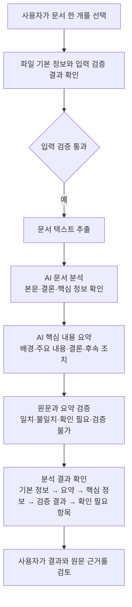
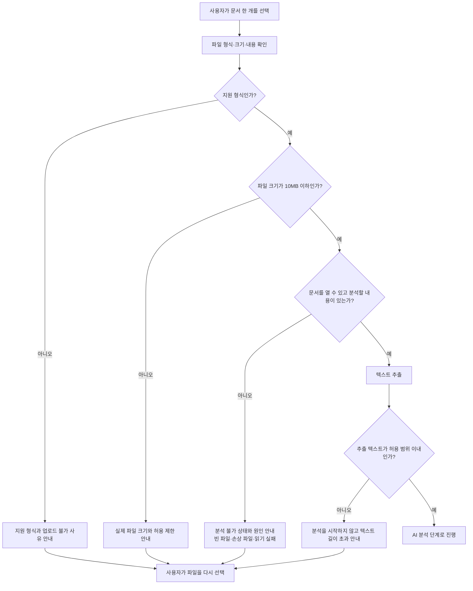

# MVP 목표

## 프로젝트명

AI Agent를 활용한 회의록, 업무보고, 공문자료 문서 분석 시스템 구축

## MVP 한 줄 설명

사용자가 문서 한 개를 입력하면 AI가 핵심 내용을 분석·요약하고, 원문과의 검증 결과를 한 화면에서 보여 주는 최소 실행 버전이다.

## MVP에서 검증할 핵심 가치

업무 문서를 직접 읽고 정리하는 시간을 줄이면서도, 사용자가 핵심 내용과 AI 분석 결과의 근거·확인 필요 항목을 함께 확인할 수 있는지 검증한다.

## 시연 방식

회의록·업무보고·공문 중 예시 문서 한 개를 입력한 뒤, 문서 기본 정보와 핵심 요약, 주요 일정·결정·요청 사항, 원문 기반 검증 결과 및 확인 필요 항목이 표시되는 과정을 시연한다.

## MVP 사용자 흐름

이 흐름은 `MVP-plan-jdk1.md`의 목표를 기준으로 하며, 단일 문서의 입력부터 분석·요약·검증 결과 확인까지를 다룬다.

## 정상 흐름

## 입력 오류 흐름

## MVP 포함 기능

MVP는 문서 한 개를 입력해 AI 분석·요약·검증 결과를 확인하는 범위로 구성한다.

| 기능 | MVP 사용 범위 |
|---|---|
| 문서 입력 기능 | PDF, DOC, DOCX, HWP, HWPX, PPT, PPTX, TXT 중 문서 한 개를 선택하고, 형식·크기·내용 검증 결과와 입력 오류 안내를 확인한다. |
| 문서 텍스트 추출 기능 | 검증을 통과한 문서에서 분석 가능한 텍스트와 기본 정보를 추출하며, 빈 문서·손상 파일·이미지 기반 PDF·텍스트 길이 초과는 분석 불가로 안내한다. |
| AI 문서 분석 기능 | 문서의 주제·목적·핵심 구조·핵심 문장·키워드·검증 후보와 원문 근거를 분석한다. |
| AI 요약 생성 기능 | 배경, 주요 내용, 결론, 후속 조치와 제목별·일정별 핵심 요약을 제공하고, 누락·상충 정보는 확인 필요로 표시한다. |
| AI 검증 결과 제공 기능 | 원문과 요약의 제목·일자·기관·수치·결정 사항을 비교하고, 일치·불일치·확인 필요·검증 불가 상태와 근거를 제공한다. |
| 분석 결과 화면 출력 기능 | 문서 기본 정보, 요약, 키워드·일정·결정 사항, 검증 결과, 확인 필요 항목을 한 화면에서 순서대로 보여 주며 개인정보를 마스킹한다. |

## 1차 MVP 제외 기능 및 후순위 처리 방향

1차 MVP는 문서 한 개의 AI 분석·요약·검증 결과를 확인하는 범위로 한정한다. 아래 기능은 삭제하지 않고, 명시된 조건이 충족되면 후순위 단계에서 추가한다.

| 제외 기능 | 후순위 추가 조건 |
|---|---|
| 분석 결과 Markdown 생성 및 사용자 확인 저장 | 1차 MVP의 결과 화면 검토가 완료되고, 관리자 문서특성 선택·최종 확인·저장 경로 및 파일명 규칙이 확정되면 추가한다. |
| 여러 문서 동시 업로드·일괄 처리·통합 분석·통합 요약·교차 검증 | 다중 문서 분석 설계와 장기 이력·저장 정책이 확정되고, MVP 범위 확장 승인이 완료되면 추가한다. |
| 분석 결과와 원본 문서의 장기 이력 관리 및 여러 문서 비교 화면 | 장기 보관 정책과 다중 문서 기능이 확정되면 추가한다. |
| 스캔 문서 및 이미지 기반 PDF의 문자 인식(OCR) | OCR 도입 범위와 분석 가능 기준이 확정되고 MVP 범위 확장 승인이 완료되면 추가한다. |
| 정밀한 표 구조 복원과 원본 서식 재현 | 기본 텍스트 추출 기능을 검증한 뒤, 해당 기능의 도입 범위가 승인되면 추가한다. |
| 사용자별 요약 스타일·길이·강조 항목 템플릿 | 기본 요약 형식의 MVP 사용성 검토가 완료되면 추가한다. |
| 문서 유형별 고도화된 정책·법률·감사 검증 및 검토 우선순위 사용자 설정 | MVP 검증 결과 검토를 통해 고도화 기준이 합의되면 추가한다. 최종 판단은 계속 사람이 수행한다. |
| 원문 전체 미리보기, 근거 위치 자동 이동, 사용자별 화면 설정, 고급 필터·정렬·대시보드 | 기본 결과 화면의 사용성 검토가 완료된 뒤, 단일 문서 검토 범위 확장이 승인되면 추가한다. |
| 사용자 인증과 데이터베이스 구축 | 초기 MVP의 단일 문서 처리와 결과 확인이 검증된 뒤, 서비스 운영 범위 확대가 결정되면 추가한다. |
| 원본 문서의 자동 수정·이동·재저장 및 자동 승인·자동 저장 | 관리자 최종 검토와 원본 보존 원칙을 훼손하지 않는 승인·저장 정책이 확정된 경우에만 검토한다. |
| 확장자와 실제 파일 형식의 심화 교차 검증 및 세부 오류 분류 고도화 | 보안 정책 검토가 완료되면 추가한다. |

## MVP 구현 순서

기능 의존성에 따라 아래 순서로 구현한다. 각 단계는 하나의 Codex 작업 요청으로 수행하는 단위이며, 다음 단계는 앞 단계의 완료 기준을 충족한 뒤 시작한다.

| 순서 | Codex 작업 요청 범위 | 선행 조건 | 완료 기준 |
|---|---|---|---|
| 1 | 문서 입력 기능 구현: 지원 형식의 문서 한 개를 선택하고, 형식·크기·내용 검증 결과 및 입력 오류 안내를 제공한다. | 없음 | 정상 문서는 텍스트 추출 대기 상태가 되고, 미지원 형식·크기 초과·빈 파일·읽기 실패는 분석을 시작하지 않고 안내한다. |
| 2 | 문서 텍스트 추출 기능 구현: 검증된 단일 문서에서 분석용 텍스트와 기본 정보를 추출하고, 분석 가능 여부를 판단한다. | 1단계의 검증 통과 문서 | PDF, DOC, DOCX, HWP, HWPX, PPT, PPTX, TXT의 기본 텍스트를 추출해 분석 단계로 전달하거나, 추출 불가 사유를 표시한다. |
| 3 | AI 문서 분석 기능 구현: 추출된 문서에서 주제·목적·핵심 구조·핵심 문장·키워드·검증 후보와 원문 근거를 분석한다. | 2단계에서 분석 가능한 텍스트 확보 | 원문 근거를 포함한 분석 결과가 생성되고, 분석 실패 시 다음 단계로 진행하지 않는다. |
| 4 | AI 요약 생성 기능 구현: 분석 결과를 바탕으로 배경·주요 내용·결론·후속 조치 및 제목별·일정별 요약을 제공한다. | 3단계의 성공한 분석 결과 | 원문 근거를 벗어나지 않는 요약과 확인 필요 항목이 생성된다. |
| 5 | AI 검증 결과 제공 기능 구현: 원문과 요약의 핵심 정보를 비교해 검증 결과와 확인 필요 항목을 제공한다. | 4단계의 사용 가능한 요약 결과 | 제목·일자·기관·수치·결정 사항에 대해 일치·불일치·확인 필요·검증 불가 상태와 근거가 생성된다. |
| 6 | 분석 결과 화면 출력 기능 구현: 문서 기본 정보, 요약, 핵심 정보, 검증 결과, 확인 필요 항목을 한 화면에 표시한다. | 1~5단계의 처리 결과 | 사용자가 결과와 원문 근거를 순서대로 검토할 수 있고, 개인정보는 마스킹되어 표시된다. |
| 7 | 단일 문서 MVP 통합 검증: 정상 문서와 주요 입력 오류 문서로 전체 흐름을 확인한다. | 1~6단계 완료 | 정상 흐름은 입력부터 결과 확인까지 이어지고, 입력 오류는 분석을 시작하지 않은 채 원인과 재입력 방법을 안내한다. |
## MVP 완료 기준

아래 기준은 사용자가 README의 실행 방법으로 서비스를 시작한 뒤 직접 확인할 수 있는 결과다.

| 완료 기준 | 사용자가 확인할 결과 |
|---|---|
| 서비스 실행 | README의 실행 방법을 따르면 로컬 브라우저에서 문서 업로드 화면이 열린다. |
| 단일 문서 입력 | 사용자는 PDF, DOC, DOCX, HWP, HWPX, PPT, PPTX, TXT 중 한 개의 문서를 선택해 업로드할 수 있다. DOC·HWP·PPT는 README에 안내된 LibreOffice 환경에서 처리된다. |
| 입력 오류 안내 | 지원하지 않는 형식, 10MB 초과 파일, 빈 파일 또는 읽을 수 없는 파일을 선택하면 분석을 시작하지 않고 원인과 다시 입력할 방법이 표시된다. AI 분석·요약·검증 실패 시에는 실패 단계와 재시도 안내가 표시된다. |
| 문서 분석 결과 | 분석 가능한 문서를 입력하면 문서의 핵심 요약과 주요 키워드가 결과 화면에 표시된다. |
| 검증 및 확인 필요 항목 | 결과 화면에서 요약과 원문의 비교 결과를 `일치`, `확인 필요` 등의 상태로 확인하고, 사용자가 추가로 확인해야 할 항목과 사유를 볼 수 있다. |
| 결과 검토 화면 | 사용자는 한 화면에서 문서 기본 정보, 핵심 요약, 주요 키워드, 검증 결과, 확인 필요 항목을 순서대로 확인할 수 있다. |
| 개인정보 마스킹 | 결과 화면에서 이름, 전화번호, 생년월일이 요구사항의 공통 마스킹 규칙에 맞게 표시된다. |
| 원본 보존 | 분석을 실행해도 업로드한 원본 문서가 수정·이동·덮어쓰기되지 않는다. |

### 전체 MVP 완료 시나리오

사용자는 README의 안내에 따라 로컬에서 서비스를 실행하고, 분석할 업무 문서 한 개를 업로드한다. 서비스는 파일 형식·크기·내용을 확인한 뒤 본문을 추출하고 AI 분석·요약·검증을 수행한다. 사용자는 결과 화면에서 핵심 요약과 주요 키워드, 원문과의 검증 결과, 확인 필요 항목을 확인한다. 입력 파일이 지원되지 않거나 분석할 내용이 없으면 서비스는 분석을 진행하지 않고 원인과 재입력 방법을 안내한다. 이 흐름이 원본 문서를 변경하지 않고 완료되면 MVP를 완료한 것으로 판단한다.
## MVP 최소 수동 확인 방법

다음 확인은 README의 실행 방법으로 서비스를 시작한 로컬 환경에서 수행한다. 테스트용 문서는 개인정보·기밀정보가 없는 파일을 사용한다.

| 확인 항목 | 준비물 및 수행 방법 | 기대 결과 |
|---|---|---|
| 서비스 실행 확인 | README의 실행 명령으로 서비스를 시작하고 브라우저에서 로컬 주소를 연다. | 문서 업로드 화면이 표시된다. |
| 정상 문서 분석 확인 | 텍스트가 있는 PDF, DOC, DOCX, HWP, HWPX, PPT, PPTX, TXT 문서를 형식별로 한 개씩 업로드한다. DOC·HWP·PPT는 LibreOffice가 설치된 환경에서 수행한다. | 각 문서에서 본문 추출 후 핵심 요약, 주요 키워드, 검증 결과, 확인 필요 항목을 확인할 수 있다. |
| 지원하지 않는 형식 확인 | 예: JPG 파일 한 개를 업로드한다. | 분석을 시작하지 않고 지원 형식 안내가 표시된다. |
| 파일 크기 초과 확인 | 10MB를 초과하는 지원 형식 파일 한 개를 업로드한다. | 분석을 시작하지 않고 실제 제한 기준과 재입력 안내가 표시된다. |
| 빈 문서·읽기 실패 확인 | 빈 TXT 파일 또는 읽을 수 없도록 손상된 테스트 문서를 업로드한다. | 분석을 시작하지 않고 분석 불가 사유와 재입력 안내가 표시된다. |
| AI 처리 실패 안내 확인 | 사용할 수 없는 AI API 설정 또는 AI 처리 오류 상황에서 분석을 시도한다. | 실패한 처리 단계와 재시도 안내가 표시되고, 정상 결과처럼 표시되지 않는다. |
| 결과 화면 순서 확인 | 정상 문서 분석 결과를 확인한다. | 문서 기본 정보, 핵심 요약, 주요 키워드, 검증 결과, 확인 필요 항목을 순서대로 확인할 수 있다. |
| 개인정보 마스킹 확인 | 이름·전화번호·생년월일이 포함된 비민감 테스트 문서를 분석한다. | 결과 화면의 이름·전화번호·생년월일이 요구사항의 공통 마스킹 규칙에 맞게 표시된다. |
| 원본 보존 확인 | 정상 분석 전후에 테스트 원본 파일의 이름, 위치, 수정 시간을 확인한다. | 원본 파일이 수정·이동·덮어쓰기되지 않는다. |

### 이번 MVP에서 제외하는 확인

- 대용량·동시 사용자·장시간 실행을 대상으로 한 성능 테스트
- 취약점 진단, 침투 테스트 등 전문 보안 테스트
- 서버 배포, 운영 환경 설정, 장애 복구를 포함한 배포 테스트
## 가정 사항 및 확인 필요 사항

문서에서 확정된 값은 파일 크기 10MB 이하, 추출 텍스트 100,000,000자 이하, 단일 문서 처리, 결과 표시 시 이름·전화번호·생년월일 마스킹이다. 이 값들은 아래 가정 또는 확인 필요 항목에 포함하지 않는다.

| 항목 | 가정 사항 | 가정 이유 |
|---|---|---|
| DOC·HWP·PPT 처리 범위 | DOC·HWP·PPT는 로컬에 설치된 LibreOffice로 텍스트 형식으로 변환한 뒤 분석한다. | 새 MVP 지원 형식에는 포함되었지만, 기능 분해 문서에는 이 세 형식의 직접 추출 방식이 정의되어 있지 않다. |
| 원본 파일 저장 여부 | 1차 MVP에서는 업로드 원본을 별도 장기 저장하지 않고 분석 과정에서만 사용한다. | 현재 MVP는 결과 확인에 한정하고, 원본 파일의 이동·덮어쓰기·이력 관리는 범위에서 제외되어 있다. |
| 실행 환경 | 사용자는 README의 Python·FastAPI 로컬 실행 환경에서 서비스를 사용한다. | 현재 MVP 완료 기준이 로컬 실행과 브라우저 확인을 전제로 하며, 배포는 범위에서 제외되어 있다. |
| AI 분석 제공 방식 | 사용 가능한 LLM API 설정이 있으면 이를 사용하고, 설정이 없을 때의 결과는 MVP 시연용 기본 분석으로 취급한다. | 요구사항은 LLM API 사용을 정했지만, 실제 API 제공자·모델·키 제공 방식은 확정하지 않았다. |

| 항목 | 확인할 내용 | MVP에 미치는 영향 |
|---|---|---|
| 개발 기간 | MVP를 완료해야 하는 날짜와 단계별 마감일 | 구현 순서의 작업 범위와 우선순위를 조정해야 한다. |
| 팀원 수 | 참여 인원, 역할 분담, 검토 담당자 | 작업 분담과 문서·코드 검토 방식이 달라진다. |
| PDF 처리 범위 | 텍스트 레이어 외 표·이미지·첨부·암호화 PDF를 어디까지 본문으로 인정할지 | 이미지 기반 PDF의 분석 불가 기준과 검토 안내가 달라진다. |
| DOCX 처리 범위 | 머리글·바닥글·각주·주석·삽입 개체를 추출 대상에 포함할지 | 본문 추출 범위와 누락 안내 기준이 달라진다. |
| HWPX 처리 범위 | 표·목록 외 수식·이미지·첨부·메모를 추출 대상에 포함할지 | 한글 문서의 분석 가능 여부와 확인 필요 항목 기준이 달라진다. |
| PPTX 처리 범위 | 발표자 노트·차트·이미지 속 문자·첨부 개체를 추출 대상에 포함할지 | 슬라이드 분석 결과의 범위와 검증 불가 안내가 달라진다. |
| DOC 처리 범위 | 변환 후 제목·본문·표 등 어느 수준의 텍스트 추출을 보장할지 | LibreOffice 변환 실패 또는 내용 누락 시 처리 기준이 필요하다. |
| HWP 처리 범위 | 변환 후 본문·표·목록을 어느 수준까지 지원할지와 보호 문서 처리 기준 | HWP 문서의 지원 완료 기준과 오류 안내가 필요하다. |
| PPT 처리 범위 | 변환 후 슬라이드 제목·본문·표를 어느 수준까지 지원할지 | 구형 프레젠테이션의 추출 성공 기준을 정해야 한다. |
| TXT 인코딩 | UTF-8 외 인코딩의 지원 목록과 읽기 실패 처리 방식 | 인코딩 오류를 분석 불가로 처리할지, 변환 후 재입력을 안내할지 결정해야 한다. |
| 최소 텍스트 기준 | 빈 문서가 아닌 것으로 판단할 최소 문자 수 또는 최소 의미 단위 | 너무 짧은 문서를 분석할지 확인 필요로 표시할지 결정해야 한다. |
| 기본 요약 분량 | 기본 요약의 문장 수·글자 수·제목별·일정별 요약의 최대 길이 | 결과 화면의 일관성과 사용자의 빠른 검토 경험에 영향을 준다. |
| 긴 문서 처리 | 1억 자 이하이지만 LLM 한 번의 분석 범위를 넘는 문서의 분할·통합 요약 방식 | 긴 문서에서 누락 없이 분석·요약·검증할 수 있는 기준이 필요하다. |
| 원본 파일 저장 여부 | 업로드 원본의 장기 보관 필요 여부, 보관 위치, 보관 기간 | 현재 임시 처리 가정을 유지할지, 별도 저장 기능을 추가할지 결정해야 한다. |
| 민감 정보 처리 기준 | 이름·전화번호·생년월일 외 마스킹할 개인정보·기밀정보 범위와 LLM 전송 허용 기준 | 결과 표시뿐 아니라 분석 전 처리와 오류·로그 안내 기준에 영향을 준다. |
| 실행 환경 | 지원 운영체제, Python 버전, LibreOffice 설치 책임, LLM API 키 제공 주체 | README의 설치·실행 안내와 DOC·HWP·PPT 지원 가능 환경을 확정해야 한다. |