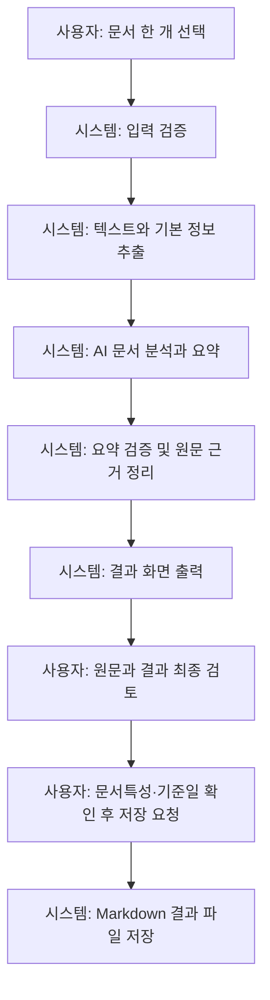
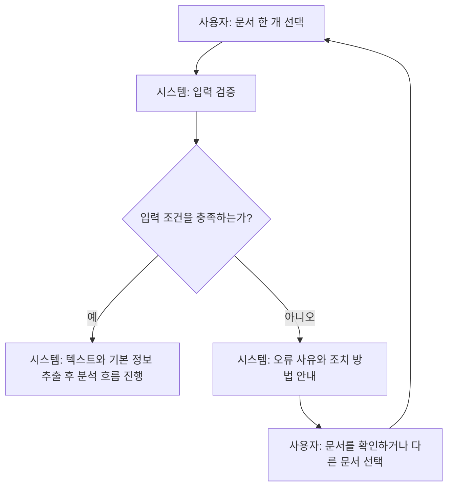

# 문서 분석 시스템 MVP 목표

## 프로젝트명

AI Agent를 활용한 회의록·업무보고·공문자료 문서 분석 시스템 구축

## MVP 한 줄 설명

사용자가 문서 한 개를 입력하면 AI가 해당 문서의 핵심 내용을 분석·요약하고, 확인이 필요한 검증 결과를 함께 보여주는 최소 실행 버전이다.

## MVP에서 검증할 핵심 가치

사용자는 여러 페이지의 업무 문서를 직접 훑지 않고도, 한 번의 입력으로 문서의 주제·핵심 내용·결정 또는 요청 사항을 빠르게 파악할 수 있다. 또한 AI가 생성한 분석과 요약에 대해 확인이 필요한 항목과 근거를 함께 제시해, 결과를 검토하고 신뢰할 수 있는지 판단할 수 있다.

## 시연 방식

대표 업무 문서 1개를 선택해 시스템에 입력한다. 시스템은 문서 텍스트를 분석한 뒤 같은 결과 화면에서 문서 개요, 핵심 내용 요약, 주요 키워드·결정 또는 요청 사항, 그리고 확인이 필요한 검증 항목과 근거를 순서대로 보여준다. 시연자는 원문과 결과를 비교해 핵심 정보가 빠르게 파악되고 검증 대상이 구분되는지 확인한다.

## MVP 사용자 흐름

| 순서 | 사용자 또는 시스템 | 동작 |
|---|---|---|
| 1 | 사용자 | 분석할 문서 한 개를 선택해 서비스에 입력한다. |
| 2 | 시스템 | 파일 형식, 크기, 읽기 가능 여부, 손상 여부와 내용 유무를 검증한다. 검증을 통과한 문서에서 텍스트와 기본 정보를 추출한다. |
| 3 | 시스템 | 추출한 텍스트를 바탕으로 AI가 문서의 주제·목적·핵심 내용·키워드·결정 또는 요청 사항을 분석하고 요약한다. |
| 4 | 시스템 | 원문에서 추출한 정보와 AI 분석·요약 결과를 비교해 일치 여부, 확인 필요 항목, 검증 불가 사유 및 원문 근거를 정리한다. |
| 5 | 시스템 | 문서 기본 정보, AI 요약, 주요 키워드, 검증 결과와 확인 필요 항목을 구분해 결과 화면에 출력한다. |
| 6 | 사용자 | 원문과 결과를 비교해 AI 분석·요약·검증 결과를 최종 검토하고, 확인이 필요한 항목을 판단한다. |
| 7 | 사용자 | 문서특성과 기준일을 최종 확인하고 `문서 저장` 버튼을 클릭한다. |
| 8 | 시스템 | 확인된 분석·요약·검증 결과를 Markdown으로 구성해 문서특성별 디렉터리에 저장하고, 저장 경로 또는 실패 사유를 표시한다. |

### 정상 흐름

### 입력 오류 흐름

## MVP 포함 기능

| 번호 | 기능 | MVP 처리 범위 | 포함 이유 |
|---|---|---|---|
| 1 | 문서 입력 기능 | 사용자가 문서 한 개를 선택·입력하고, 형식·크기·읽기 가능 여부·빈 내용 여부를 확인한다. | 분석 대상을 받는 시작점이며, 잘못된 입력은 다음 단계 전에 차단해야 한다. |
| 2 | 입력 검증 및 오류 안내 | 미지원 형식, 빈 파일, 크기 초과, 손상·암호화·읽기 불가 문서에 대해 사유와 다음 조치를 안내한다. | 기본적인 입력 오류를 안전하게 안내하고, 오류 문서가 AI 처리 결과로 보이지 않게 한다. |
| 3 | 문서 텍스트 추출 기능 | 검증을 통과한 문서에서 본문 텍스트, 기본 구조 및 필요한 메타데이터를 추출한다. 텍스트가 부족한 이미지 기반 문서는 OCR 결과를 사용한다. | AI 분석·요약·검증이 사용할 원문 정보를 준비한다. |
| 4 | AI 기반 문서 분석 기능 | 문서 주제·목적·핵심 구조·핵심 문장·키워드와 원문 근거를 생성한다. | 문서의 핵심 내용을 파악하고, 뒤이은 요약·검증의 기준을 만든다. |
| 5 | AI 요약 생성 기능 | 문서 개요, 핵심 내용, 결론 또는 후속 조치를 원문과 분석 결과에 근거해 요약한다. | 사용자가 긴 원문을 빠르게 이해할 수 있는 핵심 결과를 제공한다. |
| 6 | AI 검증 결과 제공 기능 | 원문과 분석·요약 결과를 비교해 일치·불일치 후보·확인 필요·검증 불가 항목과 근거를 제시한다. | AI 결과를 최종 사실로 단정하지 않고, 사람이 검토할 내용을 구분해 준다. |
| 7 | 분석 결과 화면 출력 기능 | 문서 기본 정보, AI 요약, 키워드, 검증 결과, 확인 필요 항목과 처리·오류 상태를 구분해 표시한다. | 사용자가 분석 결과와 기본 오류 상황을 확인하고 최종 검토할 수 있게 한다. |
| 8 | 문서특성 선택 및 Markdown 결과 저장 기능 | 분석 성공 결과에서 사용자가 문서특성·기준일을 확인한 뒤, 분석·요약·검증 결과를 Markdown으로 구성해 문서특성별 디렉터리에 저장한다. 원본 문서는 변경하지 않는다. | 요구사항의 최종 검토·승인 후 결과 파일 저장과 `문서특성-YYYY-MM-DD.md` 규칙을 충족한다. |

## MVP 제외 및 후순위 기능

| 번호 | 기능 | 제외 이유 | 후순위 처리 방향 |
|---|---|---|---|
| 1 | 로그인 및 회원 관리 | 요구사항에서 사용자 인증은 초기 MVP 이후 검토 대상으로 명시되어 있으며, 현재 단일 문서 분석·검토 흐름에 필수적이지 않다. | 여러 사용자의 접근 구분이 필요한 운영 요구사항과 인증·권한 정책이 확정된 뒤 검토한다. |
| 2 | 관리자 페이지 | 요구사항은 관리자의 최종 검토·저장 승인 역할만 정의하며, 기능 분해에는 별도 관리자 페이지가 없다. | 관리자 전용 화면이 필요한 업무 절차와 권한 범위가 요구사항으로 확정된 경우에만 검토한다. |
| 3 | 분석 이력 저장 | 기능 분해는 사용자 확인·승인 상태 저장을 후순위로 두며, 첫 번째 MVP는 현재 문서의 결과 확인에 집중한다. | 검토·승인 상태를 지속해서 보관해야 하는 요구사항과 이력 보관 기준이 확정된 뒤 검토한다. |
| 4 | 여러 문서 비교 분석 | 현재 기능 분해는 단일 문서의 분석·요약·검증 결과를 다루며, 여러 문서 비교 분석은 정의되어 있지 않다. | 다중 문서 비교가 필요한 업무 목적과 비교 기준이 요구사항으로 확정된 경우에만 검토한다. |
| 5 | 요약 길이 선택 | 요구사항과 기능 분해에는 요약 길이 선택 기능이 없으며, MVP는 하나의 기본 핵심 요약을 제공한다. | 기본 요약 결과의 사용성 검토 후, 길이 선택 요구사항이 별도로 확정될 때 검토한다. |
| 6 | 고급 문서 편집 | 요구사항은 원본 문서의 수정·이동·삭제·덮어쓰기를 금지하고, 기능 분해의 결과 수정·주석도 후순위다. | 원본 보존 원칙을 유지하는 결과 수정·주석 요구사항과 안전 기준이 확정된 경우에만 검토한다. |

## MVP 구현 순서

| 순서 | 작업 | 결과물 | 확인 방법 |
|---|---|---|---|
| 1 | 단일 문서 입력 흐름 구성 | 사용자가 분석할 문서 한 개를 선택해 전달할 수 있는 입력 흐름 | 지원 형식의 문서를 선택했을 때 파일명과 기본 입력 상태가 확인되는지 수동 확인 |
| 2 | 입력 검증과 텍스트 추출 연결 | 검증을 통과한 문서의 텍스트·기본 구조·메타데이터, 또는 분석 불가 상태 | 정상 문서는 추출 단계로 전달되고, 검증 실패 문서는 추출·AI 처리로 진행하지 않는지 확인 |
| 3 | AI 문서 분석 연결 | 문서 주제·목적·핵심 문장·키워드·원문 근거를 포함한 분석 결과 | 추출된 원문을 바탕으로 분석 결과와 근거가 생성되는지 확인 |
| 4 | AI 요약 연결 | 문서 개요·핵심 내용·결론 또는 후속 조치를 담은 요약 결과 | 원문과 분석 결과를 바탕으로 요약이 생성되고, AI 요약임이 구분되는지 확인 |
| 5 | AI 검증 연결 | 원문 대비 일치·불일치 후보·확인 필요·검증 불가 항목과 근거 | 요약과 원문의 수치·일자·조건·결정 사항 비교 결과가 근거와 함께 생성되는지 확인 |
| 6 | 분석 결과 화면 표시 | 문서 기본 정보, 요약, 키워드, 검증 결과, 확인 필요 항목을 보여 주는 결과 화면 | 정해진 표시 순서로 AI 결과와 원문 근거, 처리 상태가 구분되는지 확인 |
| 7 | 문서특성 선택과 Markdown 결과 저장 연결 | 사용자 최종 선택, 저장 파일명·경로, 저장 상태 또는 실패 사유 | 분석 성공 결과에서 문서특성·기준일 확인 후 결과 파일이 문서특성별 디렉터리에 저장되고 원본이 유지되는지 확인 |
| 8 | 기본 오류 처리 확인 | 입력·추출·AI 처리·결과 조회·저장의 오류 사유와 다음 행동 안내 | 미지원 형식, 빈 문서, 읽기 불가 문서, AI 처리·저장 실패가 정상 결과처럼 표시되지 않는지 확인 |
| 9 | 전체 흐름 수동 확인 | 문서 한 건의 입력부터 결과 저장까지의 시연 확인 기록 | 지원 문서 한 건으로 입력 → 추출 → 분석 → 요약 → 검증 → 결과 확인 → Markdown 저장 흐름을 순서대로 수행 |
| 10 | README 실행 방법 정리 | 지원 형식, 설치·환경 설정·실행·수동 확인 방법을 설명한 README | 새 환경에서 README 순서대로 실행하고 문서 처리·저장까지의 MVP 수동 확인 절차를 따라갈 수 있는지 점검 |

## MVP 완료 조건

| 기준 | 확인 방법 | 통과 조건 |
|---|---|---|
| 서비스 실행 | 로컬 환경에서 README의 실행 절차를 따라 서비스를 시작하고 접속한다. | 서비스가 정상적으로 실행되고 사용자가 문서 입력 화면에 접근할 수 있다. |
| 문서 입력 | PDF, DOC, DOCX, HWP, HWPX, PPT, PPTX, 이미지 기반 PDF, JPG, JPEG, PNG, TIFF, TIF 또는 TXT 문서 한 개를 선택해 업로드한다. | 선택한 문서가 분석 대상으로 접수되고 입력 상태가 표시된다. |
| 입력 검증 | 지원 형식의 정상 문서와 미지원·빈·읽기 불가 문서를 각각 입력한다. | 정상 문서는 다음 단계로 진행하고, 잘못된 문서는 분석을 시작하지 않은 채 사유와 다음 조치를 안내한다. |
| 텍스트 추출 | 본문이 있는 지원 문서를 입력한 뒤 추출 결과를 확인한다. | 문서 본문과 기본 정보가 추출되어 분석에 사용할 수 있는 상태가 된다. |
| AI 문서 분석 | 추출이 완료된 문서의 분석 결과를 확인한다. | 문서 주제·목적·핵심 내용·키워드와 원문 근거가 결과에 표시된다. |
| AI 요약 | 분석이 완료된 문서의 요약 영역을 확인한다. | 문서 개요, 핵심 내용, 결론 또는 후속 조치가 AI 생성 요약으로 구분되어 표시된다. |
| AI 검증 | 원문과 AI 분석·요약을 비교한 검증 영역을 확인한다. | 일치·불일치 후보·확인 필요·검증 불가 항목이 원문 근거와 함께 표시되며, 후보를 최종 사실로 단정하지 않는다. |
| 결과 화면 | 분석이 완료된 문서의 결과 화면을 순서대로 확인한다. | 문서 기본 정보, 핵심 요약, 주요 키워드, 검증 결과와 확인 필요 항목을 사용자가 확인할 수 있다. |
| 결과 문서 저장 | 사용자가 결과 화면을 검토하고 문서특성·기준일을 최종 확인한 뒤 `문서 저장` 버튼을 클릭한다. | 화면의 분석·요약·검증 결과가 Markdown으로 변환되어 문서특성별 디렉터리에 `문서특성-YYYY-MM-DD.md` 형식으로 저장되고, 원본 문서는 변경되지 않는다. |
| 기본 오류 안내 | 미지원 파일, 분석할 내용이 없는 문서, 추출 실패 또는 AI 처리 실패 상황을 확인한다. | 실패한 단계가 정상 결과와 구분되어 표시되고, 오류 사유·재시도 또는 다음 조치가 안내된다. |
| README 실행 방법 | README만 참고해 새 로컬 환경에서 서비스를 실행하고 문서 한 건을 처리한다. | 별도 구두 설명 없이 서비스 실행과 MVP 수동 확인 절차를 완료할 수 있다. |

### 전체 MVP 완료 시나리오

사용자는 README의 실행 방법에 따라 로컬에서 서비스를 시작한 뒤, 지원 형식의 문서 한 개를 업로드한다. 서비스는 입력을 검증하고 본문을 추출한 다음 AI 분석·요약·검증을 수행한다. 사용자는 결과 화면에서 핵심 요약, 주요 키워드, 검증 결과와 확인 필요 항목을 원문 근거와 함께 검토한다. 문서특성과 기준일을 최종 확인한 뒤 `문서 저장` 버튼을 클릭하면, 화면 결과가 `문서특성-YYYY-MM-DD.md` Markdown 파일로 변환되어 해당 문서특성 디렉터리에 저장된다. 미지원 파일이나 분석할 내용이 없는 문서는 AI 처리를 시작하지 않고 오류 사유와 다음 조치를 안내한다.

## MVP 최소 테스트 및 수동 확인 방법

| 번호 | 입력 | 실행 작업 | 기대 결과 |
|---|---|---|---|
| 1 | 본문이 있는 정상 PDF | 문서를 업로드하고 결과 화면을 확인한다. | 본문이 추출되고 분석·요약·검증 결과와 확인 필요 항목이 표시된다. |
| 2 | 본문이 있는 정상 DOCX | 문서를 업로드하고 결과 화면을 확인한다. | 제목·본문 등 분석 가능한 텍스트가 추출되어 결과가 표시된다. |
| 3 | 본문이 있는 정상 DOC | 문서를 업로드하고 결과 화면을 확인한다. | 문서가 분석 가능한 텍스트로 처리되고 결과가 표시된다. |
| 4 | 본문이 있는 정상 HWPX | 문서를 업로드하고 결과 화면을 확인한다. | 원본을 변경하지 않고 본문이 추출되어 결과가 표시된다. |
| 5 | 본문이 있는 정상 HWP | 문서를 업로드하고 결과 화면을 확인한다. | 문서가 분석 가능한 텍스트로 처리되거나, 변환·추출 실패 시 실패 사유가 안내된다. |
| 6 | 본문이 있는 정상 PPTX | 문서를 업로드하고 결과 화면을 확인한다. | 슬라이드 제목·본문의 순서가 반영된 결과가 표시된다. |
| 7 | 본문이 있는 정상 PPT | 문서를 업로드하고 결과 화면을 확인한다. | 문서가 분석 가능한 텍스트로 처리되거나, 변환·추출 실패 시 실패 사유가 안내된다. |
| 8 | 본문이 있는 정상 TXT | 문서를 업로드하고 결과 화면을 확인한다. | 텍스트가 읽혀 분석·요약·검증 결과가 표시된다. |
| 9 | 한국어 본문이 있는 정상 이미지 기반 PDF | 문서를 업로드하고 결과 화면을 확인한다. | 텍스트 추출이 부족한 경우 OCR이 적용되고, 페이지 순서와 경고가 결과에 반영된다. |
| 10 | 한국어 본문이 있는 정상 JPG | 이미지를 업로드하고 결과 화면을 확인한다. | OCR 텍스트를 기반으로 분석·요약·검증 결과가 표시된다. |
| 11 | 한국어 본문이 있는 정상 JPEG | 이미지를 업로드하고 결과 화면을 확인한다. | OCR 텍스트를 기반으로 분석·요약·검증 결과가 표시된다. |
| 12 | 한국어 본문이 있는 정상 PNG | 이미지를 업로드하고 결과 화면을 확인한다. | OCR 텍스트를 기반으로 분석·요약·검증 결과가 표시된다. |
| 13 | 한국어 본문이 있는 정상 TIFF | 이미지를 업로드하고 결과 화면을 확인한다. | OCR 텍스트를 기반으로 분석·요약·검증 결과가 표시된다. |
| 14 | 한국어 본문이 있는 정상 TIF | 이미지를 업로드하고 결과 화면을 확인한다. | OCR 텍스트를 기반으로 분석·요약·검증 결과가 표시된다. |
| 15 | 미지원 파일(예: ZIP 또는 XLSX) | 파일을 업로드한다. | 분석을 시작하지 않고 지원하지 않는 형식이라는 사유와 다른 파일 선택 안내가 표시된다. |
| 16 | 빈 문서 또는 본문을 추출할 수 없는 문서 | 파일을 업로드한다. | AI 분석·요약·검증을 시작하지 않고 분석 불가 사유와 다음 조치가 표시된다. |
| 17 | 제안·검토·예정 표현이 포함된 문서 | 문서를 업로드한 뒤 요약과 검증 결과를 원문과 비교한다. | 제안·검토·예정을 확정된 결정으로 과장한 요약이 있으면 확인 필요 또는 과장 후보와 원문 근거가 표시된다. |
| 18 | 수치 또는 일정이 포함된 문서 | 문서를 업로드한 뒤 해당 수치·일정의 요약과 검증 결과를 원문과 비교한다. | 수치·일정·조건이 원문과 일치하면 일치 상태가 표시되고, 다르거나 불명확하면 불일치 후보 또는 확인 필요와 근거가 표시된다. |
| 19 | 정상 문서와 AI 처리 불가 상황 | 문서를 업로드한 뒤 AI 분석·요약 또는 검증 처리가 실패한 상황을 확인한다. | 실패 단계, 재시도 가능 여부와 다음 조치가 표시되며 정상 완료 결과로 표시되지 않는다. |
| 20 | 분석 성공 결과와 선택한 문서특성·기준일 | 결과를 최종 검토한 뒤 `문서 저장` 버튼을 클릭하고 저장 경로를 확인한다. | 원본은 변경되지 않고 문서특성별 디렉터리에 `문서특성-YYYY-MM-DD.md` 형식의 Markdown 결과 파일이 저장된다. |

### AI 결과 확인 기준

| 확인 항목 | 확인 방법 |
|---|---|
| 문서 핵심 요약 | 결과의 개요·핵심 내용·결론 또는 후속 조치를 원문과 비교해 핵심 내용이 반영됐는지 확인한다. |
| 주요 키워드 | 표시된 키워드가 원문에 존재하며 문서의 주제·일정·수치·조건·결정 사항과 관련되는지 확인한다. |
| 원문 근거 | AI 분석·요약·검증 항목마다 연결된 원문 문장 또는 위치를 확인한다. |
| 과장 방지 | 원문의 제안·검토·예정 표현이 결과에서 확정·승인·완료로 바뀌지 않았는지 확인한다. |
| 수치·일정 검증 | 결과의 금액·수량·날짜·기간·조건·대상이 원문과 같은지, 다르면 확인 필요 또는 불일치 후보로 표시됐는지 확인한다. |
| 확인 필요 항목 | 누락·모호함·상충·근거 부족 항목에 사유, 우선순위, 원문 근거와 권장 조치가 표시되는지 확인한다. |
| 결과 상태 구분 | 경고·검증 불가·실패 상태가 정상 완료 결과와 구분되어 표시되고, 최종 사실이나 오류로 단정하지 않는지 확인한다. |

성능, 보안, 배포 테스트는 현재 MVP 최소 확인 범위에서 제외한다.

## MVP 가정 및 확인 필요 사항

### 확정된 기준 (가정 아님)

| 항목 | 확정된 기준 |
|---|---|
| 파일 크기 제한 | 파일 크기는 10MB 이하이며, 추출 텍스트는 100,000,000자 이하인 경우에만 AI 분석 단계로 전달한다. |
| PDF 처리 범위 | 텍스트 기반 PDF는 일반 텍스트 추출을 우선 적용하고, 텍스트가 없거나 부족한 이미지 기반 PDF에만 OCR을 적용한다. |
| DOCX 처리 범위 | 제목·문단·목록·표 안의 읽을 수 있는 텍스트를 문서 순서대로 추출한다. 정밀한 표 행·열 구조 복원은 후순위다. |
| HWPX 처리 범위 | `python-hwpx`로 제목·문단·목록·표 안의 읽을 수 있는 텍스트를 순서대로 추출하며, 원본은 수정하지 않는다. |
| PPTX 처리 범위 | 슬라이드 순서와 제목·본문·도형 안의 읽을 수 있는 텍스트를 추출한다. 이미지 안 텍스트는 OCR 대상으로 처리한다. |
| DOC·HWP·PPT 처리 범위 | 구형 DOC·HWP·PPT는 분석 가능한 형식으로 변환한 뒤 처리하며, HWP(v5)는 HWPX 변환 결과가 있어야 본문을 전달한다. 변환 실패 시 원본을 변경하지 않고 실패를 안내한다. |
| TXT 처리 범위 | 해석 가능한 인코딩의 전체 텍스트와 첫 줄의 제목 후보, 문단·빈 줄 경계를 추출한다. 해석할 수 없는 인코딩은 추출 오류로 처리한다. |
| 이미지 기반 PDF OCR | 페이지별 OCR 텍스트와 원본 페이지 위치를 보존하며, 빈 결과·저신뢰·회전·기울어짐·읽기 불가 페이지는 경고로 표시한다. |
| JPG·JPEG·PNG·TIFF·TIF OCR | 이미지별 OCR 텍스트와 원본 이미지 위치를 보존하고, 빈 결과·저신뢰·회전·기울어짐은 경고로 표시한다. |
| 긴 문서 처리 | LLM 입력 한도를 넘는 문서는 제목·문단·슬라이드·페이지 같은 구조 경계를 우선해 분할하고, 원문 순서와 근거를 보존해 통합한다. |
| 원본 및 결과 파일 저장 | 원본 문서는 이동·수정·삭제·덮어쓰지 않는다. 사용자가 문서특성과 기준일을 최종 확인·승인한 결과만 Markdown으로 생성해 문서특성별 디렉터리에 `문서특성-YYYY-MM-DD.md` 형식으로 저장한다. |
| 민감 정보 처리 | 이름·전화번호·생년월일은 결과 화면과 Markdown 결과 파일의 요약·키워드·검증·확인 필요 항목에서 요구사항의 마스킹 규칙을 동일하게 적용한다. |
| 실행 환경의 기본 구성 | MVP는 Python 3, FastAPI, LangChain/LangGraph, 문서 처리·OCR을 사용하고 데이터베이스 없이 동작하며, README 절차로 로컬 실행을 확인한다. |

### MVP 진행 가정

| 항목 | 가정 사항 | 가정 이유 |
|---|---|---|
| 처리 단위 | 첫 번째 MVP 시연과 수동 확인은 문서 한 개를 입력해 결과를 검토하는 흐름으로 진행한다. | 현재 MVP 목표·사용자 흐름·완료 시나리오가 단일 문서의 입력부터 저장까지를 최소 단위로 정의한다. |
| 로컬 실행 준비 | 실제 구현 전에는 필요한 문서 변환 도구와 한국어 OCR 언어 데이터가 로컬 실행 환경에 준비될 수 있다고 전제한다. | DOC·HWP·PPT 변환과 이미지 기반 문서 OCR은 외부 도구·언어 데이터의 설치 여부에 따라 실행 가능성이 달라지며, 아직 실제 환경 확인은 하지 않았다. |

### 확인이 필요한 내용

| 항목 | 확인할 내용 | MVP에 미치는 영향 |
|---|---|---|
| 개발 기간 | 개발 시작일·완료 목표일과 단계별 검토 일정을 정해야 한다. | 기간에 따라 지원 형식의 동시 구현 범위와 수동 확인 일정이 달라진다. |
| 팀원 수 | 참여 인원, 역할 분담, 문서 처리·AI·화면·테스트 담당을 확인해야 한다. | 병렬 구현 가능 범위와 작업 순서·완료 일정이 달라진다. |
| PDF 처리 세부 기준 | 최대 페이지 수, 텍스트가 ‘부족함’으로 판단되는 기준, 암호화 PDF의 사용자 안내를 확정해야 한다. | 일반 추출과 OCR 전환 시점, 오류 안내, 수동 확인 문서 구성이 달라진다. |
| DOCX 처리 세부 기준 | 표·머리글·각주·텍스트 상자의 처리 범위를 확정해야 한다. | 추출 결과의 범위와 누락 경고 기준이 달라진다. |
| HWPX 처리 세부 기준 | 지원할 HWPX 구조와 `python-hwpx` 버전·검증 절차를 확정해야 한다. | HWPX 추출의 재현성과 오류 처리 방식이 달라진다. |
| PPTX 처리 세부 기준 | 슬라이드 노트·차트·그룹 도형·이미지 텍스트의 처리 범위를 확정해야 한다. | 추출 대상과 OCR 적용 범위가 달라진다. |
| DOC·HWP·PPT 변환 환경 | 변환 도구, 설치 책임, 지원 운영체제, 변환 실패 시 안내 방식을 확정해야 한다. | 구형 형식의 실제 지원 여부와 로컬 실행 방법이 달라진다. |
| TXT 인코딩 | UTF-8 외에 지원할 인코딩 목록과 감지·실패 처리 기준을 확정해야 한다. | 일부 TXT 문서의 추출 성공 여부와 오류 안내가 달라진다. |
| Image PDF·JPG·JPEG·PNG·TIFF·TIF OCR | OCR 엔진, 한국어 언어 데이터, 저신뢰 기준, 회전·기울어짐 전처리 범위를 확정해야 한다. | OCR 정확도, 경고 기준, 설치 방법과 수동 확인 결과가 달라진다. |
| 최소 텍스트 기준 | 분석 가능한 최소 텍스트 길이와 그보다 짧은 문서의 상태 기준을 확정해야 한다. | 짧은 메모를 분석·경고·검토 필요 중 어느 상태로 표시할지 달라진다. |
| 기본 요약 분량 | 기본 요약의 길이·항목 수·표현 형식을 확정해야 한다. | 결과 화면의 요약 밀도와 완료 기준의 판정 방식이 달라진다. |
| 긴 문서의 운영값 | 사용할 LLM, 입력 한도, 안전 여유분, 분할 크기·겹침 범위와 부분 실패 처리 기준을 확정해야 한다. | 분할·통합 결과의 일관성, 비용, 처리 상태 안내가 달라진다. |
| 민감 정보 처리의 운영 범위 | 확정된 화면·Markdown 마스킹 외에 원문 근거, 로그, 오류 안내에 적용할 시점과 범위를 확인해야 한다. | 개인정보 노출 방지 범위와 오류·근거 표시 방식이 달라진다. |
| 실행 환경의 상세값 | 운영체제, Python·의존성 버전, LLM 모델·API 키 설정, OCR·변환 도구 설치 방법을 확정해야 한다. | README의 설치·실행 절차와 지원 형식의 실제 동작 여부가 달라진다. |

## MVP 최종 검수 결과

| 검수 항목 | 상태 | 발견 내용 | 수정 방향 |
|---|---|---|---|
| 1. 사용자가 직접 실행할 수 있는 계획인가 | 확인 필요 | 로컬 실행과 README 정리 단계는 계획에 있으나, OCR·구형 문서 변환 도구가 실제 실행 환경에 준비됐는지는 아직 확인되지 않았다. | 실행 환경 상세값을 확정한 뒤 README 절차로 로컬 실행을 확인한다. |
| 2. 입력 후 처리 결과를 확인할 수 있는가 | 통과 | 문서 한 건 입력 후 검증·추출·분석·요약·검증·결과 화면·저장까지의 사용자 흐름과 완료 조건이 있다. | 현재 흐름을 유지한다. |
| 3. 프로젝트의 핵심 문제를 해결하는가 | 통과 | 긴 업무 문서에서 핵심 내용과 확인 필요 항목을 빠르게 파악한다는 목표가 분석·요약·검증·근거 표시로 연결된다. | 현재 핵심 가치와 시연 방식을 유지한다. |
| 4. 최소 테스트 또는 수동 확인이 가능한가 | 통과 | 지원 형식별 정상 흐름, 입력 오류, AI 과장·수치·일정·실패, Markdown 저장을 포함한 수동 확인 표가 있다. | 합성·비민감 문서를 사용해 표의 순서대로 확인한다. |
| 5. README에 실행 방법을 설명할 수 있는가 | 보완 필요 | 구현 순서에 README 정리 작업은 있으나, 실제 README에는 OCR·구형 형식 변환을 포함한 최종 설치·실행 조건을 반영해야 한다. | 구현 완료 후 지원 형식, 변환·OCR 설치 조건, 환경 변수, 실행·수동 확인 절차를 README에 반영한다. |
| 6. 포함 기능과 제외 기능이 명확한가 | 통과 | 문서특성 선택·Markdown 저장 기능을 포함 기능에 반영했고, 인증·이력·비교·요약 길이·고급 편집은 후순위로 구분했다. | 현재 포함·제외 표를 유지한다. |
| 7. 구현 순서가 기능 의존성과 일치하는가 | 통과 | 입력 → 검증·추출 → 분석 → 요약 → 검증 → 화면 → 문서특성 선택·저장 → 오류 확인 → 수동 확인 → README 순서로 정리됐다. | 현재 순서를 유지한다. |
| 8. 완료 기준이 실행 결과 중심으로 작성되었는가 | 통과 | 서비스 실행, 문서 처리 결과, 화면 표시, 저장 파일 생성, 오류 안내, README 기반 재현을 통과 조건으로 작성했다. | 현재 완료 기준을 유지한다. |
| 9. 요구사항과 기능 분해에 없는 기능이 추가되지 않았는가 | 통과 | 계획의 입력·추출·OCR·분석·요약·검증·화면·문서특성 선택·Markdown 저장은 요구사항과 기능 분해에 정의된 범위다. | 현재 범위를 유지하고 새 기능은 요구사항 확정 후에만 검토한다. |
| 10. AI 검증이 최종 판정으로 표현되지 않았는가 | 통과 | 검증 결과를 일치·불일치 후보·확인 필요·검증 불가로 표시하고, 원문 근거와 사람의 최종 검토를 요구한다. | 후보를 최종 사실이나 오류로 단정하지 않는 표현을 유지한다. |
| 11. 미확정 사항을 임의로 결정하지 않았는가 | 통과 | 개발 기간, 팀원 수, OCR·변환 도구, 최소 텍스트, 요약 분량, LLM 운영값, 실행 환경 상세값을 확인 필요로 분리했다. | 확인 필요 항목은 값이 확정되기 전까지 구현 값으로 고정하지 않는다. |

## MVP 확인 및 보완 계획

| 구분 | 항목 | 현재 확인 결과 | 문제 발생 원인 | 확인·보완 방법 | 완료 판단 기준 |
|---|---|---|---|---|---|
| 보완 필요 | OCR 실행 환경 | `tesseract` 명령과 Python OCR 패키지가 없으며, 현재 의존성 목록에도 OCR 엔진·언어 데이터가 없다. | 이미지 기반 PDF와 JPG·JPEG·PNG·TIFF·TIF 처리를 요구사항에 포함했지만, OCR 엔진 선정·시스템 설치·한국어 언어 데이터·Python 연동 방식이 확정되지 않았다. | 사용할 OCR 엔진과 한국어 언어 데이터를 확정한다. 시스템 설치 항목과 Python 의존성을 분리해 기록하고, 이미지 기반 PDF와 이미지 문서에서 텍스트·위치·경고가 생성되는지 수동 확인한다. | 선택한 OCR 엔진과 한국어 언어 데이터가 로컬에서 실행되고, 지원 이미지 형식의 본문이 분석 단계까지 전달되며 저신뢰·빈 결과는 경고로 표시된다. |
| 보완 필요 | DOC·HWP·PPT 변환 환경 | `soffice`와 `libreoffice` 명령이 없으며, 현재 앱은 두 명령 중 하나가 있어야 구형 형식을 처리한다. | 구형 DOC·HWP·PPT는 직접 추출하지 않고 변환 결과를 사용해야 하지만, 변환 도구의 설치·운영체제 지원·실패 안내가 실제 환경에 준비되지 않았다. | LibreOffice의 설치 가능 여부와 실행 경로를 확인한다. DOC·HWP·PPT 각 한 건을 변환·추출해 보고, 변환 실패 시 원본 보존과 안전한 실패 안내를 확인한다. | 변환 가능한 구형 문서는 분석 가능한 텍스트로 전달되고, 실패한 문서는 원본을 변경하지 않은 채 변환 실패 사유와 다음 조치를 표시한다. |
| 보완 필요 | 이미지 형식 지원 일치 | 현재 앱의 지원 확장자 목록에는 이미지 기반 PDF, JPG, JPEG, PNG, TIFF, TIF가 포함되지 않는다. | MVP 완료 조건과 기능 분해에는 이미지 OCR이 포함됐지만, 기존 입력 검증·추출 구현은 PDF·Office·TXT 중심으로 작성됐다. | 요구사항의 지원 형식 목록과 입력 검증·텍스트 추출 범위를 대조해 이미지 형식과 OCR 흐름을 반영한다. 형식별 정상·빈·저신뢰 입력을 수동 확인한다. | 서비스의 지원 형식 안내와 실제 입력 검증 결과가 요구사항의 형식 목록과 일치한다. |
| 보완 필요 | README 실행 안내 | README에는 기본 실행과 LibreOffice 필요성만 있고, OCR 설치·한국어 언어 데이터·이미지 형식·전체 수동 확인 절차가 없다. | OCR·변환 도구의 실제 설치 방식과 지원 범위가 README에 반영되지 않아 새 환경에서 같은 실행 조건을 재현하기 어렵다. | OCR·변환 도구를 확정한 뒤 README에 시스템 설치 조건, Python 의존성, 환경 변수, 지원 형식, 실행 명령, 정상·오류 수동 확인 절차를 기록한다. | 새 로컬 환경에서 README만 따라 서비스 실행, 지원 문서 처리, Markdown 저장, 기본 오류 확인을 수행할 수 있다. |
| 확인 필요 | AI API 실행 설정 | API 키 값은 보안상 확인하지 않았고, 실제 LLM 호출 성공 여부도 아직 확인하지 않았다. | AI 분석·요약·검증은 유효한 API 키, 네트워크 연결, 선택 모델의 접근 권한에 의존하지만 현재 계획에는 실제 운영 설정값이 없다. | 민감값을 출력하지 않고 로컬 환경 변수의 설정 여부와 호출 가능 여부를 확인한다. 정상 문서 한 건으로 분석·요약·검증을 실행하고, 실패 시 단계·재시도 가능 여부가 표시되는지 확인한다. | 유효한 설정에서 AI 분석·요약·검증 결과와 원문 근거가 생성되며, 호출 실패 시 정상 결과 대신 안전한 실패 안내가 표시된다. |
| 확인 필요 | 개발 기간 | 시작일·완료 목표일·중간 검토일이 문서에 없다. | 일정이 정해지지 않아 모든 지원 형식·OCR·구형 변환을 같은 MVP 기간에 구현할 수 있는지 판단할 근거가 없다. | 수업 마감일과 중간 검토일을 정하고, 구현 순서의 단계별 완료 목표를 배정한다. | 각 구현 단계에 담당·완료 목표일·검토 시점이 기록된다. |
| 확인 필요 | 팀원 수와 역할 분담 | 참여 인원과 문서 처리·AI·화면·테스트 담당이 정해지지 않았다. | 역할 분담이 없으면 병렬 작업 가능 범위와 코드·문서 검토 책임을 판단할 수 없다. | 팀원 수와 역할을 확인하고, 문서 입력·변환/OCR·AI·결과 화면·수동 확인·README 담당을 배정한다. | 모든 MVP 구현 단계에 담당자와 검토 담당자가 지정된다. |
| 부분 확인 | Python 및 핵심 라이브러리 | Python 3.14.6과 FastAPI·OpenAI·PDF·DOCX·PPTX·HWPX 라이브러리는 가상환경에 설치되어 있다. | 설치 여부는 확인됐지만, 현재 Python 버전과 각 라이브러리·문서 형식·서비스 코드의 실제 호환성 및 전체 흐름 실행은 검증하지 않았다. | README 절차로 가상환경을 활성화한 뒤 서비스 실행, PDF·DOCX·HWPX·PPTX·TXT 문서의 추출·AI 처리·저장을 수동 확인한다. 호환성 오류가 발생하면 오류 메시지와 해당 라이브러리의 지원 버전을 기준으로 실행 환경을 결정한다. | 서비스가 시작되고, 기본 지원 형식에서 추출·분석·요약·검증·Markdown 저장까지 오류 없이 완료된다. |
