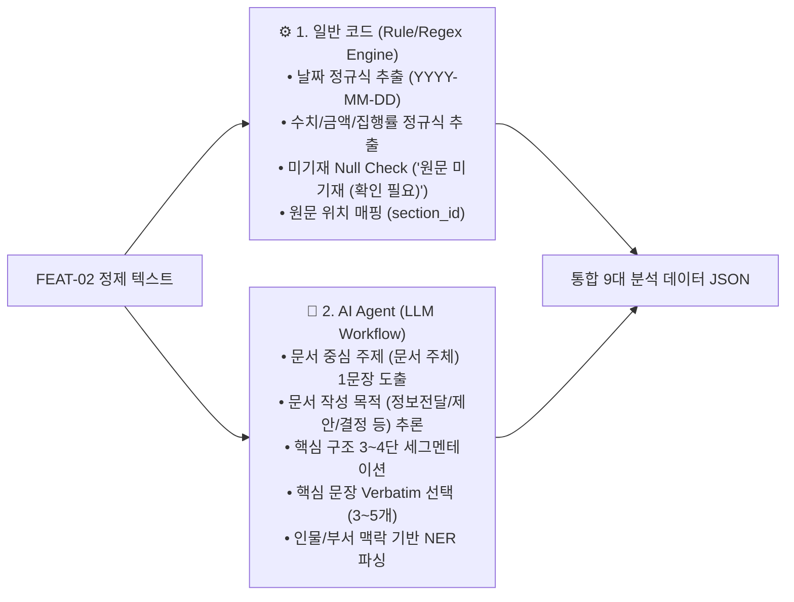

# AI 문서 분석 시스템 기능 분해 명세서 (Gharam)

본 문서는 `./docs/requirements-Gharam.md` 요구사항 정의서를 바탕으로 AI 문서 분석 시스템의 세부 기능을 단위별로 분해하고, 파이프라인 입출력 체계와 **AI Agent 활용 영역 vs 일반 코드(Rule/Regex Engine) 구현 영역의 명확한 역할 분담**을 명세한 문서입니다.

---

## 1. 문서 입력 기능 (`FEAT-01`) 기능 분해 및 설계

### 1.1 기능 개요
* **기능 ID**: `FEAT-01`
* **기능명**: 문서 업로드 및 검증 (문서 입력 기능)
* **주요 역할**: 단일 문서 파일(PDF, DOCX, TXT, HWP, HWPX, PPTX)을 수신하여 확장자/용량/내용 유효성을 검증하고, 검증이 완료된 파일에 File ID를 부여하여 텍스트 추출 단계(`FEAT-02`)로 전달함.

| 구분 | 주요 명세 | 구현 기술 / 모듈 |
| :--- | :--- | :--- |
| **입력 (Input)** | 사용자 업로드 파일 (PDF, HWPX, DOCX, TXT, HWP, PPTX / 최대 50MB) | FastAPI UploadFile |
| **처리 (Process)** | 확장자/MIME 검증, 50MB 용량 체크, 빈파일/암호화 유효성 검증, 임시 저장 | **⚙️ 100% 일반 코드** (`puremagic`, `os`, `uuid`) |
| **출력 (Output)** | `file_id` (UUID), `file_path`, `original_filename`, `format`, `size_bytes` | Standard JSON DTO |

---

### 1.2 요구사항 기준 핵심 항목 분해

#### 1. 단일 파일 업로드 범위
* **지원 포맷**: PDF (`.pdf`), DOCX (`.docx`), TXT (`.txt`), HWP (`.hwp`), HWPX (`.hwpx`), PPTX (`.pptx`)
* **업로드 방식**: 단일 파일 업로드 (Single File Upload)
* **포맷 특이사항**: HWP (v5 바이너리) 파일 수신 시 HWPX 포맷 선행 변환 대상으로 분류 (`AGENTS.md` 규칙 8 준수)

#### 2. 선택 파일 메타데이터 정보 표시
* 사용자가 파일을 선택하거나 드래그앤드롭 했을 때 화면 UI 및 API 응답에서 즉시 전달/표시해야 하는 항목:
  * **파일명 (File Name)**: 원본 파일의 전체 이름 (예: `2026_회의록_최종.pdf`)
  * **파일 형식 (File Format)**: 확장자 및 식별된 MIME Type (예: `application/pdf`, `PDF`)
  * **파일 크기 (File Size)**: 용량 단위 표시 (Byte, KB, MB)

#### 3. 파일 유효성 3단계 검증 로직 (⚙️ 100% 일반 코드 처리)
1. **파일 형식 검증**: 허용 확장자(`.pdf`, `.docx`, `.txt`, `.hwp`, `.hwpx`, `.pptx`) 및 실제 MIME Type 이중 대조 검증
2. **파일 크기 검증**: 최소 크기 `0 Byte` 초과 (빈 파일 차단), 최대 크기 `50 MB` 이하 (50MB 초과 차단)
3. **문서 내용 검증**: 텍스트 추출 가능성 검증 (추출 가능 텍스트 10자 미만 시 빈 문서 판정), 비밀번호 암호화 설정 여부 검증 (암호화 문서 접근 차단)

#### 4. 검증 완료 파일의 다음 단계 전달 (텍스트 추출 연동)
* 유효성 검증을 통과한 파일은 서버 임시 저장소(`temp/uploads/`)에 저장
* 유일한 **File ID** (UUID) 및 메타데이터 객체를 생성하여 텍스트 추출 파이프라인(`FEAT-02`)으로 전달

#### 5. 오류 상황별 처리 명세 (⚙️ 일반 예외 응답)
* **미지원 형식 업로드**: HTTP 400 Bad Request, 메시지: `"지원하지 않는 파일 형식입니다. (지원: PDF, HWPX, DOCX, TXT, HWP, PPTX)"`
* **빈 파일 / 텍스트 미보유**: HTTP 400 Bad Request, 메시지: `"문서 내에 분석할 수 있는 텍스트가 없습니다."`
* **파일 크기 초과**: HTTP 413 Payload Too Large, 메시지: `"업로드 가능한 최대 파일 크기(50MB)를 초과했습니다."`
* **암호화 문서**: HTTP 422 Unprocessable Entity, 메시지: `"암호가 설정된 문서입니다. 암호 해제 후 업로드해주세요."`

#### 6. 정상 입력 및 예외 입력 테스트 항목
* **정상 입력 테스트 케이스**:
  * `TC-INP-01`: 50MB 이하의 정상 PDF 파일 업로드 ➔ File ID 및 메타데이터 반환 확인
  * `TC-INP-02`: 정상 DOCX, TXT, HWP, HWPX, PPTX 파일 각각 업로드 ➔ 포맷 감지 및 정상 수신 확인
  * `TC-INP-03`: 업로드 완료 후 표시되는 파일명, 형식, 크기 정보의 정확성 검증
* **예외 입력 테스트 케이스**:
  * `TC-INP-ERR-01`: 미지원 확장자(`.exe`, `.zip` 등) 파일 업로드 시 400 에러 및 메시지 확인
  * `TC-INP-ERR-02`: 50MB 초과(예: 55MB) 파일 업로드 시 413 차단 에러 확인
  * `TC-INP-ERR-03`: 0 Byte 빈 파일 또는 텍스트 10자 미만 문서 업로드 시 400 에러 확인
  * `TC-INP-ERR-04`: 암호 설정된 PDF/DOCX 업로드 시 암호 해제 요청 메시지 반환 확인

#### 7. 영역별 단위 구분 (화면, API, 처리, 오류 처리, 테스트)

| 구분 단위 | 단위 ID | 명칭 및 담당 역할 | 구현 방식 (코드 vs AI) |
| :--- | :--- | :--- | :--- |
| **화면 (UI)** | `UI-INP-01` | 파일 업로드 컴포넌트 & 정보 표시 화면 | **⚙️ 일반 Frontend 코드** |
| **API** | `API-INP-01` | 문서 업로드 API 엔드포인트 | **⚙️ 일반 FastAPI Backend** |
| **처리 (Logic)** | `PROC-INP-01` | 파일 유효성 검증 및 임시 저장 처리기 | **⚙️ 일반 파이썬 룰 검사기** |
| **오류 처리** | `ERR-INP-01` | 예외 상태 감지 및 규격화 에러 응답기 | **⚙️ 일반 파이썬 예외 처리기** |
| **테스트** | `TST-INP-01` | 문서 입력 통합 및 단위 테스트 모듈 | **⚙️ Pytest 검증 모듈** |

#### 8. API Endpoint 후보
* **`POST /api/v1/documents/upload`**

#### 9. 구현 우선순위 및 추천 구현 순서
* **[P1 - 필수 핵심 (MVP)]**: 유효성 검증, FastAPI 업로드 엔드포인트, 임시 저장 및 File ID 생성, FE 파일 업로드 UI
* **[P2 - 후순위 확장 (Post-MVP)]**: 다중 파일 일괄 업로드, 대용량 분할 업로드(Chunked Upload), 사용자별 업로드 이력 DB 관리

#### 10. 구현 전에 확인해야 할 사항
1. `python-hwpx` 설치 및 Python 3.10+ 환경 확인 (`AGENTS.md` 규칙 8 준수)
2. 서버 내 임시 저장 디렉토리(`temp/uploads/`) 권한 및 자동 삭제 정책 설정
3. FastAPI/Uvicorn 바디 용량 제한(50MB) 미들웨어 설정

---

## 2. 문서 텍스트 추출 기능 (`FEAT-02`) 기능 분해 및 설계

### 2.1 기능 개요
* **기능 ID**: `FEAT-02`
* **기능명**: 문서 텍스트 추출 및 구조화 (문서 텍스트 추출 기능)
* **주요 역할**: `FEAT-01`에서 검증 완료된 문서(`file_id` 및 임시 파일 경로)를 수신하여 확장자별 전용 파서를 통해 텍스트를 추출하고, 공백/줄바꿈 정제 및 기본 문서 구조(제목, 문단, 목록, 표 텍스트)를 정제하여 AI 분석 파이프라인으로 전달함.

| 구분 | 주요 명세 | 구현 기술 / 모듈 |
| :--- | :--- | :--- |
| **입력 (Input)** | `FEAT-01` 검증 데이터 (`file_id`, `file_path`, `format`, `original_filename`) | Internal DTO |
| **처리 (Process)** | 확장자별 파싱(PDF/DOCX/TXT/HWPX/HWP/PPTX), 텍스트 정제, 구조 파싱 | **⚙️ 100% 일반 코드** (`pdfplumber`, `python-hwpx`, `re`) |
| **출력 (Output)** | `file_id`, `metadata`, `structured_content`, `raw_cleaned_text` | Standard JSON DTO |

---

### 2.2 입출력 데이터 명세

#### 1. 입력 데이터 명세 (`FEAT-01` ➔ `FEAT-02`)
```json
{
  "file_id": "doc_12345abc-6789-def0-1234-56789abcdef0",
  "file_path": "temp/uploads/doc_12345abc.pdf",
  "original_filename": "2026_업무보고.pdf",
  "format": "PDF",
  "mime_type": "application/pdf",
  "size_bytes": 1048576
}
```

#### 2. 출력 데이터 명세 (`FEAT-02` ➔ `FEAT-02_ANALYSIS` AI 분석)
```json
{
  "success": true,
  "data": {
    "file_id": "doc_12345abc-6789-def0-1234-56789abcdef0",
    "metadata": {
      "original_filename": "2026_업무보고.pdf",
      "format": "PDF",
      "mime_type": "application/pdf",
      "extracted_char_count": 3450,
      "word_count": 820,
      "section_count": 3,
      "extracted_at": "2026-07-25T13:13:00Z",
      "is_analyzable": true
    },
    "structured_content": {
      "title": "2026년 상반기 부서별 주요 업무보고",
      "sections": [
        {
          "section_id": 1,
          "section_title": "1. 추진 배경 및 목적",
          "content": "본 보고서는 2026년 상반기 부서별 주요 성과를 점검하고...",
          "content_type": "paragraph"
        },
        {
          "section_id": 2,
          "section_title": "2. 주요 결정사항 및 진행 현황",
          "content": "• 시스템 구축 완료 기한: 2026년 8월 31일\n• 담당자: 홍길동 팀장 (디지털혁신팀)",
          "content_type": "list"
        },
        {
          "section_id": 3,
          "section_title": "3. 부서별 예산 집행 표",
          "content": "[표 내용] 부서명: AI개발팀 | 예산: 50,000,000원 | 집행률: 85%",
          "content_type": "table_text"
        }
      ]
    },
    "raw_cleaned_text": "2026년 상반기 부서별 주요 업무보고\n\n1. 추진 배경 및 목적\n본 보고서는..."
  }
}
```

---

### 2.3 핵심 기능 세부 분해 (⚙️ 100% 일반 코드 구현)

#### 1. 확장자/형식별 텍스트 추출 파서
* **PDF (`.pdf`)**: `pdfplumber` / `pypdf` 기반 텍스트 레이어 파싱
* **DOCX (`.docx`)**: `python-docx` 기반 Paragraph 및 Table 텍스트 파싱
* **TXT (`.txt`)**: `chardet` 기반 UTF-8 / EUC-KR / CP949 인코딩 자동 감지 읽기
* **HWPX (`.hwpx`)**: `python-hwpx` 라이브러리의 `HwpxDocument.open()` 표준파싱 (`AGENTS.md` 규칙 8 준수)
* **HWP (`.hwp`)**: HWP v5 바이너리를 HWPX로 선행 변환 후 `python-hwpx` 파싱
* **PPTX (`.pptx`)**: `python-pptx` 기반 슬라이드 Text Frame 및 Shape 텍스트 파싱

#### 2. 정규식 텍스트 정제 및 구조 정리
* **정제 (Cleaning)**: 다중 공백 단일 축소, 3회 이상 줄바꿈 2회로 정제, 제어문자 제거 (`re` 정규 표현식 모듈 사용)
* **구조화 (Structuring)**: 제목(Heading), 문단(Paragraph), 불릿 목록(List), 표 텍스트(Table Text) 구분 추출

#### 3. 영역별 단위 구분

| 구분 단위 | 단위 ID | 명칭 및 담당 역할 | 구현 방식 (코드 vs AI) |
| :--- | :--- | :--- | :--- |
| **화면 (UI)** | `UI-EXT-01` | 텍스트 추출 진행 상태 시각화 컴포넌트 | **⚙️ 일반 Frontend 코드** |
| **API** | `API-EXT-01` | 텍스트 추출 실행 API 엔드포인트 | **⚙️ 일반 FastAPI Backend** |
| **처리 (Logic)** | `PROC-EXT-01` | 포맷별 파서 및 텍스트 정제 처리기 | **⚙️ 일반 파이썬 파싱 모듈** |
| **오류 처리** | `ERR-EXT-01` | 파싱 실패 및 OCR 탐지 예외 핸들러 | **⚙️ 일반 파이썬 예외 처리기** |
| **테스트** | `TST-EXT-01` | 포맷별 텍스트 파싱 정확도 테스트 모듈 | **⚙️ Pytest 검증 모듈** |

#### 4. API Endpoint 후보
* **`POST /api/v1/documents/{file_id}/extract`**

---

## 3. AI 문서 분석 기능 (`FEAT-02_ANALYSIS`) 재정의 및 세부 설계

### 3.1 기능 개요
* **기능 ID**: `FEAT-02_ANALYSIS`
* **기능명**: AI 기반 문서 분석 기능 (문서 구조 및 핵심 요소 추출)
* **주요 역할**: `FEAT-02`에서 추출된 텍스트를 수신하여, 문서의 **중심 주제(문서 주체)**, **작성 목적**, **핵심 구조 세그멘테이션**, **중요 원문 문장(핵심 문장)**, **주요 개체명/키워드**, **검증 후보 항목**, **분석 상태** 및 **원문 근거 정보** 9대 필수 항목을 산출함.

| 구분 | 주요 명세 | 구현 기술 / 역할 분담 |
| :--- | :--- | :--- |
| **입력 (Input)** | `FEAT-02` 결과 (`file_id`, `raw_cleaned_text`, `structured_content`) | Internal DTO |
| **처리 (Process)** | 날짜/수치/미기재 룰 파싱(⚙️ 일반 코드) + 문맥 주체/목적/상충 파싱(🤖 AI Agent) | **⚡ 하이브리드 파이프라인** |
| **출력 (Output)** | 9대 필수 항목을 포함한 완결 데이터 구조 (`data` DTO) | Standard JSON DTO |

---

### 3.2 AI Agent vs 일반 코드 역할 이원화 명세 (과도한 AI 사용 방지)

AI 토큰 비용 절감, 처리 속도 향상, 날짜/수치 정확도 100% 보장을 위해 **일반 코드 룰 엔진**과 **AI Agent**의 역할을 명확히 분리합니다.



#### 1. ⚙️ 일반 코드 (Rule/Regex Engine) 담당 영역 (비용 0원, 즉시 처리)
* **일정/날짜 핀포인트 추출**: 정규식 `\d{4}[.-/년]\s*\d{1,2}[.-/월]\s*\d{1,2}` 기반 100% 정확한 일자 파싱
* **수치/금액/집행률 추출**: 정규식 `\d+(?:,\d+)*(?:원|만원|억원|%)` 기반 예산 및 통계 데이터 핀포인트 파싱
* **단순 미기재 탐지 (Null Check)**: 정규식 파싱 배열이 비어있는 경우 LLM 호출 없이 파이썬 코드가 `"원문 미기재 (확인 필요)"` 태그 즉시 부여
* **원문 근거 위치 매핑 (Evidence Grounding)**: 텍스트 정규식 인덱스 매핑을 통한 `section_id` 자동 바인딩

#### 2. 🤖 AI Agent (LLM Workflow) 담당 영역 (문맥 이해 및 구조화)
* **문서 주체 (Main Subject)**: 문서 전체 텍스트의 맥락을 이해하여 중심 주제 1문장 도출
* **문서 목적 (Document Purpose)**: 서술 어조 기반 작성 목적(`DECISION_AND_REPORT`, `PROPOSAL` 등) 추론
* **핵심 구조 세그멘테이션**: `[배경/목적 - 주요 내용 - 결론]` 3~4단 구조 파싱
* **핵심 문장 (Key Sentences)**: 원문에서 가공 없이 핵심 문장 3~5개를 Verbatim Quote로 직접 핀포인트 선택
* **인물/부서 개체명**: 문맥 내 업무 담당자 및 소속 기관/부서명 파싱

---

### 3.3 완결 JSON 데이터 명세

```json
{
  "success": true,
  "data": {
    "file_id": "doc_12345abc-6789-def0-1234-56789abcdef0",
    "analysis_status": "WARNING",
    "document_subject": "AI Agent 기반 문서 분석 시스템 구축 및 상반기 성과 보고",
    "document_purpose": "DECISION_AND_REPORT",
    "core_structure": [
      {
        "category": "추진 배경 및 목적",
        "section_id": 1,
        "content_summary": "문서 검토 시간 단축 및 인적 오류 방지를 위한 AI 분석 시스템 구축"
      },
      {
        "category": "주요 내용 및 해결방안",
        "section_id": 2,
        "content_summary": "FastAPI 백엔드 및 python-hwpx 연동 문서 파이프라인 수립"
      },
      {
        "category": "결론 및 요구사항",
        "section_id": 3,
        "content_summary": "2026년 8월 31일까지 MVP 구축 완료 및 현업 시범 적용"
      }
    ],
    "key_sentences": [
      {
        "sentence_id": 1,
        "section_id": 1,
        "text": "업무 현장에서는 회의록, 업무보고, 공문자료를 빠르게 검토해야 하며 인적 오류를 최소화해야 한다."
      },
      {
        "sentence_id": 2,
        "section_id": 3,
        "text": "오는 2026년 8월 31일까지 MVP 구축을 완료하고 현업 부서에 시범 적용할 예정이다."
      }
    ],
    "key_keywords": {
      "persons": ["홍길동 팀장", "김철수 수석"],
      "organizations": ["디지털혁신팀", "AI개발팀"],
      "schedules": ["2026-08-31"],
      "metrics": ["예산 집행률 85%", "목표 처리 시간 10분 이내"],
      "concepts": ["AI Agent", "FastAPI", "HWPX 파싱", "문서 요약"]
    },
    "verification_candidates": [
      {
        "candidate_id": "VER-01",
        "type": "MISSING_INFO",
        "target": "시범 적용 결과 보고 일정",
        "display_tag": "원문 미기재 (확인 필요)",
        "evidence": "3절: 시범 적용 후 피드백 수집 예정 (구체적 날짜 없음)"
      },
      {
        "candidate_id": "VER-02",
        "type": "VALUE_CONFLICT",
        "target": "AI개발팀 예산 집행 금액",
        "display_tag": "사용자 직접 확인 필요",
        "evidence": "본문 2절(5,000만원) vs 표 2행(4,500만원)"
      }
    ],
    "evidence_grounding": [
      {
        "entity_or_item": "MVP 구축 기한",
        "section_id": 3,
        "original_sentence": "오는 2026년 8월 31일까지 MVP 구축을 완료하고 현업 부서에 시범 적용할 예정이다."
      }
    ]
  }
}
```

---

### 3.4 영역별 단위 구분

| 구분 단위 | 단위 ID | 명칭 및 담당 역할 | 구현 방식 (코드 vs AI) |
| :--- | :--- | :--- | :--- |
| **화면 (UI)** | `UI-ANA-01` | 문서 주체/목적 & 핵심문장/검증후보 뷰 | **⚙️ 일반 Frontend 코드** |
| **API** | `API-ANA-01` | 문서 분석 실행 API 엔드포인트 | **⚙️ 일반 FastAPI Backend** |
| **AI 처리** | `PROC-ANA-01` | 하이브리드 문서 분석 파이프라인 | **⚡ 하이브리드 (일반코드 룰엔진 + LangChain)** |
| **오류 처리** | `ERR-ANA-01` | 예외 상태 감지 (SUCCESS / WARNING / FAILED) 핸들러 | **⚙️ 일반 파이썬 예외 처리기** |
| **테스트** | `TST-ANA-01` | 9대 결과 항목 추출 정합성 테스트 모듈 | **⚙️ Pytest 검증 모듈** |

#### API Endpoint 후보
* **`POST /api/v1/documents/{file_id}/analyze`**

---

## 4. 핵심 내용 요약 생성 기능 (`FEAT-03`) 기능 분해 및 설계

### 4.1 기능 개요
* **기능 ID**: `FEAT-03`
* **기능명**: AI 기반 핵심 내용 요약 생성 기능
* **주요 역할**: `FEAT-02`의 정제 텍스트와 `FEAT-02_ANALYSIS` 분석 결과(`document_subject`, `core_structure`, `key_keywords`)를 수신하여 문서의 맥락을 관통하는 **3~5줄 전체 개요 요약**, **핵심 구조별 요약**, **결론/제안 메시지 요약**으로 구성된 표준 3단 요약 리포트를 생성함.

| 구분 | 주요 명세 | 구현 기술 / 역할 분담 |
| :--- | :--- | :--- |
| **입력 (Input)** | `raw_cleaned_text`, `document_subject`, `core_structure`, `key_keywords` | Internal DTO |
| **처리 (Process)** | 사전 분량 체크(⚙️ 일반 코드) + 팩트 준수 3단 요약 & Fact-Checker(🤖 AI Agent) | **⚡ 하이브리드 파이프라인** |
| **출력 (Output)** | `summary_result` (overview_summary, core_structure_summaries, conclusion_and_proposals) | Standard JSON DTO |

---

### 4.2 AI Agent vs 일반 코드 역할 분담 명세

* **⚙️ 일반 코드 담당 영역**: 텍스트 분량이 100자 미만인 short doc인 경우 LLM 호출을 수행하지 않고 요약 생성을 스킵하여 불필요한 AI 연산 차단
* **🤖 AI Agent 담당 영역**: 전체 개요 3~5줄 요약, 핵심 구조별 요약문 생성, 2단계 Fact-Checker 노드 대조

---

### 4.3 입출력 데이터 명세

#### 1. 입력 데이터 명세 (`FEAT-02` + `FEAT-02_ANALYSIS` ➔ `FEAT-03`)
```json
{
  "file_id": "doc_12345abc-6789-def0-1234-56789abcdef0",
  "raw_cleaned_text": "2026년 상반기 부서별 주요 업무보고...",
  "document_subject": "AI Agent 기반 문서 분석 시스템 구축 및 상반기 성과 보고",
  "core_structure": [
    {"category": "추진 배경 및 목적", "section_id": 1},
    {"category": "주요 내용 및 해결방안", "section_id": 2},
    {"category": "결론 및 요구사항", "section_id": 3}
  ],
  "key_keywords": {
    "persons": ["홍길동 팀장"],
    "schedules": ["2026-08-31"]
  }
}
```

#### 2. 출력 데이터 명세 (`FEAT-03` ➔ `FEAT-04` 검증 & `FEAT-05` 리포트 UI)
```json
{
  "success": true,
  "data": {
    "file_id": "doc_12345abc-6789-def0-1234-56789abcdef0",
    "summary_result": {
      "overview_summary": [
        "2026년 상반기 디지털혁신팀은 부서별 주요 업무 성과를 점검하고 AI 기반 문서 분석 시스템 구축 계획을 수립함.",
        "수동 문서 검토에 따른 업무 지연을 해결하기 위해 FastAPI 및 LangChain 기반 자동 요약/검증 파이프라인을 도입하기로 결정함.",
        "오는 2026년 8월 31일까지 MVP 구축을 완료하고 현업 부서에 시범 적용할 예정임."
      ],
      "core_structure_summaries": [
        {
          "category": "추진 배경 및 목적",
          "summary_points": [
            "부서별 긴급 회의록 및 공문자료 검토 시간 단축 필요성 증대",
            "핵심 정보(담당자, 기한) 누락 및 인적 오류 방지를 위한 시스템 전환 추진"
          ],
          "source_section_ids": [1]
        },
        {
          "category": "주요 내용 및 해결방안",
          "summary_points": [
            "AI Agent를 활용하여 단일 문서 업로드 시 텍스트 추출, 구조화, 요약, 검증 리포트 자동 생성",
            "python-hwpx 및 FastAPI 백엔드 연동 파이프라인 구축"
          ],
          "source_section_ids": [2]
        },
        {
          "category": "결론 및 요구사항",
          "summary_points": [
            "2026년 8월 31일까지 MVP 구축 완료 (담당: 홍길동 팀장)",
            "시범 적용 후 2차 스프린트에서 다중 문서 비교 기능 확장 검토"
          ],
          "source_section_ids": [3]
        }
      ],
      "conclusion_and_proposals": {
        "core_message": "AI 문서 분석 시스템 도입을 통해 검토 시간을 대폭 줄이고 업무 효율성을 제고함.",
        "action_items": [
          "MVP 구축 기한(8월 31일) 준수 및 개발환경 정립",
          "현업 부서 시범 적용 후 피드백 수집"
        ]
      }
    },
    "factual_consistency_check": {
      "is_factually_consistent": true,
      "unsupported_claims_found": 0
    }
  }
}
```

---

### 4.4 영역별 단위 구분

| 구분 단위 | 단위 ID | 명칭 및 담당 역할 | 구현 방식 (코드 vs AI) |
| :--- | :--- | :--- | :--- |
| **화면 (UI)** | `UI-SUM-01` | 3단 요약 카드 시각화 컴포넌트 | **⚙️ 일반 Frontend 코드** |
| **API** | `API-SUM-01` | 요약 생성 API 엔드포인트 | **⚙️ 일반 FastAPI Backend** |
| **AI 처리** | `PROC-SUM-01` | LangChain Grounded Summarizer & FactChecker | **🤖 AI Agent (LLM Chain)** |
| **오류 처리** | `ERR-SUM-01` | AI 요약 타임아웃 및 스킵 처리기 | **⚙️ 일반 파이썬 예외 처리기** |
| **테스트** | `TST-SUM-01` | 요약 정확도 및 팩트 일치성 테스트 모듈 | **⚙️ Pytest 검증 모듈** |

#### API Endpoint 후보
* **`POST /api/v1/documents/{file_id}/summarize`**

---

## 5. 문서 검증 결과 제공 기능 (`FEAT-04`) 기능 분해 및 설계

### 5.1 기능 개요
* **기능 ID**: `FEAT-04`
* **기능명**: AI 기반 문서 검증 결과 제공 기능
* **주요 역할**: 원문 텍스트(`FEAT-02`), AI 분석 개체/검증후보(`FEAT-02_ANALYSIS`), AI 생성 요약문(`FEAT-03`)을 대조하여 **필수 정보(담당자, 기한, 후속 조치) 누락 탐지**, **본문-표 간 일자/수치 상충 탐지**, **검증 상태 뱃지 부여**(`정상` / `확인 필요` / `누락 탐지` / `상충 가능성`), **원문 대조 근거 맵핑**을 수행함.

| 구분 | 주요 명세 | 구현 기술 / 역할 분담 |
| :--- | :--- | :--- |
| **입력 (Input)** | `raw_cleaned_text`, `key_keywords`, `verification_candidates`, `summary_result` | Internal DTO |
| **처리 (Process)** | 단순 누락 룰 체크 & 뱃지 조건문 판정(⚙️ 일반 코드) + 본문-표 상충 대조(🤖 AI Agent) | **⚡ 하이브리드 파이프라인** |
| **출력 (Output)** | `verification_summary`, `missing_items`, `conflict_items`, `source_citations` | Standard JSON DTO |

---

### 5.2 AI Agent vs 일반 코드 역할 분담 명세

* **⚙️ 일반 코드 담당 영역**:
  - **필수 항목 누락 룰 탐지**: 파싱된 키워드 배열(`key_keywords.schedules` 등)이 비어있으면 파이썬 조건문으로 `"원문 미기재 (확인 필요)"` 경고 카드 즉시 생성 (LLM 연산 스킵)
  - **검증 상태 뱃지 조건문 판정**: `if missing_count > 0: "누락 탐지"`, `elif conflict_count > 0: "상충 가능성"` 조건문 매트릭스 판정
* **🤖 AI Agent 담당 영역**:
  - **본문-표 내용 상충 탐지**: 본문 텍스트의 언급 수치/일자 vs 표 Cell 텍스트 간 논리적 모순 대조
  - **불확실성 태그 부여**: 상충 가능성이 모호할 경우 `"사용자 직접 확인 필요"` 태그 부여 (Human-in-the-Loop)

---

### 5.3 입출력 데이터 명세

#### 1. 입력 데이터 명세 (`FEAT-02` + `FEAT-02_ANALYSIS` + `FEAT-03` ➔ `FEAT-04`)
```json
{
  "file_id": "doc_12345abc-6789-def0-1234-56789abcdef0",
  "raw_cleaned_text": "2026년 상반기 부서별 주요 업무보고...",
  "key_keywords": {
    "persons": ["홍길동 팀장"],
    "schedules": ["2026-08-31"]
  },
  "verification_candidates": [
    {
      "candidate_id": "VER-01",
      "type": "MISSING_INFO",
      "target": "시범 적용 결과 보고 일정",
      "display_tag": "원문 미기재 (확인 필요)"
    },
    {
      "candidate_id": "VER-02",
      "type": "VALUE_CONFLICT",
      "target": "AI개발팀 예산 집행 금액",
      "display_tag": "사용자 직접 확인 필요"
    }
  ],
  "summary_result": {
    "overview_summary": ["2026년 상반기 부서별 주요 업무보고..."]
  }
}
```

#### 2. 출력 데이터 명세 (`FEAT-04` ➔ `FEAT-05` 리포트 UI)
```json
{
  "success": true,
  "data": {
    "file_id": "doc_12345abc-6789-def0-1234-56789abcdef0",
    "verification_summary": {
      "status_badge": "확인 필요",
      "total_warnings_count": 2,
      "missing_items_count": 1,
      "conflict_items_count": 1
    },
    "missing_items": [
      {
        "missing_id": "MIS-01",
        "field_name": "후속 조치 보고 기한",
        "target_task": "시범 적용 결과 보고",
        "severity": "HIGH",
        "display_tag": "원문 미기재 (확인 필요)",
        "recommendation": "시범 적용 후속 보고 일정을 담당자(홍길동 팀장)와 확인하십시오."
      }
    ],
    "conflict_items": [
      {
        "conflict_id": "CNF-01",
        "conflict_type": "VALUE_MISMATCH",
        "description": "본문 텍스트와 표 텍스트 간 예산 집행 금액 불일치",
        "source_text_1": "본문 2절: AI개발팀 예산 집행액은 5,000만원임",
        "source_text_2": "표 2행: AI개발팀 예산: 4,500만원",
        "section_ids": [2],
        "uncertainty_tag": "사용자 직접 확인 필요",
        "recommendation": "원문 표 2행과 본문 2절 금액(5,000만원 vs 4,500만원)을 수동 대조하십시오."
      }
    ],
    "source_citations": [
      {
        "citation_id": "CIT-01",
        "target_entity": "MVP 구축 기한",
        "original_sentence": "오는 2026년 8월 31일까지 MVP 구축을 완료하고...",
        "section_id": 3
      }
    ]
  }
}
```

---

### 5.4 영역별 단위 구분

| 구분 단위 | 단위 ID | 명칭 및 담당 역할 | 구현 방식 (코드 vs AI) |
| :--- | :--- | :--- | :--- |
| **화면 (UI)** | `UI-VER-01` | 검증 결과 리포트 & 원문 대조 UI | **⚙️ 일반 Frontend 코드** |
| **API** | `API-VER-01` | 문서 검증 실행 API 엔드포인트 | **⚙️ 일반 FastAPI Backend** |
| **AI 처리** | `PROC-VER-01` | 하이브리드 검증 파이프라인 | **⚡ 하이브리드 (일반코드 룰엔진 + LangChain)** |
| **오류 처리** | `ERR-VER-01` | 검증 예외 감지 및 Standard Warning 핸들러 | **⚙️ 일반 파이썬 예외 처리기** |
| **테스트** | `TST-VER-01` | 검증 탐지 정확도 테스트 모듈 | **⚙️ Pytest 검증 모듈** |

#### API Endpoint 후보
* **`POST /api/v1/documents/{file_id}/verify`**

---

## 6. 분석 결과 화면 출력 기능 (`FEAT-05`) 기능 분해 및 설계

### 6.1 기능 개요
* **기능 ID**: `FEAT-05`
* **기능명**: AI 문서 분석 결과 화면 출력 및 시각화 기능
* **주요 역할**: `FEAT-01`~`FEAT-04` 파이프라인에서 생성된 메타데이터, 9대 분석 결과, 3단 요약문, 검증 리포트를 단일 문서 식별자(`file_id`)를 통해 통합 조회하여 직관적이고 가독성 높은 웹 UI 뷰로 표시함.
* **역할 분담 원칙 (Role Isolation)**: 본 기능(`FEAT-05`)은 **결과 조회 및 화면 렌더링(Read & Render)** 전용 기능이며, 새로운 AI 분석/요약을 절대로 직접 실행하지 않음.

| 구분 | 주요 명세 | 구현 기술 / 역할 분담 |
| :--- | :--- | :--- |
| **입력 (Input)** | `GET /api/v1/documents/{file_id}/result` 요청 (`file_id`) | HTTP GET |
| **처리 (Process)** | 파이프라인 생성 통합 DTO 수신, UI 카드/뱃지 컴포넌트 바인딩, 상태별 UI 렌더링 | **⚙️ 100% 일반 코드** |
| **출력 (Output)** | 사용자 웹 리포트 화면 (Web UI View) | HTML/CSS/JS View |

---

### 6.2 입출력 및 통합 데이터 명세

#### 1. 프론트엔드 API 통합 조회 요청 (`FEAT-05` ➔ Backend)
* **Request**: `GET /api/v1/documents/{file_id}/result`

#### 2. 통합 렌더링 Response DTO (Backend ➔ `FEAT-05`)
```json
{
  "success": true,
  "data": {
    "file_id": "doc_12345abc-6789-def0-1234-56789abcdef0",
    "status": "COMPLETED",
    "document_info": {
      "original_filename": "2026_상반기_업무보고.pdf",
      "format": "PDF",
      "size_formatted": "1.0 MB",
      "char_count": 3450
    },
    "analysis_data": {
      "analysis_status": "WARNING",
      "document_subject": "AI Agent 기반 문서 분석 시스템 구축 및 상반기 성과 보고",
      "document_purpose": "DECISION_AND_REPORT",
      "key_sentences": [
        "업무 현장에서는 회의록, 업무보고, 공문자료를 빠르게 검토해야 하며 인적 오류를 최소화해야 한다."
      ],
      "key_keywords": {
        "persons": ["홍길동 팀장", "김철수 수석"],
        "organizations": ["디지털혁신팀", "AI개발팀"],
        "schedules": ["2026-08-31"],
        "metrics": ["예산 집행률 85%"]
      }
    },
    "summary_data": {
      "overview": [
        "2026년 상반기 부서별 성과 점검 및 AI 문서 분석 시스템 구축 승인",
        "오는 8월 31일까지 MVP 구축 후 현업 적용 예정"
      ],
      "core_structure_summaries": [
        {
          "category": "추진 배경 및 목적",
          "points": ["긴급 문서 검토 소요시간 단축 및 담당자/기한 누락 방지"]
        }
      ],
      "conclusion": "AI 분석 파이프라인 연동을 통해 검토 시간을 50% 이상 단축 기대"
    },
    "verification_data": {
      "status_badge": "확인 필요",
      "warning_count": 2,
      "action_items": [
        {
          "id": "ACT-01",
          "issue_type": "MISSING_INFO",
          "severity": "HIGH",
          "title": "후속 보고 일정 누락",
          "description": "시범 적용 후속 보고 일정이 원문에 미기재됨",
          "display_tag": "원문 미기재 (확인 필요)",
          "source_citation": "3절: 시범 적용 후 피드백 수집 예정"
        },
        {
          "id": "ACT-02",
          "issue_type": "VALUE_CONFLICT",
          "severity": "MEDIUM",
          "title": "예산 집행액 본문-표 상충 가능성",
          "description": "본문(5,000만원)과 표(4,500만원) 금액 불일치",
          "display_tag": "사용자 직접 확인 필요",
          "source_citation": "본문 2절 vs 표 2행"
        }
      ]
    }
  }
}
```

---

### 6.3 화면 구성 및 상태 처리 명세 (⚙️ 100% 일반 코드 구현)

#### 1. 문서 처리 상태별 화면 렌더링 (State Management)
* `PROCESSING`: 프로그레스 바 / 스피너 안내 ("문서 텍스트 분석 및 AI 요약 중입니다...")
* `COMPLETED` / `WARNING`: 리포트 화면 및 경고 뱃지 정상 시각화
* `FAILED` / `404 / 500`: Empty State 안내 화면 및 `[다시 시도]` 버튼 제공

#### 2. 탐색형 화면 구성 (Navigational UI)
* **상단 스티키 탭 바 (Sticky Tab Bar)**: `[1. 개요 및 메타데이터]` | `[2. AI 핵심 요약]` | `[3. AI 검증 리포트]`
* **아코디언 (Accordion)**: 핵심 구조별 요약 항목 접기/펴기

#### 3. 영역별 단위 구분

| 구분 단위 | 단위 ID | 명칭 및 담당 역할 | 구현 방식 (코드 vs AI) |
| :--- | :--- | :--- | :--- |
| **화면 (UI)** | `UI-DIS-01` | 분석 결과 시각화 통합 메인 UI 컴포넌트 | **⚙️ 일반 Frontend 코드** |
| **API** | `API-DIS-01` | 통합 결과 조회 API 엔드포인트 | **⚙️ 일반 FastAPI Backend** |
| **처리 (Logic)** | `PROC-DIS-01` | 파이프라인 생성 결과 데이터 통합 처리기 | **⚙️ 일반 파이썬 데이터 조인기** |
| **오류 처리** | `ERR-DIS-01` | 404/500 에러 및 Empty State 처리기 | **⚙️ 일반 파이썬 예외 처리기** |
| **테스트** | `TST-DIS-01` | 화면 바인딩 및 상태별 렌더링 UI 테스트 | **⚙️ Pytest & Cypress/Jest** |

#### 4. API Endpoint 후보
* **`GET /api/v1/documents/{file_id}/result`** (통합 리포트 조회 - 핵심)
* **`GET /api/v1/documents/{file_id}/status`** (분석 진행 상태 조회 - 폴링용)

---
