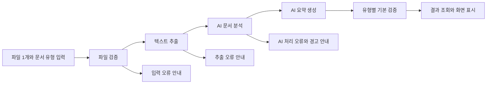

# 기능 분해 문서

## 1. 프로젝트 정보

| 항목 | 내용 |
| --- | --- |
| 프로젝트명 | AI Agent를 활용한 문서 분석 시스템 |
| 기준 문서 | docs/requirements-jdk.md |
| 목적 | 단일 업무 문서를 입력받아 텍스트를 추출하고, 요약과 문서 유형별 기본 검증 결과를 제공하는 MVP를 구현 단위로 분해한다. |
| MVP 제약 | Python 3, FastAPI, LangChain/LangGraph, 데이터베이스 미사용. 원본 파일을 수정하거나 장기 보관하지 않는다. |
| 지원 형식 | PDF, DOCX, TXT, HWPX, PPTX. HWP(v5)는 지원하지 않는다. |

## 2. 공통 계약과 처리 흐름

| 구분 | 계약 |
| --- | --- |
| 문서 식별자 | document_id: 검증 완료 문서에 임시 발급하며 이후 모든 단계의 연결 키로 사용한다. 장기 보관은 MVP 범위가 아니다. |
| 문서 유형 | meeting_minutes, work_report, official_document, other. 사용자가 선택하고, 미선택 시 other로 처리한다. 자동 추정은 표시만 하며 사용자 선택을 덮어쓰지 않는다. |
| 분석·요약 상태 | success, warning, failed. warning은 일부 근거 부족 또는 검토 후보가 있으나 사용 가능한 결과가 있는 상태다. |
| 검증 항목 상태 | pass, needs_review, not_verifiable. AI는 최종 사실 판정이 아니라 검토 후보와 근거를 제공한다. |
| 화면 상태 | processing, completed, warning, failed, not_found. 화면은 결과를 새로 생성하지 않는다. |

| 단계 | 입력 | 출력 | 다음 단계 |
| --- | --- | --- | --- |
| 파일 검증 | file, document_type | document_id, 파일명·형식·크기, validation_status | 텍스트 추출 |
| 텍스트 추출 | document_id, 검증 완료 파일 | source_text, text_length, 기본 구조, 추출 메타데이터 | AI 분석 |
| AI 문서 분석 | document_id, document_type, source_text | 분석 결과 계약 | 요약·검증 |
| AI 요약 | 원문, 분석 결과 | overview, key_points, conclusion, 근거 | 검증·표시 |
| 유형별 검증 | 원문·분석·요약, document_type | 항목별 상태·설명·근거·우선순위 | 결과 표시 |
| 결과 조회 | document_id | 문서 정보, 요약, 키워드, 검증 결과 | 사용자 조회 |

### 2.1 AI 분석 결과 계약

AI는 원문에 없는 사실을 추가하지 않으며, 근거가 부족하면 warning 또는 needs_review로 표시한다.

| 필드 | 내용 |
| --- | --- |
| document_subject | 문서 전체를 대표하는 중심 주제 |
| document_purpose | 정보 전달, 제안, 결정, 요청, 안내 등 문서 목적 |
| core_structure | 배경, 주요 내용, 결론 또는 요구사항 |
| key_sentences | 원문에서 직접 선택한 중요 문장과 위치 |
| keywords | 인물, 기관·부서, 일정, 수치, 핵심 개념, 제목, 목차 |
| verification_candidates | 모호함, 누락·상충 가능성, 중요 수치·조건의 추가 확인 후보 |
| analysis_status | success, warning, failed |
| evidence | 관련 원문 문장 또는 위치. 없는 제목·일자·기관·부서는 추정하지 않는다. |

## 3. 기능 분해

| 대분류 | 세부 기능 | 입력 | 처리 | 출력 | 우선순위 | 관련 Agent/API |
| --- | --- | --- | --- | --- | --- | --- |
| 화면 | 단일 파일·문서 유형 선택 | 파일 1개, 유형 선택값 | 지원 형식만 선택하고 미선택 유형은 other로 설정한다. 파일명·형식·크기·허용 최대 크기·상태를 표시한다. | 선택 파일·유형·기본 정보 | 높음 | Frontend |
| API | 파일 업로드·검증 | file, document_type | 파일 개수, 형식, 크기, 열기 가능 여부, 분석 가능한 내용 존재 여부를 확인한다. | 검증 결과와 document_id 또는 오류 | 높음 | API |
| 일반 처리 | 형식·크기·내용 검증 | 파일 | 본문 분석 전 지원 형식과 최대 크기를 확인하고, 형식별 라이브러리로 파일을 열어 텍스트·본문·슬라이드 텍스트 존재 여부를 확인한다. | 통과 또는 오류 | 높음 | 일반 코드 |
| 오류 처리 | 입력 오류 안내 | 미지원·빈 파일·크기 초과·손상·보호 파일 | 이후 단계를 중단하고 내부 예외와 원문을 노출하지 않는다. | 오류 코드·다음 행동 | 높음 | API·Frontend |
| API | 텍스트 추출 | document_id | 검증 완료 문서만 수신한다. | 추출 상태 또는 결과 | 높음 | API |
| 일반 처리 | 형식별 추출·정규화 | 검증 완료 파일 | PDF, DOCX, TXT, HWPX, PPTX에서 텍스트를 읽는다. HWPX는 python-hwpx를 사용하고 원본을 수정하지 않는다. 제목·문단·목록을 정리하고 공백·반복 줄바꿈을 제거한다. | source_text·기본 구조·메타데이터 | 높음 | 일반 코드 |
| 일반 처리 | 분석 가능 여부 확인 | 정규화 텍스트 | 의미 있는 본문과 길이를 확인한다. 빈 문서와 이미지 기반 PDF는 AI에 전달하지 않는다. | 추출 상태·오류 | 높음 | 일반 코드 |
| AI 처리 | 문서 분석 | 원문, 유형, 메타데이터 | 주제·목적·핵심 구조·원문 핵심 문장·키워드·검토 후보를 근거와 함께 구조화한다. | 2.1 분석 결과 계약 | 높음 | 분석 Agent |
| API | 분석 요청 | document_id | 원문·메타데이터를 분석 Agent에 전달한다. | 분석 결과 | 높음 | API·Agent |
| AI 처리 | 근거 기반 요약 | 원문, 분석 결과 | 목적과 핵심 구조를 기준으로 개요·핵심 내용·결론을 생성한다. 원문의 가능성·제안을 확정 결정처럼 바꾸지 않는다. | 구조화 요약·근거 | 높음 | 요약 Agent |
| 일반 처리 | 요약 입력·근거 확인 | 원문·분석·요약 | 이전 단계 결과와 요약 문장의 근거 연결 여부를 확인한다. | 요약 상태·경고 | 높음 | 일반 코드 |
| 일반 처리 | 유형별 기본 검증 | 유형, 원문·분석·요약 | 아래 6장의 필수 항목 존재 여부를 근거와 함께 확인한다. | 항목별 상태 | 높음 | 일반 코드 |
| 일반 처리 | 수치·조건 정확 비교 | 원문·분석·요약 | 금액, 수량, 단위, 날짜, 기간, 대상, 조건을 표준화하고 정확 비교한다. | 일치 여부·비교 근거 | 높음 | 일반 코드 |
| AI 처리 | 의미 차이 후보 식별 | 원문·요약·규칙 비교 결과 | 규칙만으로 판단하기 어려운 문맥상 불일치·과장·모호성을 검토 후보로 제시한다. | 검토 후보·근거 | 중간 | 검증 Agent |
| API | 요약·검증 요청 | document_id | 분석 성공 또는 경고 상태에서 요약과 검증을 실행한다. | 요약·검증 결과 | 높음 | API·Agent |
| 화면 | 결과 통합 조회·표시 | document_id | 생성 기능을 호출하지 않고 문서 정보, 요약, 키워드, 검증 결과, 확인 필요 항목을 조회한다. 긴 결과는 구역·접기/펼치기·우선순위로 탐색한다. | 결과 화면 | 높음 | Frontend·API |
| 화면 | 상태·오류 안내 | 처리 상태·오류 코드 | 처리 중, 완료, 경고, 실패, 결과 없음과 재시도 방법을 표시한다. | 사용자 안내 | 높음 | Frontend |
| 테스트 | 정상·예외 흐름 검증 | 예시 문서·오류 문서 | 입력부터 결과 조회까지 정상·예외 흐름을 검증한다. | 테스트 결과 | 높음 | Test |

## 4. API 기능 목록

| 기능 | Endpoint 후보 | 설명 | 우선순위 |
| --- | --- | --- | --- |
| 파일 업로드·검증 | POST /api/v1/documents | file과 document_type을 받고 검증 결과 및 임시 document_id를 반환한다. validate와 upload를 중복 제공하지 않는다. | 높음 |
| 텍스트 추출 | POST /api/v1/documents/{document_id}/extract | 검증 완료 문서에서 텍스트를 추출한다. | 높음 |
| 문서 분석 | POST /api/v1/documents/{document_id}/analysis | 추출 원문으로 분석 결과를 생성한다. | 높음 |
| 요약 생성 | POST /api/v1/documents/{document_id}/summary | 원문과 분석 결과로 요약을 생성한다. | 높음 |
| 기본 검증 | POST /api/v1/documents/{document_id}/verification | 유형별 필수 항목과 수치·조건을 검증한다. | 높음 |
| 통합 결과 조회 | GET /api/v1/documents/{document_id}/result | 결과 화면용 통합 결과와 상태를 반환하며 생성은 수행하지 않는다. | 높음 |

## 5. AI Agent 기능 목록

| Agent 기능 | 입력 | 처리 | 출력 | 우선순위 |
| --- | --- | --- | --- | --- |
| 분석 Agent | 정규화 원문, 문서 유형, 추출 메타데이터 | 주제·목적·구조·핵심 문장·키워드·검토 후보를 원문 근거와 함께 구조화한다. | 분석 결과 계약 | 높음 |
| 요약 Agent | 원문, 분석 결과 | 개요·핵심 내용·결론을 만들고 근거 부족·과장을 경고한다. | 구조화 요약 | 높음 |
| 검증 Agent | 원문·분석·요약, 규칙 비교 결과 | 문맥상 불일치·과장·모호한 조건을 사람 검토 후보로만 식별한다. 수치·날짜 정확 비교는 수행하지 않는다. | 의미적 검토 후보·근거 | 중간 |

## 6. 문서 유형별 기본 검증 기준

| 문서 유형 | MVP 필수 확인 항목 | 결과 기준 |
| --- | --- | --- |
| 회의록 | 회의 일시, 참석자, 안건, 결정 사항, 후속 조치 | pass, needs_review, not_verifiable과 원문 근거 또는 사유를 표시한다. |
| 업무보고 | 보고 기간, 진행 현황, 이슈, 다음 계획 | 같은 상태와 근거를 표시한다. |
| 공문 | 수신처, 발신처, 제목, 시행·접수 정보, 요청 또는 안내 사항 | 같은 상태와 근거를 표시한다. |
| 기타 | 공통 핵심 정보의 존재와 근거 | 유형별 필수 항목의 충족 여부는 단정하지 않는다. |

## 7. 예외 처리와 테스트 기준

| 상황 | 처리와 기대 결과 |
| --- | --- |
| 지원 형식별 정상 파일 | PDF, DOCX, TXT, HWPX, PPTX 각 1개가 입력·추출·분석·요약·검증·결과 조회까지 완료된다. |
| 유형별 정상 문서 | 회의록·업무보고·공문에서 각 필수 항목과 근거가 결과에 표시된다. |
| 유형 미선택 | other로 처리하며 자동 추정이 사용자 선택을 변경하지 않는다. |
| 미지원 형식·HWP(v5)·크기 초과 | 업로드 단계에서 중단하고 지원 형식 또는 최대 크기 안내를 표시한다. |
| 빈 파일·빈 문서·이미지 기반 PDF | 추출 이후 단계를 실행하지 않고 분석 가능한 텍스트 없음 안내를 표시한다. OCR은 MVP가 아니다. |
| 손상·비밀번호 보호 파일 | 다음 단계로 전달하지 않고 파일 상태 또는 보호 설정 확인을 안내한다. |
| 원문에 없는 사실 유도 | 분석·요약이 사실을 추가하지 않고 근거 부족을 warning 또는 needs_review로 표시한다. |
| 수치·조건 일치·불일치 | 일반 코드가 표준화·비교하며, 불일치에는 근거와 우선순위를 표시한다. |
| Agent 실패·지연 | 해당 단계만 failed로 표시하며 민감정보와 원문을 불필요하게 로그·응답에 노출하지 않는다. |
| 결과 화면 상태 | 처리 중·완료·경고·실패·결과 없음 안내가 표시되고 조회가 생성 API를 호출하지 않는다. |

## 8. 후순위 기능

| 기능 | 후순위 이유 | 추후 구현 방향 |
| --- | --- | --- |
| OCR | 스캔 PDF 지원은 품질·비용·보안 기준이 추가로 필요하다. | 이미지 기반 PDF의 OCR 품질과 비용을 별도 검토한다. |
| 정밀 표 구조 복원·원본 서식 재현 | MVP의 분석용 텍스트 추출 목표를 넘는다. | 표·도형·레이아웃 복원 기준을 확정한 뒤 추가한다. |
| 문서 유형별 심화 분석·사용자 지정 기준 | MVP는 세 유형의 기본 검증만 제공한다. | 업무별 규칙과 사용자 설정을 별도 설계한다. |
| 요약 길이·유형별 요약·사용자 지정 요약 | 기본 구조화 요약으로 MVP 가치를 검증할 수 있다. | 요약 옵션과 품질 기준을 추가한다. |
| 결과 다운로드·원문 위치 이동·검토 상태 저장 | 저장·권한·원문 보관 정책이 필요하다. | 보관 정책과 접근 제어 확정 후 추가한다. |
| 다중 문서 비교·이력 관리·로그인 | 요구사항의 MVP 제외 범위다. | 데이터베이스와 권한 모델 도입 후 추가한다. |

## 9. 추천 구현 순서

| 순서 | 기능 | 이유 |
| --- | --- | --- |
| 1 | 공통 상태·오류 코드·document_id·데이터 계약 확정 | API, 화면, Agent가 같은 데이터를 사용하도록 한다. |
| 2 | 단일 파일 입력과 형식·크기·내용 검증 | 안전한 입력 없이는 이후 처리를 시작할 수 없다. |
| 3 | 형식별 텍스트 추출과 정규화·분석 가능 여부 검증 | 모든 AI 처리의 공통 입력을 만든다. |
| 4 | 문서 유형 선택·유형별 필수 항목 규칙 | MVP 검증 기준을 먼저 고정한다. |
| 5 | 분석 Agent와 원문 근거 계약 | 요약과 검증이 재사용할 분석 결과를 만든다. |
| 6 | 요약 Agent와 근거·과장 방지 확인 | 사용자가 먼저 확인할 핵심 내용을 제공한다. |
| 7 | 규칙 기반 기본 검증과 의미적 검토 후보 | 정확 비교는 코드로, 의미 판단은 AI 보조로 구현한다. |
| 8 | 통합 결과 조회·상태 화면·긴 결과 탐색 | 생성과 표시 기능을 분리해 사용자 흐름을 완성한다. |
| 9 | 정상·예외·유형별 인수 테스트 | 요구사항의 인수 기준과 오류 처리를 검증한다. |

## 10. 구현 전 확인 사항

| 확인 항목 | 이유 |
| --- | --- |
| 최대 파일 크기와 화면 문구 | 운영 환경을 고려해 구현 단계에서 정해야 한다. |
| 임시 파일·document_id·결과의 보관 위치와 삭제 시점 | 장기 보관 없는 MVP의 데이터 수명 정책이 필요하다. |
| 파일 형식 판별 방식과 TXT 인코딩 | 확장자 불일치와 읽을 수 없는 문자 처리 기준이 필요하다. |
| 형식별 추출 라이브러리·보호 파일 판별 기준 | 형식별 예외 처리와 테스트 파일이 달라진다. |
| HWPX python-hwpx 버전과 비민감 테스트 파일 | 프로젝트 HWPX 처리 기준을 지켜야 한다. |
| AI 모델, 시간 제한, 재시도 횟수, 비용 한도 | AI 오류·지연 처리 기준을 확정해야 한다. |
| 원문 근거 위치 표현 방식 | 문단·페이지·슬라이드 위치를 화면과 API에서 일관되게 정해야 한다. |
| 유형별 필수 항목 판정 규칙 | needs_review와 not_verifiable를 일관되게 표시하기 위해 필요하다. |
| 개인정보·문서 본문 로그 정책 | 원문과 인증정보를 불필요하게 남기지 않기 위해 필요하다. |
