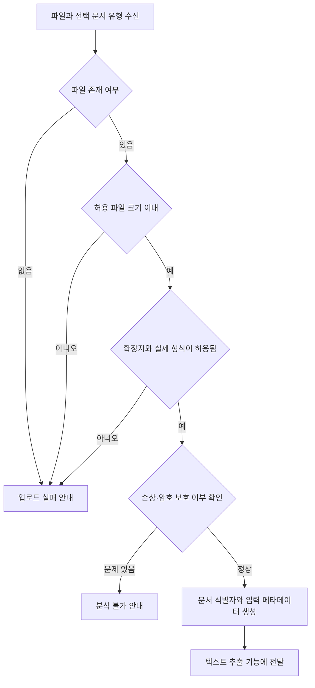

# 기능 분해 문서

## 1. 프로젝트 정보

| 항목 | 내용 |
| --- | --- |
| 프로젝트명 | AI Agent를 활용한 문서 분석 시스템 |
| 기준 문서 | `docs/requirements-jdk.md` |
| 목표 | 업무 문서를 입력받아 텍스트를 추출하고, 요약과 문서 유형별 기본 검증 결과를 제공하는 MVP를 구현 단위로 분해한다. |
| MVP 제약 | Python 3, FastAPI, LangChain/LangGraph를 사용하며 데이터베이스는 사용하지 않는다. 원본 파일을 수정하거나 장기 보관하지 않는다. |
| 지원 형식 | PDF, DOCX, TXT, HWPX, PPTX. HWP(v5)는 지원하지 않는다. |

## 2. 문서 입력 기능 목표와 범위

이 문서는 요구사항 정의서의 **FR-01 문서 업로드**를 입력·처리·출력·예외·테스트 단위로 분해한다. 사용자가 분석할 문서 한 개를 업로드하면, 시스템은 분석 가능 여부를 판정하고 다음 단계인 문서 텍스트 추출 기능에 전달할 입력 정보를 만든다.

이 기능은 AI 분석, 텍스트 추출, OCR, 요약, 검증을 수행하지 않는다. 이들은 후속 기능의 책임이다.

## 3. 입력 정의

| 항목 | 형식 | 필수 | 설명 |
| --- | --- | --- | --- |
| `file` | 업로드 파일 | 예 | PDF, DOCX, TXT, HWPX, PPTX 중 하나인 원본 문서 |
| `document_type` | 문자열 | 아니오 | `meeting_minutes`, `work_report`, `official_notice`, `other` 중 사용자가 선택한 유형 |
| `original_filename` | 문자열 | 예 | 사용자가 올린 원본 파일명. 시스템이 변경하지 않는다. |

- 문서 유형을 선택하지 않으면 `other`로 전달하고, 후속 분석 기능에서 추정 여부를 별도로 처리한다.
- 최대 파일 크기는 10MB이며 환경 설정값으로 관리한다. 화면과 API 응답은 현재 허용 크기를 안내할 수 있어야 한다.
- 원본 파일은 입력 검증과 후속 처리 중 수정·삭제·덮어쓰지 않는다.

## 4. 처리 단계

| 순서 | 일반 처리 책임 | 결과 |
| --- | --- | --- |
| 1 | 파일 존재 여부와 업로드 크기를 확인한다. | 검증 계속 또는 업로드 실패 |
| 2 | 확장자와 파일 헤더·구조를 확인해 실제 형식을 검증한다. | 허용 형식 또는 형식 오류 |
| 3 | 지원 라이브러리로 최소한의 열기 검사를 수행해 손상·암호 보호 여부를 판정한다. | 분석 가능 또는 분석 불가 |
| 4 | 중복되지 않는 `document_id`를 생성하고, 원본 파일명·형식·크기·문서 유형을 기록한다. | 후속 처리용 입력 객체 |
| 5 | 검증에 성공한 원본 파일 경로와 메타데이터를 텍스트 추출 기능으로 전달한다. | `ready_for_extraction` 상태 |

문서 입력은 일반적인 파일 검증 기능으로 구현하며 AI Agent나 LLM API를 사용하지 않는다.

## 5. 출력 정의와 기능 연결

### 4.1 업로드 응답

| 항목 | 설명 |
| --- | --- |
| `document_id` | 전체 분석 흐름에서 일관되게 사용하는 문서 식별자 |
| `original_filename` | 업로드된 원본 파일명 |
| `file_type` | 검증된 파일 형식 |
| `document_type` | 사용자가 선택한 유형 또는 `other` |
| `status` | `ready_for_extraction`, `upload_failed`, `analysis_unavailable` 중 하나 |
| `message` | 사용자에게 보여 줄 처리 결과와 다음 행동 |

### 4.2 텍스트 추출 기능 전달값

| 항목 | 설명 |
| --- | --- |
| `document_id` | 업로드 단계에서 생성된 식별자 |
| `source_path` | 읽기 전용 원본 파일의 보관 경로 |
| `original_filename` | 원본 파일명 |
| `file_type` | PDF, DOCX, TXT, HWPX, PPTX 중 검증된 값 |
| `document_type` | 선택 또는 기본 유형 |
| `file_size_bytes` | 검증된 원본 파일 크기 |

후속 텍스트 추출이 실패하면 이 기능의 성공 상태를 변경하지 않는다. 대신 추출 기능이 자신의 오류 상태와 안내를 생성한다.

## 6. 상태 규칙

| 상태 | 의미 | 후속 기능 실행 |
| --- | --- | --- |
| `received` | 파일 수신 직후, 검증 전 상태 | 실행 안 함 |
| `validating` | 형식·크기·상태를 검사 중 | 실행 안 함 |
| `ready_for_extraction` | 입력 검증이 완료됨 | 텍스트 추출 실행 가능 |
| `upload_failed` | 파일 누락, 크기 초과, 형식 오류 | 실행 금지 |
| `analysis_unavailable` | 손상 또는 암호 보호로 읽기 불가 | 실행 금지 |

## 7. 예외 처리

| 연결 요구사항 | 발생 조건 | 처리 | 사용자 안내 |
| --- | --- | --- | --- |
| ER-01 | 허용하지 않는 확장자 또는 실제 형식 | 파일을 저장·분석 흐름에 전달하지 않는다. | “PDF, DOCX, TXT, HWPX, PPTX 파일을 업로드해 주세요.” |
| ER-04 | 10MB를 초과한 파일 | 파일 내용을 분석하지 않고 제한값을 함께 안내한다. | “파일 크기가 허용 범위를 초과했습니다. 10MB 이하의 파일을 업로드해 주세요.” |
| ER-05 | 손상되었거나 비밀번호로 보호된 파일 | 원본을 변경하지 않고 분석 불가 상태로 종료한다. | “파일을 읽을 수 없습니다. 파일 상태를 확인해 주세요.” |
| 입력 누락 | 파일이 선택되지 않음 | 검증을 시작하지 않는다. | “분석할 문서를 선택해 주세요.” |
| 저장 실패 | 임시 보관 영역 또는 파일 I/O 오류 | 민감정보 없이 오류를 기록하고 재시도를 안내한다. | “파일을 업로드하지 못했습니다. 잠시 후 다시 시도해 주세요.” |

오류 메시지와 로그에는 파일 내용, 개인정보, 인증정보, API 키를 포함하지 않는다.

## 8. API Endpoint 후보

| 메서드·경로 | 역할 | 요청 | 성공 응답 |
| --- | --- | --- | --- |
| `POST /api/v1/documents` | 단일 문서 업로드와 입력 검증 | `multipart/form-data`의 `file`, 선택 `document_type` | 문서 식별자, 검증 정보, 상태 |
| `GET /api/v1/documents/{document_id}/status` | 처리 상태 조회 | 문서 식별자 | 현재 상태와 사용자 안내 |

`POST`는 업로드와 입력 검증까지만 담당한다. 텍스트 추출·AI 분석·결과 생성용 Endpoint는 각 기능 분해 단계에서 별도로 정의한다.

## 9. 테스트 기준

| ID | 테스트 입력·조건 | 기대 결과 |
| --- | --- | --- |
| T-IN-01 | 정상 PDF 업로드와 문서 유형 선택 | `ready_for_extraction`, 전달값 생성 |
| T-IN-02 | 정상 DOCX, TXT, HWPX, PPTX 업로드 | 각 형식이 허용되고 원본이 변경되지 않음 |
| T-IN-03 | 지원하지 않는 파일 형식 또는 확장자 위장 파일 | `upload_failed`, ER-01 안내 |
| T-IN-04 | 파일 미선택 | 업로드를 시작하지 않고 입력 누락 안내 |
| T-IN-05 | 최대 크기보다 큰 파일 | `upload_failed`, ER-04 안내 |
| T-IN-06 | 손상·암호 보호 파일 | `analysis_unavailable`, ER-05 안내 |
| T-IN-07 | 임시 저장 실패 상황 | 재시도 안내, 원본·민감정보 비노출 |
| T-IN-08 | 여러 문서를 순차 업로드 | 각 문서에 서로 다른 `document_id`가 생성됨 |

테스트에는 비민감 샘플 파일만 사용한다. 파일별 정상·예외 결과와 후속 기능 전달 데이터 형식을 함께 검증한다.

## 10. 구현 우선순위

1. 허용 형식·파일 존재·파일 크기 검증과 오류 응답
2. `document_id`, 상태, 후속 텍스트 추출 전달값 생성
3. 실제 파일 형식 및 손상·암호 보호 검사
4. 상태 조회 Endpoint와 화면 상태 연동

## 11. 후순위 기능

- 다중 문서 일괄 업로드와 압축 파일 업로드
- 로그인 사용자별 파일 보관·권한 관리
- 업로드 이력, 재사용, 삭제 정책
- 이미지·손글씨 문서의 OCR 품질 고도화
- 원본 서식 재현 및 정밀한 표 구조 복원
