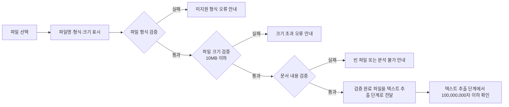
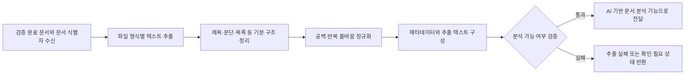
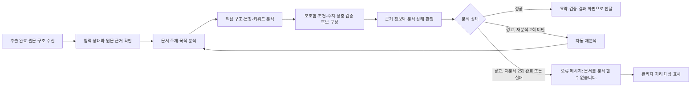
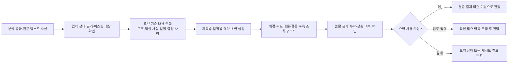
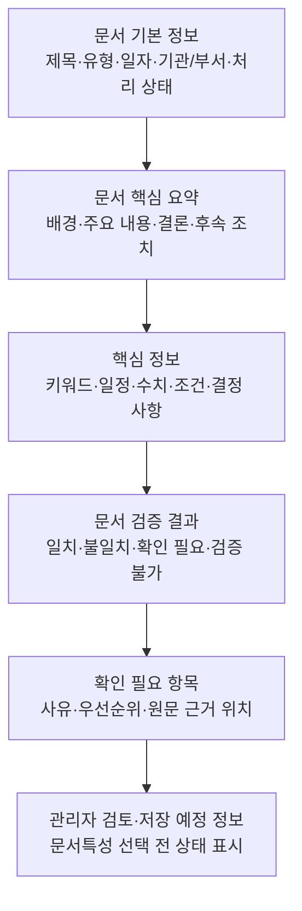

# 기능 분해 문서

## 1. 문서 입력 기능

### 1.1 기능 목적과 범위

사용자가 분석할 문서 **1개**를 업로드하면 시스템은 파일의 기본 정보를 표시하고, 형식·크기·문서 내용을 검증한다. 검증을 통과한 파일만 다음 단계인 텍스트 추출 처리로 전달한다.

- 지원 형식: PDF, DOC, DOCX, HWP, HWPX, PPT, PPTX, TXT
- 입력 단위: MVP에서는 단일 파일 1개만 처리한다. 지정 폴더의 여러 문서 일괄 처리는 후순위 기능이다.
- 최대 파일 크기: 10MB 이하
- 이 기능의 완료 기준: 파일이 검증 결과와 함께 `텍스트 추출 대기` 상태로 전달되거나, 처리 가능한 오류와 다음 행동이 사용자에게 안내된다.
- 범위 제외: 여러 파일 동시 업로드, 원본 파일 수정·재저장, 문서 이력 보관, 스캔 문서 문자 인식(OCR)

### 1.2 처리 흐름



### 1.3 화면 단위

| ID | 화면 요소 | 기능 정의 | 입력/출력 |
|---|---|---|---|
| UI-IN-01 | 파일 선택 영역 | 사용자가 PDF, DOC, DOCX, HWP, HWPX, PPT, PPTX, TXT 파일 한 개를 선택하거나 업로드한다. | 입력: 파일 1개 |
| UI-IN-02 | 파일 기본정보 영역 | 선택한 파일의 파일명, 형식, 크기를 표시한다. 아직 검증 전이면 검증 대기 상태를 함께 표시한다. | 출력: 파일명, 형식, 크기, 상태 |
| UI-IN-03 | 검증 결과 영역 | 형식, 크기, 문서 내용 검증 결과를 항목별로 표시한다. | 출력: 통과/실패, 사유 |
| UI-IN-04 | 오류 안내 영역 | 미지원 형식, 빈 파일, 크기 초과 시 원인과 사용자가 할 다음 행동을 안내한다. | 출력: 오류 메시지, 재선택 안내 |
| UI-IN-05 | 다음 단계 상태 | 모든 검증을 통과하면 텍스트 추출 단계로 전달되는 상태를 표시한다. | 출력: `텍스트 추출 대기` 또는 전달 완료 상태 |

### 1.4 API 단위 및 Endpoint 후보

| ID | Endpoint 후보 | 메서드 | 요청 | 성공 응답 후보 | 오류 응답 후보 |
|---|---|---|---|---|---|
| API-IN-01 | `/api/v1/documents/validate` | `POST` | 단일 `file` | 파일명, 형식, 크기, 각 검증 결과, 텍스트 추출 전달 상태 | 오류 코드, 사용자 안내 메시지, 실패 검증 항목 |
| API-IN-02 | `/api/v1/documents/upload` | `POST` | 단일 `file` | 업로드 후 검증 결과와 텍스트 추출 전달 상태 | 오류 코드, 사용자 안내 메시지 |

- MVP 구현 시에는 API-IN-01 또는 API-IN-02 중 하나만 채택한다.
- 성공 응답에는 최소한 파일명, 형식, 크기, 검증 상태와 텍스트 추출 전달 상태를 포함한다.
- 오류 응답에는 원문 내용이나 민감정보를 포함하지 않는다.

### 1.5 처리 단위

| ID | 처리 단계 | 기능 정의 | 완료 조건 |
|---|---|---|---|
| PR-IN-01 | 단일 파일 수신 | 요청에 파일이 정확히 1개 포함되었는지 확인하고, 선택 파일의 이름·형식·크기를 읽는다. | 파일 기본정보를 화면 및 API 응답용으로 생성한다. |
| PR-IN-02 | 파일 형식 검증 | 파일이 PDF, DOC, DOCX, HWP, HWPX, PPT, PPTX, TXT 중 하나인지 확인한다. | 지원 형식이면 다음 검증으로 진행한다. |
| PR-IN-03 | 파일 크기 검증 | 파일 크기가 10MB 이하인지 확인한다. 파일 본문을 분석하기 전에 수행한다. | 허용 범위이면 문서 내용 검증으로 진행한다. |
| PR-IN-04 | 문서 내용 검증 | 파일을 정상적으로 열 수 있는지, 분석 가능한 텍스트·본문·슬라이드 내용이 존재하는지 확인한다. | 분석 가능한 내용이 확인되면 통과로 기록한다. |
| PR-IN-05 | 검증 결과 생성 | 형식·크기·내용 검증의 상태와 실패 사유를 구조화한다. | 화면과 API에 일관된 상태와 안내를 제공한다. |
| PR-IN-06 | 텍스트 추출 전달 | 모든 검증을 통과한 파일과 기본정보를 텍스트 추출 단계에 전달한다. | 텍스트 추출 단계가 처리할 파일과 기본정보를 수신한다. |
| PR-IN-07 | 텍스트 길이 검증 연결 | 텍스트 추출 단계는 추출 텍스트가 100,000,000자 이하인지 확인한 뒤, 통과한 결과만 문서 분석 단계로 전달한다. | 초과 여부와 다음 단계 전달 상태가 반환된다. |

### 1.6 오류 처리 단위

| ID | 오류 상황 | 판정 기준 | 시스템 처리 | 사용자 안내 |
|---|---|---|---|---|
| ER-IN-01 | 미지원 형식 | 지원 목록 외 파일 | 텍스트 추출·분석을 시작하지 않고 형식 검증 실패로 처리한다. | `PDF, DOC, DOCX, HWP, HWPX, PPT, PPTX, TXT 파일을 업로드해 주세요.` |
| ER-IN-02 | 빈 파일 | 파일 크기가 0이거나 분석 가능한 텍스트·본문·슬라이드 내용이 없는 경우 | 텍스트 추출·분석을 진행하지 않고 내용 검증 실패로 처리한다. | `내용이 포함된 파일인지 확인한 뒤 다시 업로드해 주세요.` |
| ER-IN-03 | 크기 초과 | 파일 크기가 10MB를 초과한 경우 | 파일 내용을 분석하지 않고 업로드를 제한한다. | `파일 크기는 10MB 이하로 업로드해 주세요.` |
| ER-IN-04 | 파일 열기 또는 내용 확인 실패 | 지원 형식이지만 손상·보호 등으로 정상적으로 열 수 없거나 내용을 읽을 수 없는 경우 | 분석을 시작하지 않고 내용 검증 실패로 처리하며, 내부 상세 오류는 사용자에게 노출하지 않는다. | `파일을 읽을 수 없습니다. 파일 상태를 확인한 뒤 다시 업로드해 주세요.` |
| ER-IN-05 | 추출 텍스트 길이 초과 | 텍스트 추출 결과가 100,000,000자를 초과한 경우 | 문서 분석 단계로 전달하지 않고 텍스트 길이 초과 상태로 처리한다. | `추출된 텍스트가 너무 큽니다. 문서를 분할하거나 필요한 내용만 포함해 주세요.` |

### 1.7 테스트 단위

| ID | 구분 | 테스트 입력 또는 조건 | 기대 결과 |
|---|---|---|---|
| TC-IN-01 | 정상 | 텍스트가 있는 PDF 파일 1개, 10MB 이하 | 파일명·형식·크기가 표시되고 검증 통과 후 텍스트 추출 단계로 전달된다. |
| TC-IN-02 | 정상 | 텍스트가 있는 DOCX 파일 1개, 10MB 이하 | 파일 기본정보와 검증 결과가 표시되고 텍스트 추출 단계로 전달된다. |
| TC-IN-03 | 정상 | 내용이 있는 TXT 파일 1개, 10MB 이하 | 파일 기본정보와 검증 결과가 표시되고 텍스트 추출 단계로 전달된다. |
| TC-IN-04 | 정상 | 내용이 있는 HWPX 파일 1개, 10MB 이하 | 파일 기본정보와 검증 결과가 표시되고 텍스트 추출 단계로 전달된다. |
| TC-IN-05 | 정상 | 텍스트가 있는 PPTX 파일 1개, 10MB 이하 | 파일 기본정보와 검증 결과가 표시되고 텍스트 추출 단계로 전달된다. |
| TC-IN-06 | 경계값 | 파일 크기가 정확히 10MB인 지원 문서 | 크기 검증을 통과하고 다음 단계로 전달된다. |
| TC-IN-07 | 예외 | JPG, HWP(v5) 등 미지원 형식 파일 1개 | 형식 검증 실패와 지원 형식 안내가 표시되며 텍스트 추출 단계로 전달되지 않는다. |
| TC-IN-08 | 예외 | 0바이트 파일 | 빈 파일 오류가 표시되며 텍스트 추출 단계로 전달되지 않는다. |
| TC-IN-09 | 예외 | 열리지만 추출 가능한 내용이 없는 지원 형식 파일 | 내용 검증 실패와 재확인 안내가 표시되며 텍스트 추출 단계로 전달되지 않는다. |
| TC-IN-10 | 예외 | 10MB를 초과하는 지원 형식 파일 | 크기 초과 오류가 표시되며 파일 본문 분석과 텍스트 추출 단계 전달이 수행되지 않는다. |
| TC-IN-11 | 예외 | 손상되었거나 읽을 수 없는 지원 형식 파일 | 내용 검증 실패 안내가 표시되며 내부 오류 상세나 원문은 노출되지 않는다. |
| TC-IN-12 | 경계값 | 추출 텍스트가 정확히 100,000,000자인 문서 | 텍스트 길이 검증을 통과하고 문서 분석 단계로 전달된다. |
| TC-IN-13 | 예외 | 추출 텍스트가 100,000,000자를 초과하는 문서 | 문서 분석 단계로 전달되지 않고 텍스트 길이 초과 안내가 표시된다. |
| TC-IN-14 | 화면 | 정상 파일 선택 후 기본정보 확인 | 파일명, 형식, 크기, 검증 상태가 화면에 일치하게 표시된다. |
| TC-IN-15 | API | 정상·예외 파일별 API 요청 | 응답의 검증 상태·오류 코드·사용자 안내가 화면 표시와 일치한다. |

### 1.8 구현 우선순위와 추천 구현 순서

| 순서 | 우선순위 | 구현 범위 | 선행 조건 |
|---|---|---|---|
| 1 | 필수 | 지원 확장자 목록, 최대 파일 크기 10MB, 검증 상태와 오류 코드 정의 | 요구사항 확인 |
| 2 | 필수 | 단일 파일 수신과 파일명·형식·크기 표시 | 1단계 결과 |
| 3 | 필수 | 형식·크기 검증 및 미지원 형식·크기 초과 오류 처리 | 1~2단계 결과 |
| 4 | 필수 | 형식별 파일 열기 및 분석 가능 내용 존재 여부 검증, 빈 파일 오류 처리 | 지원 형식별 테스트 파일 준비 |
| 5 | 필수 | 검증 통과 파일의 텍스트 추출 단계 전달 계약과 100,000,000자 길이 검증 연결 | 텍스트 추출 기능의 입출력 계약 합의 |
| 6 | 필수 | 정상·예외 입력에 대한 화면, API, 처리 단위 테스트 | 1~5단계 구현 |
| 7 | 후순위 | 확장자와 실제 파일 형식의 심화 교차 검증, 세부 오류 분류 고도화 | 보안 정책 검토 |
| 8 | 후순위 | 여러 파일 동시 업로드, 업로드 이력·저장 관리 | MVP 범위 확장 승인 |

### 1.9 구현 전에 확인해야 할 사항

| 확인 항목 | 확인이 필요한 이유 | 결정 또는 확인 결과 |
|---|---|---|
| 파일 크기 단위 | 10MB를 바이트 단위로 적용할 때 기준을 통일해야 경계값 테스트가 가능하다. | 10MB의 정확한 바이트 기준을 구현 전에 확정한다. |
| 파일 형식 판정 기준 | 확장자만 볼지, 실제 파일 형식도 함께 확인할지에 따라 구현 범위와 보안 수준이 달라진다. | MVP 판정 방식과 확장자 불일치 시 처리 정책을 정한다. |
| 각 형식의 내용 존재 기준 | PDF, DOCX, HWPX, PPTX의 본문·표·슬라이드 텍스트를 어디까지 분석 가능 내용으로 볼지 합의가 필요하다. | 텍스트 추출 기능과 동일한 기준으로 정의한다. |
| 텍스트 길이 산정 기준 | 100,000,000자의 공백·줄바꿈·추출 실패 문자를 포함할지 정해야 한다. | 텍스트 추출 단계의 글자 수 계산 기준을 정한다. |
| 스캔 PDF 처리 | OCR 기능은 MVP 범위에서 제외되어 있으므로 텍스트가 없을 때 처리 기준이 필요하다. | 텍스트가 없으면 빈 문서 또는 분석 불가로 처리한다. |
| 암호 보호·손상 파일 처리 | 세부 오류 공개 범위는 보안과 사용성에 영향을 준다. | 사용자 안내 문구와 내부 로그 범위를 분리해 정한다. |
| TXT 인코딩 정책 | 읽을 수 없는 문자가 발생할 때 지원할 인코딩과 실패 기준을 정해야 한다. | 지원 인코딩과 오류 처리 기준을 확정한다. |
| 텍스트 추출 단계 전달 계약 | 전달할 파일, 기본정보, 검증 상태의 형식이 정해져야 기능 간 연동이 가능하다. | 텍스트 추출 기능의 입력·출력 계약을 합의한다. |

### 1.10 후순위 확장 기능

아래 항목은 요구사항 정의서의 MVP 범위에 포함되지 않으므로 이번 문서 입력 기능의 구현 대상에서 제외한다.

- 여러 문서 동시 업로드 및 통합 분석
- 업로드 파일의 장기 보관, 이력 조회, 재분석
- 원본 문서 자동 수정·재저장
- HWP(v5) 바이너리 형식 직접 지원
- 스캔 PDF 문자 인식(OCR) 처리
- 로그인·권한 기반 업로드 제한
## 2. 문서 텍스트 추출 기능

### 2.1 기능 목적과 범위

문서 입력 기능의 검증을 통과한 단일 문서와 문서 식별자를 입력받아, AI 기반 문서 분석 기능이 사용할 수 있는 정리된 텍스트와 메타데이터를 생성한다. 추출 결과가 분석 가능한 경우에만 다음 단계로 전달한다.

- 입력 조건: 문서 입력 기능에서 형식·크기·기본 내용 검증을 통과한 파일
- MVP 지원 형식: PDF, DOC, DOCX, HWP, HWPX, PPT, PPTX, TXT
- 추출 대상: 제목, 문단, 목록, 슬라이드 제목과 본문 등 분석 가능한 텍스트
- 정규화 범위: 불필요한 공백과 반복 줄바꿈 제거, 빈 줄 정리
- 텍스트 길이 제한: 정규화 후 추출 텍스트가 100,000,000자 이하인 경우에만 AI 기반 문서 분석 기능으로 전달
- 범위 제외: 원본 파일 수정, 원본 서식 재현, 정밀한 표 구조 복원, 이미지 속 문자 인식(OCR)

### 2.2 처리 흐름



### 2.3 입력 계약

| 항목 | 형식 | 필수 여부 | 설명 |
|---|---|---|---|
| document_id | 문자열 | 필수 | 문서 입력 기능이 발급하거나 전달한 문서 식별자 |
| source_file | 파일 또는 파일 참조 | 필수 | 검증을 통과한 단일 원본 문서 |
| file_name | 문자열 | 필수 | 원본 파일명 |
| file_type | 문자열 | 필수 | PDF, DOC, DOCX, HWP, HWPX, PPT, PPTX, TXT 중 하나 |
| file_size | 숫자 | 필수 | 원본 파일 크기. 10MB 이하 검증 완료 상태여야 한다. |
| validation_status | 문자열 | 필수 | 문서 입력 기능의 검증 완료 상태 |

### 2.4 형식별 텍스트 추출 범위

| 형식 | MVP 지원 여부 | 추출·정리 대상 | 주요 예외 |
|---|---|---|---|
| PDF | 지원 | 페이지의 분석 가능한 텍스트, 제목, 문단, 목록 | 손상 파일, 암호 보호 파일, 이미지 기반 PDF, 추출 가능한 텍스트 없음 |
| DOCX | 지원 | 제목, 문단, 목록, 표 안의 텍스트 | 손상 파일, 암호 보호 파일, 추출 가능한 텍스트 없음 |
| TXT | 지원 | 전체 텍스트, 제목으로 판단 가능한 첫 행, 문단 | 빈 파일, 읽을 수 없는 문자, 문자 인코딩 오류 |
| HWPX | 지원 | `python-hwpx`를 사용한 제목, 문단, 목록, 표 안의 텍스트 | 손상 파일, 보호 파일, 추출 가능한 텍스트 없음 |
| PPTX | 지원 | 슬라이드 제목, 본문, 표·도형 안의 텍스트 | 손상 파일, 빈 슬라이드, 추출 가능한 텍스트 없음 |
| DOC | 지원 | 변환 가능한 제목·본문·표 텍스트 | 변환 또는 읽기 실패 시 분석 불가 안내 |
| HWP | 지원 | 변환 가능한 제목·본문·표·목록 텍스트 | 변환 또는 읽기 실패 시 분석 불가 안내 |
| PPT | 지원 | 변환 가능한 슬라이드 제목·본문·표 텍스트 | 변환 또는 읽기 실패 시 분석 불가 안내 |

### 2.5 출력 계약: AI 기반 문서 분석 기능 입력

추출 기능은 분석 가능한 결과를 다음 구조로 AI 기반 문서 분석 기능에 전달해야 한다.

| 출력 항목 | 형식 | 설명 |
|---|---|---|
| document_id | 문자열 | 입력 문서와 분석 결과를 연결하는 식별자 |
| file_name | 문자열 | 원본 파일명 |
| file_type | 문자열 | 원본 파일 형식 |
| file_size | 숫자 | 원본 파일 크기 |
| normalized_text | 문자열 | 공백과 반복 줄바꿈을 정리한 전체 추출 텍스트 |
| text_length | 숫자 | 정규화 후 텍스트의 글자 수 |
| document_structure | 목록 | 제목, 문단, 목록, 슬라이드 등 기본 구조 단위와 순서 |
| extraction_status | 문자열 | `추출 완료`, `분석 불가`, `추출 실패` 중 하나 |
| analysis_available | 불리언 | AI 기반 문서 분석 단계로 전달 가능한지 여부 |
| warnings | 목록 | 제목·본문 미확인, 이미지 기반 PDF 등 확인이 필요한 사항 |

- `analysis_available`가 `true`이고 `text_length`가 100,000,000자 이하인 경우에만 AI 기반 문서 분석 기능으로 전달한다.
- 추출 실패 또는 분석 불가 결과에는 `normalized_text` 대신 실패 사유와 확인이 필요한 항목을 포함한다.
- 원본 파일과 추출 텍스트에 포함된 개인정보의 최종 마스킹은 분석 결과 화면과 결과 파일 생성 규칙에 따라 처리하며, 이 단계는 원본을 변경하지 않는다.

### 2.6 API 단위 및 Endpoint 후보

| ID | Endpoint 후보 | 메서드 | 요청 | 성공 응답 후보 | 오류 응답 후보 |
|---|---|---|---|---|---|
| API-EX-01 | `/api/v1/documents/{document_id}/extract` | `POST` | 검증 완료 상태의 문서 식별자와 파일 참조 | 추출 텍스트, 구조, 메타데이터, 분석 가능 여부 | 오류 코드, 추출 상태, 사용자 안내 메시지 |
| API-EX-02 | `/api/v1/documents/{document_id}/extraction-result` | `GET` | 문서 식별자 | 최신 추출 상태와 추출 결과 | 문서 미존재, 추출 미완료, 실패 사유 |

- MVP 구현 시에는 동기 처리 여부에 따라 API-EX-01만 사용하거나, 상태 조회가 필요한 경우 API-EX-02를 함께 채택한다.
- API 응답에는 원본 전체 내용을 불필요하게 포함하지 않고, 다음 단계에 필요한 추출 결과만 전달한다.

### 2.7 처리 단위

| ID | 처리 단계 | 기능 정의 | 완료 조건 |
|---|---|---|---|
| PR-EX-01 | 입력 상태 확인 | 문서 식별자, 파일 참조, 파일명·형식·크기, 검증 완료 상태를 확인한다. | 검증 완료 문서만 추출을 시작한다. |
| PR-EX-02 | 형식별 추출 수행 | PDF, DOC, DOCX, HWP, HWPX, PPT, PPTX, TXT에 맞는 방식으로 분석 가능한 텍스트를 추출한다. | 추출 텍스트 또는 형식별 실패 상태를 생성한다. |
| PR-EX-03 | 기본 구조 정리 | 제목, 문단, 목록, 슬라이드 제목·본문 등 식별 가능한 기본 구조를 순서대로 정리한다. | 구조 단위 목록과 전체 텍스트를 생성한다. |
| PR-EX-04 | 텍스트 정규화 | 불필요한 공백, 반복 줄바꿈, 빈 줄을 제거한다. | 분석용 정규화 텍스트를 생성한다. |
| PR-EX-05 | 메타데이터 구성 | 파일명, 형식, 크기, 문서 식별자, 텍스트 길이, 추출 상태를 구성한다. | 출력 계약의 메타데이터를 생성한다. |
| PR-EX-06 | 분석 가능 여부 검증 | 정규화 텍스트 존재 여부와 100,000,000자 이하 여부를 확인한다. | 분석 가능 또는 분석 불가 상태를 결정한다. |
| PR-EX-07 | 분석 기능 전달 | 분석 가능한 텍스트와 메타데이터를 AI 기반 문서 분석 기능에 전달한다. | 다음 단계가 입력 계약에 맞는 데이터를 수신한다. |

### 2.8 오류 처리 단위

| ID | 오류 상황 | 판정 기준 | 시스템 처리 | 사용자 안내 |
|---|---|---|---|---|
| ER-EX-01 | 손상·보호 파일 | 파일을 정상적으로 열 수 없거나 보호되어 내용을 읽을 수 없는 경우 | `추출 실패`로 처리하고 AI 분석 단계에 전달하지 않는다. | `파일을 읽을 수 없습니다. 파일 상태 또는 접근 권한을 확인해 주세요.` |
| ER-EX-02 | 빈 문서 | 추출 결과에 분석 가능한 텍스트가 없는 경우 | `분석 불가`로 처리하고 AI 분석 단계에 전달하지 않는다. | `문서에 분석 가능한 텍스트가 있는지 확인해 주세요.` |
| ER-EX-03 | 이미지 기반 PDF | PDF에 선택 가능한 텍스트가 없고 이미지로만 구성된 경우 | OCR은 MVP 범위에서 제외하므로 `분석 불가`로 처리한다. | `이미지 기반 PDF는 현재 분석할 수 없습니다. 텍스트가 포함된 PDF를 사용해 주세요.` |
| ER-EX-04 | 텍스트 추출 오류 | 형식별 추출 과정에서 오류가 발생한 경우 | `추출 실패`로 처리하고 오류 단계와 재시도 가능 여부를 기록한다. | `텍스트 추출에 실패했습니다. 파일 상태를 확인한 뒤 다시 시도해 주세요.` |
| ER-EX-05 | 텍스트 길이 초과 | 정규화 후 텍스트가 100,000,000자를 초과한 경우 | `분석 불가`로 처리하고 AI 분석 단계에 전달하지 않는다. | `추출된 텍스트가 너무 큽니다. 문서를 분할하거나 필요한 내용만 포함해 주세요.` |

### 2.9 테스트 단위

| ID | 구분 | 테스트 입력 또는 조건 | 기대 결과 |
|---|---|---|---|
| TC-EX-01 | 정상 | 분석 가능한 텍스트가 있는 PDF | 제목·문단·목록을 포함한 정규화 텍스트와 메타데이터가 생성되고 분석 기능으로 전달된다. |
| TC-EX-02 | 정상 | 분석 가능한 텍스트가 있는 DOCX | 제목·문단·목록을 포함한 정규화 텍스트와 메타데이터가 생성되고 분석 기능으로 전달된다. |
| TC-EX-03 | 정상 | 내용과 줄바꿈이 있는 TXT | 반복 줄바꿈과 불필요한 공백이 정리된 텍스트가 생성되고 분석 기능으로 전달된다. |
| TC-EX-04 | 정상 | 분석 가능한 텍스트가 있는 HWPX | 제목·문단·목록을 포함한 정규화 텍스트와 메타데이터가 생성되고 분석 기능으로 전달된다. |
| TC-EX-05 | 정상 | 텍스트가 있는 PPTX | 슬라이드 제목·본문·도형 안의 텍스트가 정리되어 분석 기능으로 전달된다. |
| TC-EX-06 | 예외 | 손상되었거나 보호된 PDF, DOCX, HWPX, PPTX | `추출 실패` 상태와 사용자 안내가 표시되고 분석 기능으로 전달되지 않는다. |
| TC-EX-07 | 예외 | 빈 TXT 또는 텍스트가 없는 지원 문서 | `분석 불가` 상태와 사용자 안내가 표시되고 분석 기능으로 전달되지 않는다. |
| TC-EX-08 | 예외 | 이미지로만 구성된 PDF | OCR 미지원 안내와 `분석 불가` 상태가 표시된다. |
| TC-EX-09 | 예외 | 읽을 수 없는 문자가 포함된 TXT | 추출 실패 또는 분석 불가 상태와 재확인 안내가 표시된다. |
| TC-EX-10 | 경계값 | 정규화 후 텍스트가 정확히 100,000,000자인 문서 | `analysis_available=true`로 설정되어 분석 기능으로 전달된다. |
| TC-EX-11 | 예외 | 정규화 후 텍스트가 100,000,000자를 초과한 문서 | `analysis_available=false`로 설정되어 분석 기능으로 전달되지 않는다. |
| TC-EX-12 | 범위 확인 | DOC, HWP, PPT 파일 | MVP 미지원 형식으로 처리되며, 추출 기능은 실행되지 않는다. |

### 2.10 구현 우선순위와 추천 구현 순서

| 순서 | 우선순위 | 구현 범위 | 선행 조건 |
|---|---|---|---|
| 1 | 필수 | 문서 입력 기능과의 입력 계약, 추출 결과 상태 정의 | 문서 식별자와 검증 완료 상태 형식 합의 |
| 2 | 필수 | TXT 텍스트 추출, 정규화, 메타데이터와 분석 가능 여부 구성 | 1단계 결과 |
| 3 | 필수 | PDF, DOCX, HWPX, PPTX 형식별 기본 텍스트 추출 | 형식별 비민감 테스트 파일 준비 |
| 4 | 필수 | 제목·문단·목록·슬라이드 기본 구조 정리 | 2~3단계 결과 |
| 5 | 필수 | 빈 문서, 손상·보호 파일, 이미지 기반 PDF, 텍스트 길이 초과 오류 처리 | 형식별 예외 테스트 파일 준비 |
| 6 | 필수 | AI 기반 문서 분석 기능으로의 출력 계약 연결과 형식별 정상·예외 테스트 | 1~5단계 결과 |
| 7 | 후순위 | DOC, HWP, PPT 구형 형식 지원 | MVP 범위 확장 승인 |
| 8 | 후순위 | OCR, 정밀한 표 구조 복원, 원본 서식 재현 | MVP 범위 확장 승인 |

### 2.11 MVP 범위와 후순위 기능

| 구분 | 포함 또는 제외 기능 | 이유 |
|---|---|---|
| MVP 포함 | PDF, DOC, DOCX, HWP, HWPX, PPT, PPTX, TXT의 기본 텍스트 추출 | 요구사항 정의서의 지원 형식이다. |
| MVP 포함 | 기본 문서 구조 정리, 공백·줄바꿈 정규화, 메타데이터 구성, 분석 가능 여부 검증 | AI 기반 문서 분석 기능의 입력 품질을 확보한다. |
| MVP 포함 | 손상 파일, 빈 문서, 이미지 기반 PDF, 추출 오류 처리 | 요구사항에 정의된 주요 예외 상황이다. |
| 후순위 | 이미지 기반 PDF OCR | 요구사항에 포함되지 않은 기능이다. |
| 후순위 | 정밀한 표 구조 복원 | 요구사항에 포함되지 않은 기능이다. |
| 후순위 | 원본 서식 재현 | 요구사항에 포함되지 않은 기능이다. |
### 2.12 AI 기반 문서 분석 연계 데이터 예시

문서 텍스트 추출 기능은 원본 파일을 수정하지 않고, 아래와 같은 논리적 데이터 묶음을 AI 기반 문서 분석 기능에 전달한다. 실제 API 구현 시 필드명은 공통 API 규칙에 맞춰 조정할 수 있으나, 필수 정보와 상태값의 의미는 유지한다.

#### 성공: 분석 가능한 문서

```json
{
  "document_id": "doc_20260725_001",
  "source": {
    "file_name": "2026년_7월_업무보고.docx",
    "file_type": "DOCX",
    "file_size": 245760,
    "validation_status": "VALIDATED"
  },
  "extraction": {
    "extraction_status": "EXTRACTED",
    "analysis_available": true,
    "normalized_text": "# 2026년 7월 업무보고\\n\\n## 추진 현황\\n사업 A를 완료했습니다.\\n\\n- 후속 조치: 8월 1일까지 결과를 공유합니다.",
    "text_length": 75,
    "document_structure": [
      {"order": 1, "type": "title", "text": "2026년 7월 업무보고"},
      {"order": 2, "type": "heading", "text": "추진 현황"},
      {"order": 3, "type": "paragraph", "text": "사업 A를 완료했습니다."},
      {"order": 4, "type": "list_item", "text": "후속 조치: 8월 1일까지 결과를 공유합니다."}
    ],
    "warnings": []
  }
}
```

- `document_structure.type`은 MVP에서 `title`, `heading`, `paragraph`, `list_item`, `slide_title`, `slide_body`, `table_text`만 사용한다. 형식별로 구분할 수 없는 항목은 `paragraph`로 처리한다.
- `normalized_text`는 구조 순서를 보존해 이어 붙인 분석용 본문이다. 제목과 하위 제목은 식별 가능하도록 줄 앞에 `#`, `##`를 붙일 수 있으나, 원본 서식을 재현하는 목적은 아니다.
- AI 기반 분석 기능은 `document_id`, `normalized_text`, `document_structure`, `warnings`를 입력으로 사용하며, `analysis_available=true`인 결과만 수신한다.

#### 실패 또는 분석 불가: AI 분석 단계 미전달

```json
{
  "document_id": "doc_20260725_002",
  "source": {
    "file_name": "스캔본.pdf",
    "file_type": "PDF",
    "file_size": 1048576,
    "validation_status": "VALIDATED"
  },
  "extraction": {
    "extraction_status": "ANALYSIS_UNAVAILABLE",
    "analysis_available": false,
    "normalized_text": null,
    "text_length": 0,
    "document_structure": [],
    "warnings": ["IMAGE_BASED_PDF"],
    "error": {
      "code": "EX_IMAGE_PDF_NO_TEXT",
      "message": "이미지 기반 PDF는 현재 분석할 수 없습니다. 텍스트가 포함된 PDF를 사용해 주세요."
    }
  }
}
```

- 상태값은 `EXTRACTED`, `ANALYSIS_UNAVAILABLE`, `EXTRACTION_FAILED`로 통일한다.
- 오류 응답과 로그에는 원문 전체, 개인정보, 비밀번호 또는 내부 라이브러리의 상세 예외를 포함하지 않는다.

### 2.13 형식별 정상·예외 테스트 매트릭스

| 형식 | 정상 테스트 | 예외 테스트 | MVP 처리 결과 |
|---|---|---|---|
| PDF | 텍스트 레이어가 있는 PDF에서 페이지 텍스트·제목·문단을 추출한다. | 손상·암호 보호·이미지 기반 PDF·텍스트 없는 PDF | 정상 시 분석 전달, 이미지 기반 PDF는 OCR 없이 분석 불가 |
| DOC | 변환 가능한 제목·본문·표 텍스트 | 변환 또는 읽기 실패 | 정상 시 분석 전달, 그 외 추출 실패 또는 분석 불가 |
| DOCX | 제목·문단·목록·표 안의 텍스트를 순서대로 추출한다. | 손상·암호 보호·텍스트 없는 문서 | 정상 시 분석 전달, 그 외 추출 실패 또는 분석 불가 |
| TXT | UTF-8 등 지원 인코딩의 본문·첫 행·문단을 추출한다. | 0바이트 파일·지원하지 않는 인코딩·읽을 수 없는 문자 | 정상 시 분석 전달, 인코딩 오류는 추출 실패 |
| HWP | 변환 가능한 제목·본문·표·목록 텍스트 | 변환 또는 읽기 실패 | 정상 시 분석 전달, 그 외 추출 실패 또는 분석 불가 |
| HWPX | 제목·문단·목록·표 안의 텍스트를 추출한다. | 손상·보호·텍스트 없는 문서 | 정상 시 분석 전달, 그 외 추출 실패 또는 분석 불가 |
| PPT | 변환 가능한 슬라이드 제목·본문·표 텍스트 | 변환 또는 읽기 실패 | 정상 시 분석 전달, 그 외 추출 실패 또는 분석 불가 |
| PPTX | 슬라이드 제목·본문·도형·표 안의 텍스트를 슬라이드 순서로 추출한다. | 손상·보호·모든 슬라이드가 텍스트 없는 경우 | 정상 시 분석 전달, 그 외 추출 실패 또는 분석 불가 |

### 2.14 형식 지원 상태의 API 판정 기준

문서 입력 기능의 검증 상태가 `VALIDATED`라도, 아래 지원 상태가 아니면 텍스트 추출과 AI 분석을 시작하지 않는다. DOC, HWP, PPT를 포함한 지원 형식은 변환 또는 추출에 성공한 경우에만 AI 분석을 시작한다.

| file_type | support_status | extraction_status | analysis_available | 다음 행동 |
|---|---|---|---|---|
| PDF, DOC, DOCX, HWP, HWPX, PPT, PPTX, TXT | `SUPPORTED_MVP` | 추출 결과에 따라 결정 | 추출 성공 시 `true` | AI 기반 문서 분석으로 전달 |
| 그 외 | `UNSUPPORTED` | `ANALYSIS_UNAVAILABLE` | `false` | 지원 형식 파일로 재업로드 |

## 3. AI 문서 분석 기능

### 3.1 기능 목적과 범위

AI 문서 분석 기능은 텍스트 추출 기능이 전달한 원문 텍스트와 기본 구조를 바탕으로 문서 전체를 대표하는 주제, 목적, 핵심 구조, 중요 원문 문장, 키워드, 검증 후보와 근거 정보를 구조화한다. 이 결과는 AI 요약 생성, AI 검증, 결과 화면 출력, Markdown 결과 파일 생성의 공통 입력이다.

- 입력 조건: `extraction_status=EXTRACTED`, `analysis_available=true`인 단일 문서
- 분석 범위: 문서 주제, 문서 목적, 배경·주요 내용·결론 또는 요구사항, 핵심 문장, 주요 키워드, 검증 후보, 분석 상태, 근거 정보
- 원칙: 원문에 근거가 없는 사실을 생성하거나 확정하지 않는다. 누락·상충·모호성은 검증 후보로 남긴다.
- 범위 제외: 원본 수정·이동·덮어쓰기, 자동 최종 승인, 법률·감사·행정의 확정 판단, 여러 문서 통합 분석

### 3.2 처리 흐름



### 3.3 입력 계약

| 항목 | 형식 | 필수 여부 | 설명 |
|---|---|---|---|
| document_id | 문자열 | 필수 | 추출·분석·요약·검증·저장 결과를 연결하는 식별자 |
| normalized_text | 문자열 | 필수 | 정규화된 원문 텍스트. 100,000,000자 이하인 경우만 수신 |
| document_structure | 목록 | 필수 | 제목·문단·목록·슬라이드의 원문 순서와 위치 |
| source | 객체 | 필수 | 파일명, 형식, 생성일·수정일 등 파일 메타데이터 |
| user_categories | 문자열 목록 | 필수 | 문서 유형 추천 기준. MVP 기본값은 회의록·공문·보고서 |
| extraction_warnings | 목록 | 필수 | 이미지·표·슬라이드 누락 등 추출 한계 정보 |

### 3.4 표준 분석 결과 항목

| ID | 결과 항목 | 포함 내용 | 근거·표시 규칙 |
|---|---|---|---|
| AR-01 | 문서 기본 정보 | 문서 제목, 작성일·시행일, 기관·부서, 기준일 후보 | 원문 확인값과 파일 메타데이터 후보를 구분한다. 누락값은 `확인 필요`로 표시한다. |
| AR-02 | 문서 주제 | 문서 전체를 대표하는 중심 주제 1개와 보조 주제 | 제목·목차·반복 개념·결론을 근거로 하며, 세부 문단 제목만 사용하지 않는다. |
| AR-03 | 문서 목적 | 정보 전달, 제안, 결정, 요청, 보고, 안내 | 복수 목적을 허용하고 제안·검토·확정 표현을 구분한다. |
| AR-04 | 핵심 구조 | 배경, 주요 내용, 결론 또는 요구사항 | 원문 순서로 구조화한다. 원문에 없는 구조는 생성하지 않는다. |
| AR-05 | 핵심 문장 | 원문에서 직접 선택한 중요 문장 | 원문을 요약·재작성하지 않으며, 위치와 선택 이유를 함께 제공한다. |
| AR-06 | 주요 키워드 | 인물, 기관, 일정, 수치, 핵심 개념 | 원문 표기·단위·위치를 보존한다. 개인정보는 표시·저장 시 마스킹 대상으로 연결한다. |
| AR-07 | 검증 후보 | 모호함, 조건, 수치, 상충, 누락, 추출 한계 | 오류 확정이 아닌 사람의 확인 대상이다. 사유·우선순위·원문 근거·권장 확인 행동을 제공한다. |
| AR-08 | 분석 상태 | 성공, 경고, 실패 | 결과 사용 가능 여부, 실패·경고 사유, 재시도 가능 여부, 저장 가능 여부를 제공한다. |
| AR-09 | 근거 정보 | 관련 원문 문장 또는 위치 | 짧은 원문 문장과 제목·문단·목록·슬라이드 순서를 제공하며 원문 전체는 반복 노출하지 않는다. |
| AR-10 | 문서 유형 추천 | 추천 유형, 후보, 근거, 신뢰도 | AI 추천은 관리자 선택을 대체하지 않는다. 저장 시 사용자가 직접 문서특성을 선택한다. |

### 3.5 분석 상태와 자동 재분석 정책

- 분석 시도는 최초 분석 1회와 자동 재분석 최대 2회로 구성한다. 최초 분석 후 `경고`가 발생하면 최대 두 번 다시 분석한다.
- `경고`는 중간 처리 상태이며 관리자 검토·승인 대상이 아니다. 재분석 중에는 요약·검증·저장 기능으로 결과를 전달하지 않는다.
- 두 번의 재분석 후에도 `성공`이 아니거나 분석 처리 오류가 반복되면 최종 상태를 `실패`로 확정하고 화면에 **`문서를 분석 할 수 없습니다.`**를 표시한다. 이 문서는 관리자 처리 대상으로 전환한다.

| 상태 | 판정 기준 | 요약·검증·화면 | 문서특성 드롭다운·Markdown 저장 |
|---|---|---|---|
| 성공 | 표준 결과 항목과 근거가 생성되고 치명적 처리 오류가 없는 경우 | 요약·검증·결과 화면으로 전달한다. | 드롭다운을 활성화한다. 관리자 최종 검토, 문서특성 선택, 확인 버튼 클릭 후에만 저장한다. |
| 경고 | 필수 정보 누락, 근거 부족, 상충, 추출 경고 또는 일시적 분석 오류가 있는 경우 | 자동 재분석을 수행한다. 후속 기능과 관리자 검토로 전달하지 않는다. | 비활성화한다. 파일을 생성하거나 저장하지 않는다. |
| 실패 | 자동 재분석 2회까지 수행한 뒤에도 성공하지 않았거나, 재시도할 수 없는 분석 오류가 발생한 경우 | `문서를 분석 할 수 없습니다.`와 관리자 처리 대상 상태만 표시한다. | 비활성화한다. 파일을 생성하거나 저장하지 않는다. |

### 3.6 처리 단위

| ID | 처리 단계 | 기능 정의 | 완료 조건 |
|---|---|---|---|
| PR-AN-01 | 입력 검증 | 문서 식별자, 추출 상태, 원문 텍스트, 구조, 경고를 확인한다. | 분석 가능 문서만 처리한다. |
| PR-AN-02 | 기본정보·주제·목적 분석 | 제목·일자·기관·부서와 중심 주제, 목적 유형을 근거와 함께 분석한다. | AR-01~03이 구성된다. |
| PR-AN-03 | 핵심 구조 분석 | 배경·주요 내용·결론 또는 요구사항을 원문 순서로 구성한다. | AR-04가 구성된다. |
| PR-AN-04 | 핵심 문장·키워드 추출 | 원문 직접 인용 문장과 인물·기관·일정·수치·개념을 추출한다. | AR-05~06이 위치·선택 이유와 함께 구성된다. |
| PR-AN-05 | 검증 후보 구성 | 모호함·조건·상충·누락·추출 경고를 확인 대상으로 구성한다. | AR-07이 구성된다. |
| PR-AN-06 | 유형 추천·상태 판정 | 문서 유형 후보와 근거를 제시하고 성공·경고·실패를 판정한다. 경고이면 재분석 횟수를 확인한다. | 성공 결과 또는 재분석·최종 실패 상태가 결정된다. |
| PR-AN-07 | 자동 재분석 또는 후속 전달 | 경고이면 최대 2회 자동 재분석하고, 성공이면 모든 분석 항목을 근거 ID·위치와 함께 후속 기능에 전달한다. | 성공 결과만 요약·검증·화면에 전달되며, 재분석 실패 문서는 관리자 처리 대상으로 전환된다. |

### 3.7 출력 계약: 요약·검증 기능 입력

| 출력 항목 | 형식 | 설명 |
|---|---|---|
| document_id | 문자열 | 문서 식별자 |
| analysis_status | 문자열 | `SUCCESS`, `WARNING`, `FAILURE` |
| analysis_available | 불리언 | `SUCCESS`일 때만 요약·검증·화면에 전달 가능한지 여부 |
| document_profile | 객체 | 제목, 일자, 기관·부서, 기준일 후보와 상태 |
| document_subject | 객체 | 중심 주제, 상태, 근거 ID |
| document_purposes | 목록 | 목적 유형과 근거 ID |
| content_structure | 객체 | 배경, 주요 내용, 결론 또는 요구사항과 근거 |
| key_sentences | 목록 | 원문 직접 인용 문장, 위치, 선택 이유 |
| keywords | 목록 | 인물, 기관, 일정, 수치, 핵심 개념과 근거 |
| verification_candidates | 목록 | 확인 대상, 사유, 우선순위, 권장 확인 행동 |
| category_recommendation | 객체 | 추천 문서 유형, 후보, 근거, 신뢰도 |
| evidence | 목록 | 원문 문장 또는 위치 |
| analysis_retry_count | 숫자 | 수행한 자동 재분석 횟수. 최대값은 2 |
| extraction_warnings | 목록 | 추출 단계 경고 |
| masking_targets | 목록 | 표시·저장 시 마스킹할 정보 |

### 3.8 API 단위 및 Endpoint 후보

| ID | Endpoint 후보 | 메서드 | 요청 | 성공 응답 후보 | 오류 응답 후보 |
|---|---|---|---|---|---|
| API-AN-01 | `/api/v1/documents/{document_id}/analyze` | `POST` | 문서 식별자, 추출 결과 참조, 사용자 카테고리 | 표준 분석 결과, 상태, 근거, 검증 후보 | 오류 코드, 실패 단계, 재시도 가능 여부 |
| API-AN-02 | `/api/v1/documents/{document_id}/analysis-result` | `GET` | 문서 식별자 | 최신 분석 상태와 표준 분석 결과 | 문서 미존재, 분석 미완료, 실패 사유 |

### 3.9 오류·테스트·MVP 범위

| ID | 상황 | 처리 |
|---|---|---|
| ER-AN-01 | 추출 상태가 분석 불가·실패 | 분석을 시작하지 않고 이전 단계 오류를 반환한다. |
| ER-AN-02 | 제목·일자·기관·부서 누락 | `경고`로 판정하고 최대 2회 자동 재분석한다. 성공하지 않으면 최종 실패와 관리자 처리 대상으로 전환한다. |
| ER-AN-03 | 날짜·수치·기관·결정 사항 상충 | `경고`로 판정하고 최대 2회 자동 재분석한다. 상충이 지속되면 최종 실패로 처리한다. |
| ER-AN-04 | LLM 처리 또는 응답 형식 오류 | 재시도 가능한 오류면 최대 2회 자동 재분석한다. 이후에도 성공하지 않으면 `문서를 분석 할 수 없습니다.`를 표시하며 내부 오류 상세는 노출하지 않는다. |
| ER-AN-05 | 자동 재분석 횟수 초과 | 최종 상태를 `실패`로 확정하고 요약·검증·저장 기능을 실행하지 않는다. 관리자 처리 대상으로 표시한다. |

| ID | 구분 | 테스트 입력 또는 조건 | 기대 결과 |
|---|---|---|---|
| TC-AN-01 | 정상 | 주제·목적·결론이 명확한 보고서 | AR-01~10과 근거가 생성되고 상태는 `성공`이다. |
| TC-AN-02 | 정상 | 요청·기한·조건이 있는 공문 | 목적·요구사항·일정·조건이 구조화된다. |
| TC-AN-03 | 예외 | 필수 정보 누락 또는 상충 문서 | 경고 후 최대 2회 자동 재분석한다. 성공하지 않으면 `문서를 분석 할 수 없습니다.`와 관리자 처리 대상 상태를 표시한다. |
| TC-AN-04 | 오류 | 원문·근거 없음 또는 분석 처리 실패 | 최대 2회 자동 재분석 후에도 성공하지 않으면 상태는 `실패`, 메시지는 `문서를 분석 할 수 없습니다.`, 저장은 불가로 표시된다. |

- MVP에는 단일 문서의 표준 분석 결과, 근거 연결, 검증 후보, 문서 유형 추천을 포함한다.
- OCR, 정밀 표 구조 해석, 여러 문서 통합 분석, 자동 최종 승인은 후순위다.
## 4. AI 요약 생성 기능

### 4.1 기능 목적과 범위

AI 요약 생성 기능은 AI 문서 분석 결과와 원문 정규화 텍스트를 함께 사용하여, 사용자가 빠르게 검토할 수 있는 구조화된 요약 초안을 생성한다. 요약은 분석 결과의 핵심 구조와 원문 근거를 벗어나지 않아야 하며, 불명확하거나 누락된 정보는 사실처럼 보완하지 않고 `확인 필요`로 남긴다.

- 입력 조건: `analysis_status=SUCCESS`이고 `analysis_available=true`인 단일 문서. 경고 상태는 자동 재분석 중이므로 요약을 시작하지 않는다.
- 요약 범위: 배경, 주요 내용, 문제·이슈, 해결방안 또는 요청 사항, 결론·결정 사항, 일정, 담당 주체, 후속 조치, 주요 제목별·일정별 요약
- 출력 목적: 문서 검증 결과 제공, 분석 결과 화면 출력, 관리자 최종 검토 및 결과 문서 생성의 공통 입력
- 범위 제외: 원문에 없는 사실 생성, 최종 업무 판단, 문서특성 확정, 원본 수정, 여러 문서 통합 요약

### 4.2 처리 흐름



### 4.3 입력 계약

| 항목 | 형식 | 필수 여부 | 사용 규칙 |
|---|---|---|---|
| document_id | 문자열 | 필수 | 원문·분석·요약·검증 결과를 동일 문서로 연결한다. |
| normalized_text | 문자열 | 필수 | 원문 확인과 요약 근거 검증에 사용한다. |
| document_structure | 목록 | 필수 | 제목·문단·목록·슬라이드 순서를 유지해 제목별 요약 범위를 정한다. |
| analysis_status / analysis_available | 문자열 / 불리언 | 필수 | 분석 가능 결과만 요약을 시작한다. |
| document_profile | 객체 | 필수 | 제목, 일자, 기관·부서, 기준일 후보와 상태를 요약 기본정보에 반영한다. |
| content_structure | 목록 | 필수 | 배경, 현황, 문제, 요청, 해결방안, 결론의 요약 기준으로 사용한다. |
| key_facts | 객체 | 필수 | 일정, 수치, 조건, 담당자, 결정 사항, 후속 조치를 우선 보존한다. |
| evidence | 목록 | 필수 | 요약 문장과 연결할 원문 근거다. |
| review_items / extraction_warnings | 목록 | 필수 | 누락·상충·텍스트 추출 한계를 요약의 확인 필요 항목에 반영한다. |
| masking_targets | 목록 | 필수 | 화면·결과 파일에 제공할 요약문 마스킹을 위한 대상 정보다. |
| summary_preferences | 객체 또는 null | 선택 | 사용자 요청이 있을 때 요약 길이, 강조 항목, 제목별·일정별 표시 여부를 지정한다. 미입력 시 MVP 기본 형식을 사용한다. |

### 4.4 요약 생성 처리 단위

| ID | 처리 단계 | 기능 정의 | 완료 조건 |
|---|---|---|---|
| PR-SU-01 | 입력 상태 검증 | 분석 상태, 원문 텍스트, 핵심 구조, 근거 존재 여부를 확인한다. | 분석 가능한 문서만 요약을 시작한다. |
| PR-SU-02 | 요약 대상 선정 | 문서 구조와 핵심 사실에서 배경·주요 내용·결론·후속 조치에 필요한 내용을 선정한다. | 요약에 사용할 구조 단위와 근거 목록이 정해진다. |
| PR-SU-03 | 제목별·일정별 정리 | 원문 제목과 날짜·기한을 기준으로 내용을 그룹화한다. 날짜가 없는 경우 임의의 일정 요약을 만들지 않는다. | 제목별 및 일정별 요약 후보가 생성된다. |
| PR-SU-04 | 구조화 요약 초안 생성 | 배경, 주요 내용, 문제·요청, 결론·결정 사항, 후속 조치 순서로 짧고 명확한 한국어 요약을 생성한다. | 필수 요약 영역의 초안이 생성된다. |
| PR-SU-05 | 핵심 사실 보존 확인 | 날짜, 수치, 기관·부서, 결정 사항, 담당자, 조건이 원문·분석 근거와 일치하는지 확인한다. | 불일치 후보는 수정하거나 `확인 필요`로 이동한다. |
| PR-SU-06 | 근거·누락 표시 | 근거가 부족한 문장, 분석 단계의 누락·상충 정보, 추출 경고를 확인 필요 항목으로 구성한다. | 요약과 검토 항목이 구분된다. |
| PR-SU-07 | 표시용 개인정보 마스킹 연결 | 요약문에 포함될 개인정보를 마스킹 대상과 연결한다. 원문과 내부 분석 근거는 수정하지 않는다. | 화면·파일용 요약 데이터가 준비된다. |
| PR-SU-08 | 검증 기능 전달 | 구조화된 요약, 요약 문장별 근거, 확인 필요 항목을 문서 검증 기능으로 전달한다. | 검증 기능의 입력 계약에 맞는 결과가 생성된다. |

### 4.5 요약 작성 규칙

| 구분 | 규칙 |
|---|---|
| 사실성 | 원문 또는 분석 결과의 근거가 확인되는 정보만 서술한다. 근거가 없는 일자·수치·기관·결정 사항은 생성하지 않는다. |
| 구조 | 기본 순서는 `배경 → 주요 내용 → 결론 및 결정 사항 → 후속 조치`이며, 문서에 따라 문제·요청·해결방안을 포함한다. |
| 제목별 요약 | 제목·목차·슬라이드 제목처럼 식별된 구조가 있을 때만 제목 단위로 제공한다. |
| 일정별 요약 | 원문 근거가 있는 날짜·기한·기간만 정리하며, 날짜의 종류(작성일·시행일·기한)를 구분한다. |
| 불확실성 | 누락·상충·모호한 정보는 요약 본문에서 단정하지 않고 `확인 필요` 항목에 사유와 근거를 남긴다. |
| 표현 | 업무 담당자가 이해하기 쉬운 짧고 명확한 한국어 문장으로 작성한다. 법률·감사·행정 판단은 확정적으로 표현하지 않는다. |
| 개인정보 | 결과 화면과 파일에 전달하는 요약문에는 공통 마스킹 규칙을 적용한다. 원본 파일은 변경하지 않는다. |

### 4.6 출력 계약: 문서 검증 기능 입력

| 출력 항목 | 형식 | 설명 |
|---|---|---|
| document_id | 문자열 | 문서 식별자 |
| summary_status | 문자열 | `SUMMARIZED`, `REVIEW_REQUIRED`, `SUMMARY_FAILED` 중 하나 |
| summary_available | 불리언 | 검증·결과 화면에 전달 가능한 요약인지 여부 |
| summary | 객체 | 배경, 주요 내용, 문제·요청, 해결방안, 결론·결정 사항, 후속 조치 |
| section_summaries | 목록 | 제목·구조 단위별 요약과 근거 |
| timeline_summary | 목록 | 날짜·기한별 내용, 날짜 종류, 근거 |
| key_points | 목록 | 핵심 문장, 키워드, 수치, 조건, 담당 주체 |
| evidence_map | 목록 | 요약 항목·문장과 원문 구조 위치의 연결 |
| review_items | 목록 | 누락·상충·근거 부족·마스킹 확인 항목 |
| masking_targets | 목록 | 표시·저장 단계에서 마스킹할 정보 |

```json
{
  "document_id": "doc_20260725_001",
  "summary_status": "REVIEW_REQUIRED",
  "summary_available": true,
  "summary": {
    "background": "사업 A의 추진 현황을 보고하기 위한 문서입니다.",
    "main_points": ["사업 A를 완료했습니다."],
    "conclusion_and_decisions": [],
    "follow_up_actions": ["8월 1일까지 결과를 공유합니다."]
  },
  "section_summaries": [
    {"title": "추진 현황", "summary": "사업 A를 완료했습니다.", "evidence_order": [2, 3]}
  ],
  "timeline_summary": [
    {"date_text": "8월 1일", "date_type": "deadline", "content": "결과 공유", "evidence_order": 4}
  ],
  "review_items": [
    {"field": "written_date", "reason": "작성일을 확인하지 못했습니다."}
  ]
}
```

- `summary_available=true`는 요약이 자동 승인되었음을 의미하지 않는다. `summary_status=REVIEW_REQUIRED`인 경우 관리자 검토와 문서 검증을 계속 수행한다.
- 검증 기능은 `evidence_map`을 사용해 제목·일자·기관·수치·결정 사항이 원문과 일치하는지 확인한다.

### 4.7 API 단위 및 Endpoint 후보

| ID | Endpoint 후보 | 메서드 | 요청 | 성공 응답 후보 | 오류 응답 후보 |
|---|---|---|---|---|---|
| API-SU-01 | `/api/v1/documents/{document_id}/summarize` | `POST` | 문서 식별자, 분석 결과 참조, 선택 요약 설정 | 구조화 요약, 근거 연결, 검토 항목, 상태 | 오류 코드, 실패 단계, 재시도 가능 여부, 사용자 안내 |
| API-SU-02 | `/api/v1/documents/{document_id}/summary-result` | `GET` | 문서 식별자 | 최신 요약 상태와 요약 결과 | 문서 미존재, 요약 미완료, 실패 사유 |

- MVP는 API-SU-01 하나로 시작할 수 있으며, 비동기 처리 또는 결과 재조회가 필요할 때 API-SU-02를 추가한다.
- API 응답에는 불필요한 원문 전체와 민감정보를 포함하지 않는다.

### 4.8 오류 및 예외 처리

| ID | 상황 | 시스템 처리 | 사용자·후속 기능 안내 |
|---|---|---|---|
| ER-SU-01 | 분석 결과가 없거나 분석 불가 | 요약을 실행하지 않는다. | 이전 분석 단계의 오류와 재분석 필요 여부를 반환한다. |
| ER-SU-02 | 핵심 구조 또는 근거 부족 | 생성 가능한 범위만 요약하고 `REVIEW_REQUIRED`로 처리한다. | 근거 부족 항목과 원문 재확인 필요 사유를 표시한다. |
| ER-SU-03 | 날짜·수치·기관·결정 사항 상충 | 상충 값을 임의로 선택하지 않는다. | 각 후보와 근거를 검토 항목으로 반환한다. |
| ER-SU-04 | 문서가 매우 짧거나 요약할 핵심 내용이 없음 | 요약을 과도하게 확장하지 않는다. | 원문 내용이 제한적이라는 안내와 검토 필요 상태를 반환한다. |
| ER-SU-05 | LLM 처리·응답 형식 오류 | `SUMMARY_FAILED` 또는 `RETRY_REQUIRED`로 처리한다. | 실패 단계와 재시도 가능 여부만 안내하며 내부 오류는 노출하지 않는다. |
| ER-SU-06 | 개인정보 포함 | 원문은 보존하고 표시·저장용 요약에 마스킹 대상을 적용한다. | 마스킹 결과를 관리자 검토 항목에 포함한다. |

### 4.9 테스트 단위

| ID | 구분 | 테스트 입력 또는 조건 | 기대 결과 |
|---|---|---|---|
| TC-SU-01 | 정상 | 배경·현황·결론·후속 조치가 있는 보고서 분석 결과 | 기본 요약 영역과 제목별·일정별 요약이 근거와 함께 생성된다. |
| TC-SU-02 | 정상 | 안건·결정·담당자·기한이 있는 회의록 분석 결과 | 결정 사항과 후속 조치가 구분되고 기한이 보존된다. |
| TC-SU-03 | 정상 | 시행일·수신·발신·요청 사항이 있는 공문 분석 결과 | 요청 사항과 일정이 구조화되어 생성된다. |
| TC-SU-04 | 예외 | 작성일·기관 정보가 누락된 분석 결과 | 본문 요약은 생성하되 누락 정보는 `확인 필요`로 남는다. |
| TC-SU-05 | 예외 | 서로 다른 날짜·수치·결정 사항 후보가 있는 분석 결과 | 요약에서 임의 확정하지 않고 상충 근거를 검토 항목으로 반환한다. |
| TC-SU-06 | 예외 | 짧은 메모 수준의 문서 | 원문에 없는 배경·결론을 생성하지 않고 제한된 요약과 검토 상태를 반환한다. |
| TC-SU-07 | 오류 | LLM 호출 실패 또는 구조화 응답 검증 실패 | 요약 실패 또는 재시도 필요 상태와 안전한 안내가 반환된다. |
| TC-SU-08 | 보안 | 개인정보가 포함된 요약 대상 문서 | 원본은 변경되지 않고 화면·파일 전달용 요약에 마스킹 대상이 표시된다. |

### 4.10 구현 우선순위와 추천 구현 순서

| 순서 | 우선순위 | 구현 범위 | 선행 조건 |
|---|---|---|---|
| 1 | 필수 | 분석 결과·원문·근거를 받는 입력 계약과 요약 상태 정의 | AI 문서 분석 출력 계약 확정 |
| 2 | 필수 | 배경·주요 내용·결론·후속 조치의 기본 구조화 요약 | 분석 구조와 핵심 사실 준비 |
| 3 | 필수 | 제목별·일정별 요약과 근거 연결 | 원문 구조·날짜 정보 준비 |
| 4 | 필수 | 누락·상충·근거 부족 표시와 개인정보 마스킹 연결 | 검토 상태·마스킹 규칙 합의 |
| 5 | 필수 | 문서 검증 기능 전달 계약과 정상·예외 테스트 | 1~4단계 구현 |
| 6 | 후순위 | 사용자별 길이·형식·강조 항목 템플릿 | MVP 사용성 검토 |
| 7 | 후순위 | 여러 문서 통합 요약, 문서 간 변화 요약 | 장기 이력·다중 문서 분석 설계 |

### 4.11 MVP 범위와 후순위 기능

| 구분 | 포함 또는 제외 기능 | 이유 |
|---|---|---|
| MVP 포함 | 단일 문서의 배경·주요 내용·결론·후속 조치 구조화 요약 | 요구사항의 핵심 내용 요약 결과를 제공한다. |
| MVP 포함 | 제목별·일정별 요약, 근거 연결, 누락·상충 표시 | 빠른 검토와 원문 확인을 지원한다. |
| MVP 포함 | 문서 검증 기능 전달과 개인정보 마스킹 대상 연결 | 요약·검증·결과 파일 요구사항을 연결한다. |
| 후순위 | 사용자별 요약 스타일·길이·템플릿 고도화 | MVP의 기본 형식 검증 이후 확장한다. |
| 후순위 | 여러 문서 통합 요약·변경점 비교 | 여러 문서 분석은 MVP 범위 밖이다. |
| 후순위 | 자동 최종 승인 또는 원문 수정 | 관리자 최종 검토와 원본 보존 원칙에 맞지 않는다. |

## 5. AI 검증 결과 제공 기능

### 5.1 기능 목적과 범위

AI 검증 결과 제공 기능은 AI 요약 결과의 각 핵심 정보를 원문 정규화 텍스트와 분석 근거에 비교하여, 사실 일치 여부와 사람이 확인해야 할 항목을 구조화한다. 이 기능은 요약을 다시 작성하거나 업무상 최종 판단을 내리지 않으며, 원문 확인이 필요한 이유와 위치를 명확히 제공하는 데 집중한다.

- 입력 조건: `summary_status=SUMMARIZED` 또는 `REVIEW_REQUIRED`이고 `summary_available=true`인 단일 문서
- 우선 검증 항목: 제목, 작성일·시행일·기한, 작성 기관·부서, 수치, 조건, 결정 사항, 요청 사항, 후속 조치·담당자
- 결과 상태: `일치`, `불일치`, `확인 필요`, `검증 불가`
- 사람의 역할: 정책·법률·감사 판단, 모호한 문맥 해석, 복합 문서의 최종 분류와 승인
- 범위 제외: 원문 수정, 요약 자동 수정 확정, 법적·업무적 타당성 판정, 여러 문서 간 교차 검증, 자동 저장 승인

### 5.2 처리 흐름


### 5.3 입력 계약

| 항목 | 형식 | 필수 여부 | 사용 규칙 |
|---|---|---|---|
| document_id | 문자열 | 필수 | 전체 처리 단계의 결과를 연결한다. |
| normalized_text / document_structure | 문자열 / 목록 | 필수 | 원문 비교와 근거 위치 식별에 사용한다. |
| analysis_status / analysis_available | 문자열 / 불리언 | 필수 | 분석이 불가한 문서는 검증을 시작하지 않는다. |
| document_profile | 객체 | 필수 | 제목·일자·기관·부서의 분석 후보와 상태를 비교한다. |
| key_facts / evidence | 객체 / 목록 | 필수 | 수치·조건·결정·후속 조치의 원문 근거를 비교한다. |
| summary_status / summary_available | 문자열 / 불리언 | 필수 | 검증 가능한 요약 결과인지 확인한다. |
| summary / section_summaries / timeline_summary | 객체 / 목록 | 필수 | 비교 대상 요약문, 제목별·일정별 요약이다. |
| evidence_map | 목록 | 필수 | 요약 항목과 원문 근거의 연결을 우선 사용한다. |
| review_items / extraction_warnings | 목록 | 필수 | 앞 단계의 누락·상충·추출 한계를 검증 결과에 이어 반영한다. |
| masking_targets | 목록 | 필수 | 표시·결과 파일용 개인정보 마스킹에 사용한다. |

### 5.4 검증 처리 단위

| ID | 처리 단계 | 기능 정의 | 완료 조건 |
|---|---|---|---|
| PR-VE-01 | 입력 상태 검증 | 원문·분석·요약의 상태와 문서 식별자 일치 여부를 확인한다. | 비교 가능한 문서만 검증을 시작한다. |
| PR-VE-02 | 비교 항목 구성 | 제목, 일자, 기관·부서, 수치, 조건, 결정 사항, 요청·후속 조치를 원문·요약에서 추출한다. | 항목별 비교 대상과 근거가 구성된다. |
| PR-VE-03 | 원문 근거 대조 | `evidence_map`과 원문 구조 위치를 사용해 요약 표현이 원문의 의미·값과 일치하는지 확인한다. | 항목별 원문 근거와 비교 결과가 생성된다. |
| PR-VE-04 | 상태 판정 | 근거의 충분성과 값의 일치 여부에 따라 `일치`, `불일치`, `확인 필요`, `검증 불가`를 부여한다. | 모든 검증 항목에 상태가 설정된다. |
| PR-VE-05 | 사람 검토 항목 정리 | 불일치·누락·상충·모호성·추출 경고를 우선순위와 사유별로 정리한다. | 관리자 검토 목록이 생성된다. |
| PR-VE-06 | 표시용 마스킹 연결 | 검증 근거와 검토 항목의 개인정보를 화면·파일 규칙에 맞게 마스킹 대상으로 표시한다. | 원본을 변경하지 않는 표시용 결과가 준비된다. |
| PR-VE-07 | 결과 전달 | 검증 결과와 검토 항목을 결과 화면, 관리자 승인, 결과 파일 생성 기능에 전달한다. | 후속 기능 입력 계약에 맞는 데이터가 생성된다. |

### 5.5 상태 판정 기준

| 상태 | 판정 기준 | 시스템 표시 |
|---|---|---|
| 일치 | 요약의 값·의미가 원문 및 분석 근거와 일치하고 근거가 충분한 경우 | 요약 항목, 원문 근거 또는 위치, 확인 결과를 표시한다. |
| 불일치 | 요약이 원문과 다른 날짜·수치·기관·결정 사항을 제시하거나 의미를 반대로 표현한 경우 | 요약 내용과 원문 근거를 함께 표시하고 높은 우선순위의 검토 항목으로 등록한다. |
| 확인 필요 | 원문에 정보가 없거나 여러 후보가 상충하고 사람이 문맥을 판단해야 하는 경우 | 확인할 항목명, 사유, 후보와 원문 위치를 표시한다. |
| 검증 불가 | 텍스트 추출 한계, 원문 손상, 근거 누락 등으로 비교 자체가 불가능한 경우 | 검증 불가 사유와 재추출·원문 확인 등 다음 행동을 표시한다. |

- 단순한 표현 차이는 원문의 의미, 수치, 날짜, 조건, 주체, 확정 여부가 유지되는 경우 `일치`로 볼 수 있다.
- 제안·검토·예정 표현을 확정·완료로 요약한 경우는 `불일치` 또는 문맥상 판단이 어려우면 `확인 필요`로 처리한다.
- 제목·일자·기관·수치·결정 사항 중 원문에 없는 정보를 요약이 단정하면 `불일치`로 처리한다.

### 5.6 검증 결과 출력 계약

| 출력 항목 | 형식 | 설명 |
|---|---|---|
| document_id | 문자열 | 문서 식별자 |
| verification_status | 문자열 | `VERIFIED`, `REVIEW_REQUIRED`, `VERIFICATION_UNAVAILABLE`, `VERIFICATION_FAILED` 중 하나 |
| verification_available | 불리언 | 결과 화면·관리자 검토 단계에 전달 가능한지 여부 |
| checks | 목록 | 항목별 요약값, 원문값, 상태, 사유, 근거 위치, 우선순위 |
| review_items | 목록 | 사람이 확인할 누락·불일치·상충·검증 불가 항목 |
| overall_result | 객체 | 상태별 개수, 주요 위험 항목, 관리자 검토 필요 여부 |
| source_limitations | 목록 | 텍스트 추출 경고·원문 비교 한계 |
| masking_targets | 목록 | 표시·저장 시 적용할 마스킹 대상 |

```json
{
  "document_id": "doc_20260725_001",
  "verification_status": "REVIEW_REQUIRED",
  "verification_available": true,
  "checks": [
    {"field": "title", "summary_value": "2026년 7월 업무보고", "source_value": "2026년 7월 업무보고", "status": "MATCHED", "reason": "요약 제목이 원문 제목과 일치합니다.", "evidence_order": [1], "priority": "LOW"},
    {"field": "written_date", "summary_value": null, "source_value": null, "status": "REVIEW_REQUIRED", "reason": "원문에서 작성일을 확인하지 못했습니다.", "evidence_order": [], "priority": "MEDIUM"}
  ],
  "overall_result": {"matched": 1, "mismatched": 0, "review_required": 1, "unavailable": 0},
  "review_items": [{"field": "written_date", "reason": "작성일을 원문에서 확인해 주세요.", "priority": "MEDIUM"}]
}
```

- API 상태값은 내부 연동을 위해 `MATCHED`, `MISMATCHED`, `REVIEW_REQUIRED`, `UNAVAILABLE`을 사용할 수 있으며, 화면에서는 각각 `일치`, `불일치`, `확인 필요`, `검증 불가`로 표시한다.
- `verification_available=true`는 사람이 최종 승인했다는 뜻이 아니다. `review_items`가 하나라도 있으면 관리자 검토가 필요하다.

### 5.7 API 단위 및 Endpoint 후보

| ID | Endpoint 후보 | 메서드 | 요청 | 성공 응답 후보 | 오류 응답 후보 |
|---|---|---|---|---|---|
| API-VE-01 | `/api/v1/documents/{document_id}/verify` | `POST` | 문서 식별자, 원문·분석·요약 결과 참조 | 항목별 검증 상태, 근거, 검토 항목, 종합 결과 | 오류 코드, 실패 단계, 재시도 가능 여부, 사용자 안내 |
| API-VE-02 | `/api/v1/documents/{document_id}/verification-result` | `GET` | 문서 식별자 | 최신 검증 상태와 검증 결과 | 문서 미존재, 검증 미완료, 실패·검증 불가 사유 |

- MVP는 API-VE-01로 시작하고, 비동기 결과 조회가 필요할 때 API-VE-02를 추가한다.
- 응답에는 필요한 짧은 근거와 위치만 포함하며, 원문 전체·API 키·인증정보는 포함하지 않는다.

### 5.8 오류 및 예외 처리

| ID | 상황 | 시스템 처리 | 사용자·후속 기능 안내 |
|---|---|---|---|
| ER-VE-01 | 추출·분석·요약 결과가 없거나 실패 | 검증을 실행하지 않는다. | 이전 단계 상태와 재추출·재분석·재요약 필요 여부를 반환한다. |
| ER-VE-02 | 원문 근거가 누락됨 | 해당 항목을 `확인 필요` 또는 `검증 불가`로 처리한다. | 원문 위치와 누락 사유를 표시한다. |
| ER-VE-03 | 원문과 요약 값이 상충 | 임의로 한 값을 선택하지 않는다. | `불일치`로 표시하고 두 값과 근거를 관리자 검토 항목에 등록한다. |
| ER-VE-04 | 이미지·표·텍스트 추출 한계 | 해당 범위의 비교를 `검증 불가`로 처리한다. | 추출 경고와 원본 문서 직접 확인을 안내한다. |
| ER-VE-05 | LLM 처리 또는 응답 형식 오류 | `VERIFICATION_FAILED` 또는 `RETRY_REQUIRED`로 처리한다. | 실패 단계·재시도 가능 여부만 표시하며 내부 오류 상세는 숨긴다. |
| ER-VE-06 | 개인정보 포함 | 원문은 보존하고 표시·저장할 근거와 검토 항목에 마스킹 대상을 적용한다. | 마스킹 규칙 적용 결과를 관리자 검토 대상으로 제공한다. |

### 5.9 테스트 단위

| ID | 구분 | 테스트 입력 또는 조건 | 기대 결과 |
|---|---|---|---|
| TC-VE-01 | 정상 | 제목·일자·기관·수치·결정 사항이 원문과 일치하는 요약 | 모든 해당 항목이 `일치`로 표시되고 근거 위치가 반환된다. |
| TC-VE-02 | 예외 | 요약의 수치 또는 날짜가 원문과 다른 문서 | 해당 항목이 `불일치`와 높은 우선순위 검토 항목으로 표시된다. |
| TC-VE-03 | 예외 | 원문에 없는 기관·결정 사항을 요약이 단정한 문서 | 해당 항목이 `불일치`로 표시되고 원문 재확인을 요청한다. |
| TC-VE-04 | 예외 | 작성일·기관이 원문에 없는 문서 | 해당 항목이 `확인 필요`로 표시되며 나머지 비교 가능한 항목은 검증한다. |
| TC-VE-05 | 예외 | 이미지 기반 PDF 또는 추출 경고가 있는 문서 | 영향을 받은 항목이 `검증 불가`로 표시되고 원본 확인을 안내한다. |
| TC-VE-06 | 경계값 | 제안·검토 표현을 포함한 요약 | 확정 여부를 원문과 비교해 `불일치` 또는 `확인 필요`로 처리한다. |
| TC-VE-07 | 오류 | 검증 LLM 호출 실패 또는 응답 구조 오류 | 검증 실패·재시도 필요 상태와 안전한 오류 안내가 반환된다. |
| TC-VE-08 | 보안 | 개인정보가 포함된 원문과 요약 | 원본은 변경되지 않고 표시·저장용 검증 결과에 마스킹 대상이 유지된다. |

### 5.10 구현 우선순위와 추천 구현 순서

| 순서 | 우선순위 | 구현 범위 | 선행 조건 |
|---|---|---|---|
| 1 | 필수 | 원문·분석·요약·근거를 받는 입력 계약과 상태 정의 | 텍스트 추출·분석·요약 출력 계약 확정 |
| 2 | 필수 | 제목·일자·기관·수치·결정 사항의 기본 비교와 근거 위치 표시 | 비민감 정상·불일치 테스트 문서 준비 |
| 3 | 필수 | `일치/불일치/확인 필요/검증 불가` 판정과 검토 우선순위 | 상태 판정 기준 합의 |
| 4 | 필수 | 추출 경고·누락·상충·개인정보 마스킹 연결 | 이전 단계 경고·마스킹 규칙 연동 |
| 5 | 필수 | 결과 화면·관리자 승인·결과 파일 기능에 전달할 출력 계약과 테스트 | 1~4단계 구현 |
| 6 | 후순위 | 문서 유형별 세부 검증 규칙, 검토 우선순위 사용자 설정 | MVP 검증 결과 검토 |
| 7 | 후순위 | 여러 문서 교차 검증·장기 이력 기반 불일치 탐지 | 다중 문서·저장 정책 확정 |

### 5.11 MVP 범위와 후순위 기능

| 구분 | 포함 또는 제외 기능 | 이유 |
|---|---|---|
| MVP 포함 | 원문과 요약의 제목·일자·기관·수치·결정 사항 비교 | 요구사항의 핵심 검증 항목이다. |
| MVP 포함 | 일치·불일치·확인 필요·검증 불가 상태와 근거 제공 | 사람이 재확인할 대상을 명확히 한다. |
| MVP 포함 | 확인 필요 항목의 사유·원문 위치·우선순위 제공 | 관리자 최종 검토와 결과 화면에 연결한다. |
| MVP 포함 | 추출 한계·개인정보 마스킹 대상 연결 | 안전한 결과 제공과 원본 보존 원칙을 따른다. |
| 후순위 | 문서 유형별 고도화된 정책·법률·감사 검증 | 사람이 최종 판단해야 하는 영역이다. |
| 후순위 | 여러 문서의 교차 검증과 자동 모순 판정 | MVP의 단일 문서 범위를 넘는다. |
| 후순위 | 자동 수정·자동 승인·자동 저장 | 관리자 검토와 최종 승인 요구사항에 맞지 않는다. |

## 6. 분석 결과 화면 출력 기능

### 6.1 기능 목적과 범위

분석 결과 화면 출력 기능은 하나의 문서에 대한 기본정보, 구조화 요약, 주요 키워드·일정·결정 사항, 원문-요약 검증 결과, 사람이 확인해야 할 항목을 한 화면에서 검토할 수 있도록 구성한다. 화면은 AI의 결과와 원문 근거, 관리자 최종 선택 사항을 구분해 표시하며, 원문을 변경하거나 자동 승인하지 않는다.

- 입력 조건: 분석·요약·검증 결과 중 표시 가능한 결과가 하나 이상 존재하는 단일 문서
- 핵심 목적: 사용자가 원문을 다시 열기 전에 핵심 내용을 파악하고, 불일치·누락·검증 불가 항목을 우선 확인하게 한다.
- 화면 표시 순서: 문서 기본 정보 → 핵심 요약 → 주요 키워드·일정·결정 사항 → 문서 검증 결과 → 확인 필요 항목 → 저장 예정 정보
- 범위 제외: 원본 편집, 결과 파일 실제 저장, 관리자 승인 처리, 여러 문서 비교 화면, 고급 대시보드·분석 이력

### 6.2 화면 구성 개요



### 6.3 화면 단위

| ID | 화면 영역 | 표시 내용 | 사용자 목적 |
|---|---|---|---|
| UI-RS-01 | 처리 상태 헤더 | 파일명, 파일 형식, 문서 식별자, 전체 처리 상태, 최종 갱신 시각 | 현재 문서와 처리 완료·검토 필요·실패 상태를 빠르게 확인한다. |
| UI-RS-02 | 문서 기본 정보 | 문서 제목, 추천·선택 문서 유형, 작성일·시행일·기준일, 작성 기관·부서, 정보별 상태 | 분석 대상의 성격과 식별 정보를 확인한다. |
| UI-RS-03 | 문서 핵심 요약 | 배경, 주요 내용, 문제·요청, 해결방안, 결론·결정 사항, 후속 조치 | 원문을 열기 전에 핵심 내용을 이해한다. |
| UI-RS-04 | 제목별·일정별 요약 | 제목 단위 요약, 날짜·기한, 일정의 종류, 담당 주체 | 문서의 진행 흐름과 주요 기한을 확인한다. |
| UI-RS-05 | 주요 키워드·핵심 정보 | 키워드, 수치, 조건, 담당자, 요청·결정 사항 | 업무상 중요한 정보의 탐색을 지원한다. |
| UI-RS-06 | 문서 검증 결과 | 제목·일자·기관·수치·결정 사항별 비교 상태, 요약값, 원문 근거, 사유 | 요약과 원문의 일치 여부를 확인한다. |
| UI-RS-07 | 확인 필요 항목 | 불일치, 누락, 상충, 검증 불가, 추출 경고의 우선순위·사유·원문 위치 | 사람이 먼저 확인할 대상을 정한다. |
| UI-RS-08 | 저장 예정 정보 | 관리자 최종 선택 문서특성, 기준일, 예정 파일명·저장 경로, 승인 전 상태 | 다음 단계의 저장 조건을 확인한다. |
| UI-RS-09 | 오류·재시도 안내 | 실패 단계, 사용자 안내, 재시도 가능 여부 | 정상 결과와 오류를 혼동하지 않고 다음 행동을 선택한다. |

### 6.4 화면 표시 규칙

| 항목 | 표시 규칙 |
|---|---|
| AI 분석값과 원문 확인값 | 원문 근거로 확인된 값, AI 추천값, 관리자 선택값을 라벨로 구분한다. 예: `원문 확인`, `AI 추천`, `관리자 선택`. |
| 상태 표시 | 내부 상태값은 화면에서 `일치`, `불일치`, `확인 필요`, `검증 불가`, `처리 실패`, `재시도 필요` 같은 이해하기 쉬운 한국어로 표시한다. |
| 확인 필요 우선순위 | `높음`은 불일치·결정 사항·수치·기한 오류, `보통`은 제목·일자·기관 누락 또는 상충, `낮음`은 추가 확인이 유용한 경고로 구분한다. |
| 원문 근거 | 원문 전체를 화면에 반복 노출하지 않고, 필요한 짧은 근거 문장과 제목·문단·슬라이드 순서 등 위치만 표시한다. |
| 누락 정보 | 값이 없을 때 빈칸이나 임의 추정값 대신 `확인 필요`를 표시한다. |
| 개인정보 | 이름, 전화번호, 생년월일은 공통 마스킹 규칙을 적용한 표시용 값만 노출한다. |
| 저장 상태 | 관리자 최종 선택과 승인이 완료되기 전에는 `저장 예정` 또는 `관리자 검토 필요`만 표시하고 저장 완료로 표시하지 않는다. |
| 오류 상태 | 오류가 난 영역은 정상 결과처럼 표시하지 않으며, 실패 원인·재시도 방법을 별도 영역에 표시한다. |

### 6.5 입력 계약

| 입력 항목 | 출처 기능 | 필수 여부 | 화면 사용 위치 |
|---|---|---|---|
| source, document_id, 처리 상태 | 문서 입력·텍스트 추출 | 필수 | 처리 상태 헤더, 기본 정보 |
| document_profile, category_recommendation | AI 문서 분석 | 필수 | 문서 기본 정보, 문서 유형 표시 |
| summary, section_summaries, timeline_summary, key_points | AI 요약 생성 | 필수 | 핵심 요약, 제목별·일정별 요약, 주요 키워드 |
| checks, overall_result, verification_status | AI 검증 결과 제공 | 필수 | 문서 검증 결과, 전체 상태 |
| review_items, source_limitations, extraction_warnings | 분석·요약·검증 | 필수 | 확인 필요 항목, 오류·경고 안내 |
| masking_targets | 분석·요약·검증 | 필수 | 모든 표시 영역의 개인정보 마스킹 |
| administrator_selection | 관리자 검토 단계 | 선택 | 저장 예정 정보. 미선택이면 선택 필요 상태를 표시한다. |

### 6.6 화면 처리 단위

| ID | 처리 단계 | 기능 정의 | 완료 조건 |
|---|---|---|---|
| PR-RS-01 | 결과 데이터 조회 | 문서 식별자로 추출·분석·요약·검증 결과와 처리 상태를 조회한다. | 화면에 필요한 데이터 묶음을 수신한다. |
| PR-RS-02 | 표시 가능 상태 확인 | 각 기능의 성공·검토 필요·실패·미완료 상태를 확인한다. | 표시 가능한 영역과 오류 영역이 구분된다. |
| PR-RS-03 | 기본 정보 구성 | 제목, 유형, 일자, 기관·부서, 파일 정보와 정보별 상태를 구성한다. | UI-RS-01~02 데이터가 준비된다. |
| PR-RS-04 | 요약·핵심 정보 구성 | 구조화 요약, 제목별·일정별 요약, 키워드·수치·결정 사항을 구성한다. | UI-RS-03~05 데이터가 준비된다. |
| PR-RS-05 | 검증·검토 항목 구성 | 항목별 상태, 원문 근거, 사유, 우선순위와 추출 한계를 구성한다. | UI-RS-06~07 데이터가 준비된다. |
| PR-RS-06 | 개인정보 마스킹 적용 | 표시 대상에 마스킹 규칙을 적용하고 원문·내부 근거는 변경하지 않는다. | 화면에 민감정보가 불필요하게 노출되지 않는다. |
| PR-RS-07 | 저장 예정 상태 구성 | 관리자 선택 유무와 기준일에 따라 예정 파일명·경로 또는 선택 필요 상태를 표시한다. | UI-RS-08 데이터가 준비된다. |
| PR-RS-08 | 오류·재시도 정보 구성 | 실패 기능, 재시도 가능 여부, 사용자 안내를 구성한다. | UI-RS-09에 안전한 안내가 표시된다. |

### 6.7 API 단위 및 Endpoint 후보

| ID | Endpoint 후보 | 메서드 | 요청 | 성공 응답 후보 | 오류 응답 후보 |
|---|---|---|---|---|---|
| API-RS-01 | `/api/v1/documents/{document_id}/result` | `GET` | 문서 식별자 | 한 화면에 표시할 기본 정보, 요약, 검증, 검토, 저장 예정 상태 | 문서 미존재, 결과 미완료, 처리 실패 상태와 사용자 안내 |
| API-RS-02 | `/api/v1/documents/{document_id}/result-status` | `GET` | 문서 식별자 | 단계별 최신 처리 상태와 재시도 가능 여부 | 문서 미존재, 상태 조회 실패 |

- MVP에서는 API-RS-01 하나로 화면에 필요한 통합 읽기 모델을 제공한다.
- 단계별 비동기 진행 상태를 화면에서 갱신해야 할 때 API-RS-02를 추가한다.
- 화면 출력 API는 원문 전체, API 키, 인증정보, 마스킹 전 개인정보를 반환하지 않는다.

### 6.8 결과 화면 응답 예시

```json
{
  "document_id": "doc_20260725_001",
  "display_status": "REVIEW_REQUIRED",
  "header": {"file_name": "2026년_7월_업무보고.docx", "file_type": "DOCX"},
  "basic_info": {
    "title": {"value": "2026년 7월 업무보고", "label": "원문 확인"},
    "document_type": {"recommended": "보고서", "administrator_selected": null, "label": "AI 추천"},
    "written_date": {"value": null, "status": "확인 필요"},
    "organization": {"value": "기획부", "label": "원문 확인"}
  },
  "summary": {
    "main_points": ["사업 A를 완료했습니다."],
    "follow_up_actions": ["8월 1일까지 결과를 공유합니다."]
  },
  "verification": {
    "overall": {"matched": 1, "review_required": 1},
    "checks": [{"field": "제목", "status": "일치", "evidence_order": [1]}]
  },
  "review_items": [{"field": "작성일", "reason": "원문에서 작성일을 확인하지 못했습니다.", "priority": "보통"}],
  "save_preview": {"status": "관리자 선택 필요", "file_name": null, "path": null}
}
```

### 6.9 오류 및 예외 화면 처리

| ID | 상황 | 화면 처리 | 사용자 안내 |
|---|---|---|---|
| ER-RS-01 | 문서 식별자에 해당하는 결과가 없음 | 빈 결과 화면 대신 문서 미존재 상태를 표시한다. | 문서 선택 또는 업로드 상태를 다시 확인하도록 안내한다. |
| ER-RS-02 | 분석·요약·검증 중 일부 단계가 미완료 | 완료된 영역만 표시하고 미완료 영역은 상태를 표시한다. | 처리 중임을 안내하고 새로고침 또는 상태 재조회를 제공한다. |
| ER-RS-03 | 분석이 경고 또는 실패 | 경고 중에는 자동 재분석 횟수와 진행 상태를 표시한다. 2회 재분석 후 실패하면 결과 영역 대신 오류 안내를 표시한다. | 최종 실패 시 `문서를 분석 할 수 없습니다.`를 표시하고 관리자 처리 대상으로 안내한다. |
| ER-RS-04 | 검증 불가 또는 추출 경고 | 해당 항목을 검증 결과와 확인 필요 목록에 표시한다. | 원본 문서 직접 확인이 필요함을 안내한다. |
| ER-RS-05 | 관리자 문서특성 미선택 | 저장 예정 정보에 저장 완료를 표시하지 않는다. | 문서특성 선택 및 최종 승인 전에는 저장할 수 없음을 안내한다. |
| ER-RS-06 | 개인정보 마스킹 적용 실패 | 마스킹되지 않은 값을 화면에 표시하지 않는다. | 안전한 오류 상태와 관리자 조치를 안내한다. |

### 6.10 테스트 단위

| ID | 구분 | 테스트 입력 또는 조건 | 기대 결과 |
|---|---|---|---|
| TC-RS-01 | 정상 | 분석·요약·검증이 완료된 보고서 | 기본 정보, 요약, 검증 결과, 검토 항목, 저장 예정 정보가 한 화면에 순서대로 표시된다. |
| TC-RS-02 | 정상 | 회의록의 일정·결정·후속 조치가 있는 결과 | 제목별·일정별 요약과 결정 사항, 검증 결과가 표시된다. |
| TC-RS-03 | 정상 | 공문의 기관·시행일·요청 사항이 있는 결과 | 기본 정보와 요청 사항, 검증 결과가 원문 근거와 함께 표시된다. |
| TC-RS-04 | 예외 | 일부 기본 정보가 누락된 결과 | 빈칸 대신 `확인 필요`와 사유가 표시된다. |
| TC-RS-05 | 예외 | 불일치·검증 불가 항목이 있는 결과 | 우선순위·사유·원문 위치를 포함한 검토 항목이 표시된다. |
| TC-RS-06 | 오류 | 요약 또는 검증 단계가 실패한 결과 | 정상 영역은 유지되고 실패 영역에 재시도 안내가 표시된다. |
| TC-RS-07 | 상태 | 관리자 문서특성을 아직 선택하지 않은 결과 | 저장 예정 정보가 `관리자 선택 필요`로 표시되고 저장 완료로 표시되지 않는다. |
| TC-RS-08 | 보안 | 개인정보가 있는 결과 | 화면의 이름·전화번호·생년월일이 공통 마스킹 규칙에 맞게 표시된다. |

### 6.11 구현 우선순위와 추천 구현 순서

| 순서 | 우선순위 | 구현 범위 | 선행 조건 |
|---|---|---|---|
| 1 | 필수 | 화면 통합 읽기 모델과 단계별 표시 상태 정의 | 추출·분석·요약·검증 출력 계약 확정 |
| 2 | 필수 | 기본 정보, 구조화 요약, 키워드·일정·결정 사항 표시 | 분석·요약 결과 준비 |
| 3 | 필수 | 항목별 검증 결과, 확인 필요 목록, 원문 근거 위치 표시 | 검증 결과와 우선순위 기준 준비 |
| 4 | 필수 | 개인정보 마스킹, 오류·미완료·재시도 화면 상태 | 공통 마스킹·오류 정책 확정 |
| 5 | 필수 | 저장 예정 정보와 관리자 선택 전 상태 표시, 화면 테스트 | 관리자 승인·결과 저장 입력 계약 합의 |
| 6 | 후순위 | 필터·정렬·접기·펼치기, 근거 위치로 원문 미리보기 이동 | MVP 사용성 검토 |
| 7 | 후순위 | 여러 문서 목록·비교 대시보드·분석 이력 화면 | 다중 문서·저장 정책 확정 |

### 6.12 MVP 범위와 후순위 기능

| 구분 | 포함 또는 제외 기능 | 이유 |
|---|---|---|
| MVP 포함 | 한 문서의 기본 정보·요약·키워드·검증·확인 필요 항목 통합 표시 | 사용자가 한 화면에서 결과를 검토해야 한다는 요구사항을 충족한다. |
| MVP 포함 | 원문 근거 위치, 상태 라벨, 우선순위, 오류·재시도 안내 | AI 결과의 신뢰성과 다음 행동을 이해하게 한다. |
| MVP 포함 | 개인정보 마스킹과 관리자 선택 전 저장 예정 상태 | 보안·원본 보존·최종 승인 원칙을 반영한다. |
| 후순위 | 원문 전체 미리보기·근거 위치 자동 이동 | 기본 결과 화면 검증 이후 확장한다. |
| 후순위 | 사용자별 화면 설정, 고급 필터·정렬·대시보드 | MVP의 단일 문서 검토 범위를 넘는다. |
| 후순위 | 여러 문서 비교·분석 이력 조회 | 장기 보관과 다중 문서 기능이 필요하다. |

## 7. 분석 결과 Markdown 생성 및 사용자 확인 저장 기능

### 7.1 기능 목적과 전제 조건

이 기능은 분석 상태가 `성공`인 표준 분석 결과를 Markdown 파일로 구성하고, 사용자가 문서특성을 선택한 뒤 확인 버튼을 클릭했을 때만 지정된 문서 유형별 폴더에 저장한다. 원본 문서는 수정·이동·덮어쓰지 않는다.

- 저장 전제: `analysis_status=SUCCESS`, 유효한 기준일, 관리자(또는 관리자 권한을 받은 사용자)의 문서특성 선택·최종 검토, 확인 버튼 클릭
- 저장 불가: 분석 상태가 `경고` 또는 `실패`인 경우
- 기준일 우선순위: 원문 작성일 → 파일 생성일 → 파일 수정일
- 파일명: 요구사항의 표준 규칙 `문서특성-YYYY-MM-DD.md`를 사용한다. 예: `회의록-2026-07-25.md`.
- 사용자가 제시한 `문서특성+YYYY=MM-DD.md`는 파일명 구성 의도로 해석하며 실제 파일명에는 요구사항의 하이픈 규칙을 적용한다.

### 7.2 문서특성 드롭다운과 저장 경로

| 드롭다운 선택값 | 저장 디렉터리 | 파일명 예시 |
|---|---|---|
| 회의록 | `./other_docs/meeting/` | `회의록-2026-07-25.md` |
| 공문 | `./other_docs/official document/` | `공문-2026-07-25.md` |
| 보고서 | `./other_docs/report/` | `보고서-2026-07-25.md` |

- 이 경로는 requirements-jdk1.md의 문서 유형별 저장 규칙을 따른다. AGENTS.md의 원본 보존·민감정보 비커밋 원칙도 함께 적용한다.
- AI 추천 유형은 드롭다운의 안내값일 뿐 자동 선택하거나 자동 저장하지 않는다.
- 동일 파일명이 있으면 `문서특성-YYYY-MM-DD-1.md`, `-2.md` 순서로 번호를 추가한다.

### 7.3 사용자 확인 흐름과 화면 단위


| ID | 화면 요소 | 동작 규칙 |
|---|---|---|
| UI-SV-01 | 문서특성 DropDown List Box | 분석 상태가 `성공`일 때만 활성화한다. 값은 회의록·공문·보고서로 제한한다. |
| UI-SV-02 | 저장 미리보기 | 선택값, 기준일 출처, 저장 경로, 예정 파일명, 중복 처리 예상값을 표시한다. |
| UI-SV-03 | 확인 Button | 관리자(또는 관리자 권한을 받은 사용자)가 문서특성을 선택하고 최종 검토를 완료했으며 기준일이 확인된 경우에만 활성화한다. 클릭 전에는 파일을 만들지 않는다. |
| UI-SV-04 | 저장 결과 | 실제 생성 파일명·경로·중복 번호·성공 또는 실패 사유를 표시한다. |

### 7.4 Markdown 결과 파일 구성

```markdown
# 문서 분석 결과

## 1. 문서 기본 정보
- 문서 제목:
- 문서특성:
- 기준일:
- 작성일·시행일:
- 작성 기관·부서:

## 2. 문서 주제 및 목적
- 중심 주제:
- 문서 목적:
- 근거 정보:

## 3. 핵심 구조
- 배경:
- 주요 내용:
- 결론 또는 요구사항:

## 4. 핵심 문장 및 주요 키워드
- 원문 핵심 문장:
- 원문 위치:
- 인물·기관·일정·수치·핵심 개념:

## 5. 검증 후보 및 확인 필요 항목
- 항목:
- 모호함·조건·수치·상충 내용:
- 우선순위:
- 원문 근거 또는 위치:

## 6. 분석 상태 및 근거 정보
- 분석 상태: 성공
- 관련 원문 문장 또는 위치:
```

- 화면과 결과 파일에는 동일한 개인정보 마스킹 규칙을 적용한다.
- 원문 전체·API 키·인증정보는 결과 파일에 기록하지 않는다.

### 7.5 저장 처리 단위

| ID | 처리 단계 | 기능 정의 | 완료 조건 |
|---|---|---|---|
| PR-SV-01 | 저장 전 조건 검증 | 분석 상태, 문서특성, 기준일, 관리자 최종 검토·사용자 확인 여부를 확인한다. | 성공 상태와 모든 저장 조건이 충족된다. |
| PR-SV-02 | 파일명·경로 생성 | 문서특성과 기준일로 유형별 폴더·표준 파일명을 결정한다. | 저장 미리보기가 생성된다. |
| PR-SV-03 | Markdown 생성 | 표준 분석 결과와 근거·검증 후보를 단일 Markdown 양식으로 구성하고 마스킹한다. | 안전한 저장 대상 내용이 준비된다. |
| PR-SV-04 | 중복 확인·저장 | 확인 버튼 클릭 후 고유 파일명을 결정하고 새 파일을 생성한다. | 원본과 별도 경로에 결과 파일이 생성된다. |
| PR-SV-05 | 저장 결과 반환 | 실제 파일명·경로·상태를 화면에 전달한다. | 성공·실패가 명확히 표시된다. |

### 7.6 API 단위 및 오류 처리

| ID | Endpoint 후보 | 메서드 | 요청 | 성공 응답 후보 | 오류 응답 후보 |
|---|---|---|---|---|---|
| API-SV-01 | `/api/v1/documents/{document_id}/save-preview` | `POST` | 문서특성, 기준일 후보 | 예정 파일명, 저장 경로, 저장 가능 여부 | 성공 상태 아님, 문서특성·기준일 누락 |
| API-SV-02 | `/api/v1/documents/{document_id}/save-result` | `POST` | 문서특성, 기준일, `review_confirmed=true`, `user_confirmed=true` | 실제 파일명, 저장 경로, 저장 완료 상태 | 확인 미완료, 파일명·경로·권한 오류 |

- API-SV-02는 `analysis_status=SUCCESS`, `review_confirmed=true`, `user_confirmed=true`가 모두 충족되지 않으면 파일을 생성하지 않는다.
- 디렉터리 생성·쓰기 권한 실패 시 저장 실패를 표시하고 원본과 화면 결과는 유지한다.

### 7.7 테스트와 MVP 범위

| ID | 구분 | 테스트 입력 또는 조건 | 기대 결과 |
|---|---|---|---|
| TC-SV-01 | 정상 | 성공 문서에서 회의록 선택 후 확인 버튼 클릭 | `./other_docs/meeting/회의록-YYYY-MM-DD.md`가 생성된다. |
| TC-SV-02 | 정상 | 성공 문서에서 공문 선택 후 동일 파일명 존재 | 번호를 붙인 고유 파일이 공문 폴더에 생성된다. |
| TC-SV-03 | 예외 | 분석 상태 경고 또는 실패 | 드롭다운·Markdown 생성·확인 버튼 저장이 모두 비활성화된다. |
| TC-SV-04 | 예외 | 성공 문서이나 문서특성 미선택 또는 확인 버튼 미클릭 | 파일을 생성하지 않고 선택·확인 필요 상태를 표시한다. |
| TC-SV-05 | 보안 | 개인정보가 포함된 성공 문서 저장 | 원본은 변경되지 않고 Markdown에는 마스킹된 정보만 포함된다. |

- MVP에는 성공 상태의 단일 Markdown 결과 생성과 회의록·공문·보고서 폴더 저장을 포함한다.
- 여러 문서 일괄 저장, 사용자별 저장 경로 설정, 자동 승인·자동 저장은 후순위다.

## MVP 지원 형식 변경 (2026-07-25)

문서 입력 및 텍스트 추출 기능의 MVP 지원 형식은 PDF, DOC, DOCX, HWP, HWPX, PPT, PPTX, TXT이다. 이 범위는 기존 DOC·HWP(v5)·PPT 후순위 표기를 대체하며, 단일 문서 처리·10MB 제한·원본 보존 원칙은 유지한다.
