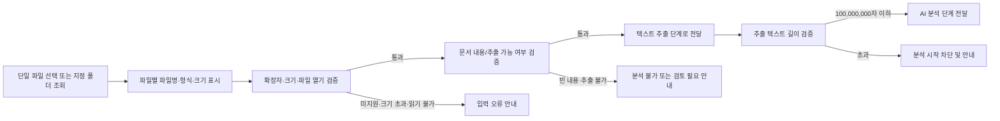
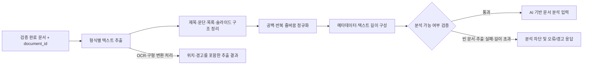
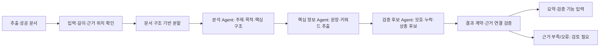
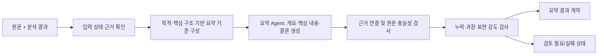
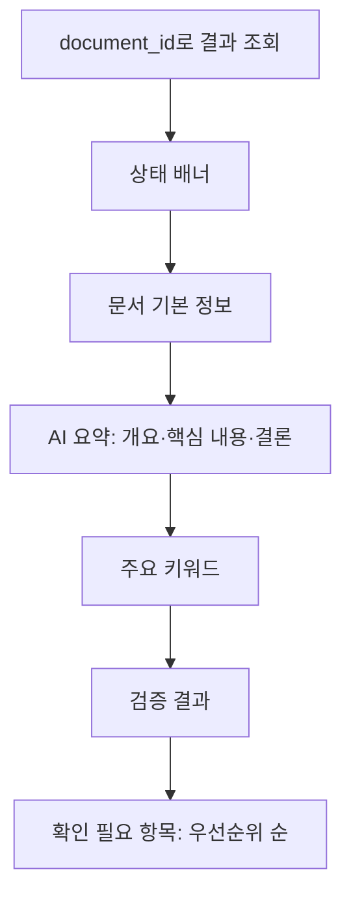

# 기능 분해표

## 1. 프로젝트 정보

| 항목 | 내용 |
|---|---|
| 프로젝트명 | AI Agent를 활용한 회의록, 업무보고, 공문자료 등의 문서 분류·분석 시스템 |
| 기준 문서 | `docs/requirements-jdk2.md` |
| 기능 분해 문서 | `docs/function-breakdown-jdk2.md` |
| 작성일 | 2026-07-26 |
| 목적 | 문서를 입력·추출·분석·요약·검증하고, 관리자가 최종 선택한 문서특성에 따라 Markdown 결과 문서를 저장한다. |
| 주요 구성 | Python 3, FastAPI, LangChain/LangGraph, 문서 처리, OCR, 데이터베이스 미사용 MVP |
| 원칙 | 원본 문서를 수정하지 않고, AI 생성 결과와 원문 근거·관리자 최종 확인 정보를 구분한다. |

## 2. 기능 분해표

| 대분류 | 세부 기능 | 입력 | 처리 | 출력 | 구현 우선순위 | 관련 Agent/API |
|---|---|---|---|---|---|---|
| 화면 | 단일 파일 업로드·지정 폴더 조회 | 파일 1개 또는 폴더 경로 | 파일별 선택·목록·기본 정보·상태를 표시한다. | 파일별 처리 대상 | 높음 | Frontend, `POST /validate` |
| API/일반 처리 | 파일 검증·식별자 발급 | 파일, 파일 경로 | 형식·크기·읽기·내용을 검증하고 통과 파일마다 `document_id`를 확정 발급한다. | 검증 결과, `document_id` | 높음 | API, 일반 코드 |
| 일반 처리 | 형식별 텍스트 추출·OCR | 검증 완료 문서 | PDF·Office·HWPX·HWP 변환·이미지 OCR로 텍스트와 위치를 추출·정규화한다. | 원문 텍스트, 구조, 메타데이터 | 높음 | 일반 코드, `POST /extract` |
| AI 처리 | 문서 분석·분류 추천 | 원문 텍스트, 필수 `category_criteria` | 주제·목적·구조·핵심 문장·의미 키워드·검증 후보를 원문 근거와 함께 생성한다. | 분석 결과, 추천 문서특성 | 높음 | Analysis/Classification Agent, `POST /analyze` |
| AI 처리 | 핵심 요약 생성 | 원문, 분석 결과 | 개요·핵심 내용·결론을 생성하고 누락·과장을 점검한다. | 요약 결과·근거 | 높음 | Summary Agent, `POST /summarize` |
| 일반 처리/AI 처리 | 검증 후보 생성 | 원문, 분석, 요약 | 정형 값은 규칙 비교하고, 의미 불일치·과장·상충은 AI 후보로 제시한다. | 검증 결과, 검토 우선순위 | 높음 | Verification Agent, `POST /verify` |
| 화면 | 결과 조회·표시 | `document_id` | 이미 생성된 결과와 상태를 읽기 전용으로 통합 표시한다. | 결과 화면 | 높음 | Frontend, `GET /result` |
| 화면/API | 문서특성 선택·저장 요청 | 문서특성, 기준일, 관리자 승인 | 저장 예정 정보를 보여 주고 Markdown 저장을 요청한다. | 저장 상태·경로 | 높음 | Frontend, `POST /save` |
| 일반 처리 | Markdown 생성·파일 저장 | 승인된 결과, 저장 경로 | 파일명·중복·마스킹을 처리하고 문서특성별 디렉터리에 결과를 저장한다. | `문서특성-YYYY-MM-DD.md` | 높음 | API, 일반 코드 |
| 테스트 | 정상·경계·오류 테스트 | 합성·비민감 문서 | 형식별, OCR, AI 오류, 저장 오류, 상태 전이를 확인한다. | 테스트 결과 | 높음 | Test |

## 3. API 기능 목록

공통 API의 상세 Endpoint와 상태 전이는 [7.1 공통 처리 계약 및 API 목록](#71-공통-처리-계약-및-api-목록)을 따른다.

| 기능 | Endpoint 후보 | 설명 | 우선순위 |
|---|---|---|---|
| 파일 검증 | `POST /api/v1/documents/validate` | 파일 검증과 `document_id` 확정 발급 | 높음 |
| 텍스트 추출 | `POST /api/v1/documents/{document_id}/extract` | 형식별 추출·OCR 작업 시작 | 높음 |
| 문서 분석 | `POST /api/v1/documents/{document_id}/analyze` | 근거 기반 분석·분류 추천 작업 시작 | 높음 |
| 요약 생성 | `POST /api/v1/documents/{document_id}/summarize` | 근거 기반 요약 작업 시작 | 높음 |
| 검증 후보 | `POST /api/v1/documents/{document_id}/verify` | 비교·검증 후보 생성 작업 시작 | 높음 |
| 결과 조회 | `GET /api/v1/documents/{document_id}/result` | 화면용 통합 결과와 저장 예정 정보 조회 | 높음 |
| 결과 저장 | `POST /api/v1/documents/{document_id}/save` | Markdown 생성·저장 요청 | 높음 |

## 4. AI Agent 기능 목록

| Agent 기능 | 입력 | 처리 | 출력 | 우선순위 |
|---|---|---|---|---|
| 문서 이해 Agent | 원문, 구조, 근거 위치 | 주제·목적·핵심 구조를 근거 기반으로 해석한다. | 분석 결과 | 높음 |
| 핵심 정보 Agent | 원문, 일반 코드 정형 추출 결과 | 핵심 문장과 문맥상 중요한 인물·기관·개념을 선택한다. | 핵심 문장·의미 키워드 | 높음 |
| 분류 추천 Agent | 원문, 필수 `category_criteria` | 사용자 정의 기준에 따라 문서특성 추천만 수행한다. | 추천 문서특성·근거 | 높음 |
| 요약 생성 Agent | 원문, 분석 결과, 근거 | 개요·핵심 내용·결론을 생성한다. | 요약 결과·근거 | 높음 |
| 검증 후보 Agent | 원문, 분석, 요약 | 의미 불일치·과장·모호함·상충 후보를 제시한다. | 검토 후보·근거 | 높음 |

## 5. 후순위 기능

| 기능 | 후순위 이유 | 추후 구현 방향 |
|---|---|---|
| OCR 정확도 고도화 | 기본 OCR로 핵심 흐름 검증이 가능하다. | 자동 회전 보정, 사용자 교정, 고급 전처리 |
| 정밀 표 구조·원본 서식 재현 | 분석용 텍스트 추출의 핵심 범위를 넘는다. | 표 행·열 복원, 글꼴·색상·배치 재현 |
| 요약 길이·문서 유형별 템플릿 | 기본 요약 결과 확인 후 확장한다. | 사용자 선택형 요약, 유형별 요약 양식 |
| 검토 이력·원문 위치 이동 | 저장·조회 MVP 이후의 협업 편의 기능이다. | 승인 이력, 원문 뷰어 연결, 주석 |
| 고급 검색·대시보드·알림 | 핵심 분석·저장 흐름에 직접 필요하지 않다. | 검색, 통계, 배정·알림 |

## 6. 추천 구현 순서

| 순서 | 기능 | 이유 |
|---|---|---|
| 1 | 공통 상태·`document_id`·API 계약 | 모든 처리 단계와 화면의 연결 기준을 고정한다. |
| 2 | 단일 업로드·폴더 조회·파일 검증 | 안전한 처리 대상을 확정한다. |
| 3 | 텍스트 추출·OCR·메타데이터 | AI 처리에 필요한 원문과 위치 정보를 만든다. |
| 4 | 근거 기반 분석·분류 추천 | 문서 이해와 후속 요약·검증의 기반을 만든다. |
| 5 | 요약·검증 후보 생성 | 사용자가 검토할 핵심 정보와 차이 후보를 만든다. |
| 6 | 결과 화면·문서특성 선택·저장 | 사용자 검토와 결과 파일 활용을 완성한다. |
| 7 | 정상·경계·오류·저장 테스트 | MVP의 신뢰성과 원본 보존을 검증한다. |

## 7. 상세 기능 분해

## 7.1 공통 처리 계약 및 API 목록

이 절의 상태, `document_id`, 선행 단계 차단, API 책임 규칙은 이후 모든 기능 정의보다 우선 적용한다.

### 1. 공통 문서 식별자와 처리 상태

파일 검증을 통과한 시점에 `document_id`를 **확정 발급**한다. 모든 결과와 상태는 동일한 `document_id` 아래에서 관리하며, 임시 후보 식별자는 후속 단계에 전달하지 않는다.

```text
DocumentProcess
├─ document_id
├─ validation_status
├─ extraction_status
├─ analysis_status
├─ summary_status
├─ verification_status
├─ storage_status
├─ overall_status
└─ warnings / error_info
```

| 공통 상태 | 의미 | 화면 표시 |
|---|---|---|
| `processing` | 현재 또는 선행 단계가 처리 중이다. | 처리 중 |
| `success` | 해당 단계의 필수 결과와 근거가 정상 생성되었다. | 완료 |
| `warning` | 결과는 있으나 일부 누락·부분 실패·경고가 있다. | 경고 |
| `needs_review` | 근거 부족·상충·불확실성으로 사람 확인이 필요하다. | 경고 / 관리자 검토 필요 |
| `failed` | 해당 단계가 실패했다. | 실패 |
| `not_verifiable` | 원문 또는 비교 근거 부족으로 검증할 수 없다. | 검증 불가 / 경고 |

| 기능 | 허용 상태 |
|---|---|
| 문서 입력·검증 | `processing`, `success`, `failed` |
| 텍스트 추출 | `processing`, `success`, `warning`, `failed` |
| AI 분석 | `processing`, `success`, `warning`, `needs_review`, `failed` |
| AI 요약 | `processing`, `success`, `warning`, `needs_review`, `failed` |
| AI 검증 | `processing`, `success`, `warning`, `needs_review`, `failed`, `not_verifiable` |
| Markdown 저장 | `processing`, `success`, `failed` |

전체 결과 화면 상태는 다음 순서로 결정한다.

1. 필수 단계 중 하나라도 `failed`이면 전체 상태는 `실패`다.
2. 필수 단계가 처리 중이면 전체 상태는 `처리 중`이다.
3. 실패가 없고 `warning`, `needs_review`, `not_verifiable` 중 하나가 있으면 전체 상태는 `경고`다.
4. 모든 필수 단계가 `success`이면 전체 상태는 `완료`다.

### 2. 선행 단계 차단 규칙

| 선행 조건이 충족되지 않은 경우 | 차단되는 후속 기능 |
|---|---|
| `validation_status`가 `success`가 아님 | 텍스트 추출 이후 모든 단계 |
| `extraction_status`가 `success` 또는 분석 가능한 `warning`이 아님 | AI 분석·요약·검증·저장 |
| `analysis_status`가 `success`, `warning`, `needs_review`가 아님 | AI 요약·검증·저장 |
| `summary_status`가 생성되지 않음 | AI 검증·저장 |
| `verification_status`가 생성되지 않음 | 최종 저장 |
| 문서특성·기준일·관리자 승인 중 하나가 없음 | Markdown 저장 |

### 3. 공통 API 목록

`POST`는 해당 작업의 **시작 요청**만 담당하고, `GET`은 생성된 결과 또는 상태의 **조회**만 담당한다. 기능별 섹션의 API 항목은 이 목록을 참조하며 별도 Endpoint를 새로 정의하지 않는다.

| Endpoint | 메서드 | 역할 |
|---|---|---|
| `/api/v1/documents/validate` | `POST` | 파일 접수·검증과 `document_id` 확정 발급 |
| `/api/v1/documents/{document_id}/extract` | `POST` | 텍스트 추출 작업 시작 |
| `/api/v1/documents/{document_id}/analyze` | `POST` | AI 문서 분석 작업 시작 |
| `/api/v1/documents/{document_id}/summarize` | `POST` | AI 요약 생성 작업 시작 |
| `/api/v1/documents/{document_id}/verify` | `POST` | AI 검증 후보 생성 작업 시작 |
| `/api/v1/documents/{document_id}/save` | `POST` | Markdown 결과 파일 생성·저장 요청 |
| `/api/v1/documents/{document_id}` | `GET` | 문서 기본 정보와 통합 처리 상태 조회 |
| `/api/v1/documents/{document_id}/extraction` | `GET` | 텍스트 추출 결과 조회 |
| `/api/v1/documents/{document_id}/analysis` | `GET` | AI 분석 결과와 원문 근거 조회 |
| `/api/v1/documents/{document_id}/summary` | `GET` | AI 요약 결과와 원문 근거 조회 |
| `/api/v1/documents/{document_id}/verification` | `GET` | 검증 결과·검토 후보·우선순위 조회 |
| `/api/v1/documents/{document_id}/result` | `GET` | 화면용 분석·요약·검증 통합 결과와 저장 예정 정보 조회 |
| `/api/v1/documents/{document_id}/status` | `GET` | 단계별·전체 상태, 경고, 실패, 재시도 가능 여부 조회 |

저장 예정 파일명·경로·중복 순번은 별도 필수 Endpoint가 아니라 `GET /result`의 `storage_preview` 필드로 제공한다.

### 4. 화면 조회와 저장 요청 UI의 책임 분리

| 구분 | 책임 | 수행하지 않는 작업 |
|---|---|---|
| 결과 조회·표시 기능 | `GET /result`, `GET /status`로 생성된 분석·요약·검증 결과와 상태를 읽기 전용으로 표시한다. | AI 분석·요약·검증 실행, 결과 수정, 파일 생성 |
| 문서 저장 요청 UI | 문서특성 DropDown List Box, 저장 예정 정보, 관리자 승인 상태를 표시하고 사용자의 저장 요청을 `POST /save`로 전달한다. | Markdown 조립, 디렉터리 생성, 파일 쓰기 |
| Markdown 생성·저장 기능 | 파일명·경로·중복 처리, Markdown 구성, 마스킹, 파일 저장과 저장 오류 처리를 수행한다. | 원본 문서 변경, AI 분석·요약·검증 재실행 |

### 5. 저장 가능 조건

```text
저장 가능 =
분석 결과 존재
+ 요약 결과 존재
+ 검증 결과 존재
+ 문서특성 최종 선택
+ 기준일 확정
+ 관리자 최종 승인
```

- `warning`, `needs_review`, `not_verifiable` 상태는 자동 저장하지 않는다. 관리자가 경고·확인 필요 항목을 검토하고 최종 승인한 경우에만 저장할 수 있다.
- `failed` 상태는 저장할 수 없다.
- `기타(예외)`는 자동 저장하지 않으며 최종 승인 후에만 `./other_docs/others/`에 저장한다.

## 7.2 문서 입력 기능

### 1. 기능 목적과 범위

사용자는 **단일 파일 업로드** 또는 **지정 폴더 내 문서 조회** 방식으로 분석 대상을 입력한다. 시스템은 파일별로 기본 정보와 분석 가능 여부를 확인하고, 검증을 통과한 파일만 텍스트 추출 단계로 전달한다. 이 항목은 입력과 검증까지만 다루며, AI 분석·요약·결과 저장은 범위에 포함하지 않는다.

- 입력 대상: `PDF`, `DOCX`, `DOC`, `TXT`, `HWPX`, `HWP`, `PPTX`, `PPT`, 이미지 기반 PDF, `JPG`, `JPEG`, `PNG`, `TIFF`(및 `.tif`).
- 파일 크기 제한: **10MB 이하**. 정확히 10MB인 파일은 허용한다.
- 텍스트 길이 제한: 추출 후 **100,000,000자 이하**인 문서만 AI 분석 단계로 전달한다. 이 제한 검증은 텍스트 추출 결과를 받은 뒤 완료된다.
- 원본 보존: 원본 파일을 수정·이동·삭제하지 않는다. 오류 메시지와 로그에 원문 또는 민감정보를 불필요하게 노출하지 않는다.

| 입력 방식 | 처리 기준 | 식별자 처리 |
|---|---|---|
| 단일 파일 업로드 | 사용자가 선택한 파일 1개를 검증·등록·처리한다. | 검증 통과 파일마다 확정 `document_id` 1개를 발급한다. |
| 지정 폴더 내 문서 조회 | 지정 폴더의 지원 파일을 조회하고, 파일별로 독립 검증·등록·처리를 수행한다. | 여러 파일이 발견되어도 파일마다 서로 다른 확정 `document_id`를 발급한다. |

- 폴더 입력은 일괄 AI 처리 요청이 아니라 파일별 독립 처리의 시작점이다.
- 한 파일의 검증·추출 실패는 다른 정상 파일의 후속 처리를 중단시키지 않는다.
- 폴더 입력의 파일 경로는 원본 추적용 메타데이터로만 관리한다.

### 2. 사용자 처리 흐름



### 3. 단위별 기능 분해

| 구분 | 세부 기능 | 입력 | 처리 | 출력/상태 | 우선순위 |
|---|---|---|---|---|---|
| 화면 | 단일 파일 선택 | 사용자 파일 1개 | 파일 선택 컨트롤에서 1개만 선택하도록 제한한다. 새 파일을 선택하면 이전 선택 상태를 교체한다. | 선택 파일 상태 | 필수 |
| 화면 | 지정 폴더 문서 조회 | 지정 폴더 경로 | 지원 파일 목록과 파일별 기본 정보를 표시한다. 각 파일은 독립 처리 대상이다. | 파일별 선택·검증 상태 | 필수 |
| 화면 | 선택 파일 기본 정보 표시 | 선택 파일 | 파일명, 확장자를 기준으로 한 형식, 크기, 최대 허용 크기(10MB), 현재 검증 상태를 표시한다. | 파일 정보 영역 | 필수 |
| 화면 | 검증 결과·다음 행동 표시 | API 검증 결과 | 통과·진행 중·분석 불가·검토 필요·오류를 구분하고, 오류 사유와 사용자가 할 수 있는 조치를 표시한다. | 상태 메시지 | 필수 |
| API | 파일 접수 | `multipart/form-data`의 파일 1개 | 파일 존재 여부와 파일 개수를 확인하고, 파일명·확장자·MIME 정보·크기를 수집한다. | 접수 결과 또는 입력 오류 | 필수 |
| API | 폴더 문서 등록 | 지정 폴더 경로와 발견 파일 목록 | 지원 파일을 파일별로 등록·검증 요청하고, 검증 통과 파일마다 확정 `document_id`를 발급한다. | 파일별 등록 결과·`document_id` | 필수 |
| API | 기본 검증 요청 | 접수된 파일 | 형식·크기·읽기 가능 여부·내용 검증을 처리 계층에 요청하고 결과를 반환한다. | 검증 결과 | 필수 |
| API | 텍스트 추출 전달 요청 | 검증 완료 파일과 확정 `document_id` | 검증 완료 상태일 때만 추출 계층으로 전달한다. 검증 실패 파일은 전달하지 않는다. | 추출 작업 상태 또는 결과 | 필수 |
| 처리 | 형식 식별 | 파일명, 확장자, MIME, 파일 헤더(가능한 경우) | 확장자만 신뢰하지 않고 파일 형식 정보와 교차 확인한다. PDF는 텍스트 기반/이미지 기반 여부를 추출 단계에서 판별한다. | 표준화된 파일 형식 | 필수 |
| 처리 | 파일 크기 검증 | 파일 바이트 수 | 10MB 이하인지 확인한다. 초과 시 이후 파일 열기·추출·AI 분석을 시작하지 않는다. | 통과 또는 `FILE_TOO_LARGE` | 필수 |
| 처리 | 형식별 읽기·구조 검증 | 지원 형식 파일 | 파일이 열리는지, 손상·암호화·접근 제한으로 읽을 수 없는지 확인한다. 형식별 본문 또는 슬라이드·페이지·이미지 정보의 확인 가능 여부를 기록한다. | 통과, 분석 불가, 검토 필요 | 필수 |
| 처리 | 문서 내용 검증 | 읽기 가능한 파일 | 텍스트 문서는 본문 존재 여부를 확인한다. 이미지 기반 PDF와 이미지 문서는 OCR 대상임을 식별하고 페이지/이미지 순서와 경고 정보를 보존한다. 제목·일자·기관 정보가 없어도 본문이 있으면 다음 단계로 전달하되 누락을 기록한다. | 내용 검증 상태·경고 | 필수 |
| 처리 | 텍스트 추출 단계 연결 | 검증 완료 파일 | 파일명, 표준 형식, 크기, 페이지·슬라이드·이미지 순서, 검증 경고를 추출 요청에 함께 전달한다. | 추출 요청 | 필수 |
| 처리 | 추출 텍스트 길이 검증 | 추출 텍스트와 문자 수 | 100,000,000자 이하일 때만 AI 분석으로 전달한다. 정확히 100,000,000자는 허용한다. | 분석 전달 가능 또는 `TEXT_TOO_LONG` | 필수 |
| 오류 처리 | 미지원 형식 | 지원 목록 밖의 파일 또는 실제 형식 불일치 | 분석을 시작하지 않는다. 파일명, 감지 형식, 지원 형식 목록과 재선택 안내를 제공한다. | `UNSUPPORTED_FORMAT` | 필수 |
| 오류 처리 | 빈 파일·빈 내용 | 0바이트 파일 또는 분석 가능한 본문을 얻지 못한 파일 | AI 분석·요약·검증으로 전달하지 않는다. 이미지/OCR 결과가 부족한 경우에는 원인에 따라 `분석 불가` 또는 `관리자 검토 필요`로 표시한다. | `EMPTY_FILE` 또는 `NO_ANALYZABLE_CONTENT` | 필수 |
| 오류 처리 | 크기 초과 | 10MB 초과 파일 | 실제 크기와 허용 최대 크기 10MB를 표시하고, 분할·정리 후 재선택하도록 안내한다. | `FILE_TOO_LARGE` | 필수 |
| 오류 처리 | 읽기 불가 | 손상, 암호화, 접근 제한, 지원 형식 파서 실패 | 실패 단계와 안전한 사유를 표시하며 원본을 변경하지 않는다. | `UNREADABLE_FILE` 또는 `ENCRYPTED_FILE` | 필수 |

### 4. 형식별 입력 검증 기준

| 형식군 | 대상 확장자 | 입력 시 확인 | 텍스트 추출 단계 전달 기준 |
|---|---|---|---|
| PDF | `.pdf` | 파일 열기, 암호화·손상 여부, 페이지 수, 텍스트 추출 가능 여부를 확인한다. | 텍스트가 있으면 일반 PDF 추출로, 텍스트가 없거나 부족하면 이미지 기반 PDF OCR 흐름으로 전달한다. |
| Word | `.docx`, `.doc` | 파일 형식, 읽기 가능 여부, 본문·표 텍스트 존재 여부, 문서 속성 날짜 정보를 확인한다. | 본문을 읽을 수 있을 때 전달한다. |
| 텍스트 | `.txt` | 파일 크기, 빈 파일 여부, 문자 인코딩, 본문 길이를 확인한다. | 해석 가능한 인코딩과 본문이 있을 때 전달한다. |
| 한글 | `.hwpx`, `.hwp` | HWPX는 파일 구조 정상 여부와 본문 추출 가능 여부를 확인한다. HWP(v5)는 직접 분석하지 않고 HWPX 변환 가능 여부와 변환 결과를 확인한다. | HWPX 본문 또는 성공적으로 변환된 HWPX의 본문을 확인한 경우만 전달한다. |
| PowerPoint | `.pptx`, `.ppt` | 파일 형식, 읽기 가능 여부, 슬라이드 수, 텍스트가 있는 슬라이드 여부를 확인한다. | 분석 가능한 슬라이드 텍스트가 있을 때 전달한다. |
| 이미지 | `.jpg`, `.jpeg`, `.png`, `.tif`, `.tiff` | 이미지 열기, 빈 이미지 여부, 해상도, 회전·기울어짐, OCR 인식 가능 여부를 확인한다. | OCR 텍스트와 원본 이미지 위치를 연결해 전달한다. |

### 5. API Endpoint 후보

공통 처리 계약의 **공통 API 목록**에서 `POST /validate`와 `GET /documents/{document_id}`를 참조한다. 검증 성공 시 `document_id`를 확정 발급한다.

### 6. 정상·예외 입력 테스트 항목

| 분류 | 테스트 항목 | 입력/조건 | 기대 결과 |
|---|---|---|---|
| 정상 | 단일 지원 파일 선택 | 각 지원 형식의 본문이 있는 파일 1개 | 파일명·형식·크기가 표시되고 검증 완료 후 추출 단계로 전달된다. |
| 정상 | 지정 폴더 문서 조회 | 지원·미지원 파일이 섞인 지정 폴더 | 지원 파일별로 독립 `document_id`와 검증 결과가 생성되며, 미지원 파일은 다른 정상 파일의 처리를 막지 않는다. |
| 정상 | 10MB 경계값 | 정확히 10MB인 읽기 가능한 지원 파일 | 크기 검증을 통과한다. |
| 정상 | 텍스트 길이 경계값 | 추출 텍스트가 정확히 100,000,000자인 문서 | AI 분석 단계로 전달된다. |
| 정상 | 텍스트 PDF | 추출 가능한 PDF | OCR이 아닌 PDF 텍스트 추출 흐름으로 전달된다. |
| 정상 | 이미지 기반 PDF·이미지 | 텍스트 추출이 부족한 PDF, 한국어 텍스트 이미지 | OCR 대상 식별, 페이지/이미지 순서 보존, 경고 포함 전달이 이루어진다. |
| 정상 | 일부 메타데이터 누락 | 제목·일자·기관 정보는 없고 본문은 있는 파일 | 누락 경고를 남기되 텍스트 추출 단계로 전달한다. |
| 예외 | 미지원 형식 | 예: `.zip`, `.xlsx` 또는 확장자와 실제 형식이 다른 파일 | 분석을 시작하지 않고 `UNSUPPORTED_FORMAT`과 지원 형식 안내를 반환한다. |
| 예외 | 단일 업로드에 여러 파일 선택 | 파일 2개 이상 | 단일 파일 업로드에서는 한 파일만 허용한다는 안내를 표시한다. 여러 파일 처리는 지정 폴더 조회 흐름을 사용한다. |
| 예외 | 폴더 내 일부 파일 검증 실패 | 손상 또는 크기 초과 파일이 포함된 지정 폴더 | 실패 파일의 사유를 표시하고, 다른 검증 통과 파일은 독립적으로 다음 단계에 전달한다. |
| 예외 | 빈 파일 | 0바이트 파일 | `EMPTY_FILE`을 반환하고 다음 단계로 전달하지 않는다. |
| 예외 | 빈 내용 | 파일은 열리지만 분석 가능한 본문이 없음 | `NO_ANALYZABLE_CONTENT` 또는 검토 필요 상태로 표시하며 AI 분석을 시작하지 않는다. |
| 예외 | 크기 초과 | 10MB 초과 파일 | 실제 크기와 10MB 제한을 표시하고 `FILE_TOO_LARGE`를 반환한다. |
| 예외 | 텍스트 길이 초과 | 추출 텍스트가 100,000,000자 초과 | AI 분석을 시작하지 않고 실제 문자 수와 제한을 안내한다. |
| 예외 | 손상·암호화·접근 제한 | 열 수 없는 지원 형식 파일 | 안전한 오류 사유와 조치를 표시하고 원본을 변경하지 않는다. |
| 예외 | OCR 품질 문제 | 회전·기울어짐, 빈 이미지, 저신뢰 OCR, 읽을 수 없는 페이지 | 해당 페이지/이미지를 누락하지 않고 경고와 위치 정보를 반환한다. |
| 예외 | HWP 변환 실패 | HWP(v5) 파일의 HWPX 변환 실패 | 원본을 변경하지 않고 분석 불가 사유와 HWPX 변환 안내를 표시한다. |

### 7. 구현 우선순위와 추천 구현 순서

| 순서 | 구현 단위 | 이유 |
|---|---|---|
| 1 | 입력 계약 확정: 단일 파일, 지원 형식 목록, 상태·오류 코드, 10MB 제한 | 화면·API·처리가 동일한 판단 기준을 사용하게 한다. |
| 2 | 화면의 파일 선택과 파일명·형식·크기 표시 | 사용자가 업로드 전 즉시 선택 내용을 확인할 수 있다. |
| 3 | API 파일 접수 및 형식·크기·단일 파일 검증 | 비용이 드는 파일 파싱과 OCR 이전에 명확한 입력 오류를 차단한다. |
| 4 | 읽기 가능 여부·빈 내용 검증과 검증 결과 응답 | 손상·암호화·빈 파일을 텍스트 추출 전에 분리한다. |
| 5 | 검증 완료 파일의 텍스트 추출 단계 연결 | 입력 기능과 이후 추출 기능의 경계를 확정한다. |
| 6 | 추출 결과의 100,000,000자 제한 검증 | AI 분석 단계에 전달 가능한 문서만 확정한다. |
| 7 | PDF/OCR·이미지·HWP 변환·구형 Office 형식 세부 지원 | 외부 엔진·변환기 및 운영 환경 의존성을 확인한 뒤 확장한다. |
| 8 | 정상·경계·예외 입력 자동 테스트 | 구현된 계약이 형식 추가와 리팩터링 뒤에도 유지되도록 한다. |

### 8. 구현 전 확인해야 할 사항

| 확인 사항 | 결정 또는 확인할 내용 | 영향 |
|---|---|---|
| 업로드 방식 | MVP에서 단일 파일 업로드와 지정 폴더 내 문서 조회를 모두 제공할 때의 화면·API 입력 모델과 권한 범위를 확정한다. | 화면 구성, API 입력 모델, 원본 파일 관리 방식 |
| 지원 형식의 실제 도구 | `.doc`, `.ppt`, `.hwp`의 읽기·변환을 어떤 라이브러리 또는 별도 변환 도구로 처리할지와 운영체제 의존성을 확인한다. | 지원 가능 범위, 오류 메시지, 배포 문서 |
| HWP 처리 정책 | HWP(v5)는 HWPX로 변환 후 처리한다는 요구사항을 기준으로, 변환 책임 주체·도구·실패 시 상태를 확정한다. | HWP 입력 흐름, 원본 보존, 테스트 |
| OCR 엔진·언어 데이터 | 한국어 OCR 엔진, 언어 데이터 설치 방식, 이미지/PDF 전처리 범위, 저신뢰 기준을 결정한다. | 이미지 기반 PDF·이미지 처리, README·의존성 |
| MIME·파일 헤더 검사 방식 | 업로드 MIME, 확장자, 실제 파일 시그니처 간 불일치 시의 판정 규칙을 정한다. | 보안성, 미지원 형식 처리 |
| 임시 파일과 식별자 | 검증 완료 파일의 임시 보관 위치, `document_id` 발급 시점, 처리 완료·실패 후 정리 정책을 정한다. 데이터베이스 미사용 MVP 범위와 일치해야 한다. | API 연결, 상태 조회, 보안 |
| 동기/비동기 처리 | OCR·대용량 문서 추출을 요청 응답에서 완료할지 작업 상태를 두고 비동기로 처리할지 결정한다. | Endpoint 응답, 화면 상태, 테스트 |
| 상태 체계 | `검증 완료`, `분석 불가`, `관리자 검토 필요`, `분석 실패`, `재시도 필요`의 전이 규칙과 사용자 표시 문구를 확정한다. | API 응답, 화면, 이후 분석 기능 |
| 테스트 픽스처 보안 | 비민감·합성 문서로 형식별 정상·손상·빈·경계값 파일을 준비하고 개인정보·기밀 문서를 저장소에 넣지 않는다. | 자동 테스트, 보안 |

### 9. 후순위 확장 기능

다음은 요구사항에 있는 지원 대상의 안정적 처리를 위해 필요하지만, 기본 단일 업로드·검증 완료 뒤에 확정할 기능이다.

- OCR 저신뢰도 기준 설정, 회전·기울어짐 보정 등 이미지 전처리 고도화
- `.doc`, `.ppt`, `.hwp`의 변환 품질 진단과 변환 결과 상세 화면
- 다수 파일의 처리 진행률·일괄 재시도·장기 상태 이력 관리
- 업로드 진행률, 재시도, 장기 상태 이력 관리

## 7.3 문서 텍스트 추출 기능

### 1. 기능 목적과 경계

문서 입력 기능에서 **검증 완료**된 단일 문서와 `document_id`를 받아, AI 기반 문서 분석이 사용할 수 있는 정규화 텍스트와 메타데이터를 만든다. 텍스트가 없거나 추출에 실패한 문서는 AI 분석으로 전달하지 않는다.

- `requirements-jdk2.md`의 입력 대상은 `PDF`, `DOC`, `DOCX`, `TXT`, `HWP`, `HWPX`, `PPT`, `PPTX`, 이미지 기반 PDF, `JPG`, `JPEG`, `PNG`, `TIFF`이다.
- 텍스트 기반 PDF는 일반 추출을 우선 사용하고, 텍스트가 없거나 부족한 이미지 기반 PDF와 이미지 문서는 한국어 OCR로 텍스트를 추출한다. OCR 텍스트에는 페이지 또는 이미지 위치와 처리 경고를 연결한다.
- HWP(v5)는 직접 추출하지 않고 HWPX로 변환한 뒤 처리한다. 원본 파일은 수정·덮어쓰지 않는다.

### 2. AI 기반 문서 분석 기능과의 입출력 계약

#### 2.1 텍스트 추출 기능 입력

| 필드 | 필수 | 설명 |
|---|---|---|
| `document_id` | 예 | 문서 입력·검증 단계에서 검증 통과 후 확정 발급한 식별자. 상태 조회와 다음 단계 연결에 사용한다. |
| `validated_file` | 예 | 형식·크기·읽기 검증을 통과한 원본 파일 또는 안전한 임시 참조이다. |
| `file_name` | 예 | 원본 파일명과 확장자. 결과 추적용으로 사용하며 텍스트 본문에 섞지 않는다. |
| `file_format` | 예 | 표준화한 형식 값: `pdf`, `doc`, `docx`, `txt`, `hwp`, `hwpx`, `ppt`, `pptx`, `image_pdf`, `jpg`, `jpeg`, `png`, `tiff` 중 하나이다. |
| `file_size_bytes` | 예 | 입력 단계에서 확인한 원본 파일 크기이다. |
| `validation_status` | 예 | `validated`여야 한다. 그 외 상태의 문서는 추출을 시작하지 않는다. |
| `validation_warnings` | 아니오 | 입력 단계에서 발견한 메타데이터 누락, 페이지·슬라이드 정보 등 다음 단계에 전달할 경고다. |

#### 2.2 AI 기반 문서 분석 기능으로 전달하는 출력

| 필드 | 설명 |
|---|---|
| `document_id` | 입력 문서와 동일한 식별자. 분석·요약·검증 결과를 연결한다. |
| `extraction_status` | `success`, `warning`, `failed` 중 하나. `success` 또는 분석 가능한 `warning`만 분석 후보가 된다. |
| `source_text` | 구조와 원문 순서를 최대한 보존하면서 정규화한 분석용 본문이다. AI가 생성한 요약이나 추정 정보는 포함하지 않는다. |
| `document_structure` | 제목, 문단, 목록, 슬라이드 등 추출 가능한 기본 구조의 순서 정보다. 각 항목은 원본 위치(페이지·슬라이드·문단 순번)를 가진다. |
| `metadata` | `file_name`, `file_format`, `file_size_bytes`, `text_length`, `page_count` 또는 `slide_count`(해당 시), 추출 도구·상태·경고를 담는다. |
| `analysis_eligible` | `true`일 때만 AI 분석 기능이 실행된다. `false`면 `reason_code`와 사용자 안내를 사용한다. |
| `reason_code` | 예: `EMPTY_DOCUMENT`, `EXTRACTION_FAILED`, `TEXT_TOO_LONG`, `OCR_FAILED`, `LEGACY_CONVERSION_FAILED`. |
| `warnings` | 제목·일자·기관 정보 미확인, 일부 페이지·슬라이드 텍스트 없음 등 분석 결과에서 함께 표시할 경고다. |

**분석 전달 조건:** `extraction_status`가 `success` 또는 분석 가능한 `warning`이고, `source_text`가 비어 있지 않으며, `text_length`가 100,000,000자 이하이고, `analysis_eligible`가 `true`여야 한다.

### 3. 처리 흐름



### 4. 단위별 기능 분해

| 구분 | 세부 기능 | 입력 | 처리 | 출력 | 우선순위 |
|---|---|---|---|---|---|
| API | 추출 요청 접수 | `document_id`, 검증 완료 문서 참조 | 식별자 존재 여부와 `validation_status=validated`를 확인한다. | 추출 작업 결과 또는 요청 거부 | 필수 |
| 처리 | 검증 완료 상태 확인 | 문서 식별자, 검증 결과 | 미검증·검증 실패 문서는 추출하지 않고 입력 검증 단계로 되돌린다. | `VALIDATION_REQUIRED` 또는 추출 시작 | 필수 |
| 처리 | 형식별 텍스트 추출 | 검증 완료 파일, 파일 형식 | 형식별 추출기를 선택해 본문 텍스트와 원본 순서 정보를 읽는다. | 원시 텍스트·구조 조각·추출 메타데이터 | 필수 |
| 처리 | 기본 문서 구조 정리 | 원시 텍스트·구조 조각 | 제목, 문단, 목록을 구분하고 순서를 보존한다. PPTX는 슬라이드 제목·본문 텍스트를 순서대로 연결한다. 구조를 확인할 수 없으면 본문 순서는 보존하고 경고를 남긴다. | `document_structure`, 구조화 전 텍스트 | 필수 |
| 처리 | 텍스트 정규화 | 구조화 전 텍스트 | 줄 끝 공백, 불필요한 연속 공백, 반복 줄바꿈을 정리한다. 단어·문단·목록의 의미와 원본 순서를 임의로 변경·요약하지 않는다. | `source_text` | 필수 |
| 처리 | 메타데이터 구성 | 입력 메타데이터, 추출 결과 | 파일명·형식·크기·텍스트 길이·페이지/슬라이드 수·추출 상태·경고를 일관된 구조로 구성한다. | `metadata` | 필수 |
| 처리 | 분석 가능 여부 검증 | 정규화 텍스트, 메타데이터 | 빈 문자열·공백뿐인 텍스트·추출 오류·100,000,000자 초과 여부를 확인한다. 제목·일자·기관 누락은 본문이 있으면 경고로만 처리한다. | `analysis_eligible`, 상태·사유 | 필수 |
| 처리 | AI 분석 입력 생성 | 분석 가능한 텍스트 추출 결과 | 2.2 계약 형식으로 결과를 만들고 분석 기능에 전달한다. | 분석 요청 페이로드 | 필수 |
| 오류 처리 | 추출 실패 및 빈 문서 처리 | 손상 파일, 빈 본문, 파서 오류 | 요약·분석·검증을 시작하지 않는다. 안전한 오류 코드, 실패 단계, 다음 행동을 반환한다. | 실패 또는 분석 불가 상태 | 필수 |

### 5. 형식별 텍스트 추출 기준

| 형식 | MVP 처리 | 추출 대상과 기본 구조 | 예외/후순위 처리 |
|---|---|---|---|
| PDF | 필수 | 페이지 순서의 텍스트, 제목·문단·목록을 가능한 범위에서 구성한다. 텍스트가 없거나 부족하면 페이지별 OCR을 적용한다. | 저신뢰·회전·기울어짐·읽을 수 없는 페이지는 누락하지 않고 경고와 위치를 남긴다. |
| DOCX | 필수 | 제목, 문단, 목록, 표 안의 읽을 수 있는 텍스트를 문서 순서로 추출한다. | 정밀한 표 행·열 구조 복원은 후순위다. |
| TXT | 필수 | 인코딩을 해석한 전체 텍스트, 첫 줄 등 제목 후보, 문단·빈 줄 경계를 추출한다. | 해석할 수 없는 인코딩은 추출 오류로 처리한다. |
| HWPX | 필수 | `python-hwpx`를 사용해 제목, 문단, 목록, 표 안의 읽을 수 있는 텍스트를 순서대로 추출한다. | 원본 수정·저장은 하지 않는다. 정밀한 표 복원은 후순위다. |
| PPTX | 필수 | 슬라이드 순서, 슬라이드 제목, 본문·도형 안의 읽을 수 있는 텍스트를 추출한다. | 이미지 안 텍스트는 OCR 대상이며, 인식 결과의 위치·경고를 보존한다. |
| DOC | 필수 | 변환 도구를 통해 DOCX 또는 분석 가능한 텍스트로 변환한 뒤 제목·문단·목록·표 텍스트를 추출한다. | 변환 실패 시 원본을 변경하지 않고 `LEGACY_CONVERSION_FAILED`로 처리한다. |
| HWP | 필수 | HWPX 변환 성공 후 HWPX 추출 흐름으로 처리한다. | 변환 실패 시 원본을 그대로 두고 분석 불가 사유를 표시한다. |
| PPT | 필수 | 변환 도구를 통해 PPTX 또는 분석 가능한 텍스트로 변환한 뒤 슬라이드 순서와 텍스트를 추출한다. | 변환 실패 시 원본을 변경하지 않고 `LEGACY_CONVERSION_FAILED`로 처리한다. |
| 이미지 기반 PDF | 필수 | 텍스트 추출을 먼저 시도하고 부족하면 페이지별 OCR 텍스트와 페이지 위치를 구성한다. | 저신뢰·회전·기울어짐·빈·읽을 수 없는 페이지는 경고로 보존한다. |
| JPG/JPEG/PNG/TIFF | 필수 | 이미지별 OCR 텍스트와 원본 이미지 위치를 구성한다. | 빈 결과·저신뢰·회전·기울어짐은 경고로 보존한다. |

### 6. 오류 처리 기준

| 상황 | 감지 시점 | 처리 결과 | AI 분석 전달 |
|---|---|---|---|
| 문서 식별자 없음 또는 미검증 문서 | 추출 요청 시작 | `VALIDATION_REQUIRED`를 반환하고 파일 입력·검증을 요청한다. | 불가 |
| 손상·암호화·읽기 불가 파일 | 형식별 파서 실행 | `EXTRACTION_FAILED`와 안전한 사유, 재선택 또는 잠금 해제 안내를 반환한다. | 불가 |
| 빈 문서·빈 슬라이드·공백뿐인 텍스트 | 정규화 후 | `EMPTY_DOCUMENT`와 본문이 있는 파일을 선택하라는 안내를 반환한다. | 불가 |
| 이미지 기반 PDF 또는 이미지 문서 | OCR 처리 중 | OCR 결과·페이지/이미지 위치·경고를 보존한다. 텍스트가 충분하면 분석으로 전달하고, 빈 결과·처리 실패면 사유를 표시한다. | 조건부 가능 |
| 구형 DOC/HWP/PPT 변환 실패 | 변환 처리 후 | 원본을 변경하지 않고 `LEGACY_CONVERSION_FAILED`와 HWPX/DOCX/PPTX 변환 안내를 반환한다. | 불가 |
| 텍스트 길이 초과 | 텍스트 길이 계산 후 | 실제 문자 수와 100,000,000자 제한을 표시하고 문서 분할·정리 후 재시도를 안내한다. | 불가 |
| 일부 페이지·슬라이드 텍스트 없음 | 형식별 추출 중 | 추출된 텍스트와 원본 위치를 보존하고 `warning`을 남긴다. 본문이 충분하면 분석 후보가 될 수 있다. | 조건부 가능 |

### 7. API Endpoint 후보

공통 처리 계약의 `POST /extract`, `GET /extraction`을 참조한다. AI 분석 시작은 추출 결과의 선행 단계 조건을 통과한 뒤 공통 `POST /analyze`를 사용한다.

### 8. 형식별 정상·예외 테스트

| 분류 | 테스트 항목 | 입력/조건 | 기대 결과 |
|---|---|---|---|
| 정상 | PDF 텍스트 추출 | 텍스트가 있는 다중 페이지 PDF | 페이지 순서가 보존된 `source_text`, 페이지 수, 텍스트 길이가 생성된다. |
| 정상 | DOCX 구조 추출 | 제목·문단·목록·표 텍스트가 있는 DOCX | 제목·문단·목록 순서가 유지되고 분석 가능 상태가 된다. |
| 정상 | TXT 인코딩·정규화 | UTF-8 및 지원하기로 한 인코딩의 TXT | 본문이 읽히고 불필요한 공백·반복 줄바꿈이 정리된다. |
| 정상 | HWPX 텍스트 추출 | 비민감 HWPX 테스트 파일 | 원본을 변경하지 않고 본문과 구조·메타데이터를 생성한다. |
| 정상 | PPTX 텍스트 추출 | 제목·본문이 있는 다중 슬라이드 PPTX | 슬라이드 순서와 제목·본문 텍스트가 보존된다. |
| 정상 | 메타데이터·분석 전달 | 분석 가능한 모든 MVP 형식 | `document_id`, 파일 정보, `text_length`, `source_text`, `analysis_eligible=true`가 AI 분석 입력 계약에 맞게 생성된다. |
| 예외 | 미검증 식별자 | 존재하지 않거나 검증 실패 상태의 `document_id` | 추출을 시작하지 않고 `VALIDATION_REQUIRED`를 반환한다. |
| 예외 | 손상·암호화 PDF/DOCX/HWPX/PPTX | 파서가 열 수 없는 파일 | 오류 단계와 안전한 사유를 표시하고 AI 분석을 차단한다. |
| 예외 | 빈 PDF/DOCX/TXT/HWPX/PPTX | 추출 텍스트가 비어 있거나 공백뿐인 파일 | `EMPTY_DOCUMENT`으로 표시하고 분석을 진행하지 않는다. |
| 정상 | 이미지 기반 PDF | 텍스트 레이어가 없는 스캔 PDF | 페이지별 OCR 텍스트와 원본 위치·경고가 생성되고, 충분한 텍스트면 분석으로 전달된다. |
| 정상 | 이미지 파일 | 한국어 텍스트가 포함된 JPG, JPEG, PNG, TIFF | OCR 텍스트와 이미지 위치·경고가 생성된다. |
| 예외 | OCR 실패·저신뢰 | 빈 이미지, 읽을 수 없는 이미지, 저신뢰·회전 이미지 | 빈 결과·경고·위치를 보존하고 분석 가능 여부를 안전하게 판정한다. |
| 예외 | 구형 형식 변환 실패 | DOC, HWP, PPT 변환 실패 | `LEGACY_CONVERSION_FAILED`와 원본 보존·재변환 안내를 반환한다. |
| 예외 | 텍스트 길이 초과 | 정규화 후 100,000,000자 초과 | `TEXT_TOO_LONG`, 실제 문자 수, 재처리 안내를 반환하고 분석을 차단한다. |
| 예외 | 일부 추출 실패 | 일부 페이지·슬라이드에서 텍스트를 읽지 못한 문서 | 원본 위치와 경고를 남긴다. 본문 충족 여부에 따라 `warning` 또는 `failed`가 된다. |

### 9. MVP 범위와 후순위 기능

| 구분 | 포함 기능 |
|---|---|
| MVP 필수 | 검증 완료 `document_id` 수신, PDF·DOC·DOCX·TXT·HWP·HWPX·PPT·PPTX·이미지 기반 PDF·JPG·JPEG·PNG·TIFF 텍스트 추출, OCR 텍스트와 위치·경고 보존, 제목·문단·목록·슬라이드의 기본 순서 정리, 공백·반복 줄바꿈 정규화, 메타데이터·텍스트 길이 구성, 빈 문서·추출 오류 차단, AI 분석 입력 계약 생성 |
| 후순위 | OCR 정확도 고도화(고급 전처리·자동 회전 보정·사용자 교정), 정밀한 표 행·열 구조 복원, 원본 글꼴·색상·배치 등 서식 재현 |

### 10. 구현 우선순위와 추천 구현 순서

| 순서 | 구현 단위 | 이유 |
|---|---|---|
| 1 | 추출 입출력 계약과 상태 코드 확정 | 문서 입력·AI 분석 기능 간 연결 기준을 먼저 고정한다. |
| 2 | `document_id` 및 검증 완료 상태 확인 | 미검증 파일이 추출·분석 단계로 우회하지 않도록 한다. |
| 3 | TXT, PDF, DOCX의 기본 추출과 정규화 | 구조가 비교적 명확한 MVP 핵심 형식부터 분석용 텍스트 흐름을 검증한다. |
| 4 | HWPX와 PPTX 추출 추가 | 요구사항의 필수 형식을 모두 충족한다. |
| 5 | 메타데이터·분석 가능 여부·100,000,000자 제한 검증 | AI 분석의 안전한 시작 조건을 완성한다. |
| 6 | 형식별 정상·빈 문서·손상 파일 자동 테스트 | 추출 실패가 AI 정상 결과로 보이지 않게 보장한다. |
| 7 | DOC/HWP/PPT 변환 및 OCR 통합 테스트 | 변환·OCR 엔진, 한국어 언어 데이터, 오류·저신뢰 경고가 요구사항대로 동작하는지 확인한다. |
| 8 | 표 구조 복원과 원본 서식 재현 | 분석용 텍스트 추출의 핵심 가치 이후에 고도화한다. |

## 7.4 AI 기반 문서 분석 기능

### 1. 기능 목적과 신뢰성 원칙

텍스트 추출 기능이 만든 분석 가능 문서(`document_id`, `source_text`, `document_structure`, `metadata`)를 입력으로 받아 문서의 주제·목적·핵심 구조·핵심 문장·키워드·검증 후보를 **원문 근거와 함께** 구조화한다. 이 기능은 요약과 검증의 입력을 만들며, 원문을 수정하거나 결과를 사실로 확정하지 않는다.

- AI의 분석 결과와 원문에서 직접 추출한 근거는 별도 필드와 화면 영역으로 구분한다.
- 주제·목적·구조·검증 후보는 AI의 해석이므로, 반드시 관련 원문 문장 또는 위치를 연결한다.
- 원문에 없는 인물·기관·일정·수치·조건·결론을 생성하거나, 불확실한 내용을 확정된 사실처럼 표시해서는 안 된다.
- 근거가 없거나 충분하지 않으면 값을 추정하지 않고 `확인 필요`, `근거 부족`, 또는 `분석 불가`로 기록한다.
- `requirements-jdk2.md`에는 사용자 지정 1차 카테고리를 이용한 분류 제안이 MVP에 포함되어 있다. 따라서 분류 Agent는 **사전에 제공된 카테고리 기준이 있는 경우에만** 추천 결과를 만들고, 최종 확정은 하지 않는다. 문서 유형별 세부 분석 규칙과 임의의 사용자 정의 분석 항목 확장은 후순위로 둔다.

### 2. 입력·출력 계약

#### 2.1 입력: 텍스트 추출 기능 출력

| 필드 | 필수 | 분석 기능에서의 사용 |
|---|---|---|
| `document_id` | 예 | 문서·분석·요약·검증 결과의 공통 연결 키 |
| `extraction_status` | 예 | `success` 또는 분석 가능한 `warning`일 때만 분석을 시작한다. |
| `analysis_eligible` | 예 | `true`가 아니면 AI 호출 없이 실패 또는 분석 불가 상태를 반환한다. |
| `source_text` | 예 | AI 분석의 유일한 본문 근거다. |
| `document_structure` | 권장 | 제목·문단·목록·페이지·슬라이드 위치를 사용해 근거를 연결하고 긴 문서를 구조 우선으로 분할한다. |
| `metadata` | 예 | 파일명·형식·텍스트 길이·페이지/슬라이드 수·추출 경고를 결과 추적에 사용한다. |
| `warnings` | 아니오 | 추출 단계의 누락·부분 실패를 분석 결과에 이어 표시한다. |
| `category_criteria` | 예 | 사용자 지정 1차 카테고리의 포함·제외 기준과 우선 키워드. AI 분류 추천의 필수 기준 입력이다. 기준이 비어 있거나 유효하지 않으면 추천을 실행하지 않고 `기타(예외)` 또는 `관리자 검토 필요`로 처리한다. |

#### 2.2 출력: 요약·검증 기능 공통 입력

| 영역/필드 | 유형 | 내용과 근거 규칙 |
|---|---|---|
| `analysis_status` | 상태 | `success`, `warning`, `failed`, `needs_review` 중 하나. `warning`·`needs_review`는 이유를 필수로 가진다. |
| `document_subject` | AI 분석 | 문서의 중심 주제. `evidence_refs`를 하나 이상 연결한다. |
| `document_purpose` | AI 분석 | 정보 전달, 요청, 제안, 결정 기록, 안내 등 원문으로 뒷받침되는 작성 목적. 근거 부족 시 `확인 필요`다. |
| `core_structure` | AI 분석 | `background`, `main_content`, `requirements`, `decisions`, `conclusion` 등 항목별 내용·상태·근거. 원문에 없는 항목은 빈 값 대신 `not_found`로 표시한다. |
| `key_sentences` | 원문 추출 | 원문 문장을 변경·요약하지 않고 선택한다. 각 문장에 위치와 선택 사유를 가진다. |
| `keywords` | 원문 추출/정규화 | 인물, 기관·부서, 일정, 제목, 목차, 수치, 조건, 핵심 개념을 값·유형·원문 위치로 저장한다. 값이 불확실하면 추정하지 않는다. |
| `verification_candidates` | AI 분석 후보 | 모호한 표현, 누락 가능성, 상충 가능성, 중요 수치·조건의 검토 후보. 사실 판정이 아니라 `candidate`이며 근거와 확인 사유를 가진다. |
| `missing_analysis_items` | 분석 완결성 | 필수 분석 항목 중 원문에서 확인하지 못했거나 AI가 근거를 만들지 못한 항목과 사유다. |
| `category_recommendation` | AI 분석 | 필수 `category_criteria`에 대한 추천 카테고리, 신뢰도 표현, 근거, `관리자 검토 필요` 여부. 기준이 없거나 유효하지 않으면 추천값은 `기타(예외)` 또는 미실행 상태이며 최종 카테고리가 아니다. |
| `evidence_index` | 원문 근거 | `evidence_id`, 원문 인용문, 위치(페이지·슬라이드·문단 등), 출처 유형을 담는다. 다른 분석 필드는 이 식별자를 참조한다. |
| `analysis_warnings` | 경고 | 추출 경고 계승, 근거 부족, 분할 분석 실패 구간, AI 응답 불완전 등을 기록한다. |

**근거 참조 형식 예시:** `evidence_refs: ["ev-003", "ev-014"]`. `ev-003`은 원문 인용문과 `page=2`, `paragraph=4` 같은 위치를 포함한다. AI가 작성한 해석 문장 자체를 근거로 사용하지 않는다.

### 3. 처리 흐름과 Agent 역할



| Agent/처리 역할 | 입력 | 책임 | 출력 |
|---|---|---|---|
| 분석 오케스트레이터 | 추출 결과, 운영 설정 | 입력 상태를 확인하고 LLM 입력 한도에 따라 구조 기반 분할·재시도·결과 통합을 조정한다. | 작업 상태, 분할 정보, 통합 분석 결과 |
| 문서 이해 Agent | 원문 분할본, 구조 정보 | 문서 주제·작성 목적과 배경·주요 내용·요구사항·결론을 근거 기반으로 분석한다. | `document_subject`, `document_purpose`, `core_structure`, 근거 참조 |
| 핵심 정보 Agent | 원문 분할본, 일반 코드 정형 추출 결과 | 원문 문장을 그대로 선택하고, 인물·기관·부서의 문맥상 역할과 핵심 개념·업무상 중요한 키워드를 추출한다. 날짜·금액·수량·단위 등 정형 값은 일반 코드 결과를 사용한다. | `key_sentences`, 의미 키워드, 근거 색인 |
| 검증 후보 Agent | 원문, 문서 이해·핵심 정보 결과 | 모호함, 누락 가능성, 상충 가능성, 중요 수치·조건을 확인 대상 후보로 식별한다. 자동 사실 판정·수정은 하지 않는다. | `verification_candidates`, `missing_analysis_items` |
| 분류 추천 Agent | 원문, 필수 사용자 지정 카테고리 기준 | 유효한 기준에 대해서만 1차 카테고리 추천과 근거를 생성한다. 기준이 없거나 무효하면 추천하지 않고 `기타(예외)` 또는 `관리자 검토 필요`로 기록한다. | `category_recommendation` |
| 결과 계약 검증 처리 | 모든 Agent 결과 | 모든 AI 해석에 근거가 있는지, 필수 필드와 상태가 완전한지 확인한다. | `analysis_status`, 경고, 요약·검증 입력 |

#### 일반 코드와 AI Agent의 책임 분리

| 구분 | 일반 코드 우선 | AI Agent 사용 |
|---|---|---|
| 파일·구조 | 형식, 크기, 페이지, 슬라이드, 제목 후보, 문단·목록 순서 | 구조 의미 해석 |
| 키워드 | 날짜, 금액, 수량, 단위, 패턴형 연락처·식별자 | 핵심 개념, 업무 맥락상 중요한 키워드 |
| 비교·검증 | 값·단위·기간·대상 일치 여부 | 의미 불일치, 과장, 모호함, 상충 후보 |
| 저장·상태 | `document_id`, 상태 전이, 파일명, 중복 처리, Markdown 생성 | 사용하지 않음 |

### 4. 단위별 기능 분해

| 구분 | 세부 기능 | 입력 | 처리 | 출력/상태 | 우선순위 |
|---|---|---|---|---|---|
| API | 분석 요청 접수 | `document_id`, 추출 결과 참조, `category_criteria` | 추출 상태·분석 가능 여부·본문 존재 여부·카테고리 기준 존재 여부를 확인한다. | 분석 시작 또는 입력 오류 | 필수 |
| 처리 | 분석 입력 검증 | 추출 결과, `category_criteria` | 빈 텍스트, 분석 불가 상태, 100,000,000자 초과 여부와 카테고리 기준의 유효성을 확인한다. 기준이 없으면 분류 추천은 실행하지 않고 `기타(예외)` 또는 `관리자 검토 필요`로 기록한다. | `ANALYSIS_INPUT_INVALID` 또는 실행 가능 | 필수 |
| 처리 | 긴 문서 분할·통합 | 구조·본문·LLM 운영 설정 | 모델 입력 한도와 안전 여유분을 사용하고, 제목·문단·슬라이드·페이지 경계를 우선해 분할한다. 임의로 뒷부분을 삭제하지 않는다. | 분할본별 결과·통합 결과·실패 구간 경고 | 필수 |
| AI 분석 | 주제·작성 목적 분석 | 원문, 구조, 근거 위치 | 중심 주제와 작성 목적을 원문 근거와 함께 생성한다. | `document_subject`, `document_purpose` | 필수 |
| AI 분석 | 핵심 구조 분석 | 원문, 구조 | 배경, 주요 내용, 요구사항, 결정 사항, 결론을 식별한다. 없는 항목은 추정하지 않고 `not_found`로 표시한다. | `core_structure` | 필수 |
| AI 분석 | 원문 기반 핵심 문장 추출 | 원문 | 분석·요약에 중요한 문장을 원문 그대로 선택한다. | `key_sentences`, 위치·선택 사유 | 필수 |
| 처리 | 정형 키워드 추출·정규화 | 원문, 구조 | 날짜, 금액, 수량, 단위, 패턴형 연락처·식별자, 제목 후보, 문단·목록·페이지 위치를 일반 코드로 추출·정규화한다. | 정형 키워드·구조 메타데이터 | 필수 |
| AI 분석 | 의미 키워드·핵심 정보 추출 | 원문, 구조, 정형 키워드 | 인물·기관·부서의 문맥상 역할, 핵심 개념, 업무 맥락상 중요한 키워드를 원문 위치와 함께 추출한다. | `keywords`, `evidence_index` | 필수 |
| AI 분석 | 검증 후보 식별 | 원문, 구조, 추출 정보 | 모호 표현, 누락 가능성, 상충 후보, 중요 수치·조건을 검토 후보로 표시한다. | `verification_candidates` | 필수 |
| 처리 | 필수 분석 항목 누락 확인 | 분석 결과 | 주제·목적·핵심 구조·핵심 문장·키워드·근거·검증 후보의 생성 여부와 근거 연결을 검사한다. | `missing_analysis_items`, `needs_review` | 필수 |
| 처리 | 근거·환각 방지 검증 | AI 결과, 원문 근거 색인 | 모든 해석 필드가 원문 근거를 참조하는지 확인한다. 근거 없는 값은 삭제 또는 `근거 부족`으로 바꾸고 확정 결과로 전달하지 않는다. | 검증된 분석 결과·경고 | 필수 |
| AI 분석 | 카테고리 추천 | 원문, 필수 사용자 지정 기준 | 요구사항의 사전 지정 기준에 맞춰 추천만 수행한다. 기준이 없거나 유효하지 않으면 추천하지 않고 `기타(예외)` 또는 `관리자 검토 필요`로 표시한다. | `category_recommendation` | 필수 |
| 오류 처리 | AI 응답 오류·불완전 응답 | 호출 오류, 스키마 오류, 타임아웃 | 실패 단계, 재시도 가능 여부, 이미 확보한 원문·추출 정보 보존 여부를 기록한다. | `failed` 또는 `needs_review` | 필수 |

### 5. 예외 처리

| 상황 | 처리 기준 | 결과 |
|---|---|---|
| 빈 텍스트 | `source_text`가 없거나 공백뿐이면 AI 호출을 하지 않는다. | `ANALYSIS_INPUT_INVALID`, `분석 불가` |
| 짧은 텍스트 | 최소 분석 길이 기준은 운영 설정으로 확정한다. 기준 미만이면 가능한 원문 정보만 추출하고 주제·결론을 추정하지 않는다. | `warning` 또는 `needs_review`, `TEXT_TOO_SHORT` |
| 추출 단계 실패·분석 불가 | 추출 결과의 `analysis_eligible=false` 또는 실패 상태를 그대로 존중한다. | 분석 미실행, 입력 단계 사유 반환 |
| LLM API 오류·타임아웃 | 오류 단계와 재시도 가능 여부를 기록한다. 민감 원문·API 키는 로그나 응답에 넣지 않는다. | `ANALYSIS_FAILED` 또는 `RETRY_REQUIRED` |
| 응답 스키마 오류·근거 누락 | 결과를 정상 분석으로 표시하지 않는다. 가능한 부분만 보존하고 근거 누락 항목을 검토 대상으로 표시한다. | `needs_review`, `INVALID_AI_RESPONSE` |
| 분할본 일부 실패 | 성공 분할본의 근거 기반 결과는 보존하되 실패 위치와 사유를 표시한다. 전체 결과를 자동 완료로 확정하지 않는다. | `warning` 또는 `needs_review` |
| 상충 정보 | 서로 다른 값과 각 원문 근거를 함께 표시하며 하나의 값으로 자동 확정하지 않는다. | `CONFLICT_CANDIDATE`, 관리자 검토 필요 |

### 6. API Endpoint 후보

공통 처리 계약의 `POST /analyze`, `GET /analysis`, `GET /status`를 참조한다. 재시도 방식은 운영 정책으로 확정하며, 별도 Endpoint가 필요한 경우에도 공통 API 목록을 갱신한 뒤 사용한다.

### 7. 정상 및 예외 테스트 항목

| 분류 | 테스트 항목 | 입력/조건 | 기대 결과 |
|---|---|---|---|
| 정상 | 주제·목적·구조 분석 | 배경·요구사항·결론이 명확한 분석 가능 문서 | 모든 해석 값이 원문 근거를 참조하고 구조별 결과가 생성된다. |
| 정상 | 원문 핵심 문장 | 중요 문장이 포함된 문서 | `key_sentences`는 원문 문장과 위치를 그대로 보존한다. |
| 정상 | 키워드·수치·조건 | 인물·기관·일정·수치·조건이 포함된 문서 | 유형별 키워드와 각 원문 위치가 생성되며 값이 임의 변경되지 않는다. |
| 정상 | 검증 후보 | 모호 표현 또는 서로 다른 일정이 있는 문서 | 후보·사유·각 원문 근거가 생성되고 자동 판정하지 않는다. |
| 정상 | 카테고리 추천 | 사전 정의된 카테고리 기준과 일치하는 문서 | 추천 결과·근거·검토 필요 여부가 나오며 최종 확정 상태가 아니다. |
| 정상 | 긴 문서 | LLM 입력 한도를 넘는 구조화 텍스트 | 구조 기반 분할·통합, 분할본 출처, 실패 구간 경고가 보존된다. |
| 예외 | 빈 텍스트 | `source_text`가 빈 값 | AI 호출 없이 `분석 불가`를 반환한다. |
| 예외 | 짧은 텍스트 | 운영 최소 길이보다 짧은 문장·메모 | 근거 없는 보완 없이 `TEXT_TOO_SHORT` 경고 또는 검토 필요를 표시한다. |
| 예외 | 근거 없는 AI 값 | 원문에 없는 날짜·기관·결론이 포함된 모의 응답 | 결과 계약 검증이 해당 값을 차단하고 근거 부족으로 기록한다. |
| 예외 | AI 호출 실패 | 타임아웃·인증 실패·서비스 오류 | `ANALYSIS_FAILED` 또는 `RETRY_REQUIRED`, 실패 단계와 재시도 안내를 표시한다. |
| 예외 | 불완전·형식 오류 응답 | 필수 필드 또는 근거 참조가 빠진 응답 | 정상 완료로 표시하지 않고 `INVALID_AI_RESPONSE`와 검토 필요 상태를 반환한다. |
| 예외 | 카테고리 기준 없음·무효 | 사용자 지정 기준 없이 분류 요청 또는 기준 형식 오류 | 추천을 실행하지 않고 `기타(예외)` 또는 `관리자 검토 필요` 상태를 반환한다. |
| 예외 | 상충 정보 | 서로 다른 날짜·수치·조건이 있는 문서 | 각 값과 근거를 표시하고 하나의 값으로 확정하지 않는다. |

### 8. MVP 범위와 후순위 기능

| 구분 | 기능 |
|---|---|
| MVP 필수 | 근거 기반 주제·목적·핵심 구조 분석, 원문 핵심 문장 선택, 인물·기관·일정·제목·목차·수치·조건·개념 키워드 추출, 검증 후보 식별, 필수 항목·근거 누락 확인, 요약·검증 입력 계약 생성, 긴 문서의 구조 기반 분할·통합, 사전 제공된 1차 카테고리 기준에 대한 추천 |
| 후순위 | 문서 유형별 세부 분석 템플릿과 규칙, 사용자 지정 분석 필드·프롬프트·평가 기준 편집 화면, 복합 카테고리 자동 확정, 분석 결과의 자동 정책 판정, 도메인별 법률·행정 판단 |

### 9. 구현 우선순위와 추천 구현 순서

| 순서 | 구현 단위 | 이유 |
|---|---|---|
| 1 | 분석 결과·근거 참조 계약과 상태 코드 확정 | 요약·검증·화면이 동일한 결과를 안전하게 소비하게 한다. |
| 2 | 분석 입력 검증과 빈 텍스트 차단 | 분석 불가 문서가 AI 정상 결과로 보이는 것을 막는다. |
| 3 | 핵심 문장·키워드·근거 색인 추출 | 이후 주제·요약·검증의 신뢰 가능한 기반을 만든다. |
| 4 | 주제·목적·핵심 구조 분석 | 핵심 문서 이해 결과를 제공한다. |
| 5 | 검증 후보·필수 항목 누락·근거 검증 | AI 해석을 확정 사실과 구분하고 검토 대상을 만든다. |
| 6 | 구조 기반 긴 문서 분할·통합 및 부분 실패 처리 | LLM 한도 초과에도 원문 순서와 근거를 보존한다. |
| 7 | 사전 지정 카테고리 기준 기반 추천 | 기본 분석 계약이 안정된 뒤 분류 기준을 연결한다. |
| 8 | 정상·근거 누락·AI 오류·상충 정보 자동 테스트 | 환각 방지와 예외 상태가 회귀하지 않게 한다. |

### 10. 구현 전에 확정해야 할 분석 기준

| 확인 항목 | 확정할 내용 | 영향 |
|---|---|---|
| LLM·안전 여유분 | 사용할 모델, 입력 한도, 안전 여유분, 분할 크기·겹침 범위 | 긴 문서 분할, 비용, 결과 일관성 |
| 최소 분석 길이 | 짧은 텍스트를 `warning`·`needs_review`·`failed` 중 어느 상태로 처리할지와 기준 길이 | 짧은 메모의 처리, 테스트 |
| 근거 최소 요건 | 주제·목적·구조·후보별 최소 근거 수, 인용문 최대 길이, 허용 위치 형식 | 환각 방지, 화면·결과 파일 |
| 핵심 문장 선택 기준 | 문장 수, 선택 우선순위(결정·요청·일정·수치 등), 원문 그대로 보존하는 규칙 | 요약·검증 품질 |
| 키워드 정규화 | 기관명·부서명·날짜·수치·단위·조건의 표기 방식과 원문값 보존 방식 | 비교·검증 기능 연결 |
| 검증 후보 기준 | 모호 표현, 누락, 상충, 중요 수치·조건을 후보로 올리는 기준과 심각도 표현 | 사용자 검토, 자동 테스트 |
| 카테고리 기준 입력 | 기본 4개 카테고리의 포함·제외 기준, 우선 키워드, 기준 부재 시 처리 | 분류 추천, 관리자 최종 선택 |
| 개인정보 처리 | 분석 결과·키워드·근거에서 적용할 마스킹 시점과 범위 | 화면, Markdown 결과, 보안 |
| 재시도 정책 | AI 오류별 재시도 횟수·대기·사용자 노출 방식 | API, 비용, 오류 경험 |

## 7.5 AI 요약 생성 기능

### 1. 기능 목적과 생성 원칙

원문 텍스트와 AI 문서 분석 결과를 함께 사용해 문서의 개요, 핵심 내용, 결론을 짧고 명확하게 정리한다. 요약은 분석 결과를 그대로 재서술하는 작업이 아니라 원문 근거를 다시 확인하는 결과물이며, 이후 검증 기능의 비교 대상이 된다.

- 원문에 없는 사실·수치·일정·기관·결론을 추가하지 않는다.
- 원문의 `가능`, `검토`, `제안`, `예정`, `요청` 표현을 `확정`, `승인`, `결정`, `완료`처럼 강화하지 않는다.
- 분석 결과의 해석은 원문 근거가 있을 때만 요약 후보로 사용하며, 원문 근거가 없으면 해당 내용을 제외하거나 `확인 필요`로 남긴다.
- AI가 작성한 요약문과 원문 근거·AI 분석 결과를 결과 구조에서 분리한다.
- 근거가 부족하거나 핵심 내용 누락·의미 과장 가능성이 있으면 정상 완료로 확정하지 않고 `관리자 검토 필요` 상태와 사유를 표시한다.

### 2. 입력 상태 확인과 출력 계약

#### 2.1 입력

| 필드 | 필수 | 확인 기준 |
|---|---|---|
| `document_id` | 예 | 원문·분석·요약 결과를 연결하는 동일한 식별자여야 한다. |
| `source_text` | 예 | 비어 있지 않고 텍스트 추출 단계에서 분석 가능으로 판정된 원문이다. |
| `document_structure` | 권장 | 제목·문단·페이지·슬라이드 순서와 근거 위치를 보존한다. |
| `analysis_status` | 예 | `success` 또는 사용할 수 있는 `warning`/`needs_review` 결과만 요약 입력으로 허용한다. |
| `document_subject`, `document_purpose`, `core_structure` | 예 | 요약 기준을 구성하는 분석 결과이며, 각 항목은 원문 근거를 참조해야 한다. |
| `key_sentences`, `keywords`, `verification_candidates` | 권장 | 핵심 내용 선택, 수치·조건 확인, 검토 필요 경고에 사용한다. |
| `evidence_index` | 예 | 요약 문장마다 연결할 원문 근거의 식별자와 위치를 제공한다. |
| `analysis_warnings`, `missing_analysis_items` | 아니오 | 근거 부족·분할 실패·누락 항목을 요약 상태에 반영한다. |

#### 2.2 출력: 요약·검증 기능 공통 결과

| 필드 | 내용 |
|---|---|
| `summary_status` | `success`, `warning`, `needs_review`, `failed` 중 하나. |
| `overview` | 문서 목적과 핵심 구조를 바탕으로 한 개요 요약. AI 생성 문장과 원문 근거 참조를 포함한다. |
| `key_points` | 핵심 주장·사실·요구사항·결정 사항을 항목별로 구분한 요약 목록. 각 항목은 `kind`, `summary_text`, `evidence_refs`, `certainty`를 가진다. |
| `conclusion_summary` | 원문에 있는 결론, 제안, 핵심 메시지, 후속 조치를 구분해 정리한 요약. 문서에 없으면 `not_found`로 표시한다. |
| `summary_evidence` | 요약문 또는 항목별 원문 근거 색인 참조. AI 생성 분석 문장만 근거로 사용하지 않는다. |
| `coverage_check` | 분석 결과의 핵심 구조·핵심 문장·중요 수치·조건이 요약에 반영되었는지의 누락 확인 결과. |
| `fidelity_check` | 원문보다 강한 표현, 근거 없는 추가, 수치·일정·조건 변경, 상충 정보 단일 확정 여부를 확인한 결과. |
| `warnings` | 근거 부족, 부분 분석·분할 실패, 누락 가능성, 모호 표현을 기록한다. |
| `missing_summary_items` | 원문 또는 분석 결과에 없어서 요약할 수 없었던 필수 항목과 사유다. |

### 3. 처리 흐름과 Agent 역할



| Agent/처리 역할 | 책임 | 입력 | 출력 |
|---|---|---|---|
| 요약 오케스트레이터 | 입력 상태 확인, LLM 한도에 따른 분할본 순서 관리, 부분 실패 통합을 조정한다. | 원문, 분석 결과, 운영 설정 | 작업 상태, 분할·통합 정보 |
| 요약 생성 Agent | 문서 목적·핵심 구조를 기준으로 개요·핵심 내용·결론 요약 초안을 만든다. | 원문, 근거 기반 분석 결과 | `overview`, `key_points`, `conclusion_summary` 초안 |
| 근거 확인 처리 | 요약 항목을 원문 근거와 연결하고 근거 없는 문장을 차단한다. | 요약 초안, `evidence_index`, 원문 | `summary_evidence`, 근거 부족 경고 |
| 충실성·누락 검사 처리 | 핵심 내용 누락과 의미 과장, 가능성→확정 표현 변경, 수치·조건 변경을 확인한다. | 원문, 분석 결과, 요약 초안 | `coverage_check`, `fidelity_check`, `warnings` |
| 결과 통합 처리 | 긴 문서의 분할본 요약을 원문 순서로 통합하고 충돌을 유지한다. | 분할본 요약, 근거 | 전체 요약, 실패 구간·검토 필요 정보 |

### 4. 단위별 기능 분해

| 구분 | 세부 기능 | 입력 | 처리 | 출력/상태 | 우선순위 |
|---|---|---|---|---|---|
| API | 요약 요청 접수 | `document_id` 또는 원문·분석 결과 참조 | 원문과 분석 결과의 존재·상태·식별자 일치 여부를 확인한다. | 요청 수락 또는 입력 오류 | 필수 |
| 처리 | 입력 상태 확인 | 원문, 분석 결과 | 빈 원문, 분석 실패, 근거 색인 누락, 분석 불가 상태를 확인하고 조건 미충족 시 AI 호출을 하지 않는다. | `SUMMARY_INPUT_INVALID` 또는 실행 가능 | 필수 |
| 처리 | 요약 기준 구성 | 문서 목적, 핵심 구조, 핵심 문장, 키워드 | 개요·핵심 내용·결론에 포함할 원문 근거와 우선순위를 구성한다. | 요약 계획·근거 목록 | 필수 |
| AI 생성 | 문서 개요 생성 | 원문, 문서 목적, 구조, 근거 | 문서가 무엇을 위해 작성되었고 무엇을 다루는지 짧게 정리한다. | `overview` | 필수 |
| AI 생성 | 핵심 내용 생성 | 원문, 핵심 구조·문장·키워드 | 핵심 주장·사실·요구사항·결정 사항을 구분해 정리한다. 결정을 뜻하는 원문 표현이 없으면 결정으로 표시하지 않는다. | `key_points` | 필수 |
| AI 생성 | 결론·제안·핵심 메시지 생성 | 원문, 구조, 근거 | 결론, 제안, 요청, 후속 조치를 서로 구분한다. 존재하지 않는 결론은 만들어내지 않는다. | `conclusion_summary` | 필수 |
| 처리 | 원문 근거 확인 | 요약 초안, 원문 근거 | 요약 문장·항목마다 원문 문장 또는 위치를 연결하고, 근거 없는 내용은 제외 또는 검토 필요로 처리한다. | `summary_evidence` | 필수 |
| 처리 | 누락 확인 | 분석 핵심 구조·문장·수치·조건, 요약 | 중요 내용이 빠졌는지 확인한다. 원문에 없거나 분석 근거가 부족한 항목은 요약에 억지로 추가하지 않는다. | `coverage_check`, 경고 | 필수 |
| 처리 | 과장·의미 왜곡 확인 | 원문, 요약 | 추측·가능성·제안·요청을 확정된 사실·결정처럼 바꾸지 않았는지, 수치·일정·조건을 변경하지 않았는지 확인한다. | `fidelity_check`, 검토 필요 | 필수 |
| 처리 | 긴 문서 통합 요약 | 분할본 원문·분석·요약 | 원문 순서와 근거를 유지해 통합한다. 반복은 정리하되 수치·일정·결정·결론 충돌은 하나로 확정하지 않는다. | 통합 요약·실패 구간 경고 | 필수 |
| 오류 처리 | AI 실패·지연 처리 | 호출 오류, 타임아웃, 불완전 응답 | 실패 단계·재시도 가능 여부를 기록하고 정상 요약처럼 표시하지 않는다. | `failed` 또는 `needs_review` | 필수 |

### 5. 오류 및 지연 처리

| 상황 | 처리 기준 | 결과 |
|---|---|---|
| 원문 없음 | `source_text`가 없거나 비어 있으면 요약을 생성하지 않는다. | `SUMMARY_INPUT_INVALID`, `SOURCE_TEXT_MISSING` |
| 분석 결과 없음·실패 | 분석 결과가 없거나 `failed`이고 대체 근거가 없으면 요약을 생성하지 않는다. | `SUMMARY_INPUT_INVALID`, `ANALYSIS_RESULT_MISSING` |
| 근거 색인 없음 | AI 분석 해석만으로 요약을 확정하지 않는다. | `needs_review`, `EVIDENCE_MISSING` |
| 짧은 문서 | 최소 요약 길이 기준은 운영 설정으로 정한다. 가능한 사실만 간결히 요약하며 결론·요청을 추정하지 않는다. | `warning` 또는 `needs_review`, `TEXT_TOO_SHORT` |
| 긴 문서 | LLM 한도를 넘으면 구조·분할본 순서·근거를 보존해 분할 요약 후 통합한다. | 통합 요약 또는 부분 실패 경고 |
| AI 호출 실패 | 네트워크·서비스·인증·응답 오류를 단계별로 기록하고 민감 원문을 노출하지 않는다. | `SUMMARY_FAILED`, 재시도 안내 |
| AI 응답 지연·타임아웃 | 운영 설정의 시간 제한을 넘으면 요청을 종료하고 재시도 가능 여부를 반환한다. 중간 결과가 있으면 불완전 상태로만 보존한다. | `RETRY_REQUIRED` 또는 `needs_review` |
| 근거 없는 추가·과장 | 충실성 검사에서 발견된 문장을 정상 요약에서 제외하고 사유를 남긴다. | `needs_review`, `UNSUPPORTED_SUMMARY_CLAIM` |

### 6. API Endpoint 후보

공통 처리 계약의 `POST /summarize`, `GET /summary`, `GET /status`를 참조한다. 재시도 방식은 운영 정책으로 확정하며, 별도 Endpoint가 필요한 경우에도 공통 API 목록을 갱신한 뒤 사용한다.

### 7. 정상 및 예외 테스트 항목

| 분류 | 테스트 항목 | 입력/조건 | 기대 결과 |
|---|---|---|---|
| 정상 | 일반 문서 요약 | 원문·분석 결과·근거가 모두 있는 문서 | 개요, 핵심 내용, 결론 구조와 모든 요약 항목의 원문 근거가 생성된다. |
| 정상 | 요구·결정 구분 | 요청·검토·제안과 실제 결정 표현이 함께 있는 문서 | 요청·제안은 확정 결정으로 바뀌지 않고 구분되어 요약된다. |
| 정상 | 수치·일정·조건 보존 | 중요 수치·기한·조건이 있는 문서 | 원문값과 일치하는 값이 요약되며 근거가 연결된다. |
| 정상 | 긴 문서 | LLM 입력 한도를 넘는 구조화 문서 | 분할본 순서·근거를 보존해 통합 요약하며 실패 구간을 누락하지 않는다. |
| 정상 | 짧은 문서 | 분석 가능한 짧은 메모 | 있는 사실만 간결히 요약하고 없는 결론·요청을 생성하지 않는다. |
| 예외 | 원문 누락 | `source_text` 없음 | AI 호출 없이 `SOURCE_TEXT_MISSING`을 반환한다. |
| 예외 | 분석 결과 누락 | 분석 결과 또는 근거 색인 없음 | 정상 요약을 생성하지 않고 입력 오류 또는 검토 필요로 표시한다. |
| 예외 | 분석 실패 입력 | `analysis_status=failed` | 실패 사유를 보존하고 요약을 시작하지 않는다. |
| 예외 | 근거 없는 AI 요약 | 원문에 없는 날짜·결론·결정이 포함된 모의 응답 | 충실성 검사가 해당 문장을 제외하고 `UNSUPPORTED_SUMMARY_CLAIM`을 기록한다. |
| 예외 | AI 호출 실패·지연 | 오류·타임아웃 모의 응답 | 실패 단계·재시도 가능 여부가 표시되고 정상 완료 상태가 아니다. |
| 예외 | 분할본 일부 실패 | 긴 문서의 일부 요약 실패 | 성공 결과와 실패 위치를 보존하고 전체 요약은 `needs_review`가 된다. |

### 8. MVP 범위와 후순위 기능

| 구분 | 기능 |
|---|---|
| MVP 필수 | 입력 상태 확인, 목적·핵심 구조 기반 요약 기준, 개요·핵심 내용·결론 구조 생성, 주장·사실·요구사항·결정 사항 구분, 원문 근거 연결, 핵심 내용 누락·의미 과장 확인, 긴 문서 분할·통합, AI 실패·지연 상태 처리 |
| 후순위 | 사용자가 선택하는 요약 길이·형식, 문서 유형별 전용 요약 템플릿, 사용자 지정 요약 항목·프롬프트, 대상별 다국어·대외용 요약, 요약 비교·버전 관리 |

### 9. 구현 우선순위와 추천 구현 순서

| 순서 | 구현 단위 | 이유 |
|---|---|---|
| 1 | 요약 입력·출력 계약과 상태 코드 확정 | 분석·검증·화면이 같은 요약 구조와 근거를 사용하게 한다. |
| 2 | 원문·분석 결과·근거 상태 확인 | 입력 누락과 분석 실패가 정상 요약으로 보이지 않게 한다. |
| 3 | 개요·핵심 내용·결론 생성과 근거 연결 | MVP의 기본 요약 가치를 제공한다. |
| 4 | 요구·제안·결정 표현 구분과 수치·조건 보존 검사 | 의미 과장과 업무상 중요한 왜곡을 막는다. |
| 5 | 누락 확인·충실성 검사·검토 필요 상태 | 사용자가 요약의 한계를 확인할 수 있게 한다. |
| 6 | 긴 문서 분할·통합 및 부분 실패 처리 | LLM 한도 초과에서도 원문 순서·근거를 보존한다. |
| 7 | 정상·긴·짧은·입력 누락·AI 지연 자동 테스트 | 핵심 품질과 예외 처리를 회귀 검증한다. |

## 7.6 AI 검증 결과 제공 기능

### 1. 기능 목적과 판정 원칙

원문, AI 문서 분석 결과, AI 요약 결과를 비교해 누락·의미 불일치·과장·수치/조건 불일치·모호함·상충 가능성을 **사람이 확인할 후보**로 제시한다. 이 기능은 법적·업무적 사실이나 최종 오류를 확정하지 않으며, 모든 후보에 원문 근거와 확인 사유를 제공한다.

- 결과 상태는 `일치`, `불일치 후보`, `확인 필요`, `검증 불가`로 표시한다. `불일치 후보`는 자동 확정된 오류가 아니다.
- 원문 근거가 없거나 비교 대상이 부족하면 `일치`로 처리하지 않고 `검증 불가` 또는 `확인 필요`로 표시한다.
- 서로 다른 원문 값이 있으면 각 값과 위치를 함께 보이며, 하나를 정답으로 자동 선택하지 않는다.
- 분석·요약 문장이 원문보다 강한 표현인지 확인하되, 해석 차이는 사람이 검토할 수 있도록 후보와 근거로만 제공한다.

### 2. 입력 상태 확인과 결과 구조

#### 2.1 입력

| 필드 | 필수 | 확인 기준 |
|---|---|---|
| `document_id` | 예 | 원문·분석·요약 결과가 같은 문서를 가리켜야 한다. |
| `source_text`, `document_structure` | 예 | 비교의 기준 원문과 위치 정보다. 비어 있거나 추출 실패 상태면 검증을 시작하지 않는다. |
| `analysis_status`, 분석 결과 | 예 | 핵심 문장·키워드·수치·조건·검증 후보·근거 색인을 사용한다. 실패 또는 근거 부족 상태는 경고로 계승한다. |
| `summary_status`, 요약 결과 | 예 | 개요·핵심 내용·결론과 각 근거 참조를 비교 대상으로 사용한다. |
| `evidence_index`, `summary_evidence` | 예 | 분석·요약의 모든 비교 대상이 원문 위치로 연결되는지 확인한다. |
| `analysis_warnings`, `warnings`, 부분 실패 정보 | 아니오 | 검증 가능 범위와 검토 우선순위 산정에 반영한다. |

#### 2.2 출력

| 필드 | 내용 |
|---|---|
| `verification_status` | `completed`, `warning`, `needs_review`, `failed`, `not_verifiable` 중 하나. 최종 사실 판정 상태가 아니다. |
| `verification_items` | 항목별 비교 결과 목록. 제목·일자·기관/부서·핵심 내용·수치·조건·결정 사항 등을 포함한다. |
| `review_candidates` | 사람이 확인해야 할 누락·불일치·과장·상충·모호 표현 후보 목록이다. |
| `coverage_result` | 원문의 중요 내용과 분석·요약에 반영된 내용의 대응 및 누락 후보다. |
| `warnings` | 입력 불완전, 근거 부족, 부분 문서 실패, 비교 불가 사유다. |
| `not_verifiable_items` | 원문 또는 비교 대상 부재로 검증하지 못한 항목과 이유다. |

`verification_items` 및 `review_candidates`의 공통 구조는 다음과 같다.

| 필드 | 설명 |
|---|---|
| `item_id` | 검증 항목 식별자 |
| `problem_type` | `omission_candidate`, `meaning_mismatch_candidate`, `overstatement_candidate`, `numeric_mismatch_candidate`, `ambiguity_candidate`, `conflict_candidate`, `insufficient_evidence` 등 |
| `status` | `일치`, `불일치 후보`, `확인 필요`, `검증 불가` |
| `description` | 사람이 이해할 수 있는 비교 설명. 최종 오류·사실로 단정하지 않는다. |
| `source_evidence_refs` | 비교 기준인 원문 인용문·위치 참조 |
| `analysis_or_summary_refs` | 비교 대상 분석·요약 항목 참조 |
| `priority` | `높음`, `중간`, `낮음`. 영향도와 근거 명확성을 바탕으로 한 검토 순서다. |
| `recommended_action` | 원문 재확인, 담당자 확인, 날짜·수치 확인 등 사람이 할 다음 행동 |

### 3. 처리 흐름과 Agent 역할


| Agent/처리 역할 | 책임 | 입력 | 출력 |
|---|---|---|---|
| 검증 오케스트레이터 | 입력 상태·문서 식별자·부분 실패를 확인하고 검증 흐름을 조정한다. | 원문, 분석, 요약 | 작업 상태, 범위·경고 |
| 비교 대상 정규화 처리 | 원문·분석·요약의 날짜, 수치, 단위, 기간, 조건, 대상을 비교 가능한 값과 원문값으로 구성한다. | 원문 근거, 키워드, 요약 항목 | 비교 쌍, 정규화 메타데이터 |
| 근거 기반 검증 Agent | 요약 문장과 원문을 비교해 누락·의미 불일치·과장 후보를 식별한다. | 원문, 분석, 요약, 근거 | `review_candidates` 초안 |
| 수치·조건 비교 처리 | 금액·수량·날짜·기간·조건·대상의 동일성·차이를 규칙 중심으로 확인한다. | 비교 쌍, 원문 근거 | 일치/불일치 후보, 근거 |
| 모호·상충 식별 Agent | 원문의 모호 표현과 서로 다른 값·조건·결론을 검토 후보로 표시한다. | 원문, 분석, 요약 | 모호·상충 후보, 근거 |
| 우선순위 산정 처리 | 업무 영향 가능성, 수치·기한·대상 중요도, 근거 명확성, 범위를 바탕으로 검토 순서를 정한다. | 검토 후보 | `priority`, 권장 조치 |
| 결과 계약 검증 처리 | 모든 후보의 원문 근거·상태·설명이 있는지 확인하고 근거 없는 판정을 제거한다. | 전체 검증 결과 | 최종 검증 결과·경고 |

### 4. 단위별 기능 분해

| 구분 | 세부 기능 | 입력 | 처리 | 출력/상태 | 우선순위 |
|---|---|---|---|---|---|
| API | 검증 요청 접수 | `document_id` 또는 원문·분석·요약 참조 | 세 입력의 존재·상태·식별자 일치 여부를 확인한다. | 검증 시작 또는 입력 오류 | 필수 |
| 처리 | 입력·근거 상태 확인 | 원문, 분석, 요약, 근거 색인 | 빈 원문, 실패한 분석·요약, 근거 누락, 부분 실패 구간을 확인한다. | 검증 가능 범위·경고 | 필수 |
| 처리 | 요약 문장-원문 근거 비교 | 요약 항목, 원문, 근거 | 요약 각 문장이 연결된 원문을 지지하는지 확인한다. | 항목별 상태·근거 | 필수 |
| AI 검증 | 핵심 내용 누락 탐지 | 원문 핵심 문장·구조, 분석·요약 | 원문의 중요 주장·사실·요구·결정·일정·수치·조건이 분석·요약에서 빠진 후보를 식별한다. | `omission_candidate` | 필수 |
| AI 검증 | 의미 불일치 탐지 | 원문, 분석·요약 문장 | 행위 주체, 대상, 관계, 조건, 결론의 의미가 원문과 다른 후보를 식별한다. | `meaning_mismatch_candidate` | 필수 |
| AI 검증 | 과장 탐지 | 원문, 분석·요약 문장 | 가능성·제안·요청·검토·예정을 확정·승인·결정·완료로 강화한 후보를 식별한다. | `overstatement_candidate` | 필수 |
| 처리 | 수치·조건 일치 확인 | 원문과 분석·요약의 금액·수량·날짜·기간·조건·대상 | 값·단위·기간·적용 대상·조건을 비교한다. 단위나 기준이 불명확하면 불일치로 단정하지 않는다. | `numeric_mismatch_candidate` 또는 `검증 불가` | 필수 |
| AI 검증 | 모호·상충 식별 | 원문, 분석, 요약 | 원문의 해석이 여러 개인 표현, 상반된 수치·일정·조건·결론을 후보로 표시한다. | `ambiguity_candidate`, `conflict_candidate` | 필수 |
| 처리 | 원문 근거 연결 | 모든 검증 후보 | 원문 인용문과 위치를 연결한다. 근거를 찾지 못한 후보는 확정하지 않고 근거 부족 경고로 낮춘다. | `source_evidence_refs` | 필수 |
| 처리 | 검토 우선순위 설정 | 후보의 유형·영향도·근거 | 금액·기한·대상·결정 사항처럼 업무 영향이 큰 항목을 우선한다. | `priority`, 권장 조치 | 필수 |
| 처리 | 결과 구조 생성 | 항목별 비교·후보·경고 | 문제 유형, 설명, 근거, 우선순위, 권장 조치를 공통 계약으로 만든다. | `verification_items`, `review_candidates` | 필수 |
| 오류 처리 | 입력 누락·근거 부족 | 원문/분석/요약/근거 누락 | 정상 검증 완료로 표시하지 않고 가능한 범위만 보존한다. | `not_verifiable` 또는 `needs_review` | 필수 |

### 5. 검토 우선순위 기준

| 우선순위 | 후보 예시 | 기준 |
|---|---|---|
| 높음 | 금액·수량·날짜·기간·대상·필수 조건·결정 사항의 불일치 또는 누락 후보 | 업무 기한, 예산, 책임 주체, 승인·요청에 직접 영향을 줄 수 있고 원문 근거가 명확한 경우 |
| 중간 | 핵심 주장·요구사항·결론의 의미 차이, 상충 가능성 | 결과 해석에 영향을 주지만 원문 문맥 확인이 필요한 경우 |
| 낮음 | 부가 설명 누락, 표현상 모호함, 중요도 낮은 키워드 차이 | 업무 결과 영향이 제한적이거나 근거가 불충분한 경우 |

우선순위는 검토 순서일 뿐 사실 여부나 심각도의 최종 확정이 아니다.

### 6. 오류 및 경고 처리

| 상황 | 처리 기준 | 결과 |
|---|---|---|
| 원문 누락·추출 실패 | 비교 기준이 없으므로 AI 검증을 시작하지 않는다. | `not_verifiable`, `SOURCE_TEXT_MISSING` |
| 분석 또는 요약 누락 | 비교 대상이 없으면 가능한 원문 구조·키워드만 보존하고 정상 검증으로 표시하지 않는다. | `needs_review`, `COMPARISON_RESULT_MISSING` |
| 분석·요약 근거 부족 | 근거 없는 분석·요약 값은 사실로 비교하지 않는다. | `insufficient_evidence`, `검증 불가` |
| 부분 문서·분할본 실패 | 실패한 위치와 영향을 표시하고 성공 구간만 제한적으로 비교한다. | `warning` 또는 `needs_review` |
| 비교 값의 단위·기준 불명확 | 단위를 추정하거나 환산하지 않고 사람이 확인하도록 표시한다. | `확인 필요`, `UNIT_OR_CONTEXT_AMBIGUOUS` |
| AI 응답 오류·스키마 오류 | 실패 단계와 재시도 가능 여부를 기록하며 민감 원문을 노출하지 않는다. | `failed`, `RETRY_REQUIRED` |

### 7. API Endpoint 후보

공통 처리 계약의 `POST /verify`, `GET /verification`, `GET /status`를 참조한다. 재시도 방식은 운영 정책으로 확정하며, 별도 Endpoint가 필요한 경우에도 공통 API 목록을 갱신한 뒤 사용한다.

### 8. 정상 및 예외 테스트 항목

| 분류 | 테스트 항목 | 입력/조건 | 기대 결과 |
|---|---|---|---|
| 정상 | 일치 문서 | 원문·분석·요약의 핵심 내용, 수치, 조건이 같은 문서 | 항목별 `일치`와 원문 근거가 생성되며 최종 사실 판정 문구는 없다. |
| 정상 | 핵심 누락 | 원문 핵심 요구사항 또는 결정 사항이 요약에서 빠진 문서 | `omission_candidate`, 근거, 우선순위, 확인 권장 조치가 생성된다. |
| 정상 | 의미 과장 | 원문의 제안·검토를 요약이 확정 결정처럼 표현한 문서 | `overstatement_candidate`와 원문·요약 비교 근거가 생성된다. |
| 정상 | 수치 불일치 | 금액·수량·날짜·기간·조건·대상이 다른 문서 | 차이 값과 원문 위치가 연결된 `numeric_mismatch_candidate`가 생성된다. |
| 정상 | 상충 문서 | 원문 안에 서로 다른 일정·조건·결론이 있는 문서 | 각 근거를 함께 보여 주는 `conflict_candidate`가 생성되며 하나로 확정하지 않는다. |
| 예외 | 원문 누락 | `source_text` 없음 또는 추출 실패 | AI 검증을 하지 않고 `not_verifiable` 상태가 된다. |
| 예외 | 분석 또는 요약 누락 | 비교 결과 중 하나가 없음 | 정상 완료로 표시하지 않고 `COMPARISON_RESULT_MISSING` 경고를 반환한다. |
| 예외 | 근거 없는 비교 후보 | 원문 위치 없이 AI가 후보를 생성한 모의 응답 | 결과 계약 검증이 후보를 근거 부족으로 낮추거나 제외한다. |
| 예외 | 단위·문맥 불명확 | 숫자는 같지만 단위·적용 대상이 불명확한 문서 | 불일치 확정 대신 `확인 필요`와 원문 재확인 안내를 표시한다. |
| 예외 | AI 응답 실패 | 타임아웃·스키마 오류 | 실패 단계·재시도 가능 여부를 표시하고 정상 검증 결과처럼 보이지 않는다. |

### 9. MVP 범위와 후순위 기능

| 구분 | 기능 |
|---|---|
| MVP 필수 | 원문·분석·요약 입력 상태 확인, 요약-원문 근거 비교, 핵심 누락·의미 불일치·과장 후보, 금액·수량·날짜·기간·조건·대상 비교, 모호·상충 후보, 근거 연결, 영향도 기반 검토 우선순위, 확인 후보·설명·근거·권장 조치 결과 구조 |
| 후순위 | 사용자별 검토 상태·승인 이력 저장, 검토 후보를 클릭해 원문 뷰어의 해당 위치로 이동하는 기능, 도메인별 규정·법령 자동 판정, 사용자 정의 검증 규칙 편집, 알림·배정 워크플로 |

### 10. 추천 구현 순서와 확인 필요 사항

| 순서 | 구현 단위 | 확인 필요 사항 |
|---|---|---|
| 1 | 검증 입력·출력 계약과 후보 상태 정의 | `일치`·`불일치 후보`·`확인 필요`·`검증 불가`의 화면 문구와 전이 규칙을 확정한다. |
| 2 | 원문 근거·분석·요약 연결 확인 | 근거 ID, 페이지·슬라이드·문단 위치 형식과 인용문 길이를 확정한다. |
| 3 | 수치·날짜·기간·조건·대상 규칙 비교 | 단위·날짜 형식·기간 표현·조건 범위의 정규화 원칙과 불명확 시 처리 규칙을 확정한다. |
| 4 | 누락·의미 불일치·과장 후보 식별 | 후보 판정 프롬프트, 원문 대비 표현 강도 기준, 최소 근거 수를 정한다. |
| 5 | 모호·상충 후보와 우선순위 산정 | 영향도 기준, 우선순위 표현, 권장 조치 템플릿을 정한다. |
| 6 | 근거 부족·부분 실패·AI 오류 처리 | 가능한 결과 보존 범위와 재시도 정책을 확정한다. |
| 7 | 정상·누락·과장·수치 불일치·상충 테스트 | 비민감 합성 문서와 기대 후보·근거·우선순위를 준비한다. |

## 7.7 분석 결과 화면 출력 기능

### 1. 기능 목적과 역할 경계

사용자가 `document_id`로 문서의 이미 생성된 분석·요약·검증 결과를 통합 조회하고 이해하기 쉽게 표시한다. 이 기능은 조회·상태 처리·화면 렌더링만 담당하며, **새 AI 분석·요약·검증을 실행하거나 결과를 수정하지 않는다.** 결과 생성과 재시도는 앞 단계의 기능이 담당한다.

- 화면은 원문에서 추출한 정보, AI 분석/요약/검증 결과, 관리자 최종 확인 정보(향후)를 구분해 표시한다.
- 검증의 `불일치 후보`, `확인 필요`, `검증 불가`를 최종 사실·오류로 표현하지 않는다.
- 결과가 불완전해도 이미 생성된 안전한 결과와 경고를 표시하되, 정상 완료 화면처럼 보이지 않게 한다.

### 2. 화면 진입과 통합 조회

| 구분 | 입력 | 처리 | 출력 |
|---|---|---|---|
| 화면 진입 | URL 또는 화면 상태의 `document_id` | 식별자 형식과 존재 여부를 확인한 뒤 결과 조회 API를 호출한다. | 로딩, 결과, 결과 없음, 조회 실패 중 하나의 화면 상태 |
| 통합 결과 조회 | `document_id` | 문서 기본 정보, 분석 결과, 요약 결과, 키워드, 검증 결과, 확인 필요 항목, 처리 상태를 읽기 전용으로 수신한다. | 화면용 결과 모델 |
| 상태 합성 | 각 단계의 상태·경고·실패 정보 | 가장 주의가 필요한 상태와 단계별 상태를 함께 구성한다. 결과 생성 요청은 하지 않는다. | 처리 중/완료/경고/실패/결과 없음 상태 |

### 3. 화면 구성과 표시 항목



| 화면 영역 | 표시 내용 | 표시 규칙 |
|---|---|---|
| 상태 배너 | 전체 상태, 단계별 상태, 경고·실패 사유, 재시도 가능 여부·다음 행동 | 처리 중·경고·실패를 완료 상태와 명확히 구분한다. 화면에서 재시도를 수행하지 않는다. |
| 문서 기본 정보 | 파일명, 형식, 크기, 제목·일자·기관/부서 등 추출된 정보와 누락 경고 | 원문에서 추출한 정보임을 표시하고, 없는 값은 추정하지 않고 `확인 필요`로 표시한다. |
| 문서 개요 | `overview`, 관련 근거 존재 여부 | AI 생성 요약임을 표시하며 원문 사실과 시각적으로 구분한다. |
| 핵심 내용 | `key_points`의 주장·사실·요구사항·결정 사항 | 항목 유형을 함께 표시한다. 요청·제안·검토는 결정으로 바꾸어 표시하지 않는다. |
| 결론 | `conclusion_summary`의 결론·제안·핵심 메시지·후속 조치 | 원문에 결론이 없으면 `확인 필요` 또는 `찾지 못함`을 표시한다. |
| 주요 키워드 | 인물, 기관/부서, 일정, 제목, 목차, 수치, 조건, 개념 | 유형별 그룹 또는 필터로 표시한다. 중요도·근거 부족 경고가 있으면 함께 표시한다. |
| 검증 결과 | 검증 항목, 문제 유형, 상태, 설명, 원문 근거 또는 확인 내용 | `불일치 후보`는 사람이 확인할 후보라는 안내를 표시한다. 근거 부족이면 `검증 불가`를 표시한다. |
| 확인 필요 항목 | 후보 설명, 문제 유형, 우선순위, 원문 근거, 권장 조치 | `높음`→`중간`→`낮음` 순으로 정렬한다. 우선순위는 검토 순서임을 안내한다. |

### 4. 화면·API·상태 처리 기능 분해

| 구분 | 세부 기능 | 입력 | 처리 | 출력/상태 | 우선순위 |
|---|---|---|---|---|---|
| 화면 | 결과 화면 진입 | `document_id` | 식별자를 이용해 조회를 시작하고 이전 결과를 문서 식별자가 다른 결과와 섞지 않는다. | 초기 로딩 화면 | 필수 |
| API | 통합 결과 조회 | `GET` 요청의 `document_id` | 저장된 분석·요약·검증 결과와 상태를 읽기 전용으로 조합해 반환한다. AI 호출·요약 생성·검증 실행은 하지 않는다. | 화면용 통합 결과 | 필수 |
| 화면 | 요약 표시 | `overview`, `key_points`, `conclusion_summary` | 개요·핵심 내용·결론 순으로 렌더링하고 AI 생성 결과임을 명시한다. | 요약 영역 | 필수 |
| 화면 | 키워드 표시 | `keywords` | 키워드 값·유형·경고를 목록으로 표시하고, 길면 유형별 그룹 또는 접기/펼치기를 제공한다. | 키워드 영역 | 필수 |
| 화면 | 검증 결과 표시 | `verification_items` | 문제 유형·상태·설명·근거를 표 또는 목록으로 표시한다. | 검증 영역 | 필수 |
| 화면 | 확인 필요 항목 표시 | `review_candidates` | 우선순위별로 정렬하고 설명·근거·권장 조치를 보여 준다. | 검토 영역 | 필수 |
| 화면 | 처리 상태 표시 | 추출·분석·요약·검증 상태 | 처리 중, 완료, 경고, 실패, 결과 없음을 구분해 배너와 영역별 상태로 표시한다. | 상태 배너·영역 상태 | 필수 |
| 화면 | 긴 결과 탐색 | 많은 요약·키워드·검증 항목 | 영역별 접기/펼치기, 우선순위 정렬, 페이지 또는 점진적 추가 표시를 사용한다. 긴 결과를 임의로 잘라 숨기지 않는다. | 탐색 가능한 결과 화면 | 필수 |
| 오류 처리 | 결과 없음 | 존재하지 않는 식별자 또는 아직 결과 미생성 | 문서 식별자와 결과 상태를 확인하라는 안내를 표시한다. | `NOT_FOUND` 안내 | 필수 |
| 오류 처리 | 조회 실패 | 네트워크·서버·권한 등 조회 오류 | 실패 원인 범주, 재조회 가능 여부, 다음 행동을 안내한다. 민감 정보는 표시하지 않는다. | `FETCH_FAILED` 안내 | 필수 |

### 5. 상태별 화면 규칙

| 상태 | 화면 표시 | 사용자 안내 |
|---|---|---|
| 처리 중 | 단계명과 진행 중임을 배너로 표시하고, 이미 생성된 결과가 있으면 해당 결과가 최신 완료본이 아닐 수 있음을 표시한다. | 처리가 끝난 뒤 다시 조회하도록 안내한다. |
| 완료 | 요약·키워드·검증·확인 필요 항목을 정상 순서로 표시한다. | 검증 후보와 근거를 확인하도록 안내한다. |
| 경고 | 생성 가능한 결과는 표시하되 경고 원인·영향 범위·검토 필요 항목을 상단에 표시한다. | 누락·부분 실패·근거 부족 영역을 확인하도록 안내한다. |
| 실패 | 실패 단계·사유 범주·재시도 가능 여부를 표시하고, 성공한 이전 결과가 있으면 구분해 제한적으로 표시한다. | 재시도 또는 입력·처리 상태 확인을 안내한다. |
| 결과 없음 | 결과가 없거나 조회 대상이 없음을 표시한다. | 문서 식별자, 업로드·분석 처리 상태를 확인하도록 안내한다. |

### 6. API Endpoint 후보

공통 처리 계약의 `GET /result`와 `GET /status`를 우선 사용한다. 화면의 세부 영역이 독립 조회를 요구할 때만 공통 API 목록의 `GET /analysis`, `GET /summary`, `GET /verification`을 사용한다.

### 7. 정상 결과와 상태별 화면 테스트

| 분류 | 테스트 항목 | 입력/조건 | 기대 결과 |
|---|---|---|---|
| 정상 | 통합 결과 표시 | 완료된 문서의 분석·요약·검증 결과 | 문서 개요, 핵심 내용, 결론, 키워드, 검증, 확인 필요 항목이 정해진 순서로 표시된다. |
| 정상 | 검증 후보 표시 | 불일치·확인 필요·검증 불가 항목이 있는 결과 | 문제 유형·상태·설명·근거·우선순위가 표시되고 최종 오류로 단정하지 않는다. |
| 정상 | 긴 결과 탐색 | 많은 키워드·검증·확인 필요 항목 | 접기/펼치기·정렬·점진 표시로 모든 결과에 접근할 수 있다. |
| 정상 | 경고 결과 | 일부 분할본 실패 또는 근거 부족 결과 | 생성된 결과와 경고 범위가 함께 표시되고 완료 화면과 구분된다. |
| 상태 | 처리 중 | 분석·요약·검증 중 상태 | 진행 중 배너와 최신 상태가 표시되며 새로운 AI 처리를 호출하지 않는다. |
| 상태 | 실패 | 분석·요약·검증 중 하나가 실패 | 실패 단계·재시도 가능 여부·다음 행동이 표시되고 정상 결과로 보이지 않는다. |
| 예외 | 결과 없음 | 존재하지 않는 `document_id` 또는 결과 미생성 | 결과 없음 안내와 상태 확인 방법을 표시한다. |
| 예외 | 조회 실패 | API 오류·네트워크 오류 | 오류 안내와 재조회 방법을 표시하며 민감 정보는 노출하지 않는다. |
| 보안 | 개인정보 포함 결과 | 마스킹 대상 정보가 있는 화면 모델 | 요구사항의 마스킹 규칙이 화면 결과에 적용되고 원문을 수정하지 않는다. |

### 8. MVP 범위와 후순위 기능

| 구분 | 기능 |
|---|---|
| MVP 필수 | `document_id` 기반 진입, 읽기 전용 통합 조회, 개요·핵심 내용·결론·키워드·검증·확인 필요 항목 표시, 처리 중/완료/경고/실패/결과 없음 상태, 긴 결과의 접기·정렬·점진 표시, 조회 오류 안내 |
| 후순위 | 결과 다운로드, 검증·근거 클릭 시 원문 위치 이동, 사용자 확인·승인 상태 저장, 결과 수정·주석, 검색·필터 대시보드, 알림·공유 |

### 9. 구현 우선순위와 추천 구현 순서

| 순서 | 구현 단위 | 이유 |
|---|---|---|
| 1 | 화면용 통합 결과 모델과 읽기 전용 API 계약 확정 | 생성 기능과 조회 기능의 역할을 분리한다. |
| 2 | `document_id` 진입·결과 없음·조회 실패 상태 | 사용자가 잘못된 링크나 미생성 결과를 이해할 수 있게 한다. |
| 3 | 상태 배너와 단계별 상태 표시 | 처리 중·경고·실패를 완료 결과와 구분한다. |
| 4 | 요약·키워드·검증·확인 필요 기본 화면 | 요구사항의 핵심 결과를 정해진 순서로 제공한다. |
| 5 | 우선순위 정렬·접기/펼치기·점진 표시 | 긴 결과도 누락 없이 탐색할 수 있게 한다. |
| 6 | 상태별·긴 결과·보안 마스킹 화면 테스트 | 사용자 안내와 데이터 표시의 회귀를 방지한다. |

### 10. 화면 구성 전에 확정해야 할 사항

| 확인 항목 | 확정할 내용 | 영향 |
|---|---|---|
| 통합 조회 모델 | 결과·상태·경고·근거·검토 후보를 한 요청으로 받을지, 단일 결과 Endpoint들을 조합할지 | API 호출 수, 로딩·오류 처리 |
| 상태 우선순위 | 처리 중·경고·실패·결과 없음이 동시에 있을 때 상단 배너와 영역별 상태를 어떻게 표시할지 | 사용자 이해, 테스트 |
| 화면 정보 순서 | 문서 기본 정보, 요약, 키워드, 검증, 확인 필요 항목의 고정 순서와 접기 기본값 | 요구사항 준수, 사용성 |
| 긴 결과 기준 | 초기 표시 개수, 점진 표시 단위, 정렬 기준, 모바일/접근성 동작 | 성능, 탐색성 |
| 근거 표시 정책 | 인용문 길이, 위치 표기 형식, 마스킹 적용 시점, 근거가 없는 결과의 표시 문구 | 신뢰성, 개인정보 보호 |
| 오류 안내 문구 | `NOT_FOUND`, `FETCH_FAILED`, 처리 실패별 사용자 행동과 재시도 안내 | 일관된 오류 경험 |
| API 권한·보안 | 결과 조회 권한, 민감 정보·개인정보 마스킹 범위, 로그 제한 | 보안, 향후 인증 기능 연결 |

## 7.8 AI 문서 분석 결과 재정의 및 문서 저장 연계 설계

### 1. 목적과 역할 경계

이 항목은 AI 문서 분석 기능의 결과 계약을 아래 필수 결과 항목으로 재정의하고, 분석 상태가 `성공`인 경우에만 FrontEnd에서 문서특성을 최종 선택하고 분석 결과 Markdown 파일을 생성·저장하는 흐름을 정의한다.

- AI 분석은 문서 주제·목적·구조·핵심 문장·키워드·검증 후보와 근거를 생성한다.
- FrontEnd는 결과를 조회하고 문서특성을 선택하며 저장 요청을 보낸다. FrontEnd가 새 분석을 수행하거나 분석 값을 임의로 확정하지 않는다.
- 저장 기능은 선택된 문서특성, 확인된 기준일, 이미 생성된 분석·요약·검증 결과를 Markdown으로 구성한다. 원본 문서는 수정·이동·삭제·덮어쓰기하지 않는다.
- `기타(예외)`는 자동 저장하지 않으며, 관리자 또는 사용자 최종 확인·저장 승인 후에만 예외 디렉터리에 저장한다.

### 2. 재정의한 분석 결과 항목

| 결과 항목 | 필드 | 포함 내용 | 근거·상태 규칙 |
|---|---|---|---|
| 문서 주제 | `document_subject` | 문서 전체를 대표하는 중심 주제 | AI 해석 항목이며 관련 원문 문장 또는 위치를 하나 이상 연결한다. 근거 부족 시 `확인 필요`로 표시한다. |
| 문서 목적 | `document_purpose` | 정보 전달, 제안, 결정, 요청, 안내 등 문서의 작성 목적 | 원문 표현을 기준으로 한다. 제안·검토·예정은 확정 결정으로 바꾸지 않는다. |
| 핵심 구조 | `core_structure` | 배경, 주요 내용, 결론 또는 요구사항 | 각 구조 항목에 내용, `found/not_found` 상태, 원문 근거를 둔다. 원문에 없는 구조는 추정하지 않는다. |
| 핵심 문장 | `key_sentences` | 원문에서 직접 선택한 중요 문장 | 문장을 요약·변형하지 않고, 페이지·슬라이드·문단 등 원문 위치와 선택 사유를 함께 저장한다. |
| 주요 키워드 | `keywords` | 인물, 기관·부서, 일정, 수치, 핵심 개념 | 값, 유형, 원문 위치, 추출 경고를 포함한다. 읽을 수 없거나 불명확한 값은 추정하지 않는다. |
| 검증 후보 | `verification_candidates` | 추가 확인이 필요한 모호함, 조건, 수치, 상충 내용 | 최종 오류가 아닌 검토 후보로 표시한다. 후보 유형, 설명, 원문 근거, 권장 조치를 포함한다. |
| 분석 상태 | `analysis_status` | `processing`, `success`, `warning`, `needs_review`, `failed` | 공통 상태 계약을 따른다. `success`는 필수 결과와 원문 근거가 준비된 상태이며, `warning`·`needs_review`는 사유를 필수로 가진다. |
| 근거 정보 | `evidence_index` | 관련 원문 문장 또는 위치 | 각 근거는 `evidence_id`, 원문 인용문, 페이지·슬라이드·문단 위치, 출처 유형을 가진다. AI 생성 문장을 원문 근거로 대체하지 않는다. |

### 3. 분석 결과 계약

```text
AnalysisResult
├─ document_id
├─ analysis_status: processing | success | warning | needs_review | failed
├─ document_subject: { value, evidence_refs }
├─ document_purpose: { value, evidence_refs }
├─ core_structure
│  ├─ background: { value, status, evidence_refs }
│  ├─ main_content: { value, status, evidence_refs }
│  ├─ conclusion: { value, status, evidence_refs }
│  └─ requirements: { value, status, evidence_refs }
├─ key_sentences: [{ text, location, evidence_refs, selection_reason }]
├─ keywords: [{ value, type, evidence_refs, warning }]
├─ verification_candidates: [{ type, description, evidence_refs, recommended_action }]
├─ missing_analysis_items
├─ analysis_warnings
└─ evidence_index: [{ evidence_id, quote, location, source_type }]
```

`analysis_status=success`의 최소 조건은 다음과 같다.

1. `document_id`와 분석 가능한 원문 텍스트가 있다.
2. 문서 주제·문서 목적·핵심 구조·핵심 문장·주요 키워드가 결과에 포함된다.
3. AI 해석 항목마다 원문 근거가 연결된다.
4. 빈 구조 항목은 추정하지 않고 `not_found` 또는 경고로 표시한다.
5. AI 응답 오류, 필수 근거 누락, 결과 계약 오류가 없다.

### 4. 분석 성공 후 FrontEnd 문서특성 선택

| 화면 기능 | 실행 조건 | 동작 | 출력 |
|---|---|---|---|
| 문서특성 DropDown List Box 표시 | `analysis_status=success` | 분석 결과 조회 화면에 `회의록`, `공문`, `보고서`, `공고문`, `기타(예외)` 선택 목록을 표시한다. AI 추천 문서특성이 있으면 기본 추천값으로만 보이며 사용자가 변경할 수 있다. | 선택 문서특성, 추천 여부, 변경 여부 |
| 결과 확인 | 문서특성 목록 표시 후 | 사용자는 분석·요약·검증 결과와 확인 필요 항목을 검토한다. 검증 후보는 최종 사실이 아니라 확인 후보임을 계속 표시한다. | 저장 전 확인 상태 |
| 저장 버튼 활성화 | 분석·요약·검증 결과 존재, 문서특성 선택, 기준일 확정, 관리자 최종 승인 | `문서 저장` 버튼을 활성화한다. `warning`·`needs_review`·`not_verifiable`는 관리자 확인·승인 전 자동 저장하지 않으며, `failed`는 저장을 차단한다. | 저장 가능/불가 상태와 사유 |
| 문서 저장 요청 | 사용자가 `문서 저장` 버튼 클릭 | 선택 문서특성·확정 기준일·기존 결과 식별자를 저장 API로 전달한다. 화면은 새 분석을 수행하지 않는다. | 저장 진행·성공·실패 상태 |

문서특성 목록의 값과 저장 규칙은 다음과 같다.

| 선택값 | 저장 대상 디렉터리 | 기본 파일명 |
|---|---|---|
| 회의록 | `./other_docs/meeting/` | `회의록-YYYY-MM-DD.md` |
| 공문 | `./other_docs/official document/` | `공문-YYYY-MM-DD.md` |
| 보고서 | `./other_docs/report/` | `보고서-YYYY-MM-DD.md` |
| 공고문 | `./other_docs/public notice/` | `공고문-YYYY-MM-DD.md` |
| 기타(예외) | `./other_docs/others/` | `예외-YYYY-MM-DD.md` |

### 5. Markdown 결과 파일 생성·저장 기능

| 구분 | 입력 | 처리 | 출력 |
|---|---|---|---|
| 저장 요청 검증 | `document_id`, 선택 문서특성, 기준일, 분석·요약·검증 결과 상태 | 분석 성공 여부, 사용자 선택, 기준일·저장 경로를 확인한다. `기타(예외)`는 최종 저장 승인 여부를 추가 확인한다. | 저장 가능 또는 확인 필요/저장 불가 |
| 파일명 생성 | 선택 문서특성, 확정 기준일 | `문서특성-YYYY-MM-DD.md`를 만든다. 기준일은 본문 작성일·시행일 우선, 없으면 생성일, 그다음 수정일을 사용하며 적용 출처를 파일에 기록한다. | 저장 파일명 |
| 중복 이름 처리 | 대상 디렉터리, 저장 파일명 | 기존 파일을 덮어쓰지 않고 `-1`, `-2` 순번을 확장자 앞에 붙인다. | 고유 파일명 |
| Markdown 구성 | 문서 기본 정보, 분석 결과, 요약, 키워드, 검증, 확인 필요 항목, 저장 정보 | 요구사항의 결과 문서 구조에 따라 Markdown을 구성한다. 분석 결과·요약·검증 결과·원문 근거를 구분한다. 개인정보 마스킹 규칙을 동일하게 적용한다. | `.md` 파일 내용 |
| 저장 | 고유 파일명, 대상 디렉터리, Markdown 내용 | 디렉터리가 없으면 생성하고 결과 파일만 저장한다. 원본 문서는 변경하지 않는다. | 저장 경로·저장 상태 |
| 저장 오류 처리 | 경로·권한·파일 생성 오류 | 저장 실패 사유와 대상 경로를 표시하며 화면 결과는 유지한다. | `SAVE_FAILED` |

Markdown 파일에 포함할 최소 구조는 다음과 같다.

```markdown
# 문서 분석 결과

## 1. 문서 기본 정보
- 파일명, 형식, 문서특성(최종 선택), 기준일 및 출처

## 2. 문서 분석 및 핵심 요약
- 문서 주제, 문서 목적, 핵심 구조
- 개요, 주요 내용, 결론 및 결정 사항, 후속 조치

## 3. 주요 키워드
- 인물, 기관·부서, 일정, 수치, 조건, 핵심 개념

## 4. 문서 검증 결과
- 검증 항목, 상태, 원문 근거 또는 확인 내용

## 5. 확인이 필요한 항목
- 문제 유형, 설명, 원문 근거 또는 위치, 우선순위, 권장 조치

## 6. 저장 정보
- 저장 파일명, 저장 디렉터리, 저장 상태
```

### 6. API Endpoint 후보와 상태 처리

공통 처리 계약의 `GET /analysis`, `GET /result`, `POST /save`, `GET /status`를 참조한다. 저장 예정 파일명·경로·중복 순번은 `GET /result`의 `storage_preview`에서 조회하며, 별도 `storage-preview` Endpoint는 사용하지 않는다.

| 상태 | FrontEnd 동작 | 저장 동작 |
|---|---|---|
| `success` | DropDown List Box와 저장 예정 정보를 표시한다. | 분석·요약·검증 결과, 문서특성, 기준일, 관리자 승인 조건이 충족되면 가능 |
| `warning` 또는 `needs_review` 또는 `not_verifiable` | 결과와 경고·확인 필요 사유를 표시한다. | 자동 저장하지 않으며 관리자 최종 승인 후에만 가능 |
| `failed` | 실패 단계와 재시도 가능 여부만 표시한다. | 불가 |
| `SAVE_FAILED` | 기존 결과를 유지하고 실패 사유·경로를 표시한다. | 재저장 가능 여부를 안내 |
| `SAVED` | 저장 파일명·디렉터리·중복 순번 결과를 표시한다. | 완료 상태 |

### 7. 테스트와 구현 우선순위

| 분류 | 테스트 항목 | 기대 결과 |
|---|---|---|
| 정상 | 분석 성공 결과 | 8개 필수 결과 항목과 원문 근거가 조회되고 DropDown List Box가 표시된다. |
| 정상 | 문서특성 변경 | AI 추천값과 다른 값을 선택해도 선택값이 저장 예정 파일명·디렉터리에 반영된다. |
| 정상 | 문서 저장 | 회의록·공문·보고서·공고문 선택 시 요구사항 디렉터리와 `문서특성-YYYY-MM-DD.md` 형식으로 결과 파일이 생성된다. |
| 정상 | 파일명 중복 | 기존 파일을 유지하고 새 파일명에 `-1` 이상의 순번이 붙는다. |
| 예외 | 분석 경고·실패 | DropDown 또는 저장 버튼이 정책에 맞게 제한되고 사유가 표시된다. |
| 예외 | 기준일·문서특성 누락 | 저장하지 않고 확인 필요 항목과 안내를 표시한다. |
| 예외 | 기타(예외) 선택 | 자동 저장하지 않으며 최종 승인 전 저장 요청을 차단한다. |
| 예외 | 저장 권한·경로 오류 | 원본과 화면 결과를 유지하고 `SAVE_FAILED` 및 대상 경로를 표시한다. |

| 순서 | 구현 단위 | 이유 |
|---|---|---|
| 1 | 재정의한 `AnalysisResult`와 근거 계약 확정 | 이후 요약·검증·화면·파일 생성이 같은 분석 결과를 사용한다. |
| 2 | 분석 성공/경고/실패 상태와 FrontEnd 표시 규칙 | 저장 가능 조건을 명확히 한다. |
| 3 | 문서특성 DropDown List Box와 저장 예정 정보 조회 | 사용자가 AI 추천과 최종 선택을 구분한다. |
| 4 | 파일명·디렉터리·중복 처리 규칙 | 원본 보존과 요구사항의 저장 구조를 보장한다. |
| 5 | Markdown 생성·저장과 오류 처리 | 결과 파일 생성·저장 요구사항을 완성한다. |
| 6 | 정상·상태별·중복·예외 저장 테스트 | 잘못된 자동 저장과 덮어쓰기를 방지한다. |
