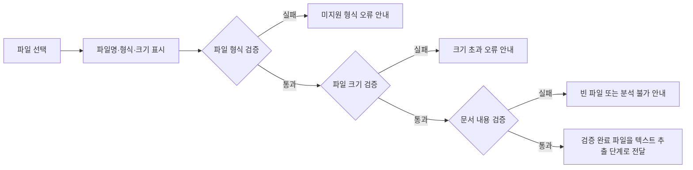

# 기능 분해 문서

## 1. 문서 입력 기능

### 1.1 기능 목적과 범위

사용자가 분석할 문서 **1개**를 업로드하면 시스템은 파일의 기본 정보를 표시하고, 형식·크기·문서 내용을 검증한다. 검증을 통과한 파일만 다음 단계인 텍스트 추출 처리로 전달한다.

- 지원 형식: PDF, DOCX, TXT, HWPX, PPTX
- 입력 단위: 단일 파일 1개
- 이 기능의 완료 기준: 파일이 검증 결과와 함께 `텍스트 추출 대기` 상태로 전달되거나, 처리 가능한 오류와 다음 행동이 사용자에게 안내된다.
- 범위 제외: 여러 파일 동시 업로드, 원본 파일 수정·재저장, HWP(v5) 직접 지원, 문서 이력 보관

### 1.2 처리 흐름

### 1.3 화면 단위

| ID | 화면 요소 | 기능 정의 | 입력/출력 |
| --- | --- | --- | --- |
| UI-IN-01 | 파일 선택 영역 | 사용자가 PDF, DOCX, TXT, HWPX, PPTX 파일 한 개를 선택하거나 업로드한다. | 입력: 파일 1개 |
| UI-IN-02 | 파일 기본정보 영역 | 선택한 파일의 파일명, 형식, 크기를 표시한다. 아직 검증 전이면 검증 대기 상태를 함께 표시한다. | 출력: 파일명, 형식, 크기, 상태 |
| UI-IN-03 | 검증 결과 영역 | 형식, 크기, 문서 내용 검증 결과를 항목별로 표시한다. | 출력: 통과/실패, 사유 |
| UI-IN-04 | 오류 안내 영역 | 미지원 형식, 빈 파일, 크기 초과 시 원인과 사용자가 할 다음 행동을 안내한다. | 출력: 오류 메시지, 재선택 안내 |
| UI-IN-05 | 다음 단계 상태 | 모든 검증을 통과하면 텍스트 추출 단계로 전달되는 상태를 표시한다. | 출력: `텍스트 추출 대기` 또는 전달 완료 상태 |

화면에는 구현 단계에서 확정한 최대 파일 크기 설정값을 표시한다. 요구사항 문서에서 구체적인 제한값은 아직 정하지 않았으므로, 이 문서에서는 `최대 허용 크기`로 표기한다.

### 1.4 API 단위 및 Endpoint 후보

| ID | Endpoint 후보 | 메서드 | 요청 | 성공 응답 후보 | 오류 응답 후보 |
| --- | --- | --- | --- | --- | --- |
| API-IN-01 | `/api/v1/documents/validate` | `POST` | `multipart/form-data`의 단일 `file` | 파일명, 형식, 크기, 각 검증 결과, 텍스트 추출 전달 식별자 또는 상태 | 오류 코드, 사용자 안내 메시지, 실패 검증 항목 |
| API-IN-02 | `/api/v1/documents/upload` | `POST` | `multipart/form-data`의 단일 `file` | 업로드 후 검증 결과와 텍스트 추출 전달 상태 | 오류 코드, 사용자 안내 메시지 |

- MVP 구현 시에는 API-IN-01 또는 API-IN-02 중 **하나만** 채택한다. 두 Endpoint를 함께 제공하는 것은 요구사항에 없는 중복 기능이므로 후순위로 둔다.
- 성공 응답에는 최소한 `file_name`, `file_type`, `file_size`, `validation_status`와 검증 결과를 포함한다.
- 오류 응답에는 원문 내용이나 민감정보를 포함하지 않는다.

### 1.5 처리 단위

| ID | 처리 단계 | 기능 정의 | 완료 조건 |
| --- | --- | --- | --- |
| PR-IN-01 | 단일 파일 수신 | 요청에 파일이 정확히 1개 포함되었는지 확인하고, 선택 파일의 이름·형식·크기를 읽는다. | 파일 기본정보를 화면/API 응답용으로 생성한다. |
| PR-IN-02 | 파일 형식 검증 | 파일명 확장자를 기준으로 PDF, DOCX, TXT, HWPX, PPTX인지 확인한다. 구현 시 파일 형식 식별 방식과 확장자 불일치 처리 정책을 확정한다. | 지원 형식이면 다음 검증으로 진행한다. |
| PR-IN-03 | 파일 크기 검증 | 파일 크기를 최대 허용 크기와 비교한다. 파일 본문을 분석하기 전에 수행한다. | 허용 범위이면 문서 내용 검증으로 진행한다. |
| PR-IN-04 | 문서 내용 검증 | 파일을 해당 형식의 읽기 방식으로 열 수 있는지 확인하고, 분석 가능한 텍스트·본문·슬라이드 내용이 존재하는지 확인한다. | 분석 가능한 내용이 확인되면 통과로 기록한다. |
| PR-IN-05 | 검증 결과 생성 | 형식·크기·내용 검증의 상태와 실패 사유를 구조화한다. | 화면/API에 일관된 상태와 안내를 제공한다. |
| PR-IN-06 | 텍스트 추출 전달 | 모든 검증을 통과한 파일만 텍스트 추출 단계에 전달한다. 검증 실패 파일은 전달하지 않는다. | 텍스트 추출 단계가 처리할 파일과 기본정보를 수신한다. |

### 1.6 오류 처리 단위

| ID | 오류 상황 | 판정 기준 | 시스템 처리 | 사용자 안내 |
| --- | --- | --- | --- | --- |
| ER-IN-01 | 미지원 형식 | 지원 목록 외 확장자의 파일 | 텍스트 추출·분석을 시작하지 않고 형식 검증 실패로 반환한다. | `PDF, DOCX, TXT, HWPX, PPTX 파일을 업로드해 주세요.` |
| ER-IN-02 | 빈 파일 | 파일 크기가 0이거나, 파일을 열었지만 분석 가능한 텍스트·본문·슬라이드 내용이 없는 경우 | 텍스트 추출·분석을 진행하지 않고 내용 검증 실패로 반환한다. | `내용이 포함된 파일인지 확인한 뒤 다시 업로드해 주세요.` |
| ER-IN-03 | 크기 초과 | 파일 크기가 구현 단계에서 확정한 최대 허용 크기를 초과한 경우 | 파일 내용을 분석하지 않고 업로드를 제한한다. | `파일 크기를 줄이거나 필요한 내용만 포함한 파일을 업로드해 주세요.` |
| ER-IN-04 | 파일 열기 또는 내용 확인 실패 | 지원 형식이지만 손상·보호 등으로 정상적으로 열 수 없거나 내용을 읽을 수 없는 경우 | 분석을 시작하지 않고 내용 검증 실패로 반환하며, 내부 상세 오류는 사용자 응답에 노출하지 않는다. | `파일을 읽을 수 없습니다. 파일 상태를 확인한 뒤 다시 업로드해 주세요.` |

### 1.7 테스트 단위

| ID | 구분 | 테스트 입력 | 기대 결과 |
| --- | --- | --- | --- |
| TC-IN-01 | 정상 | 텍스트가 있는 PDF 1개 | 파일명·PDF 형식·크기가 표시되고, 모든 검증 통과 후 텍스트 추출 단계로 전달된다. |
| TC-IN-02 | 정상 | 텍스트가 있는 DOCX 1개 | 파일 기본정보와 검증 결과가 표시되고 텍스트 추출 단계로 전달된다. |
| TC-IN-03 | 정상 | 내용이 있는 TXT 1개 | 파일 기본정보와 검증 결과가 표시되고 텍스트 추출 단계로 전달된다. |
| TC-IN-04 | 정상 | 내용이 있는 HWPX 1개 | 파일 기본정보와 검증 결과가 표시되고 텍스트 추출 단계로 전달된다. |
| TC-IN-05 | 정상 | 텍스트가 있는 PPTX 1개 | 파일 기본정보와 검증 결과가 표시되고 텍스트 추출 단계로 전달된다. |
| TC-IN-06 | 예외 | JPG, HWP(v5) 등 미지원 형식 1개 | 형식 검증 실패와 지원 형식 안내가 표시되며 텍스트 추출 단계로 전달되지 않는다. |
| TC-IN-07 | 예외 | 0바이트 파일 | 빈 파일 오류가 표시되며 텍스트 추출 단계로 전달되지 않는다. |
| TC-IN-08 | 예외 | 열리지만 추출 가능한 내용이 없는 지원 형식 파일 | 내용 검증 실패와 재확인 안내가 표시되며 텍스트 추출 단계로 전달되지 않는다. |
| TC-IN-09 | 예외 | 최대 허용 크기보다 큰 지원 형식 파일 | 크기 초과 오류가 표시되며 파일 본문 분석과 텍스트 추출 단계 전달이 수행되지 않는다. |
| TC-IN-10 | 예외 | 손상되었거나 읽을 수 없는 지원 형식 파일 | 내용 검증 실패 안내가 표시되며 내부 예외 상세나 원문은 노출되지 않는다. |
| TC-IN-11 | 화면 | 정상 파일 선택 후 기본정보 확인 | 파일명, 형식, 크기, 검증 상태가 화면에 일치하게 표시된다. |
| TC-IN-12 | API | 정상·예외 파일별 API 요청 | 상태 코드와 응답의 검증 상태·오류 코드·사용자 안내가 화면 표시와 일치한다. |

### 1.8 구현 우선순위와 추천 구현 순서

| 순서 | 우선순위 | 구현 범위 | 선행 조건 |
| --- | --- | --- | --- |
| 1 | 필수 | 최대 허용 크기 설정 방식, 지원 확장자 목록, 검증 결과 상태·오류 코드 정의 | 구현 전 확인 사항 결정 |
| 2 | 필수 | 단일 파일 수신과 파일명·형식·크기 표시 | 1단계 결과 |
| 3 | 필수 | 형식·크기 검증 및 미지원 형식·크기 초과 오류 처리 | 1~2단계 결과 |
| 4 | 필수 | 형식별 파일 열기 및 분석 가능 내용 존재 여부 검증, 빈 파일 오류 처리 | 지원 라이브러리 및 테스트 파일 준비 |
| 5 | 필수 | 검증 통과 파일의 텍스트 추출 단계 전달 계약 정의 및 연결 | 텍스트 추출 기능의 입력 형식 합의 |
| 6 | 필수 | 정상·예외 입력에 대한 화면, API, 처리 단위 테스트 | 1~5단계 구현 |
| 7 | 후순위 | 확장자와 실제 파일 형식의 심화 교차 검증, 세부 오류 분류 고도화 | 보안 정책과 라이브러리 검토 |
| 8 | 후순위 | 여러 파일 동시 업로드, 업로드 이력·저장 관리 | MVP 범위 확장 승인 |

### 1.9 구현 전에 확인해야 할 사항

| 확인 항목 | 확인이 필요한 이유 | 결정 또는 확인 결과 |
| --- | --- | --- |
| 최대 허용 파일 크기 | 요구사항에서는 운영 환경을 고려해 정하도록 되어 있으며 수치가 확정되지 않았다. | 운영 환경·비용을 검토해 설정값과 화면 표시 문구를 확정한다. |
| 파일 형식 판정 기준 | 확장자만 볼지, 파일의 실제 형식도 확인할지에 따라 구현·보안 수준이 달라진다. | MVP 판정 방식과 확장자 불일치 시 처리 정책을 정한다. |
| 각 형식의 내용 존재 기준 | PDF, DOCX, HWPX, PPTX의 본문·표·슬라이드 텍스트를 어디까지 분석 가능 내용으로 볼지 합의가 필요하다. | 텍스트 추출 기능과 동일한 기준으로 정의한다. |
| 스캔 PDF 처리 | OCR 지원 여부는 요구사항에서 추후 결정 사항이다. | OCR 미지원 시 텍스트가 없으면 빈 문서/분석 불가로 처리할지 확정한다. |
| 암호 보호·손상 파일 처리 | 요구사항은 주요 오류 안내를 요구하지만, 세부 오류 공개 범위는 보안과 사용성에 영향을 준다. | 사용자 안내 문구와 내부 로그 범위를 분리해 정한다. |
| TXT 인코딩 정책 | 읽을 수 없는 문자가 발생할 때 지원할 인코딩과 실패 기준을 정해야 한다. | 지원 인코딩과 오류 처리 기준을 확정한다. |
| 텍스트 추출 단계 전달 계약 | 전달할 파일 자체, 임시 저장 위치, 기본정보, 상태 값의 형식이 정해져야 연동할 수 있다. | 텍스트 추출 기능 담당 범위와 입력·출력 계약을 합의한다. |
| 파일 보관·삭제 정책 | 초기 MVP는 장기 보관을 제외하지만, 처리 중 임시 파일의 보관 위치와 삭제 시점은 필요하다. | 개인정보·보안 원칙에 따라 임시 처리 정책을 정한다. |

### 1.10 후순위 확장 기능

아래 항목은 `requirements-jdk.md`의 MVP 범위에 포함되지 않으므로 이번 문서 입력 기능의 구현 대상에서 제외한다.

- 여러 문서 동시 업로드 및 통합 분석
- 업로드 파일의 장기 보관, 이력 조회, 재분석
- 원본 문서 자동 수정·재저장
- HWP(v5) 바이너리 형식 직접 지원
- 스캔 PDF OCR 처리
- 로그인·권한 기반 업로드 제한
