# AI 문서 분석 시스템 MVP 계획서 (MVP Plan)

본 문서는 `vibe-frame-kit` 표준 및 `./docs/requirements-Gharam.md`, `./docs/function-breakdown-Gharam.md` 명세서를 바탕으로 수립된 AI 문서 분석 시스템 구축 프로젝트의 **실행 가능한 최소 버전(MVP, Minimum Viable Product) 범위를 정의한 최종 계획서**입니다.

---

## 1. 프로젝트 개요 및 MVP 목표

### 1.1. 프로젝트명
**AI Agent를 활용한 회의록, 업무보고, 공문자료 등을 이용한 문서 분석 시스템 구축**

### 1.2. MVP 한 줄 설명
사용자가 단일 문서를 업로드하여 AI 분석·3단 요약·검증 결과를 확인하거나, 다중 문서를 자동 분석·보관하고, SQLite DB에 저장된 문서를 검색·선택하여 요약 내용 조회 및 원본 파일 1-Click 다운로드를 수행할 수 있는 최소 실행 버전

### 1.3. MVP에서 검증할 핵심 가치
* **문서 파싱 및 구조 추출의 안정성**: 다양한 문서 포맷(6종)의 텍스트와 메타데이터를 파싱하고 핵심 구조를 정확히 분리·분석할 수 있는지 검증
* **팩트 기반 요약의 정밀성**: 원문의 의미 왜곡이나 환각(Hallucination) 없이 가독성 높은 3단(개요-구조-결론) 요약문을 안정적으로 생성하는지 검증
* **AI 검증 결과의 신뢰성**: 원문 대조 및 항목 누락·상충 탐지를 통해 검증 신뢰도 점수(0~100점)와 4대 필수 검토 리스트를 제시하여 검토 시간을 단축하는지 검증
* **DB 아카이빙 및 검색/다운로드 편의성**: 분석 결과를 DB에 저장하고, 키워드/조건 검색을 통해 과거 문서의 요약 내역을 빠르게 확인하고 원본 파일을 신속히 다운로드할 수 있는지 검증

### 1.4. 시연 방식
* **[시연 1] 신규 문서 분석 및 결과 확인**:
  1. 단일 문서 파일 1건(PDF, DOCX, TXT, HWP, HWPX, PPTX)을 업로드합니다.
  2. 텍스트 추출 ➔ 8대 핵심 구조 분석 ➔ 3단 요약 생성 ➔ 신뢰도 검증을 자동 수행합니다.
  3. 대시보드 화면에서 메타데이터, 키워드, 3단 요약문, 검증 신뢰도 배지 및 인간 검토 체크리스트를 확인합니다.
* **[시연 2] DB 리스트 조회, 검색 및 원본 다운로드**:
  1. DB 저장 이력 목록 화면에서 키워드, 부서, 작성일 등의 조건으로 문서를 검색합니다.
  2. 검색 리스트에서 특정 문서를 선택하여 요약 미리보기 모달을 확인하고 문구를 수정/저장합니다.
  3. `[📥 1-Click 원본 파일 다운로드]` 버튼을 클릭하여 원본 문서 파일 바이너리를 다운로드합니다.

---

## 2. MVP 사용자 흐름 (User Flow)

### 2.1. 신규 문서 업로드 및 AI 분석·검증 흐름

| 순서 | 사용자 또는 시스템 | 동작 |
|---|---|---|
| 1 | **사용자** | 분석할 단일 문서 파일(PDF, DOCX, TXT, HWP, HWPX, PPTX)을 선택하여 업로드합니다. |
| 2 | **시스템** | 파일 확장자(6종), 용량 제한(50MB 이하), 빈 파일 및 손상 여부 등 입력 유효성을 검증합니다. |
| 3 | **시스템** | 문서 포맷별 전용 파서를 이용해 Raw 텍스트를 추출하고 공백 및 줄바꿈을 정제합니다. |
| 4 | **시스템 (AI Agent)** | 텍스트를 기반으로 문서 중심 주제, 작성 목적, 3~4단 구조, 핵심 문장, 5대 범주 키워드 등 핵심 구조를 분석합니다. |
| 5 | **시스템 (AI Agent)** | 팩트 기반 3단 요약문(1단 전체 개요/태그, 2단 세부 구조 요약, 3단 결론/향후계획)을 생성합니다. |
| 6 | **시스템 (AI Agent/시스템)** | 원문과 요약문을 대조하여 문맥 일치성 및 수치를 검증하고, 검증 신뢰도 점수(0~100점)와 4대 필수 검토 항목을 추출합니다. |
| 7 | **시스템** | 분석·요약·검증 결과 및 아카이빙 정보(규칙 기반 파일명/경로)를 통합 대시보드 화면에 출력하고 DB에 저장합니다. |
| 8 | **사용자** | 화면에 출력된 요약 리포트, 신뢰도 점수 배지, 원문 근거를 확인하고 4대 필수 검토 항목을 직접 최종 검토합니다. |

### 2.2. DB 저장 문서 검색, 결과 확인 및 원본 다운로드 흐름

| 순서 | 사용자 또는 시스템 | 동작 |
|---|---|---|
| 1 | **사용자** | DB 검색 화면에서 검색어(단어 검색 대상: 키워드, 요약, 제목) 및 필터 조건을 입력합니다. |
| 2 | **시스템** | 검색 조건에 부합하는 문서 목록을 DB에서 조회하여 리스트 화면으로 출력합니다. |
| 3 | **사용자** | 검색 결과 리스트에서 상세 확인이 필요한 특정 문서를 선택합니다. |
| 4 | **시스템** | 선택된 문서의 상세 분석·요약·검증 리포트 화면을 렌더링하여 출력합니다. |
| 5 | **사용자** | 요약 결과를 확인한 후 필요한 경우 정보 수정/저장을 진행하거나, 원본 파일 다운로드를 실행합니다. |

### 2.3. 전체 사용자 흐름 및 예외 처리 Mermaid 다이어그램

```mermaid
flowchart TD
    classDef startEnd fill:#2B3A42,stroke:#333,stroke-width:2px,color:#fff;
    classDef process fill:#EBF5FB,stroke:#2980B9,stroke-width:1px,color:#2C3E50;
    classDef aiProcess fill:#F5EEF8,stroke:#8E44AD,stroke-width:1px,color:#4A235A;
    classDef decision fill:#FEF9E7,stroke:#F39C12,stroke-width:1px,color:#7E5109;
    classDef error fill:#FDEDEC,stroke:#E74C3C,stroke-width:1px,color:#78281F;

    subgraph Flow1 ["1. 문서 업로드 & AI 분석·검증 파이프라인"]
        A[사용자: 문서 선택 및 업로드]:::startEnd --> B{입력 유효성 검증}:::decision
        
        B -- "미지원 포맷 / 50MB 초과" --> E1[에러: 확장자 및 용량 초과 알림]:::error
        B -- "빈 문서 / 암호화 / 손상" --> E2[에러: 파일 손상 및 빈 문서 알림]:::error
        E1 --> A
        E2 --> A

        B -- "검증 통과 (PASSED)" --> C[시스템: 텍스트 추출 및 공백 정제]:::process
        
        C --> C_Check{텍스트 파싱 결과}:::decision
        C_Check -- "추출 텍스트 20자 미만" --> OCR[선택적 OCR 폴백 시도]:::process
        OCR -- "OCR 성공" --> D
        OCR -- "OCR 불가 또는 텍스트 부족" --> E3[에러: 텍스트 미존재 및 OCR 환경 확인 안내]:::error
        E3 --> A

        C_Check -- "정상 텍스트 파싱 완료" --> D[AI Agent: 문서 8대 핵심 구조 분석]:::aiProcess
        
        D --> D_Check{AI 분석 성공 여부}:::decision
        D_Check -- "API 오류 / 타임아웃" --> E4[에러: AI 분석 재시도 안내]:::error
        
        D_Check -- "분석 완료" --> F[AI Agent: 팩트 기반 3단 요약 생성]:::aiProcess
        F --> G[AI/시스템: 요약 검증 & 신뢰도 점수 산출]:::aiProcess
        G --> H[시스템: 결과 화면 출력 & DB 저장]:::process
        H --> I[사용자: 화면 결과 확인 & 최종 검토]:::startEnd
    end

    subgraph Flow2 ["2. DB 문서 검색 & 조회의 흐름"]
        S1[사용자: DB 검색어 입력]:::startEnd --> S2{단어 검색 대상 매칭}:::decision
        note1["검색 대상: 키워드, 요약, 제목"] -.-> S2
        
        S2 -- "검색 결과 없음" --> SE1[안내: 조건에 부합하는 문서 없음 표시]:::error
        SE1 --> S1

        S2 -- "검색 결과 존재" --> S3[시스템: 문서 리스트 화면 출력]:::process
        S3 --> S4[사용자: 리스트에서 문서 선택]:::startEnd
        S4 --> S5[시스템: 선택 문서 결과 화면 출력]:::process
        S5 --> S6{사용자 작업 선택}:::decision
        
        S6 -- "결과 수정" --> S7[사용자: 정보 수정 및 저장]:::process
        S6 -- "원본 받기" --> S8[사용자: 원본 파일 다운로드 실행]:::process
        S7 --> S9[완료: 작업 완료]:::startEnd
        S8 --> S9
    end

    class A,I,S1,S4,S9 startEnd;
    class C,H,S3,S5,S7,S8 process;
    class D,F,G aiProcess;
    class B,C_Check,D_Check,S2,S6 decision;
    class E1,E2,E3,E4,SE1 error;
```



---

## 3. MVP 포함 기능 명세

| 번호 | 기능 | MVP 처리 범위 | 포함 이유 |
|:---:|---|---|---|
| **1** | **문서 입력 및 유효성 검증 (`FEAT-01`)** | 단일 문서 분석과 다중 문서 자동 처리에서 PDF, DOCX, TXT, HWP, HWPX, PPTX 파일(각 최대 50MB)을 수신하고 3단계 유효성 검증 및 예외 알림 처리 | 사용자가 문서를 입력하고 유효하지 않은 파일 입력을 사전 차단 및 안내받는 데 필수적임 |
| **2** | **문서 텍스트 추출 및 정제 (`FEAT-02`)** | 6종 문서 포맷별 전용 파서를 통한 Raw 텍스트 파싱, 불필요한 공백/줄바꿈 정제, PDF 텍스트 부족 시 선택적 OCR 폴백 및 기본 구조 태깅 | AI 분석 및 요약 파이프라인의 입력 텍스트 데이터 생성을 위해 문서 핵심 처리에 필수적임 |
| **3** | **AI 문서 구조 분석 (`FEAT-03`)** | AI Agent 기반 중심 주제(1문장), 작성 목적, 3~4단 구조, 핵심 문장, 5대 범주(인물/기관/일정/수치/개념) 키워드 추출 | 문서의 핵심 메타정보 및 원문 구조 데이터를 생성하는 데 필수적임 |
| **4** | **AI 핵심 내용 3단 요약 (`FEAT-04`)** | AI Agent 기반 원문 뉘앙스 보존 3단 요약문(1단 개요/태그, 2단 세부 구조 요약, 3단 결론/향후계획) 생성 | 사용자가 문서의 핵심 요약 결과를 빠르게 파악하고 확인할 수 있도록 하는 데 필수적임 |
| **5** | **AI 문서 검증 및 신뢰도 산출 (`FEAT-05`)** | 원문-요약 교차 대조, 신뢰도 점수(0~100점) 산출 및 사람의 4대 필수 검토 체크리스트 생성 | AI 요약문의 환각(Hallucination) 및 수치 불일치를 탐지하여 결과의 신뢰도를 보장하는 데 필수적임 |
| **6** | **분석 결과 통합 대시보드 화면 출력 (`FEAT-06`)** | 메타데이터 카드, 저장 규칙 정보, 3단 요약, 신뢰도 배지, 대화형 검토 체크박스 통합 출력 | 사용자가 분석·요약·검증 결과를 한 화면에서 직관적으로 확인하고 검토하는 데 필수적임 |
| **7** | **DB 요약 검색 및 원본 다운로드 (`FEAT-07`)** | DB 저장 목록 조회, 단어 검색(키워드, 요약, 제목), 선택 결과 상세 출력, 원본 다운로드 및 결과 수정/저장 | 사용자가 저장된 문서 요약 내역을 다각도로 조회·확인하고 원본 파일을 받거나 수정/저장하는 데 필요함 |

---

## 4. MVP 제외 기능 및 후순위 처리 방향

| 번호 | 제외 기능명 | MVP 제외 사유 | 후순위 추가 조건 및 처리 방향 |
|:---:|---|---|---|
| **1** | **OCR 결과 보정 및 외부 OCR 연동** | MVP에는 PDF 텍스트 부족 시 Tesseract 기반 선택적 OCR 폴백만 포함하며, 인식률 보정과 외부 서비스 연동은 범위에서 제외함 | OCR 품질 기준과 외부 서비스 보안·비용 정책이 확정되면 추가 |
| **2** | **다중 문서 간 비교 분석** | 단일 문서 기반 AI 분석·3단 요약·검증 및 DB 검색이라는 핵심 가치 검증이 선행되어야 하기 위함 | 단일 문서 파이프라인 완결 후, 여러 부서 문서 간 내용 상충 탐지나 버전 간 차이 비교 분석 요구가 구체화되면 추가 |
| **3** | **분석 리포트 PDF/JSON 파일 다운로드** | 웹 화면 시각화 출력(One-Page View)과 원본 파일 다운로드가 최우선 제공 사항이기 위함 | 웹 대시보드 렌더링 검증 완료 후, 보고서 보관용 PDF 변환 엔진(ReportLab 등) 연동 요구 발생 시 추가 |
| **4** | **유저 맞춤형 요약 옵션 (분량/주제 조절)** | 기본 표준 3단 요약(개요-구조-결론)으로도 문서 요약의 핵심 가치를 충분히 수용할 수 있기 위함 | 기본 3단 요약 기능 검증 완료 후, 사용자 선택형 숏폼/미디엄/롱폼 및 특정 주제 중심 요약 옵션 요구 시 추가 |
| **5** | **외부 시스템 연동 (이메일/협업 툴/그룹웨어 API)** | 사내 이메일, 협업 툴(Slack/Teams), 전자결재 API 연동에 따른 보안 및 인프라 연동 복잡성을 배제하기 위함 | 단일 문서 분석 및 DB 아카이빙 시스템 구축 완료 후, 사내 타 시스템 연동 규격이 확정되면 2단계 스프린트에서 추가 |
| **6** | **고도화된 부서/유저 권한 관리 및 통계 대시보드** | MVP 단계에서는 문서 처리 핵심 파이프라인과 DB 검색/다운로드의 동작 검증이 최우선이기 위함 | 다수 부서 실무자 단위의 멀티 테넌트 서비스로 확장되거나 사내 보안 권한 정책 적용 시 추가 |

---

## 5. 단계별 구현 로드맵 (Implementation Roadmap)

```text
[Phase 1: 인프라 & 파이프라인 기초]
  Step 1. 문서 입력 API & 3단계 유효성 검증 모듈 (FEAT-01)
  Step 2. 6종 문서 포맷별 텍스트 추출 및 정제 파서 (FEAT-02)

[Phase 2: AI Agent & 검증 모듈]
  Step 3. AI 문서 8대 핵심 구조 & 키워드 분석 Agent (FEAT-03)
  Step 4. AI 팩트 보존 3단 요약 생성 Agent (FEAT-04)
  Step 5. AI 교차 검증 & 신뢰도 점수 산출 엔진 (FEAT-05)

[Phase 3: 대시보드 UI & DB 검색 서비스]
  Step 6. 통합 분석 결과 대시보드 화면 UI (FEAT-06)
  Step 7. DB 요약 검색 API, 미리보기/수정 & 원본 다운로드 (FEAT-07)
```

### 5.1. 단계별 세부 가이드
* **Step 1 (`FEAT-01`)**: 단일 파일 수신, 확장자(6종)/용량(50MB)/내용 3단계 검증 및 예외 토스트 표출
* **Step 2 (`FEAT-02`)**: `python-hwpx`, `PyMuPDF`, `python-docx`, `python-pptx`, `chardet` 기반 파싱 및 텍스트 정제
* **Step 3 (`FEAT-03`)**: 문서 주체, 작성 목적, 구조, 핵심 문장, 5대 범주 키워드 추출 AI Agent 구현
* **Step 4 (`FEAT-04`)**: 원문 뉘앙스를 보존하는 1단 개요, 2단 세부 구조, 3단 결론 요약 생성 Agent 구현
* **Step 5 (`FEAT-05`)**: 원문-요약 교차 검증, NLI/수치 일치도 기반 신뢰도 점수 산출 및 4대 인간 검토 리스트 생성
* **Step 6 (`FEAT-06`)**: 메타데이터, 요약, 키워드, 검증 배지, 원문 대조 모달, 대화형 검토 체크박스 대시보드 UI 렌더링
* **Step 7 (`FEAT-07`)**: DB 단어 검색(키워드/요약/제목), 요약 수정/저장, 원본 파일 1-Click 스트림 다운로드 구현

---

## 6. MVP 완료 기준 (Definition of Done, DoD)

| 기준 | 확인 방법 | 통과 조건 |
|---|---|---|
| **서비스 실행** | 터미널에서 실행 명령어를 구동한 후 웹 브라우저로 서비스 주소(`http://localhost:8000` 등)에 접속합니다. | 에러 없이 백엔드/프론트엔드 서비스가 정상 구동되고, 웹 브라우저에 대시보드 메인 화면이 출력됩니다. |
| **문서 입력** | 화면의 파일 업로드 UI(드롭존/탐색기)에서 지원 대상 단일 문서 파일 1건을 선택합니다. | 선택한 파일(PDF, DOCX, TXT, HWP, HWPX, PPTX)의 메타정보(파일명, 확장자, 용량)가 화면에 올바르게 표시됩니다. |
| **입력 검증** | 미지원 확장자 파일(예: `.xlsx`, `.zip`) 또는 50MB 초과 파일 입력/업로드를 시도합니다. | 파일 업로드가 즉시 거부되고 미지원 포맷 또는 용량 초과 안내 메시지 알림이 화면에 표시됩니다. |
| **텍스트 추출** | 6종 지원 포맷 문서를 업로드하고 텍스트 추출 진행 상태를 확인합니다. | 문서 포맷별 파서에 의해 원문 텍스트가 글자 깨짐 없이 파싱되고, 공백/줄바꿈이 정제되어 준비됩니다. |
| **AI 문서 분석** | 문서 분석 완료 후 화면의 문서 분석 정보 영역을 확인합니다. | 중심 주제(1문장), 작성 목적, 3~4단 원문 구조, 핵심 문장(3~5개) 및 5대 범주 키워드가 정확히 파싱·표시됩니다. |
| **AI 요약** | 생성된 요약 리포트 영역을 확인합니다. | 원문의 뉘앙스 왜곡 없이 팩트에 기반한 3단(1단 개요/태그, 2단 세부 구조 요약, 3단 결론/향후계획) 요약문이 출력됩니다. |
| **AI 검증** | 검증 리포트 카드 및 신뢰도 배지 영역을 확인합니다. | 원문-요약 교차 검증 결과인 신뢰도 점수(0~100점) 배지와 사람의 4대 필수 검토 리스트 항목이 명확히 표시됩니다. |
| **결과 화면** | 분석 완료 대시보드 및 DB 저장/검색 화면을 확인합니다. | 메타데이터, 저장 규칙 정보, 3단 요약, 검증 배지, 원문 근거 대조 모달, 대화형 검토 체크박스, DB 검색 목록, 요약 내용 수정/저장 UI 및 `[📥 원본 파일 다운로드]` 버튼이 화면에 시각적으로 올바르게 바인딩됩니다. |
| **기본 오류 안내** | 텍스트가 없는 0바이트 빈 파일, 손상 파일, 스캔 이미지 전용 문서를 업로드해 봅니다. | 파이프라인 처리가 즉시 중단되고 "분석할 텍스트 내용이 존재하지 않습니다(OCR 필요)" 등 적절한 오류 안내 메시지가 표출됩니다. |
| **README 실행 방법** | `README.md` 문서에 작성된 설치 및 실행 가이드를 처음부터 끝까지 순서대로 실행해 봅니다. | 문서에 명시된 명령어 실행만으로 외부 에러 없이 로컬 환경에서 서비스가 정상 구동되고 시연 가능합니다. |

### 6.1. 전체 MVP 완료 통합 시나리오 (End-to-End Scenario)
> **[통합 시연 시나리오]**
> 1. 사용자는 `README.md` 가이드에 명시된 명령어를 터미널에 입력하여 백엔드 및 프론트엔드 서비스를 로컬 환경에서 정상 구동하고 웹 브라우저로 서비스 화면에 접속한다.
> 2. 웹 UI 드롭존에 검토 대상 공문 문서(`2026_업무보고.pdf`) 단일 파일을 업로드한다.
> 3. 시스템은 파일 확장자(PDF)와 용량(50MB 이하) 및 텍스트 존재 여부를 즉시 3단계 검증하고 파싱을 완료한 후 AI 분석 파이프라인을 자동 구동한다.
> 4. 결과 대시보드 화면에서 추출된 메타데이터, 5대 범주 키워드, 팩트 기반 3단 요약문, 92.5점의 검증 신뢰도 배지 및 원문 근거 대조 모달을 직접 확인하고, 4대 필수 검토 항목 체크박스를 눈으로 확인하며 체크한 뒤 **[DB 저장]** 버튼을 클릭한다.
> 5. 상단 **[DB 요약 검색]** 탭으로 이동하여 키워드를 입력하고 검색을 수행하면, 방금 저장된 문서 리스트가 결과로 출력된다.
> 6. 해당 리스트 항목을 클릭하여 요약 미리보기 모달을 렌더링하고, 필요 시 요약 문구를 일부 수정 후 저장한 뒤 **`[📥 1-Click 원본 파일 다운로드]`** 버튼을 눌러 원본 파일 바이너리 스트림이 다운로드됨을 최종 확인한다.
> 7. 만약 테스트를 위해 미지원 포맷(`.xlsx`)이나 0바이트 빈 문서를 업로드할 경우, 처리가 즉시 중단되며 화면 상단에 명확한 예외 안내 메시지가 표출됨을 확인하고 전체 시연을 마친다.

---

## 7. 최소 수동 확인 및 테스트 가이드

### 7.1. 정상 흐름 수동 확인 (Happy Path)
* **TC-01 (서비스 구동)**: `README.md` 가이드 명령어로 서버/클라이언트 실행 후 `http://localhost:8000` 접속 ➔ 메인 대시보드 UI 정상 렌더링 확인
* **TC-02 (문서 업로드 및 AI 파이프라인)**: 정상 6종 문서를 선택하여 업로드 ➔ 메타데이터, 키워드, 3단 요약, 신뢰도 배지(0~100점), 검토 체크박스 출력 확인
* **TC-03 (검토 및 DB 저장)**: 4대 검토 항목 체크 후 `[DB 저장]` 클릭 ➔ DB 저장 성공 토스트 확인
* **TC-04 (DB 검색, 미리보기/수정 & 다운로드)**: `[DB 요약 검색]` 탭 ➔ 키워드 검색 ➔ 리스트 선택 후 요약 문구 수정/저장 ➔ `[📥 1-Click 원본 파일 다운로드]` 클릭 ➔ 정상 다운로드 확인

### 7.2. 예외 및 오류 안내 수동 확인 (Exception Path)
* **TC-05 (미지원 포맷 차단)**: `.xlsx` 등 미지원 확장자 업로드 시도 ➔ 미지원 포맷 안내 메시지 표출 확인
* **TC-06 (용량 초과 차단)**: 50MB 초과 대용량 파일 업로드 시도 ➔ 용량 초과 안내 메시지 표출 확인
* **TC-07 (텍스트 미존재 예외)**: 0자 빈 파일 또는 스캔 이미지 문서 업로드 시도 ➔ 텍스트 미존재/OCR 필요 알림 표출 확인

### 7.3. 테스트 제외 범위
* 대용량 부하/성능 테스트, 고도화 OAuth2 보안 테스트, Kubernetes 자동 배포 테스트 제외 (로컬 단일 시연 환경 전제)

---

## 8. 가정 사항 및 미결정 항목

### 8.1. MVP 가정 사항 (Immersive Assumptions)

| 항목 | 가정 사항 | 가정 이유 |
|---|---|---|
| **파일 크기 제한** | 단일 문서 파일 50MB 이하 | 대용량 파일 수신에 따른 서버 메모리 과부하를 방지하고 파이프라인 유효성 검증 기준을 명확히 하기 위함 |
| **PDF 처리 범위** | 텍스트 레이어가 포함된 PDF를 기본 처리하고, 추출 텍스트가 20자 미만이면 Tesseract 기반 선택적 OCR 폴백을 시도 | 스캔 이미지 PDF도 최소 범위에서 처리하되, OCR 환경이 없거나 결과가 부족하면 명확한 오류를 반환함 |
| **DOCX 처리 범위** | 암호가 해제된 표준 MS Word 파일 (`.docx`) | 암호 보호 문서 해독 오버헤드를 방지하고 표준 XML 기반 구조 파싱을 보장하기 위함 |
| **HWPX 처리 범위** | `python-hwpx` 라이브러리를 이용한 표준 개방형 문서 파싱 (Python 3.10+) | 저장소 규칙 및 개방형 한글 문서 포맷 표준 파서를 활용하기 위함 |
| **HWP 처리 범위** | HWP (v5 바이너리)는 `docpler`로 텍스트를 추출 | HWPX 변환 없이 현재 구현의 전용 파서로 처리함 |
| **PPTX 처리 범위** | 슬라이드 텍스트 레이어 및 프레젠터 노트 텍스트 추출 | MS 프레젠테이션 문서의 주요 발표 및 보고 텍스트를 정제하기 위함 |
| **TXT 인코딩** | UTF-8 및 EUC-KR 인코딩 자동 감지 (`chardet` 활용) | 한글 텍스트 문서 읽기 시 인코딩 깨짐 현상을 사전 방지하기 위함 |
| **최소 텍스트 기준** | 추출 및 정제된 실질 텍스트 20자 이상 | 20자 미만 문서나 공백 문서 등 분석 불가능한 파일을 사전 차단하여 AI 토큰 낭비를 막기 위함 |
| **기본 요약 분량** | 1단 개요(3~5줄) + 2단 세부 구조 요약 + 3단 결론/향후계획 | 정보의 가독성을 최적화하고 LLM 컨텍스트 및 토큰 낭비를 방지하기 위함 |
| **실행 환경** | 로컬 독립 실행 환경 (Windows OS, Python 3.10+, FastAPI, Node/Vite) | 외부 클라우드 배포 인프라 복잡성 없이 로컬 환경에서 손쉬운 시연 및 실행을 보장하기 위함 |

### 8.2. 아직 결정되지 않은 확인 필요 사항 (Open Questions)

| 항목 | 확인할 내용 | MVP에 미치는 영향 |
|---|---|---|
| **개발 기간** | 전체 구현 및 테스트 완료까지의 정확한 스프린트/제출 마감 기한 | 7단계 로드맵의 세부 일자 산정 및 테스트 시점 결정에 영향을 줌 |
| **팀원 수** | 개발에 참여하는 실제 팀원 수 및 역할 분담 (단독 구현 vs N명 분담) | Step별 병렬 작업 가능 여부 및 모듈 분할 범위 결정에 영향을 줌 |
| **운영 환경 DB 전환** | 현재 SQLite 스키마를 PostgreSQL 등 운영 DB로 이전할 시점과 마이그레이션 방식 | 배포 환경의 동시성·백업·권한 정책에 영향을 줌 |
| **긴 문서 처리** | 토큰 수 제한을 초과하는 대용량 긴 문서 분할(Chunking/Map-Reduce) 적용 여부 | LLM 컨텍스트 오버플로우 시 분할 요약 및 텍스트 청킹 알고리즘 도입 여부에 영향을 줌 |
| **원본 파일 저장 여부** | 업로드된 원본 파일을 로컬 저장소 폴더에 보관할지 DB BLOB 또는 Cloud S3에 저장할지 여부 | `[📥 1-Click 원본 파일 다운로드]` API의 물리 저장소 파이프라인 구현 방식에 영향을 줌 |
| **민감 정보 처리 기준** | 개인정보(주민번호, 전화번호, 계좌번호 등) 자동 마스킹 처리 기준 및 수준 | 텍스트 추출 및 AI 분석 파이프라인 내 정규식/NER 마스킹 모듈 포함 여부에 영향을 줌 |

---

## 9. MVP 계획 최종 검수 결과

| 검수 항목 | 상태 | 발견 내용 | 수정 방향 |
|---|:---:|---|---|
| **1. 사용자가 직접 실행할 수 있는 계획인가** | **통과** | 로컬 독립 실행 환경에서 단일 문서 업로드부터 DB 검색/원본 다운로드까지 사용자가 직접 실행 가능한 파이프라인으로 구성됨 | 해당 없음 (현재 계획 유지) |
| **2. 입력 후 처리 결과를 확인할 수 있는가** | **통과** | 문서 입력 후 메타데이터, 3단 요약, 5대 키워드, 검증 배지, 인간 검토 리스트 및 DB 조회/수정 화면으로 결과를 즉시 확인 가능함 | 해당 없음 (현재 계획 유지) |
| **3. 프로젝트의 핵심 문제를 해결하는가** | **통과** | 대량 문서 수동 검토 지연 및 파일 보관 파편화 문제를 AI 자동 요약/검증과 DB 아카이빙/1-Click 다운로드로 해결함 | 해당 없음 (현재 계획 유지) |
| **4. 수업 시간 안에 구현 가능한 범위인가** | **통과** | 선택적 OCR 폴백은 최소 범위로 제공하고, OCR 결과 보정·다중 문서 비교 분석·외부 연동 등 고난도 기능은 후순위로 제외하여 핵심 7개 기능으로 범위를 한정함 | 해당 없음 (현재 계획 유지) |
| **5. 최소 테스트 또는 수동 확인이 가능한가** | **통과** | 정상 흐름(TC-01~TC-04) 및 예외 처리 흐름(TC-05~TC-07) 등 총 7종의 직관적인 수동 확인 테스트 가이드가 구축됨 | 해당 없음 (현재 계획 유지) |
| **6. README에 실행 방법을 설명할 수 있는가** | **통과** | 로컬 Uvicorn/Vite 실행 명령어 수순만으로 서비스를 구동할 수 있도록 DoD(완료 기준) 항목에 명시됨 | 해당 없음 (현재 계획 유지) |
| **7. 포함 기능과 제외 기능이 명확한가** | **통과** | FEAT-01~FEAT-07과 선택적 OCR 폴백은 MVP 포함으로, OCR 결과 보정·비교분석·PDF변환 등 후순위 기능은 사유 및 추가 조건과 함께 분리됨 | 해당 없음 (현재 계획 유지) |
| **8. 구현 순서가 기능 의존성과 일치하는가** | **통과** | Step 1(입력) ➔ Step 2(파싱) ➔ Step 3(분석) ➔ Step 4(요약) ➔ Step 5(검증) ➔ Step 6(대시보드) ➔ Step 7(DB검색/다운로드) 순으로 데이터 전이 조건과 일치함 | 해당 없음 (현재 계획 유지) |
| **9. 완료 기준이 실행 결과 중심으로 작성되었는가** | **통과** | 개발 내부 코드가 아닌 사용자 UI 표시, 에러 메시지 표출, 원본 다운로드 성공 등 사용자가 체감 가능한 결과 중심으로 작성됨 | 해당 없음 (현재 계획 유지) |
| **10. 요구사항과 기능 분해에 없는 기능이 추가되지 않았는가** | **통과** | `requirements-Gharam.md` 및 `function-breakdown-Gharam.md` 문서 내 정의된 기능 및 스키마만 100% 매핑됨 | 해당 없음 (현재 계획 유지) |
| **11. AI 검증이 최종 판정으로 표현되지 않았는가** | **통과** | AI 검증은 보조적 신뢰도 점수(0~100점) 및 뱃지 표시이며, 최종 판단은 사람(사용자)의 4대 필수 검토 체크리스트로 연결되도록 설계됨 | 최종 판정 주체가 사람(사용자)임을 화면 UI 검토 체크박스 및 안내 문구에 명확히 유지함 |
| **12. 미확정 사항을 임의로 결정하지 않았는가** | **통과** | DB 종류, 개발 기간, 팀원 수, 마스킹 기준 등 미확정 6개 항목을 단정 짓지 않고 확인 필요 사항으로 독립 관리함 | 해당 없음 (현재 계획 유지) |
