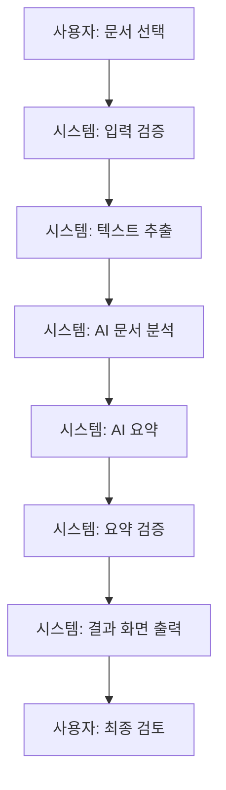
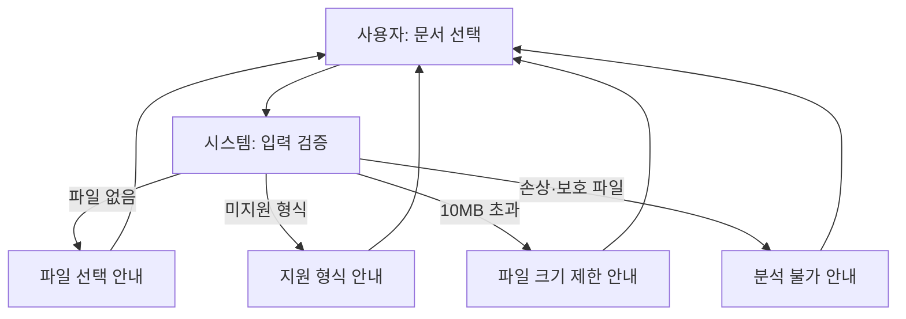

# MVP 계획서

## 1. MVP 목표

| 항목 | 내용 |
| --- | --- |
| 프로젝트명 | AI Agent 기반 회의록, 업무보고, 공문자료 등을 이용한 문서 분석 시스템 |
| MVP 한 줄 설명 | 사용자가 업무 문서 한 개를 입력하면, 시스템이 문서의 핵심 내용을 분석·요약하고 사람이 확인할 검증 후보를 제공하는 최소 실행 버전이다. |
| MVP에서 검증할 핵심 가치 | 긴 업무 문서를 검토할 때 핵심 내용, 일정·수치·결정 사항 및 확인 필요 항목을 구조화해 제공하여 사용자의 초기 검토 시간을 줄일 수 있는지 검증한다. |
| 시연 방식 | 지원 형식의 비민감 문서 한 개를 업로드하고, 입력 검증·텍스트 추출·AI 분석·요약·검증 결과를 순서대로 확인한다. 사용자는 결과 화면에서 요약, 주요 키워드, 검증 결과와 원문 확인이 필요한 항목을 검토한다. |

이 MVP는 AI 결과를 최종 판단으로 사용하지 않는다. 결과는 원문 검토를 돕는 참고 정보이며, 사용자가 최종 확인한다.

## 2. MVP 사용자 흐름

| 순서 | 사용자 또는 시스템 | 동작 |
| --- | --- | --- |
| 1 | 사용자 | 분석할 문서 한 개와 필요 시 문서 유형을 선택한다. |
| 2 | 시스템 | 파일 형식, 10MB 크기 제한, 손상·보호 여부를 확인한다. |
| 3 | 시스템 | 문서 본문을 추출하고, 스캔 PDF 등 일반 추출이 어려운 경우 OCR 처리 흐름을 적용한다. |
| 4 | 시스템 | 추출한 내용을 바탕으로 문서의 핵심 구조와 주요 정보를 분석한다. |
| 5 | 시스템 | 분석 결과와 원문에 근거해 핵심 내용을 요약한다. |
| 6 | 시스템 | 요약과 원문을 비교해 확인이 필요한 누락, 불일치, 수치·일자·조건 항목을 표시한다. |
| 7 | 시스템 | 문서 정보, 핵심 요약, 키워드, 검증 결과, 확인 필요 항목을 결과 화면에 표시한다. |
| 8 | 사용자 | 원문과 결과를 비교해 최종 검토하고 업무 판단에 활용한다. |

### 정상 흐름

### 입력 오류 흐름

