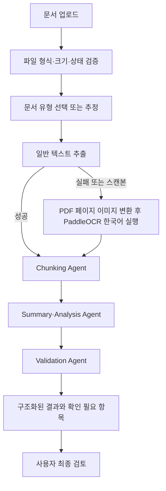

# 요구사항 정의서

## 1. 프로젝트 개요

| 항목 | 내용 |
| --- | --- |
| 프로젝트명 | AI Agent 기반 회의록, 업무보고, 공문자료 등을 이용한 문서 분석 시스템 |
| 서비스 목적 | 문서를 업로드하면 AI가 핵심 내용을 요약하고 검증 결과를 제공한다. |
| 프로젝트 배경 | 긴 업무 문서를 검토할 때 핵심 정보와 중요한 기한·결정 사항을 놓칠 수 있다. |
| 주요 사용자 | 회의록, 업무보고, 공문을 검토·정리해야 하는 조직의 실무 담당자 |
| 사용 상황 | 보고서, 회의자료, 기획서, 정책 문서, 업무 문서를 빠르게 검토할 때 |
| 핵심 가치 | 문서 검토 시간 단축, 요약 품질 표준화, 최종 검토 보조 |

이 시스템의 AI 결과는 사용자의 최종 판단을 대체하지 않는다. 원문을 검토할 수 있도록 근거와 확인 필요 사항을 함께 제공한다.

## 2. 서비스 범위와 제약

- 지원 형식: PDF, DOCX, TXT, HWPX, PPTX
- 최대 파일 크기: 10MB 이하
- 기술 기준: Python 3, FastAPI, LangChain, LangGraph, LLM API
- HWP(v5) 바이너리 형식은 지원하지 않으며 HWPX 변환이 필요하다.
- 초기 MVP는 단일 문서 분석을 대상으로 하며, 로그인·데이터베이스·고급 UI는 후순위다.
- 원본 파일을 수정, 삭제, 덮어쓰기 하지 않는다.

## 3. 사용자 정의

| 사용자 | 사용하는 상황 | 어려움 | 시스템이 제공할 해결 |
| --- | --- | --- | --- |
| 일반 행정·사무 담당자 | 회의록 정리, 수신 공문 검토 | 결정·요청 사항과 기한을 놓치기 쉽다. | 핵심 내용, 담당자, 일정, 후속 조치를 구조화해 제공 |
| 팀장·관리자 | 여러 업무보고의 진행 현황 확인 | 이슈·지연·다음 계획을 문서마다 찾아야 한다. | 진행 현황, 주요 이슈, 위험 요소, 다음 계획 요약 |
| 문서 작성자 | 제출 전 문서 확인 | 필수 항목 누락을 기억에 의존한다. | 문서 유형별 확인 항목과 누락 가능성 표시 |
| 신규 담당자 | 인수인계 문서 이해 | 조직 용어와 문서 구조가 낯설다. | 쉬운 언어의 요약과 원문 근거 제공 |

## 4. 사람이 수행하는 문서 분석 업무 흐름

| 단계 | 목적 | 제목·일자·기관 기준 확인 정보 | 산출물 |
| --- | --- | --- | --- |
| 문서 확인 | 분석 대상과 범위를 파악 | 문서 종류, 제목, 목차, 작성·시행 일자, 소속 기관·부서 | 문서 기본정보 |
| 문서 읽기 | 전체 내용과 의도를 이해 | 작성 기관·부서, 제목, 본문, 결론 | 문서 내용 이해 |
| 핵심 내용 표시 | 중요 정보를 찾음 | 핵심 문장, 키워드, 수치, 조건, 기한, 담당자, 결정·요청 사항 | 핵심 정보 목록 |
| 내용 분류 | 내용을 논리적으로 정리 | 배경, 현황, 문제, 해결방안, 결론 | 분류된 분석 내용 |
| 요약 작성 | 빠른 이해를 돕는 재작성 | 제목별 핵심, 일자별 일정, 기관·부서별 담당 내용 | 구조화된 요약 |
| 결과 검토 | 원문과 결과의 일치 확인 | 제목·일자·기관명·수치의 정확성, 누락과 과도한 해석 여부 | 검토 결과 |

## 5. 시스템 처리 흐름

## 6. 기능 요구사항

| ID | 기능 | 입력 | 처리 | 출력 | 우선순위 |
| --- | --- | --- | --- | --- | --- |
| FR-01 | 문서 업로드 | 지원 문서 파일 | 형식·크기·손상 여부를 확인 | 분석 가능 여부 | 필수 |
| FR-02 | 문서 기본정보 추출 | 업로드 문서 | 제목, 일자, 기관·부서, 목차를 추출한다. | 문서 기본정보 | 필수 |
| FR-03 | 텍스트 추출·OCR | 문서 또는 PDF 페이지 이미지 | 일반 추출을 우선하며 실패·스캔본만 PaddleOCR로 처리 | 분석용 텍스트 | 필수 |
| FR-04 | 내용 청킹·분류 | 분석용 텍스트 | 문맥 단위로 분할하고 배경·문제·해결방안·결론 등을 분류 | 분할·분류 데이터 | 필수 |
| FR-05 | 핵심 요약 | 분할·분류 데이터 | 문서의 주요 내용, 일정, 결정 사항, 후속 조치를 요약 | 구조화된 요약 | 필수 |
| FR-06 | 문서 검증 | 원문과 요약·분석 결과 | 필수 정보 누락, 근거 부족, 원문 불일치 가능성을 표시 | 검증 결과 | 필수 |
| FR-07 | 결과 표시 | 분석 결과 | 정해진 출력 항목을 사용자가 검토할 수 있게 제공 | 분석 결과 화면 또는 응답 | 필수 |
| FR-08 | 문서 질의응답 | 사용자 질문과 문서 내용 | 문서에 존재하는 근거 안에서 답변 | 질의응답 결과 | 선택 |

## 7. 입력 데이터 요구사항

| 입력 항목 | 요구사항 |
| --- | --- |
| 파일 형식 | PDF, DOCX, TXT, HWPX, PPTX만 허용한다. 확장자와 실제 파일 형식을 함께 확인한다. |
| 문서 유형 | 회의록, 업무보고, 공문, 기타 중 선택하거나 문서 내용으로 추정해 표시한다. |
| 기본 정보 | 제목, 작성·시행 일자, 소속 기관·부서, 목차, 본문을 가능한 범위에서 추출한다. |
| 정보 누락 | 문서에 없는 값은 임의로 생성하지 않고 `확인 필요`로 표시한다. |
| 원본 보호 | 처리 과정에서 원본 문서를 변경하지 않는다. |

## 8. 출력 결과 요구사항

결과는 사용자가 빠르게 이해하고 최종 검토할 수 있도록 다음 항목을 구조화해 제공한다.

| 출력 항목 | 내용 |
| --- | --- |
| 문서 제목 | 추출한 제목 또는 확인 필요 표시 |
| 작성·시행 일자 | 문서에서 확인된 일자와 일자 유형 |
| 소속 기관·부서 | 작성·발신 기관 또는 부서 |
| 문서 핵심 요약 | 주요 내용, 결론, 결정·요청 사항, 후속 조치 |
| 주요 키워드 | 문서 핵심 주제와 중요 용어 |
| 문서 검증 결과 | 필수 항목 충족 여부와 원문 근거 |
| 확인 필요 항목 | 누락, 모호함, OCR 오인식 가능성, 사람의 판단이 필요한 항목 |

## 9. 예외 상황 및 오류 처리 요구사항

| ID | 발생 조건 | 시스템 처리 요구사항 | 사용자 안내 | 상태 |
| --- | --- | --- | --- | --- |
| ER-01 | 지원하지 않는 파일 형식 | 분석 전에 형식 검사를 하고 업로드를 제한한다. | “PDF, DOCX, TXT, HWPX, PPTX 파일을 업로드해 주세요.” | 업로드 실패 |
| ER-02 | 문서가 비었거나 추출할 내용이 없음 | 요약·검증을 진행하지 않고 빈 문서와 추출 실패를 구분한다. | “문서에서 분석할 내용을 찾을 수 없습니다.” | 분석 불가 |
| ER-03 | AI 분석 요청 실패 또는 시간 초과 | 오류 단계만 기록하고 재시도를 허용한다. | “문서 분석 중 오류가 발생했습니다. 잠시 후 다시 시도해 주세요.” | 분석 실패 |
| ER-04 | 파일 크기 초과 | 10MB를 초과한 파일은 분석하지 않고 허용 크기 기준을 안내한다. | “파일 크기가 허용 범위를 초과했습니다. 10MB 이하의 파일을 업로드해 주세요.” | 업로드 실패 |
| ER-05 | 비밀번호 보호·손상 파일 | 내용을 읽지 않고 재업로드 또는 보호 해제 방법을 안내한다. | “파일을 읽을 수 없습니다. 파일 상태를 확인해 주세요.” | 분석 불가 |

공통 원칙: 오류 결과를 정상 결과처럼 표시하지 않으며, 원본·개인정보·API 키·인증정보를 오류 메시지와 로그에 노출하지 않는다.

## 10. 비기능 및 보안 요구사항

- 사용자는 처리 진행 상태, 분석 가능 여부, 다음 행동을 확인할 수 있어야 한다.
- API 키와 토큰은 `.env`로 관리하고, 실제 값은 코드·로그·저장소에 기록하지 않는다.
- 개인정보·기밀·운영 문서는 저장소와 테스트 픽스처에 커밋하지 않는다.
- HWPX 처리 결과를 생성할 때는 새 경로에 저장하고 `MutationReport`로 저장 결과를 확인한다.

## 11. 사람이 최종 검토해야 하는 부분

- AI 요약이 원문의 의미, 수치, 일자, 기관·부서를 정확히 반영했는지
- 누락·확인 필요 항목의 실제 필요성과 문서 유형별 필수 항목 충족 여부
- OCR 결과의 오인식 및 AI가 원문에 없는 내용을 단정적으로 해석했는지
- 업무 결정, 대외 발신, 법적·정책적 판단이 필요한 내용

## 12. MVP 범위

### 포함

- 단일 문서 업로드와 기본 검증
- 텍스트 추출 및 스캔 PDF의 OCR 대체 처리
- 제목·일자·기관·부서 등 기본정보 추출
- 핵심 요약, 주요 키워드, 검증 결과, 확인 필요 항목 표시
- 정상·오류 입력에 대한 사용자 안내

### 제외 또는 후순위

- 로그인·권한 관리, 데이터베이스 보관, 다중 문서 비교
- 고급 UI와 자동 배포
- 이미지·손글씨 중심 OCR의 고도화
- 법적 판단 또는 AI 결과의 자동 확정

## 13. 인수 기준 및 테스트 기준

- 각 지원 형식의 비민감 샘플 문서를 업로드해 분석 가능 여부를 확인한다.
- 분석 가능한 문서에서 제목, 일자, 기관·부서, 핵심 요약, 키워드, 검증 결과, 확인 필요 항목을 제공한다.
- 지원하지 않는 형식, 빈 파일, 손상·보호 파일, 크기 초과, AI 분석 실패에서 올바른 안내와 상태를 제공한다.
- 스캔 PDF는 OCR 결과가 원문과 다를 수 있음을 표시하고, 사람의 최종 검토가 가능해야 한다.
- HWPX 관련 테스트는 비민감 픽스처를 사용하고 원본이 변경되지 않았음을 확인한다.

## 14. 기능 분해 연결 기준

다음 단계에서는 FR-01부터 FR-08까지를 각각 **입력, 처리, 출력, 예외 처리, 테스트** 단위로 분해한다. 우선순위는 FR-01~FR-07을 먼저 구현하고, FR-08은 핵심 분석 흐름이 안정화된 뒤 검토한다.

## 15. 추후 확정 항목

- 허용 처리 시간과 동시 처리 수
- 문서 유형별 필수 검증 항목과 정확성 평가 기준
- 프런트엔드 기술과 결과 화면 구성
- OCR 적용 범위와 모델 운영 환경
- 분석 결과·원본 문서의 보관 및 삭제 정책

## 16. 문서 변경 이력

| 일자 | 내용 |
| --- | --- |
| 2026-07-25 | 요구사항 정의 초안 작성 및 기능 분해 준비 기준 정리 |
