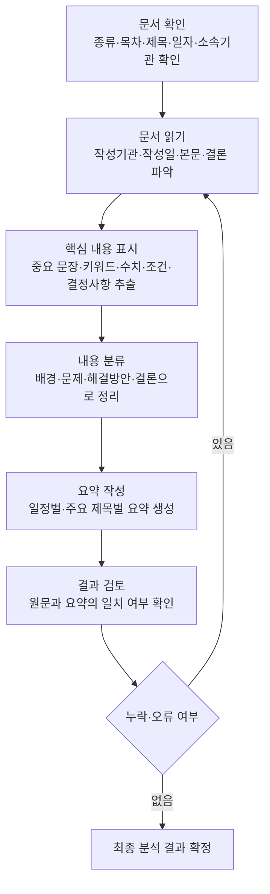

# 요구사항 정의서

## 1. 문서 개요

| 항목 | 내용 |
| --- | --- |
| 프로젝트명 | AI Agent를 활용한 문서 분석 시스템 |
| 작성일 | 2026-07-23 |
| 작성 목적 | 회의록, 업무보고, 공문 자료의 핵심 내용을 요약하고 검증 결과를 제공하는 MVP의 범위를 정의한다. |
| 대상 사용자 | 회의록·업무보고·공문 자료를 빠르게 검토해야 하는 일반 업무 담당자 |

## 2. 문제 정의

업무 문서는 길고 형식이 다양하여, 담당자가 핵심 내용과 누락·불일치 여부를 빠르게 파악하기 어렵다. 사용자가 문서를 업로드하면 시스템이 내용을 추출하고, AI가 핵심 내용을 요약하며 사전에 정의한 검증 기준에 따른 결과를 제공한다.

## 3. 서비스 목표

1. 지원 문서에서 분석 가능한 텍스트를 안전하게 추출한다.
2. 문서의 주요 목적, 핵심 논의·결정 사항, 일정 및 요청 사항을 이해하기 쉬운 형태로 요약한다.
3. 문서 종류별 기본 검증 항목을 적용하여 누락 또는 확인이 필요한 내용을 알려 준다.
4. 분석 결과를 화면 또는 API 응답으로 일관되게 제공한다.

## 4. MVP 범위

### 포함 범위

- 단일 문서 업로드 및 파일 형식·크기 검증
- PDF, DOCX, TXT, HWPX, PPTX 형식의 텍스트 추출
- 문서 유형(회의록, 업무보고, 공문, 기타) 선택 또는 간단한 자동 분류
- AI 기반 핵심 내용 요약
- 문서 유형별 기본 검증
  - 회의록: 회의 일시, 참석자, 안건, 결정 사항, 후속 조치
  - 업무보고: 보고 기간, 진행 현황, 이슈, 다음 계획
  - 공문: 수신처, 발신처, 제목, 시행·접수 정보, 요청 또는 안내 사항
- 검증 결과를 `통과`, `확인 필요`, `검증 불가` 상태와 근거로 제공
- 분석 실패 시 사용자에게 원인과 재시도 방법을 안내

### 제외 범위

- 사용자 로그인·권한 관리 및 관리자 기능
- 데이터베이스를 이용한 장기 보관, 문서 이력 관리, 협업 기능
- 여러 문서의 동시 비교·통합 분석
- 원본 문서의 자동 수정·재저장
- HWP(v5 바이너리) 형식 직접 지원
- 법률·감사 판단처럼 사람이 최종 결정해야 하는 확정적 판정

## 5. 기능 요구사항

| ID | 기능 | 요구사항 | 우선순위 |
| --- | --- | --- | --- |
| FR-01 | 파일 업로드 | 사용자는 분석할 문서 파일 1개를 업로드할 수 있어야 한다. | 필수 |
| FR-02 | 입력 검증 | 시스템은 지원하지 않는 확장자, 빈 파일, 허용 크기 초과 파일을 거부하고 이유를 알려야 한다. | 필수 |
| FR-03 | 텍스트 추출 | 시스템은 지원 형식에서 분석용 텍스트를 추출해야 한다. 텍스트가 없거나 추출에 실패하면 분석을 진행하지 않는다. | 필수 |
| FR-04 | 문서 유형 | 사용자는 문서 유형을 선택할 수 있어야 하며, 선택하지 않으면 시스템은 기타 문서로 처리하거나 추정 유형을 표시해야 한다. | 필수 |
| FR-05 | 요약 | 시스템은 문서 목적, 핵심 내용, 결정·요청 사항, 일정·담당 정보(존재할 경우)를 구조화하여 요약해야 한다. | 필수 |
| FR-06 | 검증 | 시스템은 선택·추정된 문서 유형의 기본 필수 항목 존재 여부를 확인하고 결과 및 근거를 제공해야 한다. | 필수 |
| FR-07 | 결과 제공 | 시스템은 원본 파일명, 문서 유형, 요약, 검증 결과, 주의 사항을 하나의 분석 결과로 반환해야 한다. | 필수 |
| FR-08 | 오류 처리 | 파일 손상, 비밀번호 보호, 추출 실패, AI 처리 실패 등 주요 오류를 구분해 안내해야 한다. | 필수 |

## 6. 입력·출력 요구사항

### 입력

- 파일: PDF, DOCX, TXT, HWPX, PPTX 중 1개
- 선택값: 문서 유형(회의록, 업무보고, 공문, 기타)
- 제약: 최대 파일 크기는 구현 단계에서 운영 환경을 고려해 설정하며, 설정값을 사용자에게 표시한다.

### 출력

- 업로드 파일명 및 처리 상태
- 추출 또는 선택된 문서 유형
- 핵심 요약
- 확인된 주요 항목
- 검증 항목별 상태, 근거 문장 또는 확인 필요 사유
- 처리 실패 시 오류 코드 또는 이해하기 쉬운 오류 메시지

## 7. 비기능 요구사항

| 구분 | 요구사항 |
| --- | --- |
| 사용성 | 분석 결과는 업무 담당자가 별도 교육 없이 읽을 수 있는 한국어 중심의 명확한 문장으로 제공한다. |
| 성능 | 일반적인 단일 업무 문서는 사용자가 기다릴 수 있는 시간 안에 결과를 반환하도록 설계하며, 정확한 목표 시간은 구현·배포 환경에서 측정 후 정한다. |
| 보안 | API 키, 비밀번호, 토큰을 코드와 로그에 기록하지 않는다. 업로드 문서의 본문과 개인정보는 불필요하게 로그에 남기지 않는다. |
| 신뢰성 | AI가 확신할 수 없는 항목은 사실로 단정하지 않고 `확인 필요` 또는 `검증 불가`로 표시한다. |
| 유지보수성 | 문서 유형별 검증 기준은 다른 코드와 분리하여 추가·수정할 수 있어야 한다. |
| 접근성 | 오류 메시지는 기술 용어만 제시하지 않고 사용자가 취할 수 있는 다음 행동을 함께 안내한다. |

## 8. 기술 및 구현 제약

- 언어는 Python 3을 사용한다.
- 백엔드는 FastAPI 기반으로 구현한다.
- AI 처리 흐름은 LangChain과 LangGraph를 사용한다.
- 초기 MVP에는 데이터베이스를 사용하지 않는다.
- HWPX는 `python-hwpx` 라이브러리로 처리한다. 원본 파일은 덮어쓰지 않으며, HWP(v5)는 HWPX로 변환한 후 처리한다.
- 외부 AI 서비스 사용 시 API 키는 환경 변수로 관리하며 실제 키를 저장소에 포함하지 않는다.

## 9. 검증 및 인수 기준

1. 지원 형식의 정상 문서를 업로드하면 텍스트 추출, 요약, 검증 결과가 모두 반환된다.
2. 지원하지 않는 형식·빈 파일·손상 파일을 업로드하면 시스템이 중단되지 않고 원인을 안내한다.
3. 회의록·업무보고·공문 예시 문서에서 각 문서 유형의 기본 검증 항목이 결과에 표시된다.
4. 필수 정보가 없는 예시 문서에서는 해당 항목이 `확인 필요` 또는 `검증 불가`로 표시된다.
5. 결과에 없는 내용을 AI가 사실처럼 단정하지 않으며, 근거가 부족한 경우 이를 명시한다.
6. 로그와 응답에 API 키, 인증 정보, 불필요한 문서 원문이 노출되지 않는다.

## 10. 가정 및 추후 결정 사항

- 초기 사용자는 내부 업무 담당자로 가정하며, 인증과 역할별 접근 제어는 후속 단계에서 결정한다.
- 파일 크기 제한, 지원 언어 범위, AI 모델, 응답 시간 목표는 운영 환경과 비용을 검토한 뒤 확정한다.
- 스캔 PDF의 OCR 지원 여부는 텍스트 추출 품질과 비용을 검토한 뒤 별도 요구사항으로 결정한다.
- 검증 기준은 문서의 형식적 누락 여부를 우선 확인하며, 내용의 법적·업무적 타당성 최종 판단은 사용자가 수행한다.
## 11. 사람이 수행하는 문서 분석 업무 흐름

문서 분석 시스템은 사람이 수행하던 아래 업무 흐름을 지원한다. 모든 단계에서 문서의 제목, 일자, 소속기관·부서를 기본 분석 기준으로 활용한다.

| 단계 | 작업 목적 | 제목·일자·소속기관 기준 분석 | 확인해야 할 정보 | 산출물 |
| --- | --- | --- | --- | --- |
| 문서 확인 | 분석 대상 문서의 기본 성격과 범위를 파악한다. | 제목·일자·소속기관·부서로 문서 주제, 시점, 책임 주체를 확인한다. | 문서 종류, 제목, 목차, 작성·시행 일자, 소속기관, 소속부서 | 문서 기본정보 |
| 문서 읽기 | 문서의 전체 내용과 의도를 이해한다. | 제목·목차·본문·결론의 연결 관계와 작성 기관·부서를 확인한다. | 작성 기관·부서, 작성 일자, 제목, 목차, 본문, 결론 | 문서 내용 이해 |
| 핵심 내용 표시 | 업무에 영향을 주는 중요 정보를 놓치지 않는다. | 제목 및 기관·부서 업무와 관련된 문장을 중심으로 확인한다. | 중요 문장, 키워드, 수치, 조건, 기한, 담당자, 결정·요청 사항 | 핵심 정보 목록 |
| 내용 분류 | 문서의 내용을 논리적 구조로 정리한다. | 기관·부서별 역할, 일자별 진행 상황, 제목별 세부 안건을 구분한다. | 배경, 현황, 문제, 해결방안, 주요 논의, 결론 | 분류된 분석 내용 |
| 요약 작성 | 사용자가 빠르게 이해하고 업무에 활용할 수 있도록 재작성한다. | 제목별 내용, 일자별 일정·기한, 기관·부서별 담당 내용을 정리한다. | 주요 제목, 일정, 결정 사항, 담당 부서, 후속 조치 | 구조화된 요약문 |
| 결과 검토 | 요약의 정확성과 누락 여부를 확인한다. | 제목·일자·기관명·부서명·수치가 원문과 일치하는지 확인한다. | 원문과 요약의 일치 여부, 누락·오인식 정보, 과도한 해석 | 검토 완료 결과 |

## 12. 기능 분해 연결 기준

| 사람의 업무 | 연결 기능 | 기대 결과 | 우선순위 |
| --- | --- | --- | --- |
| 문서 기본정보 확인 | 파일 업로드·기본정보 추출 | 제목, 일자, 기관·부서, 목차 표시 | 필수 |
| 문서 읽기 | 텍스트 추출 | 분석 가능한 본문 생성 | 필수 |
| 핵심 내용 표시·분류 | 문서 내용 분석 | 핵심 정보와 분류 결과 제공 | 필수 |
| 요약 작성 | 핵심 내용 요약 | 제목별·일정별 요약 제공 | 필수 |
| 결과 검토 | 문서 검증·결과 출력 | 근거, 검증 상태, 확인 필요 항목 제공 | 필수 |
| 결과 저장·검색 | 분석 이력 관리 | 문서 관리 기능 | 후순위 |

## 13. 입력 데이터 상세 요구사항

문서 분석은 한 번에 파일 1개를 입력받으며, 사용자는 문서 유형을 선택할 수 있다. 선택하지 않은 경우에는 기타 문서로 처리하거나 추정한 유형을 표시한다.

| 입력 파일 | 확인해야 할 기본정보 | 분석 대상 | 주요 검증 사항 |
| --- | --- | --- | --- |
| PDF | 파일명, 페이지 수, 제목, 일자, 기관·부서 | 표지, 목차, 본문, 표, 결론 | 파일 열기 가능 여부, 텍스트 존재 여부, 암호 보호 여부 |
| Word | 파일명, 제목, 작성일, 기관·부서, 목차 | 제목, 문단, 표, 목록, 본문, 결론 | 파일 손상 여부, 빈 문서 여부, 암호 보호 여부 |
| 텍스트 파일 | 파일명, 문자 인코딩, 작성일, 기관·부서 | 전체 텍스트, 제목 행, 날짜, 결론 | 빈 파일 여부, 읽을 수 없는 문자 여부 |
| HWPX | 파일명, 제목, 작성·시행 일자, 기관·부서, 목차 | 제목, 문단, 표, 본문, 결론 | 정상 열기 여부, 손상·보호 여부, 텍스트 존재 여부 |
| PowerPoint | 파일명, 슬라이드 수, 제목, 작성일, 작성 부서 | 슬라이드 제목, 본문, 표, 도형 내 텍스트, 결론 슬라이드 | 정상 열기 여부, 빈 슬라이드 여부, 텍스트 존재 여부 |

문서에 없는 제목, 일자, 소속기관·부서 정보는 추정하지 않고 `확인 필요`로 표시한다. 원본 파일은 수정하거나 덮어쓰지 않는다.

## 14. 분석 결과 출력 요구사항

분석 결과는 `문서 기본정보 → 핵심 요약 → 주요 키워드 → 검증 결과 → 확인 필요 항목` 순서로 구조화하여 제공한다.

| 출력 영역 | 출력 항목 | 요구사항 | 사용자 활용 목적 |
| --- | --- | --- | --- |
| 문서 기본정보 | 문서 제목 | 추출한 제목을 표시하고, 없으면 `확인 필요`로 표시한다. | 분석 대상과 주제를 식별한다. |
| 문서 기본정보 | 문서 작성 일자 및 시행 일자 | 작성일, 회의일, 보고 기간, 시행일을 구분해 표시한다. | 문서 시점과 업무 기한을 확인한다. |
| 문서 기본정보 | 문서 작성 소속부서·기관 | 작성·발신·수신 기관과 소속부서를 구분해 표시한다. | 책임 주체와 관련 조직을 파악한다. |
| 핵심 요약 | 문서 핵심 요약 | 문서 목적, 주요 내용, 결정·요청 사항, 일정·담당 정보, 결론을 짧고 명확하게 정리한다. | 핵심 업무 내용을 파악한다. |
| 핵심 정보 | 주요 키워드 | 핵심 명사, 업무명, 수치, 일정, 기관명, 결정 사항을 목록으로 제공한다. | 주요 내용을 탐색한다. |
| 검증 결과 | 문서 검증 결과 | 문서 유형별 필수 항목을 `통과`, `확인 필요`, `검증 불가` 상태와 근거 또는 사유로 표시한다. | 누락 가능성을 점검한다. |
| 최종 검토 | 확인이 필요한 항목 목록 | 누락, 모호한 표현, 추출 실패, 원문 재확인 항목을 우선순위와 함께 제공한다. | 최종 검토 대상을 확인한다. |

## 15. 예외 상황 및 오류 처리 요구사항

| ID | 예외 상황 | 발생 조건 | 시스템 처리 요구사항 | 사용자 안내 |
| --- | --- | --- | --- | --- |
| ER-01 | 지원하지 않는 파일 형식 | 지원 대상 이외의 파일을 업로드한 경우 | 분석을 시작하지 않고 지원 형식을 안내한다. | PDF, DOCX, TXT, HWPX, PPTX 파일을 업로드하도록 안내한다. |
| ER-02 | 문서 내용이 비어 있음 | 추출 가능한 텍스트·본문·슬라이드 내용이 없는 경우 | 요약·검증을 진행하지 않고 분석 불가 상태로 처리한다. | 내용이 포함된 파일인지 확인하도록 안내한다. |
| ER-03 | AI 분석 오류 | 요약·분류·검증 처리 중 오류가 발생한 경우 | 오류 단계만 기록하고 원문·민감정보는 불필요하게 남기지 않는다. | 잠시 후 재시도하고 반복 시 파일 상태를 확인하도록 안내한다. |
| ER-04 | 파일 크기 초과 | 운영 환경에서 정한 최대 허용 크기를 초과한 경우 | 파일 내용을 분석하지 않고 업로드를 제한한다. | 파일 크기를 줄이거나 필요한 내용만 포함한 파일을 업로드하도록 안내한다. |

오류 결과를 정상 분석 결과처럼 표시하지 않고, 원본 파일을 수정·삭제하지 않으며, 오류 원인과 사용자가 수행할 다음 행동을 함께 제공한다.

## 16. 사람이 최종 검토해야 하는 부분

| 검토 항목 | 사람이 최종 확인해야 하는 이유 |
| --- | --- |
| 제목·일자·기관·부서명 정확성 | 인식 오류가 업무 담당자나 처리 시점을 잘못 연결할 수 있다. |
| 수치·기한·조건 | 작은 오류도 업무상 문제로 이어질 수 있다. |
| 결정 사항의 확정 여부 | 제안, 검토, 협의, 확정 표현을 AI가 잘못 판단할 수 있다. |
| 문서에 없는 내용의 추가 여부 | AI의 추정을 사실처럼 사용하지 않도록 확인해야 한다. |
| 법률·행정·감사 및 보안 판단 | 최종 업무 판단과 정보 공개 범위는 담당자가 결정해야 한다. |
