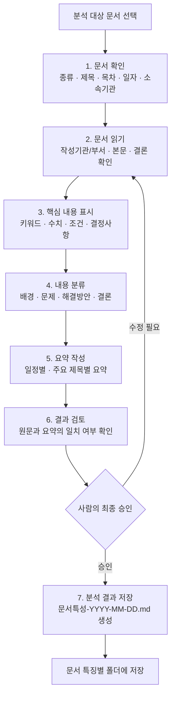
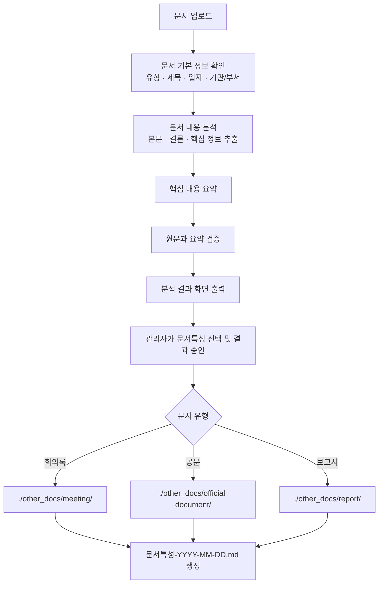

# 요구사항 정의서

## 1. 개요

### 1.1 프로젝트 정보

- **프로젝트명**: AI Agent를 활용한 회의록, 업무보고, 공문자료 등을 이용한 문서 분류 및 분석 시스템 구축
- **프로젝트 목적**: AI Agent가 문서를 분석하여 분류하고, 핵심 내용을 요약·검증하며, 검증된 문서를 회의록·공문·보고서 등으로 구분한 디렉터리에 `문서특성-YYYY-MM-DD.md` 형식으로 저장하여 활용할 수 있는 기반을 제공한다.
- **대상 사용자**: 회의록, 업무보고, 공문 등 다수의 업무 문서를 반복적으로 검토·정리하는 실무자

### 1.2 추진 배경 및 문제 정의

업무 과정에서 회의록, 보고서, 공문 등 다양한 문서를 하나의 폴더에 모아 관리하면 문서 수가 늘어날수록 원하는 파일을 찾기 어려워진다. 또한 파일명이 작성자별로 제각각이어서 문서의 작성 시점과 성격을 파일명만으로 파악하기 어렵고, 많은 문서를 직접 열어 검토하는 과정에서 시간이 오래 걸리거나 중요한 정보를 놓칠 수 있다.

본 프로젝트는 이러한 문제를 해결하기 위해 AI Agent와 LLM API를 활용한다. 시스템은 폴더 안의 문서를 확인하고 문서의 생성일 또는 수정일과 내용을 분석한 뒤, 사용자가 지정한 기준에 따라 문서를 1차 분류한다. 분류 결과를 바탕으로 문서의 특성을 드러내는 표준 이름을 생성하여 문서 탐색성과 검토 효율을 높인다.

### 1.3 MVP 목표

MVP에서는 문서 관리 폴더를 대상으로 다음의 최소 흐름이 동작하는 것을 목표로 한다.

1. 사용자가 지정한 폴더 안의 지원 문서 파일을 조회한다.
2. 각 문서의 생성일 또는 수정일을 확인한다.
3. 사용자가 지정한 1차 카테고리 목록을 기준으로 분류용 폴더를 준비한다.
4. LLM API로 문서 내용과 카테고리 기준을 비교하여 문서를 1차 분류한다.
5. 문서의 핵심 특성을 추출하여 표준 문서명과 요약·검증에 활용할 분석 결과를 생성한다.
6. 표준 문서명을 `문서특성-YYYY-MM-DD.md` 형식으로 제안하거나 결과물에 기록한다.

초기 MVP는 문서 분류와 표준 이름 생성에 집중하며, 사용자 인증, 데이터베이스 구축, 고급 사용자 화면, 원본 파일의 자동 이동·덮어쓰기는 범위에 포함하지 않는다. 원본 문서는 보존하고, 분석 및 분류 결과는 별도 결과 경로에 저장하는 것을 원칙으로 한다.

### 1.4 용어 및 명명 규칙

- **1차 카테고리**: 사용자가 사전에 지정하는 상위 분류 기준이다. 예: `회의록`, `보고서`, `공문`.
- **문서특성**: 사용자가 지정한 1차 카테고리 목록에서 관리자가 최종 선택하는 문서 유형 값이다. 예: `회의록`, `보고서`, `공문`.
- **기준일**: 문서에 작성일이 명확히 기재된 경우 해당 날짜를 우선 사용한다. 작성일을 확인할 수 없으면 파일 생성일을 사용하고, 생성일도 확인할 수 없거나 신뢰하기 어려운 경우 수정일을 사용한다.
- **표준 문서명**: `문서특성-YYYY-MM-DD.md` 형식을 사용한다. 날짜는 기준일을 `YYYY-MM-DD`로 표기하며, 문서특성에는 파일 시스템에서 사용할 수 없는 문자를 포함하지 않는다.

예시: `회의록-2026-07-25.md`

### 1.5 개요 단계의 확인 필요 사항

- 지원할 입력 문서 형식(PDF, DOC, DOCX, HWP, HWPX, PPT, PPTX, TXT 등)의 MVP 우선순위
- 생성일과 수정일 중 실제 분류 기준으로 사용할 날짜의 정책
- 사용자가 제공할 1차 카테고리 목록과 카테고리별 판단 기준
- LLM 분석 결과의 검증 기준 및 사용자 확인 방식

---

## 2. 사용자 및 사용 시나리오

### 2.1 주요 사용자

이 시스템의 주요 사용자는 회의록, 업무보고, 공문 등 다수의 업무 문서를 관리하고 검토하는 행정·기획·총무 담당자, 사업관리자, 프로젝트 매니저 및 팀장이다. 사용자는 문서가 한 폴더에 누적되어 필요한 정보를 찾거나, 문서의 핵심 내용과 결론을 빠르게 파악해야 하는 상황에서 시스템을 사용한다.

사용자는 업무 목적에 따라 `회의록`, `보고서`, `공문` 등의 1차 카테고리와 사업명, 담당 부서, 업무 분야 등의 추가 분류 기준을 사전에 정의한다. 시스템은 사용자가 정의한 기준을 우선 적용한다.

### 2.2 사람 중심 문서 분석·요약 업무 흐름

| 단계 | 사람이 수행하는 작업 | 목적 | 확인해야 할 정보 | 시스템 기능으로 전환 가능한 부분 | 사람이 최종 검토할 부분 |
|---|---|---|---|---|---|
| 1. 문서 확인 | 분석할 문서를 선택하고 기본 정보를 확인한다. | 문서의 성격과 분석 우선순위를 판단한다. | 문서 종류, 제목, 목차, 작성·수정 일자, 소속 기관·부서 | 폴더 내 파일 조회, 파일 형식 판별, 생성·수정일 추출, 제목·기관 정보 추출 | 분석 대상이 맞는지, 기관·부서 정보가 정확한지 |
| 2. 문서 읽기 | 작성 기관·부서, 작성 일자, 제목, 목차, 본문, 결론을 읽는다. | 문서 전체의 맥락과 작성 목적을 이해한다. | 작성 기관, 부서, 일자, 제목, 목차, 본문 내용, 결론 | PDF·DOCX·TXT 등 문서 텍스트 추출, 문단·목차 구조 분석 | 표·이미지·첨부자료의 의미와 문맥 |
| 3. 핵심 내용 표시 | 중요한 문장, 키워드, 수치, 조건, 결정 사항을 표시한다. | 요약과 검증의 근거를 확보한다. | 주요 일정, 담당자, 수치, 기한, 요청 사항, 승인·결정 사항 | LLM 기반 핵심 문장·키워드·수치·조건 추출 | 실제 업무상 중요한 정보인지 판단 |
| 4. 내용 분류 | 내용을 배경, 문제, 해결방안, 결론 등으로 정리한다. | 문서 구조를 통일하고 비교하기 쉽게 만든다. | 배경, 현황, 문제, 요청 사항, 해결방안, 결정 사항, 결론 | LLM 기반 문단 분류, 사용자 지정 카테고리 추천 | 분류 기준의 적합성, 복합 문서의 최종 분류 |
| 5. 요약 작성 | 일정별·주요 제목별로 핵심 내용을 짧고 명확하게 다시 작성한다. | 빠른 검토와 정보 공유를 지원한다. | 일자별 이슈, 제목별 핵심 내용, 결론, 후속 조치 | 일정·제목 중심 자동 요약 초안 생성 | 요약의 누락·왜곡 여부와 표현의 명확성 |
| 6. 결과 검토 | 원문과 요약·분류 결과를 비교한다. | 분석 결과의 신뢰성을 확보한다. | 원문 근거, 수치·일자·기관명, 결론, 결정 사항 | 원문 근거 문장 연결, 누락·불일치 경고 | 최종 승인, 정책·법률·대외 문서의 해석 |
| 7. 검토 완료 정보 저장 | 분석 완료 정보를 새 문서로 만들고 문서 특징별 폴더에 저장한다. | 재검색·재활용이 가능한 문서 관리 체계를 만든다. | 문서 특징, 기준 일자, 저장 위치, 파일명 중복 여부 | 결과 파일 생성, 폴더 분류, 중복 파일명 검사 | 문서특성명과 최종 저장 위치 승인 |



### 2.3 역할 분담 원칙

시스템은 문서 정보 추출, 핵심 내용 표시, 1차 분류, 요약 초안 생성, 파일명 생성과 결과 저장을 자동화한다. 업무상 중요도 판단, 모호한 표현의 해석, 요약의 정확성, 최종 승인과 저장 위치 결정은 사람이 담당한다.

## 3. 기능 요구사항

### 3.1 핵심 기능 요구사항

| 기능 | 입력 | 처리 | 출력 | 예외 처리 |
|---|---|---|---|---|
| 문서 업로드 | 사용자가 선택한 회의록·공문·보고서 파일 | 파일 형식, 파일명, 크기, 생성·수정일을 확인하고 분석 대상 목록에 등록 | 업로드 성공 여부, 문서 기본 정보 | 지원하지 않는 파일 형식, 빈 파일, 손상 파일, 읽기 권한 없음, 파일 크기 초과 시 오류 안내 |
| 문서 내용 분석 | 업로드 문서, 문서 종류, 제목·일자·소속 기관·부서 정보 | 문서의 목차·본문·결론을 추출하고, 핵심 문장·키워드·수치·조건·결정 사항을 분석 | 문서 기본 정보와 분석 항목 | 텍스트 추출 실패, 날짜·기관 정보 누락, 내용이 없는 문서는 분석 불가 또는 검토 필요 상태로 표시 |
| 핵심 내용 요약 | 분석된 문서 내용 | 배경, 문제, 해결방안, 결론을 기준으로 정리하고 일정별·주요 제목별 요약 초안을 생성 | 핵심 요약문, 주요 일정, 결정 사항, 후속 조치 | 요약 근거가 부족하거나 문서 내용이 모호할 경우 `사람의 검토 필요` 표시 |
| 문서 검증 결과 제공 | 원문, 분석 결과, 요약문 | 원문의 제목·일자·기관·수치·결정 사항과 요약문을 비교 | 일치 여부, 누락·불일치 항목, 검토 필요 항목 | 원문 정보가 부족하거나 비교할 수 없는 경우 검증 불가 사유 표시 |
| 분석 결과 화면 출력 | 문서 기본 정보, 분석 결과, 요약문, 검증 결과 | 사용자가 검토하기 쉬운 순서로 결과를 구성 | 문서 정보, 핵심 내용, 요약, 검증 결과, 저장 예정 정보 | 분석 중 오류가 발생한 영역은 오류 내용과 재시도 안내를 표시 |
| 분석 결과 파일 생성·저장 | 관리자 승인 결과, 문서특성, 기준 일자, 문서 종류 | 문서특성을 관리자가 선택하고, 표준 파일명을 생성하여 유형별 디렉터리에 저장 | `문서특성-YYYY-MM-DD.md` 분석 결과 파일 | 파일명 중복 시 관리자에게 확인 요청 또는 중복 방지 규칙 적용, 디렉터리 생성 실패·저장 권한 없음 오류 안내 |

### 3.2 문서 유형별 저장 요구사항

| 문서 유형 | 저장 디렉터리 | 생성 파일명 |
|---|---|---|
| 회의록 | `./other_docs/meeting/` | `문서특성-YYYY-MM-DD.md` |
| 공문 | `./other_docs/official document/` | `문서특성-YYYY-MM-DD.md` |
| 보고서 | `./other_docs/report/` | `문서특성-YYYY-MM-DD.md` |

### 3.3 관리자 역할 요구사항

- 관리자는 분석 결과를 확인한 뒤 문서특성을 선택해야 한다.
- 시스템은 관리자가 선택한 문서특성을 파일명 앞부분에 사용해야 한다.
- 관리자는 자동 분류 결과를 변경할 수 있어야 한다.
- 파일 저장은 관리자의 최종 검토 또는 승인 후 수행해야 한다.
- 원본 문서는 변경하거나 덮어쓰지 않아야 한다.

### 3.4 핵심 기능 흐름



### 3.5 구현 전 확인 필요 사항

- 지원 문서 형식과 파일 크기 제한
- 같은 파일명이 발생했을 때의 중복 처리 방식
- 관리자 승인 화면의 구성과 승인 권한

## 4. 입력·출력 및 데이터 규칙

### 4.1 입력 대상 문서 유형

| 구분 | 입력 파일 형식 | 용도 | 분석 대상 정보 |
|---|---|---|---|
| PDF 문서 | `.pdf` | 회의록, 공문, 보고서 등 배포용 문서 | 제목, 목차, 본문, 작성·수정일, 작성 기관·부서, 결론 |
| Word 문서 | `.doc`, `.docx` | 업무보고서, 회의록, 내부 문서 | 제목, 목차, 본문, 표, 작성자·기관 정보, 결론 |
| 텍스트 파일 | `.txt` | 간단한 회의 기록, 메모, 텍스트 기반 업무 자료 | 제목, 본문, 작성일, 핵심 문장, 키워드 |
| 한글 문서 | `.hwp`, `.hwpx` | 한글 기반 공문, 보고서, 회의록 | 제목, 목차, 본문, 작성·수정일, 소속 기관·부서, 결론 |
| PowerPoint 문서 | `.ppt`, `.pptx` | 발표 자료, 업무 보고 자료, 회의 자료 | 슬라이드 제목, 본문 텍스트, 표·도형 내 텍스트, 결론·요청 사항 |

### 4.2 공통 입력 데이터 항목

시스템은 지원 문서에서 가능한 범위 내에서 다음 정보를 입력 데이터로 사용해야 한다.

| 항목 | 설명 | 필수 여부 |
|---|---|---|
| 원본 파일 | 사용자가 업로드하거나 지정 폴더에서 선택한 문서 | 필수 |
| 파일명 | 원본 문서의 파일명 | 필수 |
| 파일 형식 | PDF, Word, TXT, HWPX, PowerPoint 구분 | 필수 |
| 생성일 또는 수정일 | 표준 파일명 생성과 문서 정렬에 사용할 기준일 | 필수 |
| 문서 제목 | 문서 내용 또는 제목 영역에서 추출한 제목 | 권장 |
| 문서 종류 | 사용자가 지정한 1차 카테고리 목록을 바탕으로 LLM이 추천하고, 관리자가 최종 선택하는 문서 유형 | 필수 |
| 작성 기관·부서 | 소속 부처, 기관, 부서 등 문서 작성 주체 | 권장 |
| 목차 | 문서의 주요 구성과 항목 | 선택 |
| 본문 | 핵심 내용 분석과 요약의 대상이 되는 텍스트 | 필수 |
| 결론·결정 사항 | 결론, 요청 사항, 승인 내용, 후속 조치 | 권장 |
| 사용자 지정 카테고리 | 1차 분류에 사용할 카테고리 목록 | 필수 |
| 관리자 최종 선택 문서특성 | 결과 파일명과 저장 폴더 결정에 사용할 문서 유형 값 | 결과 저장 전 필수 |

### 4.3 입력 처리 기준

- 시스템은 한 번에 문서 한 개만 입력받아야 한다.
- 시스템은 입력 파일의 형식을 식별하고, 지원 여부를 사용자에게 알려야 한다.
- 시스템은 파일 크기가 10MB 이하인 문서만 분석 대상으로 등록해야 한다.
- 시스템은 문서에서 추출한 텍스트가 100,000,000자 이하인 경우에만 분석을 진행해야 한다.
- 시스템은 원본 파일을 변경하거나 덮어쓰지 않아야 한다.
- 문서에 작성일이 명확히 기재된 경우 해당 날짜를 기준일로 사용하고, 작성일을 확인할 수 없으면 파일 생성일, 생성일도 확인할 수 없으면 수정일을 사용해야 한다.
- 제목, 작성 기관·부서, 목차 등 일부 정보가 없는 문서는 가능한 본문 분석을 수행하되, 누락 정보를 표시해야 한다.
- 텍스트로 추출할 수 없는 내용이 많아 분석 신뢰성이 낮은 문서는 관리자 검토 대상으로 표시해야 한다.

### 4.4 입력 오류 및 예외 처리

| 상황 | 시스템 처리 요구사항 |
|---|---|
| 지원하지 않는 파일 형식 | 지원 형식 목록과 함께 업로드 불가 사유를 표시한다. |
| 빈 파일 또는 본문이 없는 파일 | 분석 불가 상태로 표시하고 재확인을 요청한다. |
| 손상되었거나 읽을 수 없는 파일 | 파일 읽기 실패 사유를 표시하고 해당 파일을 분석 대상에서 제외한다. |
| 제목·일자·기관 정보 누락 | 본문 분석은 진행할 수 있으나, 누락 정보와 관리자 검토 필요 여부를 표시한다. |
| 동일한 파일명 | 원본 파일명, 저장 예정 파일명, 중복 여부를 표시하여 관리자가 확인할 수 있게 한다. |
| 비밀번호 또는 접근 제한 문서 | 분석할 수 없음을 알리고, 잠금 해제 또는 접근 권한 확인을 요청한다. |
| 파일 크기 10MB 초과 | 업로드 및 분석을 진행하지 않고, 실제 파일 크기와 최대 허용 크기 10MB를 표시한다. |
| 추출 텍스트 100,000,000자 초과 | AI 분석을 진행하지 않고, 텍스트 분할 또는 원본 문서 정리가 필요함을 안내한다. |

### 4.5 출력 결과 요구사항

시스템은 사용자가 문서의 내용을 빠르게 이해하고 최종 검토할 수 있도록, 분석 결과를 구조화된 화면 및 결과 문서로 제공해야 한다. 출력 정보는 원문에서 확인한 값, AI 분석 결과, 사용자 또는 관리자의 최종 확인 상태를 구분하여 표시해야 한다.

| 출력 항목 | 내용 | 표시 또는 생성 규칙 |
|---|---|---|
| 문서 제목 | 문서의 제목 또는 제목으로 판단된 정보 | 원문에서 추출한 제목을 표시하고, 제목을 찾지 못한 경우 `확인 필요`로 표시한다. |
| 문서 작성 일자 및 시행 일자 | 작성일, 시행일 등 문서에 기재된 날짜 정보 | 날짜의 종류를 구분하여 표시한다. 해당 날짜가 없거나 불명확하면 `확인 필요`로 표시한다. |
| 문서 작성 소속부서(기관) | 문서 작성 기관, 소속 부처, 소속 부서 | 원문 근거와 함께 표시하며, 누락되었거나 여러 기관이 확인되면 검토 대상으로 표시한다. |
| 문서 핵심 요약 | 배경, 주요 내용, 결론, 후속 조치의 요약 | 일정별 및 주요 제목별로 짧고 명확하게 제공한다. |
| 주요 키워드 | 문서의 핵심 주제, 업무명, 수치, 조건, 결정 사항 | 중요한 키워드를 목록으로 제공하고, 필요 시 원문 근거를 확인할 수 있게 한다. |
| 문서 검증 결과 | 원문과 분석·요약 결과의 일치 여부 | 제목, 일자, 기관·부서, 수치, 결정 사항별로 `일치`, `불일치`, `확인 필요` 상태를 표시한다. |
| 확인이 필요한 항목 목록 | 누락, 불명확, 불일치 또는 분석 신뢰도가 낮은 정보 | 항목명, 확인이 필요한 이유, 원문 위치 또는 근거를 목록으로 표시한다. |

### 4.6 분석 결과 문서 구조

분석 결과 문서는 다음 구조로 생성하여 사용자가 원문을 다시 열지 않고도 핵심 내용을 파악하고 최종 검토할 수 있어야 한다.

```markdown
# 문서 분석 결과

## 1. 문서 기본 정보
- 문서 제목:
- 문서 유형:
- 문서 작성 일자:
- 문서 시행 일자:
- 문서 작성 소속부서(기관):

## 2. 문서 핵심 요약
- 배경:
- 주요 내용:
- 결론 및 결정 사항:
- 후속 조치:

## 3. 주요 키워드
- 키워드:

## 4. 문서 검증 결과
| 검증 항목 | 결과 | 확인 내용 |
|---|---|---|
| 제목 | 일치 / 불일치 / 확인 필요 | |
| 작성 일자 및 시행 일자 | 일치 / 불일치 / 확인 필요 | |
| 소속부서(기관) | 일치 / 불일치 / 확인 필요 | |
| 핵심 수치 및 결정 사항 | 일치 / 불일치 / 확인 필요 | |

## 5. 확인이 필요한 항목
- 항목:
- 확인 필요 사유:
- 원문 근거 또는 위치:

## 6. 최종 검토 정보
- 검토 상태:
- 검토자:
- 검토 일자:
- 최종 의견:
```

### 4.7 결과 파일 생성 및 저장 규칙

- 시스템은 최종 검토가 완료된 분석 결과를 Markdown 파일로 생성해야 한다.
- 파일명은 `문서특성-YYYY-MM-DD.md` 형식을 사용해야 한다.
- `문서특성`에는 사용자가 지정한 1차 카테고리 목록에서 관리자가 최종 선택한 문서 유형 값인 `회의록`, `보고서`, `공문` 등을 사용해야 한다.
- 예를 들어 관리자가 문서 유형을 `회의록`으로 최종 선택하고 기준일이 2026년 7월 25일이면 결과 파일명은 `회의록-2026-07-25.md`로 생성한다.
- 시스템은 문서 유형별 저장 규칙에 따라 결과 파일을 저장해야 하며, 파일 저장 전 사용자 또는 관리자의 최종 검토 상태를 확인해야 한다.
- 문서 유형이 지정되지 않은 경우 시스템은 자동 저장하지 않고 확인이 필요한 항목으로 표시해야 한다.
- 생성하려는 결과 파일명과 같은 파일이 이미 존재하는 경우, 파일 확장자 앞에 `-1`, `-2`, `-3`처럼 1부터 증가하는 번호를 추가하여 저장해야 한다.
- 예를 들어 `회의록-2026-07-25.md`가 이미 존재하면 새 결과 파일은 `회의록-2026-07-25-1.md`로 저장한다.
## 5. 비기능 요구사항

### 5.1 개인정보 마스킹 요구사항

시스템은 분석 결과 화면과 `문서특성-YYYY-MM-DD.md` 결과 파일에 개인정보가 포함될 수 있는 경우, 다음 기준으로 마스킹하여 표시해야 한다.

| 개인정보 유형 | 마스킹 규칙 | 표시 예시 |
|---|---|---|
| 사람 이름 | 성은 유지하고, 성을 제외한 뒤 두 글자는 `00`으로 표시한다. | `홍길동` → `홍00` |
| 전화번호 | 전화번호의 뒤 네 자리는 `XXXX`로 표시한다. | `010-1234-5678` → `010-1234-XXXX` |
| 생년월일 | 생년월일의 앞 네 자리는 `0000`으로 표시한다. | `1990-01-01` → `0000-01-01` |

- 원본 문서는 마스킹을 위해 수정하거나 덮어쓰지 않아야 한다.
- 개인정보 마스킹은 분석 결과 화면, 요약문, 검증 결과, 결과 파일에 동일하게 적용해야 한다.

## 6. 예외 처리 및 검증 기준

시스템은 문서 분석 과정에서 예외가 발생하더라도 원본 파일을 변경하거나 삭제하지 않아야 한다. 예외 발생 시 사용자가 원인과 다음 조치를 이해할 수 있도록, 대상 파일·발생 단계·오류 사유·권장 조치를 구조화하여 표시해야 한다.

| 요구사항 ID | 예외 상황 | 감지 시점 | 시스템 처리 요구사항 | 사용자 확인·조치 |
|---|---|---|---|---|
| ER-01 | 지원하지 않는 파일 형식 업로드 | 문서 업로드 및 파일 형식 확인 | 시스템은 지원하지 않는 파일 형식의 분석을 시작하지 않아야 한다. 지원 형식 목록(PDF, DOC, DOCX, HWP, HWPX, PPT, PPTX, TXT)과 업로드 불가 사유를 표시해야 한다. | 사용자는 지원 형식으로 변환하거나 지원되는 파일을 다시 선택한다. |
| ER-02 | 문서 내용이 비어 있음 | 텍스트·본문 추출 후 | 시스템은 문서를 `분석 불가` 상태로 표시하고 요약·검증·결과 파일 생성을 수행하지 않아야 한다. 파일명, 파일 형식, 본문 확인 결과를 표시해야 한다. | 사용자는 원본 파일이 올바른지 확인하거나 내용이 포함된 파일을 다시 업로드한다. |
| ER-03 | AI 분석 중 오류 발생 | 문서 분석, 분류, 요약 또는 검증 처리 중 | 시스템은 처리 중인 문서를 `분석 실패` 또는 `재시도 필요` 상태로 표시해야 한다. 오류가 발생한 분석 단계와 재시도 가능 여부를 제공해야 하며, 이미 추출된 원문 정보는 보존해야 한다. | 사용자는 재시도하거나 원문 내용을 직접 확인한 뒤 관리자 검토 대상으로 지정한다. |
| ER-04 | 파일 크기 초과 | 문서 업로드 전 또는 업로드 중 | 시스템은 허용된 파일 크기 제한을 초과한 파일의 분석을 시작하지 않아야 한다. 실제 파일 크기와 허용 제한을 표시해야 한다. | 사용자는 파일을 분할·압축·정리하거나, 허용 기준에 맞는 파일을 다시 선택한다. |
| ER-05 | 확인된 문서정보 저장 오류 | 분석 결과 파일 생성 또는 저장 중 | 시스템은 저장 실패 사실, 저장 대상 경로, 실패 사유를 표시해야 한다. 원본 문서와 화면에 표시된 분석 결과는 유지해야 하며, 저장 완료 상태로 표시해서는 안 된다. | 사용자는 저장 경로와 파일명 중복 여부를 확인한 후 재저장하거나 관리자에게 조치를 요청한다. |

### 6.1 공통 예외 처리 원칙

- 시스템은 예외가 발생한 문서와 정상 처리된 문서를 구분하여 표시해야 한다.
- 오류 메시지에는 민감한 원문 내용, 인증 정보, API 키를 포함해서는 안 된다.
- 원본 파일은 어떤 예외 상황에서도 변경·삭제·덮어쓰기해서는 안 된다.
- 예외가 발생한 문서는 자동으로 최종 검토 완료 또는 저장 완료 상태가 되어서는 안 된다.
- 사용자가 재시도할 수 있는 오류에는 재시도 기능 또는 재시도 방법을 안내해야 한다.
- 저장 오류가 발생하면 `문서특성-YYYY-MM-DD.md` 파일의 실제 생성 여부를 명확히 표시해야 한다.
- 반복적으로 분석에 실패하거나 필수 정보가 누락된 문서는 관리자 검토 대상으로 표시해야 한다.

### 6.2 예외 처리 결과 상태

| 상태 | 의미 |
|---|---|
| 업로드 불가 | 지원하지 않는 형식 또는 파일 크기 초과로 분석을 시작할 수 없는 상태 |
| 분석 불가 | 문서가 비어 있거나 본문을 확인할 수 없어 분석할 수 없는 상태 |
| 분석 실패 | AI 분석, 분류, 요약, 검증 과정에서 오류가 발생한 상태 |
| 재시도 필요 | 일시적 오류 또는 사용자 조치 후 다시 분석할 수 있는 상태 |
| 저장 실패 | 분석 결과는 있으나 결과 파일을 지정 경로에 저장하지 못한 상태 |
| 관리자 검토 필요 | 자동 처리 결과만으로 최종 승인할 수 없어 사람이 확인해야 하는 상태 |

## 7. MVP 범위 및 우선순위

### 7.1 MVP 필수 기능

| 우선순위 | 기능 또는 기준 | MVP 완료 조건 |
|---|---|---|
| 필수 | 지원 문서 업로드 및 형식 확인 | PDF, DOC, DOCX, HWP, HWPX, PPT, PPTX, TXT 파일의 지원 여부를 확인하고 결과를 표시한다. |
| 필수 | 파일 크기 제한 | 10MB 이하 파일만 분석 대상으로 등록하고, 10MB 초과 파일은 분석을 시작하지 않는다. |
| 필수 | 텍스트 추출 제한 | 추출 텍스트가 100,000,000자 이하인 문서만 AI 분석 단계로 전달한다. |
| 필수 | 문서 분석·요약·검증 | 제목, 일자, 기관·부서, 핵심 내용, 키워드, 검증 결과 및 확인 필요 항목을 구조화하여 제공한다. |
| 필수 | 관리자 최종 선택 및 저장 | 관리자가 문서특성을 최종 선택한 뒤 결과를 `문서특성-YYYY-MM-DD.md` 파일로 생성한다. |
| 필수 | 중복 파일명 처리 | 같은 결과 파일명이 존재하면 확장자 앞에 1부터 증가하는 번호를 붙여 저장한다. |
| 필수 | 개인정보 마스킹 | 분석 결과 화면과 결과 파일에 이름, 전화번호, 생년월일 마스킹 규칙을 동일하게 적용한다. |

### 7.2 MVP 범위 제외 및 후순위 항목

- 여러 문서를 묶어 통합 분석하는 기능
- 사용자 인증과 역할별 권한 관리
- 분석 결과와 원본 문서의 장기 이력 관리
- 스캔 문서의 문자 인식(OCR) 기능
- 원본 문서의 자동 수정, 이동 또는 재저장 기능

### 7.3 MVP 승인 조건

- 필수 기능이 정상·예외 입력에서 요구사항대로 동작해야 한다.
- 원본 문서는 분석·저장 과정에서 변경되거나 덮어써서는 안 된다.
- 개인정보 마스킹, 파일 크기 제한, 텍스트 추출 제한, 중복 파일명 처리 결과를 사용자가 확인할 수 있어야 한다.
- 결과 파일은 관리자의 최종 검토 후 지정된 문서 유형별 디렉터리에 생성되어야 한다.

## 8. 테스트 및 승인 기준

### 8.1 테스트 기준

| 테스트 ID | 구분 | 테스트 입력 또는 조건 | 기대 결과 |
|---|---|---|---|
| TC-01 | 정상 | 지원 형식이며 파일 크기가 10MB 이하인 문서 | 문서가 분석 대상으로 등록되고, 문서 기본 정보와 분석 결과가 표시된다. |
| TC-02 | 경계값 | 파일 크기가 정확히 10MB인 지원 문서 | 문서가 분석 대상으로 등록된다. |
| TC-03 | 예외 | 파일 크기가 10MB를 초과하는 지원 문서 | 업로드 또는 분석이 제한되고, 최대 허용 크기 10MB와 오류 사유가 표시된다. |
| TC-04 | 경계값 | 추출 텍스트가 정확히 100,000,000자인 문서 | 문서가 AI 분석 단계로 전달된다. |
| TC-05 | 예외 | 추출 텍스트가 100,000,000자를 초과하는 문서 | AI 분석을 진행하지 않고, 텍스트 분할 또는 원본 문서 정리가 필요함을 안내한다. |
| TC-06 | 정상 | 같은 결과 파일명이 없는 승인 완료 문서 | `문서특성-YYYY-MM-DD.md` 형식의 결과 파일이 유형별 디렉터리에 생성된다. |
| TC-07 | 예외 | 동일한 결과 파일명이 이미 존재하는 승인 완료 문서 | 확장자 앞에 `-1`을 추가한 파일명으로 저장한다. |
| TC-08 | 예외 | 기본 파일명과 `-1` 파일명이 모두 존재하는 승인 완료 문서 | 확장자 앞에 `-2`를 추가한 파일명으로 저장한다. |
| TC-09 | 보안 | 이름, 전화번호, 생년월일이 포함된 문서 | 분석 결과 화면과 결과 파일에서 이름은 성 외 두 글자가 `00`, 전화번호 뒤 네 자리는 `XXXX`, 생년월일 앞 네 자리는 `0000`으로 표시된다. |
| TC-10 | 보안 | 개인정보가 포함된 문서의 분석 결과 저장 | 원본 문서는 변경되지 않고, 마스킹된 정보만 결과 화면과 결과 파일에 표시된다. |
| TC-11 | 승인 | 분석 결과에 확인 필요 항목이 존재하는 문서 | 관리자가 결과를 검토하고 문서특성을 최종 선택하기 전에는 결과 파일이 저장되지 않는다. |

### 8.2 최종 승인 기준

- 모든 필수 기능 테스트가 기대 결과와 일치해야 한다.
- 파일 크기와 텍스트 추출 제한의 경계값·초과값 테스트가 모두 통과해야 한다.
- 결과 파일명 중복 시 번호가 1부터 순차적으로 증가하는 것을 확인해야 한다.
- 개인정보 마스킹이 분석 결과 화면과 결과 파일에 모두 적용되고, 원본 문서가 변경되지 않았음을 확인해야 한다.
- 관리자의 최종 선택 및 검토가 완료된 결과만 지정된 디렉터리에 저장되어야 한다.


## MVP 지원 형식 변경 (2026-07-25)

MVP는 PDF, DOC, DOCX, HWP, HWPX, PPT, PPTX, TXT 형식의 단일 문서를 입력 대상으로 한다. 이 항목은 이전 문서에 기재된 DOC·HWP(v5)·PPT 후순위 제외 내용을 대체한다.
