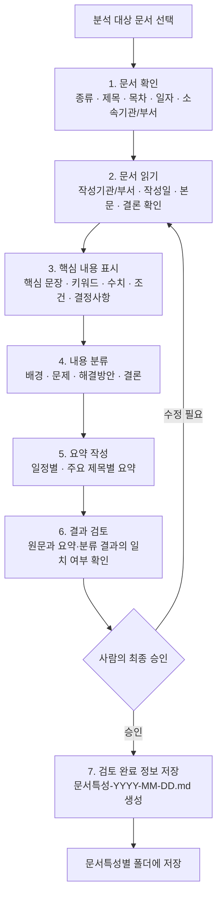

# 요구사항 정의서

## 1. 개요

### 1.1 프로젝트 정보

- **프로젝트명**: AI Agent를 활용한 회의록, 업무보고, 공문자료 등을 이용한 문서 분류 및 분석 시스템 구축
- **프로젝트 목적**: AI Agent가 문서를 분석하여 분류하고, 핵심 내용을 요약·검증한다. 검증된 문서는 회의록, 공문, 보고서, 공고문 등으로 구분하고, 구분된 디렉터리에 `문서특성-YYYY-MM-DD.md`를 저장하여 활용할 수 있는 기반을 제공한다.
- **대상 사용자**: 회의록, 업무보고, 공문, 공고문 등 다수의 업무 문서를 반복적으로 검토·정리하는 실무자
- **처리 대상**: 사용자가 지정한 폴더 안의 문서 파일

### 1.2 추진 배경 및 문제 정의

현재 여러 유형의 문서 파일이 하나의 폴더에 함께 보관되어 있다. 문서 수가 많아질수록 필요한 파일을 찾기 어렵고, 파일명이 작성자나 작성 방식에 따라 제각각이어서 파일명만으로 문서의 종류와 내용을 판단하기 어렵다. 이 때문에 문서를 하나씩 열어 핵심 내용을 확인하는 데 많은 시간이 들며, 중요한 일정·결정 사항·요청 사항을 놓칠 가능성도 있다.

본 프로젝트는 AI Agent와 LLM API를 활용하여 이러한 문서 검토·정리 과정을 지원한다. 시스템은 지정 폴더의 문서를 확인하고, 문서의 생성일 또는 수정일과 내용을 분석한다. 이후 사용자가 정한 1차 카테고리 기준으로 문서를 분류하고, 문서의 특징을 드러내는 표준 분석 결과 문서를 생성·저장한다. 이를 통해 문서 탐색성, 핵심 정보 파악 속도, 재활용 가능성을 높이는 것을 목표로 한다.

### 1.3 MVP 목표

MVP에서는 다음 최소 흐름이 동작하는 것을 목표로 한다.

1. 사용자가 지정한 폴더 안의 문서 파일 목록을 확인한다.
2. 각 문서의 생성일 또는 수정일을 확인한다.
3. 사용자가 지정한 1차 카테고리 목록에 따라 분류용 폴더를 생성한다.
4. LLM API를 사용하여 문서 내용을 분석하고, 카테고리 기준에 맞게 1차 분류한다.
5. 문서의 핵심 특성을 추출하고 요약·검증 결과를 생성한다.
6. 분석 결과를 문서특성과 기준일을 사용한 `문서특성-YYYY-MM-DD.md` 형식으로 해당 카테고리 디렉터리에 저장한다.

초기 MVP는 폴더 기반 문서 확인, 1차 분류, 분석 결과 생성·저장에 집중한다. 원본 문서를 자동으로 이동·수정·덮어쓰지 않으며, 분석 결과 Markdown 파일을 별도 생성하는 것을 원칙으로 한다. 사용자 인증, 데이터베이스, 고급 검색 화면, 복합 카테고리 분류 정책은 후속 단계에서 검토한다.

### 1.4 용어 및 명명 규칙

- **1차 카테고리**: 사용자가 사전에 지정하는 상위 문서 분류 기준이다. 예: `회의록`, `공문`, `보고서`, `공고문`. `예외`
- **문서특성**: 문서의 주된 성격을 나타내며, 분석 결과 파일명의 앞부분에 사용하는 값이다. 원칙적으로 최종 분류 카테고리를 사용한다.
- **기준일**: 결과 파일명에 사용할 날짜다. 문서 본문에서 작성일 또는 시행일을 확인할 수 있으면 이를 우선 사용한다. 문서 내 날짜를 확인할 수 없으면 파일 생성일을 사용하고, 생성일을 확인할 수 없거나 신뢰하기 어려우면 파일 수정일을 사용한다. 적용한 날짜의 종류와 출처는 분석 결과에 기록한다.
- **관리자**: 문서특성을 최종 선택하고 분석 결과 파일의 저장을 승인할 권한을 가진 사용자다. 이 문서에서 사용자에게 저장 승인 권한이 부여된 경우 해당 사용자를 관리자로 본다.
- **분석 결과 문서**: 원본 문서를 변경하지 않고, 분류·요약·검증 정보를 Markdown으로 기록한 결과물이다.
- **표준 파일명**: `문서특성-YYYY-MM-DD.md` 형식을 사용한다. 날짜는 기준일을 `YYYY-MM-DD`로 표기하며, 문서특성에는 파일 시스템에서 사용할 수 없는 문자를 포함하지 않는다.

예시: `회의록-2026-07-25.md`

### 1.5 운영 전 설정 항목

- **사용자 지정 1차 카테고리와 판단 기준**: MVP의 1차 카테고리는 `회의록`, `보고서`, `공문`, `공고문`으로 한정한다. 이 카테고리에 포함되지 않는 문서는 `기타(예외)` 상태로 표시하고 자동 저장하지 않는다. 카테고리별 포함·제외 기준과 우선 키워드는 사용자가 지정하며, 시스템은 지정된 기준이 없는 카테고리를 자동으로 최종 확정해서는 안 된다.
- **LLM 처리 기준**: 시스템은 사용하는 LLM의 입력 한도에서 운영자가 정한 안전 여유분을 제외한 값을 문서 분할 기준으로 사용해야 한다. LLM 입력 한도, 안전 여유분, 적용할 모델은 운영 환경의 설정값으로 관리하며, 코드에 고정해서는 안 된다.
- **파일 크기 및 추출 텍스트 제한**: 시스템은 파일 크기가 10MB 이하이고, 추출한 텍스트가 100,000,000자 이하인 문서만 분석 대상으로 등록·분석해야 한다. 제한을 초과하면 실제 값과 허용 기준을 사용자에게 표시해야 한다.
- **최종 검토 및 재분류**: 사용자는 LLM이 추천한 문서특성을 승인하거나 변경할 수 있으며, 관리자는 최종 저장을 승인한다.

| 문서특성 | 포함 기준과 우선 키워드 예시 | 제외 기준 |
|---|---|---|
| 회의록 | 회의 일시·장소·참석자·안건·논의 내용·결정 사항·회의록 | 외부 기관에 발송하는 공식 시행 문서, 모집·안내 중심의 공고문 |
| 보고서 | 업무 현황·추진 실적·결과·성과·분석·계획·보고 | 회의 진행 기록, 수신·발신 정보가 중심인 공식 문서 |
| 공문 | 시행·수신·참조·발신·붙임·협조·공문 | 내부 검토용 업무보고, 모집·접수 안내가 중심인 공고문 |
| 공고문 | 공고·모집·안내·접수·기간·자격·제출 서류 | 회의의 논의·결정 기록, 특정 수신 기관에 대한 시행 문서 |
| 기타(예외) | 위 네 카테고리의 포함 기준과 우선 키워드에 명확히 해당하지 않는 문서 | 자동 분류 확정 및 자동 저장 대상에서 제외 |

---

## 2. 사용자 및 사용 시나리오

### 2.1 주요 사용자

이 시스템의 주요 사용자는 회의록, 업무보고, 공문, 공고문 등 다수의 업무 문서를 수집·검토·정리하는 행정·기획·총무 담당자, 사업관리자, 프로젝트 매니저 및 팀장이다. 사용자는 문서가 한 폴더에 누적되어 필요한 문서를 찾기 어렵거나, 여러 문서의 핵심 내용과 결정 사항을 짧은 시간 안에 파악해야 할 때 이 서비스를 사용한다.

사용자는 업무 목적과 조직의 문서 관리 방식에 따라 1차 카테고리를 사전에 정의한다. 예를 들어 `회의록`, `공문`, `보고서`, `공고문`을 기본 카테고리로 사용하고, 필요하면 사업명·담당 부서·업무 분야별 카테고리를 추가한다. 각 카테고리에는 대표 문서의 특징, 포함·제외 기준, 우선 적용할 키워드 등의 분류 기준을 함께 정의한다. 시스템은 이 사용자 정의 기준을 LLM 분류의 우선 입력값으로 사용한다.

### 2.2 사용자 상황과 어려움

사용자는 다음과 같은 상황에서 문서를 검토하고 정리한다.

| 사용자 상황 | 현재 어려움 | 시스템이 제공해야 할 해결 방식 |
|---|---|---|
| 여러 유형의 문서가 한 폴더에 누적된 경우 | 파일명이 제각각이어서 문서 종류와 내용을 파일명만으로 판단하기 어렵다. | 폴더 안의 문서를 조회하고, 파일의 기본 정보와 분석 결과를 함께 제공한다. |
| 특정 회의나 업무의 관련 문서를 빠르게 찾아야 하는 경우 | 원하는 문서를 찾기 위해 파일을 여러 개 열어보아야 한다. | 문서 유형별로 분류하고, 핵심 요약과 키워드를 포함한 결과 문서를 저장한다. |
| 문서 수가 많아 일괄 검토가 필요한 경우 | 문서별 작성일·수정일·핵심 내용·결정 사항을 직접 확인하는 데 시간이 오래 걸린다. | 문서의 날짜 정보를 확인하고, 핵심 내용·결론·요청 사항을 요약한다. |
| 유사하거나 복합적인 문서를 분류하는 경우 | 문서의 성격이 모호하거나 여러 종류의 내용이 섞여 있어 분류 기준을 일관되게 적용하기 어렵다. | 사용자 정의 카테고리와 판단 기준을 바탕으로 LLM이 1차 분류를 제안하고, 불확실한 결과는 검토 필요로 표시한다. |
| 요약 결과를 업무에 활용하기 전 확인하는 경우 | AI 요약이 원문의 중요한 수치·일정·결정 사항을 누락하거나 다르게 해석할 수 있다. | 요약·검증 결과와 원문 근거를 구분하여 제공하고, 최종 확인은 사용자가 수행할 수 있게 한다. |

### 2.3 사용자 중심 사용 시나리오

1. 사용자는 분석할 문서가 있는 대상 폴더와 사용할 1차 카테고리 목록을 지정한다.
2. 사용자는 각 카테고리의 설명과 분류 기준을 입력하거나 기존 기준을 선택한다.
3. 시스템은 폴더 안의 문서를 확인하고, 문서별 생성일 또는 수정일과 분석 가능한 내용을 추출한다.
4. 시스템은 사용자 정의 기준과 LLM 분석을 함께 사용하여 문서별 1차 카테고리를 제안한다.
5. 시스템은 문서의 핵심 내용, 요약, 검증 결과 및 확인이 필요한 항목을 제공한다.
6. 사용자는 분류 결과와 검증 내용을 검토하고, 필요한 경우 카테고리를 수정하거나 재분류한다.
7. 검토가 끝난 문서는 해당 카테고리 디렉터리에 `문서특성-YYYY-MM-DD.md` 형식의 분석 결과 문서로 저장한다.

### 2.4 사용자와 시스템의 역할

- **사용자**: 분류 기준을 정의하고, AI가 제안한 분류·요약·검증 결과를 검토하며, 모호하거나 중요한 문서의 최종 분류를 결정한다.
- **시스템**: 문서 목록과 날짜 정보를 확인하고, 문서 내용을 분석하여 1차 분류·요약·검증 결과를 생성하며, 승인된 결과를 표준 이름의 Markdown 문서로 저장한다.
- **원칙**: 시스템의 자동 분류 결과는 사용자 정의 기준을 우선 반영하는 제안값이며, 원본 문서를 자동으로 변경하지 않는다.

### 2.5 사람 중심 문서 분석·요약 업무 흐름

AI Agent 기반 문서 분석 시스템을 구현하기 전에, 사람이 직접 수행하는 문서 분석·요약 업무 흐름을 다음과 같이 정의한다. 시스템은 사람이 수행하던 반복 작업을 지원하되, 업무적 판단과 최종 승인을 대체하지 않는다.

| 단계 | 사람이 수행하는 작업 | 목적 | 확인해야 할 정보 | 시스템 기능으로 전환할 수 있는 부분 | 사람이 최종 검토해야 하는 부분 |
|---|---|---|---|---|---|
| 1. 문서 확인 | 분석할 문서를 선택하고 기본 정보를 확인한다. | 분석 대상과 우선순위를 판단한다. | 문서 종류, 제목, 목차, 작성·수정 일자, 소속기관·소속부서 | 폴더 내 문서 조회, 파일 형식 판별, 생성·수정일 추출, 제목·기관 정보 추출 | 분석 대상 문서가 맞는지, 추출된 기관·부서 정보가 정확한지 |
| 2. 문서 읽기 | 문서의 주요 항목과 본문을 읽는다. | 문서의 작성 목적과 전체 맥락을 이해한다. | 작성 기관·부서, 작성 일자, 제목, 목차, 본문, 결론 | PDF·DOCX·TXT 등 문서에서 텍스트 추출, 문단·목차 구조 분석 | 표·이미지·첨부자료의 의미, 문맥과 업무적 중요도 |
| 3. 핵심 내용 표시 | 중요한 문장과 정보를 표시한다. | 요약과 검증의 근거를 확보한다. | 핵심 문장, 키워드, 수치, 조건, 일정, 담당자, 결정 사항 | LLM 기반 핵심 문장·키워드·수치·조건 추출 | 실제 업무에 중요한 정보인지, 누락된 핵심 내용이 없는지 |
| 4. 내용 분류 | 문서 내용을 구조적으로 정리한다. | 문서 내용을 일관된 기준으로 비교·활용한다. | 배경, 현황, 문제, 요청 사항, 해결방안, 결정 사항, 결론 | LLM 기반 문단 분류, 사용자 지정 카테고리 추천 | 복합 문서의 최종 카테고리와 분류 기준 적합성 |
| 5. 요약 작성 | 핵심 내용을 일정별·주요 제목별로 짧고 명확하게 작성한다. | 빠른 검토와 정보 공유를 지원한다. | 주요 일정, 제목별 핵심 내용, 결론, 후속 조치 | 일정·제목 중심 요약 초안 생성 | 요약의 누락·왜곡 여부와 표현의 명확성 |
| 6. 결과 검토 | 원문과 분류·요약 결과를 비교한다. | 분석 결과의 신뢰성을 확보한다. | 제목, 일자, 기관·부서, 수치, 조건, 결정 사항, 결론 | 원문 근거 문장 연결, 누락·불일치 항목 경고 | 최종 승인, 정책·법률·대외 문서의 해석 |
| 7. 검토 완료 정보 저장 | 검토가 완료된 분석 정보를 새 문서로 생성하고 저장한다. | 재검색·재활용 가능한 문서 관리 체계를 만든다. | 문서특성, 기준일, 저장 위치, 파일명 중복 여부 | 표준 파일명 생성, 유형별 폴더 생성·저장, 중복 파일명 확인 | 문서특성·최종 저장 위치 승인, 저장 전 최종 내용 확인 |



## 3. 기능 요구사항

### 3.1 핵심 기능 요구사항

| 기능 | 입력 | 처리 | 출력 | 예외 처리 |
|---|---|---|---|---|
| 문서 업로드 기능 | 사용자가 지정한 폴더 또는 업로드한 문서 파일 | 파일명, 확장자, 파일 크기, 생성일 또는 수정일을 확인하고 분석 대상 목록에 등록한다. | 분석 대상 문서 목록, 파일 기본 정보, 등록 결과 | 지원하지 않는 형식, 빈 파일, 손상 파일, 읽기 권한 없음, 파일 크기 초과 시 분석을 시작하지 않고 원인과 조치 방법을 안내한다. |
| 문서 내용 분석 기능 | 분석 대상 문서, 파일 기본 정보, 사용자 지정 1차 카테고리 목록 | 문서에서 제목, 목차, 작성 일자, 소속기관·소속부서, 본문, 결론을 추출한다. LLM API를 사용해 문서의 주제·목적·핵심 문장·키워드·수치·조건·결정 사항을 분석하고 1차 카테고리를 제안한다. | 문서 기본 정보, 분석 결과, 추천 카테고리, 분석 근거 | 텍스트 추출 실패, 날짜·기관 정보 누락, 내용이 없는 문서는 분석 불가 또는 관리자 검토 필요 상태로 표시한다. LLM API 오류 시 실패 단계와 재시도 가능 여부를 안내한다. |
| 핵심 내용 요약 기능 | 문서 본문과 문서 내용 분석 결과 | 배경, 현황 또는 문제, 주요 내용, 해결방안, 결론, 후속 조치 기준으로 내용을 정리한다. 일정별·주요 제목별 요약 초안을 생성한다. | 핵심 요약, 주요 일정, 주요 키워드, 결정 사항, 후속 조치 | 요약 근거가 부족하거나 문서 내용이 모호한 경우 요약 결과를 확정하지 않고 `관리자 검토 필요` 상태와 사유를 표시한다. |
| 문서 검증 결과 제공 기능 | 원문에서 추출한 정보, 분석 결과, 핵심 요약 | 원문의 제목, 일자, 소속기관·소속부서, 수치, 조건, 결정 사항과 분석·요약 결과를 비교한다. | 항목별 `일치`, `불일치`, `확인 필요` 또는 `검증 불가` 상태와 원문 근거 | 원문 정보가 누락되었거나 비교할 수 없는 경우 검증 불가 사유를 표시한다. 불일치 항목은 자동 확정하지 않고 관리자 확인 대상으로 표시한다. |
| 분석 결과 화면 출력 기능 | 문서 기본 정보, 분류 결과, 요약, 검증 결과, 관리자 확인 상태 | 사용자가 검토하기 쉬운 순서로 결과를 구성하고, 원문에서 확인한 정보와 AI 분석 결과를 구분해 표시한다. | 문서 정보, 추천 문서특성, 핵심 요약, 검증 결과, 확인 필요 항목, 저장 예정 정보 | 처리 중 오류가 발생한 영역은 정상 결과처럼 표시하지 않고, 오류 내용·발생 단계·재시도 방법을 표시한다. 민감정보와 API 키는 화면에 표시하지 않는다. |
| 분석 결과 Markdown 파일 생성 기능 | 관리자가 최종 선택한 문서특성, 기준일, 분석 결과 화면 정보 | 문서특성과 기준일로 표준 파일명을 만들고, 분석 결과 화면 정보를 Markdown 형식으로 구성한다. | `문서특성-YYYY-MM-DD.md` 분석 결과 파일 | 문서특성 또는 기준일이 확정되지 않으면 파일을 생성하지 않고 관리자 확인을 요청한다. 같은 파일명이 이미 있거나 저장 권한이 없으면 저장 실패 사유를 표시하고 원본 문서를 변경하지 않는다. |
| 문서특성별 디렉터리 저장 기능 | 관리자가 선택한 문서특성, 생성할 Markdown 파일 | 선택한 문서특성에 맞는 디렉터리가 없으면 생성하고, 결과 Markdown 파일을 해당 디렉터리에 저장한다. | 유형별 디렉터리에 저장된 분석 결과 파일과 최종 저장 경로 | 알 수 없는 문서특성, 디렉터리 생성 실패, 저장 권한 없음, 파일명 중복 시 자동 저장 완료로 표시하지 않고 관리자에게 사유를 안내한다. |

### 3.2 문서특성 선택 및 저장 요구사항

- 시스템은 LLM 분석 결과를 바탕으로 문서특성을 추천할 수 있으나, 분석 결과의 문서특성은 관리자가 최종 선택한다.
- 관리자는 추천된 문서특성을 승인하거나 다른 문서특성으로 변경할 수 있어야 한다.
- 관리자가 문서특성을 선택하기 전에는 분석 결과 Markdown 파일을 최종 생성·저장해서는 안 된다.
- `기타(예외)` 문서는 자동 저장하지 않는다. 관리자가 예외 문서로 최종 확인해 저장을 승인한 경우에만 `./other_docs/others/`에 저장한다.
- 시스템은 원본 문서를 이동, 수정, 삭제하거나 덮어써서는 안 된다.
- 결과 파일명은 관리자가 선택한 문서특성과 확정된 기준일을 사용하여 `문서특성-YYYY-MM-DD.md` 형식으로 생성한다.

### 3.3 문서특성별 파일 생성 디렉터리 구조

| 관리자가 선택한 문서특성 | 분석 결과 파일 생성 디렉터리 | 파일명 형식 |
|---|---|---|
| 회의록 | `./other_docs/meeting/` | `회의록-YYYY-MM-DD.md` |
| 공문 | `./other_docs/official document/` | `공문-YYYY-MM-DD.md` |
| 보고서 | `./other_docs/report/` | `보고서-YYYY-MM-DD.md` |
| 공고문 | `./other_docs/public notice/` | `공고문-YYYY-MM-DD.md` |
| 기타(예외) | `./other_docs/others/` | `예외-YYYY-MM-DD.md` |

### 3.4 기능 분해 기준

각 기능은 아래 기준에 따라 후속 구현 작업으로 분해한다.

1. **입력 검증**: 파일 형식, 파일 크기, 읽기 권한, 문서 내용 유무, 사용자 지정 카테고리 목록을 확인한다.
2. **처리**: 문서 텍스트와 메타데이터 추출, LLM 기반 분석·분류·요약, 원문 대비 검증, 관리자 선택을 순서대로 수행한다.
3. **출력**: 화면용 분석 결과와 유형별 디렉터리에 저장할 Markdown 결과 파일을 구분한다.
4. **예외 처리**: 오류가 발생한 파일·처리 단계·사유·재시도 가능 여부를 표시하며, 원본 문서는 보존한다.
5. **최종 승인**: 문서특성과 저장 경로는 관리자가 최종 확인한 뒤 적용한다.

## 4. 입력·출력 및 데이터 규칙

### 4.1 입력 대상 문서 유형

시스템은 사용자가 지정한 폴더 또는 업로드 경로에서 아래 문서 유형을 입력으로 받는다. 모든 입력 문서는 원본을 변경하지 않고, 분석에 필요한 정보만 추출하여 사용한다.

| 구분 | 입력 파일 형식 | 주요 사용 문서 | 분석 대상 정보 | 입력 시 확인 사항 |
|---|---|---|---|---|
| PDF 문서 | `.pdf` | 회의록, 공문, 보고서, 공고문 등 배포용 문서 | 제목, 목차, 본문, 작성·시행 일자, 작성 기관·부서, 결론, 표 안의 텍스트 | 파일이 열리는지, 텍스트 추출 가능 여부, 암호화 또는 손상 여부, 페이지 수 |
| 이미지 기반 PDF 문서 | `.pdf` | 스캔된 회의록, 공문, 보고서, 공고문 | 페이지별 인식 텍스트, 제목, 작성·시행 일자, 기관·부서, 본문, 결론 | 텍스트 추출 가능 여부를 먼저 확인하고, 추출 가능한 텍스트가 없거나 부족할 때만 OCR을 적용한다. 페이지 수, 회전·기울어짐, 빈 페이지, 암호화 또는 손상 여부를 확인한다. |
| Word 문서 | `.doc`, `.docx` | 업무보고서, 회의록, 내부 문서 | 제목, 목차, 본문, 표 안의 텍스트, 작성자·기관 정보, 작성·수정 일자, 결론 | 파일 형식, 본문 존재 여부, 읽기 가능 여부, 문서 속성의 날짜 정보 |
| 텍스트 파일 | `.txt` | 간단한 회의 기록, 메모, 텍스트 기반 업무 자료 | 제목으로 판단되는 첫 문장 또는 표제, 본문, 작성 일자, 핵심 문장, 키워드 | 문자 인코딩, 빈 파일 여부, 본문 길이, 날짜 정보 존재 여부 |
| 한글 문서 | `.hwp`, `.hwpx` | 한글 기반 공문, 보고서, 회의록 | 제목, 목차, 본문, 표 안의 텍스트, 작성·시행 일자, 작성 기관·부서, 결론 | HWPX는 파일 구조의 정상 여부와 본문 추출 가능 여부를 확인한다. HWP(v5)는 직접 분석하지 않고 HWPX로 변환 가능한지와 변환 결과를 확인한다. |
| PowerPoint 문서 | `.ppt`, `.pptx` | 발표 자료, 업무보고 자료, 회의 자료 | 슬라이드 제목, 본문 텍스트, 표·도형 안의 텍스트, 주요 일정, 결론·요청 사항 | 파일 형식, 슬라이드 수, 텍스트가 포함된 슬라이드 여부, 읽기 가능 여부 |
| 이미지 문서 | `.jpg`, `.jpeg`, `.png`, `.tif`, `.tiff` | 촬영 또는 스캔된 회의록, 공문, 보고서, 공고문 | OCR 인식 텍스트, 제목, 일자, 기관·부서, 핵심 문장, 수치, 조건, 결정 사항 | 이미지가 열리는지, 해상도, 회전·기울어짐, 빈 이미지, 인식 가능한 텍스트 여부를 확인한다. |

### 4.2 공통 입력 데이터 항목

시스템은 문서 유형과 관계없이 가능한 범위에서 다음 입력 데이터를 수집하여 문서 분석·분류·요약·검증에 사용한다.

| 입력 데이터 | 설명 | 필수 여부 | 활용 목적 |
|---|---|---|---|
| 원본 파일 | 사용자가 선택한 분석 대상 문서 | 필수 | 문서 내용 및 메타데이터 추출의 원본 |
| 파일명 | 원본 문서의 이름과 확장자 | 필수 | 문서 식별, 처리 결과 연결 |
| 파일 형식 | PDF, 이미지 기반 PDF, Word, TXT, HWP, HWPX, PowerPoint, JPG, JPEG, PNG, TIF, TIFF 구분 | 필수 | 지원 여부 확인 및 문서 유형별 처리 기준 적용 |
| 파일 경로 | 사용자가 지정한 폴더 안의 원본 파일 위치 | 폴더 분석 시 필수 | 문서 조회 및 원본 추적 |
| 생성일 또는 수정일 | 파일 시스템에서 확인한 날짜 정보 | 필수 | 문서 정렬 및 결과 파일명 기준일 후보 |
| 문서 제목 | 제목 영역, 표제 또는 문서 내용에서 추출한 제목 | 권장 | 문서 성격 판단, 요약 및 검증 |
| 문서 작성·시행 일자 | 문서 본문에 명시된 작성일·시행일 등 | 권장 | 결과 파일명 기준일 판단, 문서 검증 |
| 작성 소속기관·소속부서 | 문서를 작성하거나 발행한 기관·부서 | 권장 | 문서 분류, 문서 맥락 파악, 검증 |
| 목차 또는 문서 구조 | 목차, 장·절 제목, 슬라이드 구성 등 | 선택 | 본문 구조 분석과 제목별 요약 |
| 본문 텍스트 | 문서에서 추출한 분석 대상 내용 | 필수 | 문서 분석, 핵심 내용 추출, 요약, 검증 |
| 결론·결정 사항 | 결론, 요청 사항, 승인 내용, 후속 조치 | 권장 | 핵심 내용 요약과 검증 |
| 사용자 지정 1차 카테고리 | 회의록, 공문, 보고서, 공고문 등 사용자가 정의한 분류 목록과 기준 | 필수 | LLM의 1차 분류 기준 |

### 4.3 입력 데이터 처리 원칙

- 시스템은 입력 문서의 파일 형식과 읽기 가능 여부를 먼저 확인한 뒤 분석을 시작해야 한다.
- 텍스트 기반 PDF는 기존 텍스트 추출을 우선 사용하고, 추출 가능한 텍스트가 없거나 부족한 이미지 기반 PDF에만 OCR을 적용해야 한다.
- 이미지 기반 PDF와 이미지 문서는 페이지 또는 이미지 단위로 OCR 텍스트와 원본 순서를 유지해야 한다. 빈 결과, 낮은 인식 신뢰도, 회전·기울어짐, 읽을 수 없는 페이지 또는 이미지는 누락시키지 않고 경고로 표시해야 한다.
- OCR로 인식한 텍스트는 원본 파일과 페이지 또는 이미지 위치를 연결해 관리해야 하며, AI가 생성한 요약·검증 결과를 OCR 원문 자체로 표시해서는 안 된다.
- 문서 본문에 작성일 또는 시행일이 명확히 있는 경우 이를 기준일 후보로 사용하고, 없으면 파일 생성일 또는 수정일을 기준일 후보로 사용해야 한다. 최종 적용 기준일은 관리자가 확인할 수 있어야 한다.
- 제목, 작성 기관·부서, 목차 등 일부 정보가 없더라도 본문 텍스트가 있으면 분석을 진행할 수 있다. 다만 누락 정보와 그 영향은 결과에 표시해야 한다.
- 본문 텍스트를 충분히 추출할 수 없거나 문서 내용이 없는 경우에는 분석 결과를 확정하지 않고 `관리자 검토 필요` 또는 `분석 불가` 상태로 표시해야 한다.
- 시스템은 파일 크기가 10MB 이하이고 추출 텍스트가 100,000,000자 이하인 문서만 AI 분석 단계로 전달해야 한다.
- 사용자 지정 1차 카테고리는 `회의록`, `보고서`, `공문`, `공고문`으로 한정한다. 이외 문서는 `기타(예외)`로 표시하고 자동 저장해서는 안 된다.
- 입력 문서, 추출 텍스트, 문서 메타데이터에 개인정보 또는 기밀정보가 포함될 수 있으므로, 민감한 원문 내용을 불필요하게 로그나 결과 파일에 기록해서는 안 된다.

### 4.4 입력 오류 및 예외 처리 요구사항

이 절은 입력 단계에서 즉시 확인하는 예외를 요약한다. 오류 상태, 사용자 조치, 긴 문서 처리 기준을 포함한 상세 예외 요구사항은 [6. 예외 처리 및 검증 기준](#6-예외-처리-및-검증-기준)을 따른다.

| 상황 | 시스템 처리 요구사항 |
|---|---|
| 지원하지 않는 파일 형식 | 분석을 시작하지 않고 지원하는 파일 형식과 제외 사유를 표시한다. |
| 빈 파일 또는 본문이 없는 파일 | `분석 불가` 상태로 표시하고, 요약·검증·결과 파일 생성을 수행하지 않는다. |
| 손상되었거나 읽을 수 없는 파일 | 읽기 실패 단계와 안전한 오류 사유를 표시하고 해당 파일을 분석 대상에서 제외한다. |
| 암호화 또는 접근 제한 문서 | 분석할 수 없음을 알리고, 잠금 해제 또는 접근 권한 확인을 요청한다. |
| HWP(v5) 문서 | HWPX로 변환한 뒤 분석할 수 있음을 안내한다. 변환에 실패하면 원본은 변경하지 않고 분석 불가 사유를 표시한다. |
| 파일 크기 10MB 초과 | 분석을 시작하지 않고, 실제 파일 크기와 최대 허용 크기 10MB를 표시한다. |
| 추출 텍스트 100,000,000자 초과 | AI 분석을 시작하지 않고, 추출 텍스트가 100,000,000자 이하가 되도록 원본 문서를 분할·정리한 뒤 다시 분석해야 함을 안내한다. |
| 제목·일자·소속기관 정보 누락 | 가능한 본문 분석은 진행하되, 누락된 항목과 관리자 확인 필요 여부를 표시한다. |
| 텍스트 추출이 부족한 문서 | 자동 분류·요약을 확정하지 않고 추출 상태와 검토 필요 사유를 표시한다. |

### 4.5 분석 결과 출력 항목

시스템은 사용자가 문서 내용을 빠르게 이해하고 최종 검토할 수 있도록, 분석 결과를 구조화된 FrontEnd 화면 정보와 Markdown 결과 문서로 제공해야 한다. 원문에서 확인한 정보, AI가 분석한 정보, 사용자 또는 관리자가 최종 확인한 정보는 구분하여 표시한다.

| 출력 항목 | 내용 | 표시 및 검토 규칙 |
|---|---|---|
| 문서 제목 | 문서의 제목 또는 제목으로 판단된 정보 | 원문에서 추출한 제목을 표시한다. 제목을 찾지 못했거나 여러 후보가 있으면 `확인 필요` 상태와 원문 위치를 함께 표시한다. |
| 문서 작성 일자 및 시행 일자 | 작성일, 시행일, 회의일 등 문서에 기재된 날짜 정보 | 날짜의 종류와 출처를 구분하여 표시한다. 날짜가 없거나 불명확하면 파일 생성일 또는 수정일을 기준일 후보로 표시하고 사용자 확인을 요청한다. |
| 문서 작성 소속부서(기관) | 문서 작성 또는 발행 기관, 소속부처, 소속부서 | 원문에서 확인한 기관·부서와 근거를 표시한다. 누락되었거나 여러 기관이 확인되면 검토 대상으로 표시한다. |
| 문서 핵심 요약 | 문서의 배경, 주요 내용, 결론 및 결정 사항, 후속 조치 | 일정별·주요 제목별로 짧고 명확하게 구조화하여 표시한다. AI가 생성한 요약임을 원문 정보와 구분해 표시한다. |
| 주요 키워드 | 문서의 핵심 주제, 업무명, 일정, 수치, 조건, 결정 사항 | 키워드 목록과 가능한 원문 근거를 제공한다. 중요도 또는 추출 근거가 불명확한 키워드는 검토 대상으로 표시한다. |
| 문서 검증 결과 | 원문과 분석·요약 결과의 비교 결과 | 제목, 일자, 기관·부서, 수치, 조건, 결정 사항별로 `일치`, `불일치`, `확인 필요`, `검증 불가` 상태를 표시한다. |
| 확인이 필요한 항목 목록 | 누락, 불명확, 불일치 또는 분석 신뢰도가 낮은 정보 | 항목명, 확인 필요 사유, 원문 근거 또는 위치, 권장 조치를 목록으로 제공한다. |
| 문서 저장 예정 정보 | 사용자 또는 관리자가 선택한 문서특성, 기준일, 저장 경로, 파일명 | 저장 전 문서특성·파일명·저장 디렉터리를 표시하고 최종 확인을 받는다. |

### 4.6 분석 결과 화면 및 문서 구조

FrontEnd의 분석 결과 화면은 아래 순서로 정보를 제공해야 한다. 이 순서는 생성되는 Markdown 결과 문서에도 동일하게 적용한다.

```markdown
# 문서 분석 결과

## 1. 문서 기본 정보
- 문서 제목:
- 문서 유형(추천):
- 문서특성(사용자 또는 관리자 최종 선택):
- 문서 작성 일자:
- 문서 시행 일자:
- 기준일 및 출처:
- 문서 작성 소속부서(기관):
- 원본 파일명:

## 2. 문서 핵심 요약
- 배경:
- 주요 내용:
- 결론 및 결정 사항:
- 후속 조치:

## 3. 주요 키워드
- 키워드:

## 4. 문서 검증 결과
| 검증 항목 | 결과 | 원문 근거 또는 확인 내용 |
|---|---|---|
| 제목 | 일치 / 불일치 / 확인 필요 / 검증 불가 | |
| 작성 일자 및 시행 일자 | 일치 / 불일치 / 확인 필요 / 검증 불가 | |
| 소속부서(기관) | 일치 / 불일치 / 확인 필요 / 검증 불가 | |
| 핵심 수치 및 결정 사항 | 일치 / 불일치 / 확인 필요 / 검증 불가 | |

## 5. 확인이 필요한 항목
- 항목:
- 확인 필요 사유:
- 원문 근거 또는 위치:
- 권장 조치:

## 6. 저장 정보
- 문서특성:
- 저장 파일명:
- 저장 디렉터리:
- 저장 상태:
```

### 4.7 문서 저장 기능 및 결과 파일 규칙

- FrontEnd는 사용자가 조회한 분석 결과를 확인하고 저장할 수 있는 문서 저장 기능을 제공해야 한다.
- 시스템은 LLM이 추천한 문서특성을 표시할 수 있으나, 저장에 사용할 문서특성은 사용자 또는 관리자 권한을 가진 사용자가 최종 지정한다.
- 사용자가 `회의록`, `보고서`, `공문`, `공고문` 등 문서특성을 지정하면, 지정한 정보값을 결과 파일명의 `문서특성` 부분에 사용해야 한다.
- 결과 파일명은 `문서특성-YYYY-MM-DD.md` 형식을 사용한다. `YYYY-MM-DD`에는 최종 확인된 기준일을 사용한다.
- 시스템은 문서특성별로 지정된 디렉터리에 분석 결과 문서를 저장해야 한다.

아래 저장 디렉터리 표는 분석 결과 화면에서 보여 줄 저장 예정 정보를 위한 것이며, 기능 요구사항의 저장 기준은 [3.3 문서특성별 파일 생성 디렉터리 구조](#33-문서특성별-파일-생성-디렉터리-구조)와 동일하다.

| 문서특성 | 저장 디렉터리 | 파일명 예시 |
|---|---|---|
| 회의록 | `./other_docs/meeting/` | `회의록-2026-07-25.md` |
| 공문 | `./other_docs/official document/` | `공문-2026-07-25.md` |
| 보고서 | `./other_docs/report/` | `보고서-2026-07-25.md` |
| 공고문 | `./other_docs/public notice/` | `공고문-2026-07-25.md` |
| 기타(예외) | `./other_docs/others/` | `예외-2026-07-25.md` |

- 문서특성, 기준일, 저장 경로가 확정되지 않은 경우 시스템은 최종 저장을 수행하지 않고 확인이 필요한 항목으로 표시해야 한다.
- 같은 파일명이 이미 존재하는 경우 시스템은 기존 파일을 덮어쓰지 않고, 확장자 앞에 `-1`, `-2`, `-3`처럼 순차 번호를 붙여 저장해야 한다. 예를 들어 `회의록-2026-07-25.md`가 이미 있으면 `회의록-2026-07-25-1.md`로 저장한다.
- 저장에 실패한 경우 저장 실패 원인과 저장 대상 경로를 표시해야 하며, 원본 문서와 화면의 분석 결과는 유지해야 한다.

## 5. 비기능 요구사항

### 5.1 원본 보존 및 보안

- 시스템은 분석·요약·검증·저장 과정에서 원본 문서를 수정, 이동, 삭제 또는 덮어써서는 안 된다.
- API 키, 비밀번호, 토큰 등 인증정보와 민감한 원문 내용은 화면, 오류 메시지, 로그, 결과 파일에 불필요하게 노출해서는 안 된다.
- 개인정보 또는 기밀정보가 포함될 수 있는 문서와 분석 결과는 프로젝트 외부에 전송·저장하기 전에 별도 보안 정책과 권한을 확인해야 한다.

### 5.2 신뢰성과 사용자 검토

- 시스템은 원문에서 추출한 정보, AI가 생성한 분석 결과, 관리자가 최종 확인한 정보를 구분하여 표시해야 한다.
- 분류·요약·검증 결과가 불확실하거나 원문 근거가 부족한 경우 자동 확정하지 않고 `관리자 검토 필요` 상태와 사유를 표시해야 한다.
- 오류 또는 저장 실패가 발생한 경우, 해당 문서를 정상 완료 상태로 표시해서는 안 된다.

### 5.3 개인정보 마스킹

시스템은 분석 결과 화면과 `문서특성-YYYY-MM-DD.md` 결과 파일에 개인정보가 포함되는 경우 다음 규칙을 적용해야 한다. 원본 문서는 마스킹을 위해 수정하거나 덮어써서는 안 된다.

| 개인정보 유형 | 마스킹 규칙 | 표시 예시 |
|---|---|---|
| 사람 이름 | 성은 유지하고, 성을 제외한 뒤 두 글자는 `00`으로 표시한다. | `홍길동` → `홍00` |
| 전화번호 | 전화번호의 뒤 네 자리는 `XXXX`로 표시한다. | `010-1234-5678` → `010-1234-XXXX` |
| 생년월일 | 생년월일의 앞 네 자리는 `0000`으로 표시한다. | `1990-01-01` → `0000-01-01` |

- 개인정보 마스킹은 핵심 요약, 키워드, 검증 결과, 확인이 필요한 항목, 저장 결과 파일에 동일하게 적용해야 한다.

## 6. 예외 처리 및 검증 기준

### 6.1 공통 예외 처리 원칙

- 시스템은 예외가 발생한 문서와 정상 처리된 문서를 구분하여 표시해야 한다.
- 오류가 발생해도 원본 문서는 수정, 이동, 삭제 또는 덮어쓰기해서는 안 된다.
- 오류 메시지에는 API 키, 인증 정보, 불필요한 원문 내용 등 민감정보를 포함해서는 안 된다.
- 오류 결과에는 대상 파일, 발생 처리 단계, 오류 사유, 재시도 가능 여부, 사용자가 취할 수 있는 다음 조치를 표시해야 한다.
- 예외가 발생한 문서는 자동으로 `검토 완료` 또는 `저장 완료` 상태가 되어서는 안 된다.
- 일부 정보만 추출되었거나 분석 결과가 불완전한 경우, 이미 확인된 정보는 보존하되 결과 상태를 `관리자 검토 필요`로 표시해야 한다.

### 6.2 주요 예외 상황별 요구사항

이 절은 4.4의 입력 단계 예외 요약을 포함하는 상세 기준이며, 예외 처리 구현과 테스트의 기준으로 사용한다.

| 요구사항 ID | 예외 상황 | 감지 시점 | 시스템 처리 요구사항 | 사용자 확인 및 조치 |
|---|---|---|---|---|
| ER-01 | 지원하지 않는 파일 형식이 업로드되거나 대상 폴더에서 확인된 경우 | 파일 형식 확인 단계 | 시스템은 해당 파일의 분석·요약·검증·저장을 시작하지 않아야 한다. 파일명, 감지된 형식, 지원 형식 목록, 제외 사유를 표시해야 한다. 다른 정상 문서의 처리는 계속할 수 있어야 한다. | 사용자는 지원되는 형식으로 변환하거나 다른 파일을 선택한다. |
| ER-02 | 문서 내용이 비어 있거나 분석 가능한 본문을 추출하지 못한 경우 | 파일 읽기 및 텍스트 추출 후 | 시스템은 해당 문서를 `분석 불가` 상태로 표시하고, AI 분석·요약·검증·결과 파일 생성을 수행하지 않아야 한다. 파일명, 형식, 본문 확인 결과, 가능한 원인을 표시해야 한다. | 사용자는 원본 문서가 올바른지 확인하거나 내용이 포함된 파일을 다시 선택한다. |
| ER-03 | AI 분석, 분류, 요약 또는 검증 처리 중 오류가 발생한 경우 | LLM API 호출 및 응답 처리 중 | 시스템은 처리 중이던 문서를 `분석 실패` 또는 `재시도 필요` 상태로 표시해야 한다. 실패한 단계, 재시도 가능 여부, 이미 추출된 문서 기본 정보의 보존 여부를 표시해야 한다. 정상 분석 결과가 생성된 것처럼 표시해서는 안 된다. | 사용자는 재시도하거나, 추출된 원문 정보와 오류 사유를 확인한 뒤 관리자 검토 대상으로 지정한다. |
| ER-04 | 파일 크기가 10MB를 초과한 경우 | 파일 등록 전 또는 등록 중 | 시스템은 10MB를 초과한 파일의 분석을 시작하지 않아야 한다. 실제 파일 크기와 최대 허용 크기 10MB를 표시하고, 파일 분할·압축·정리 등 사용자가 선택할 수 있는 조치를 안내해야 한다. | 사용자는 파일을 정리하거나 10MB 이하의 문서를 다시 선택한다. |
| ER-05 | 확인된 문서정보를 Markdown 파일로 저장하는 중 오류가 발생한 경우 | 결과 파일 생성 또는 디렉터리 저장 중 | 시스템은 `저장 실패` 상태, 저장 대상 파일명·경로, 실패 사유를 표시해야 한다. 원본 문서와 화면에 표시된 분석 결과는 유지해야 하며, 저장 완료로 표시해서는 안 된다. | 사용자는 문서특성, 파일명 중복, 대상 디렉터리 및 저장 권한을 확인한 후 재저장한다. |
| ER-06 | 추출 텍스트가 100,000,000자를 초과한 경우 | 텍스트 추출 및 AI 분석 전 | 시스템은 AI 분석·요약·검증을 시작하지 않아야 한다. 파일명, 실제 추출 문자 수, 허용 최대 문자 수 100,000,000자, 재분석 방법을 표시해야 한다. | 사용자는 원본 문서를 100,000,000자 이하가 되도록 분할·정리한 뒤 다시 분석한다. |

### 6.3 긴 문서 처리 및 LLM 입력 한도 정책

추출 텍스트가 100,000,000자 이하이면서 LLM의 입력 한도를 넘는 경우, 시스템은 전체 텍스트를 한 번에 전송하거나 임의로 뒷부분을 삭제해서는 안 된다. 문서의 순서와 근거를 보존하는 분할·통합 요약 정책을 적용해야 한다.

| 단계 | 처리 요구사항 | 출력 및 검토 기준 |
|---|---|---|
| 1. 길이 측정 | 텍스트 추출 후 문서 전체 길이와 LLM 입력 한도 대비 초과 여부를 확인한다. 입력 한도와 안전 여유분은 사용하는 LLM과 운영 정책에 따라 별도 설정한다. | 한도 이내면 일반 분석 흐름으로 진행한다. 한도 초과 여부와 적용한 처리 방식을 결과에 기록한다. |
| 2. 문서 구조 우선 분할 | 목차, 장·절 제목, 문단, 슬라이드, 페이지 등 문서의 자연스러운 구조를 우선 사용해 분할한다. 구조 정보가 부족할 때만 의미 단위의 문단 경계를 기준으로 분할한다. | 각 분할본에는 원본 파일명, 순번, 원문 위치 또는 페이지·슬라이드 범위를 연결한다. |
| 3. 분할 경계 보완 | 한 분할본이 한도를 넘으면 문장 또는 문단 경계에서 다시 분할한다. 문맥이 끊기지 않도록 필요한 범위의 앞뒤 문장을 제한적으로 겹쳐 포함할 수 있다. | 중복된 문맥은 통합 단계에서 중복 요약되지 않도록 식별한다. 분할 실패 시 해당 구간을 `검토 필요`로 표시한다. |
| 4. 분할본별 분석 및 요약 | 각 분할본에 대해 제목·일자·기관 정보, 핵심 문장, 키워드, 수치, 조건, 결정 사항을 분석하고 요약한다. | 분할본별 결과는 원문 순서와 출처를 유지한다. 분석 실패 분할본은 누락시키지 않고 실패 상태와 사유를 기록한다. |
| 5. 통합 요약 및 검증 | 분할본별 요약을 원문 순서대로 통합한다. 반복 내용은 정리하되, 일정·수치·결정 사항·결론은 각 분할본의 원문 근거와 비교하여 누락 또는 충돌 여부를 확인한다. | 전체 요약, 통합 키워드, 전체 검증 결과, 분할본별 확인 필요 항목을 생성한다. 서로 충돌하는 정보는 하나의 값으로 자동 확정하지 않는다. |
| 6. 최종 검토 및 저장 | 통합 결과의 문서특성, 기준일, 핵심 요약, 확인 필요 항목을 사용자 또는 관리자에게 제시한다. | 사용자가 최종 확인한 경우에만 `문서특성-YYYY-MM-DD.md` 파일을 생성·저장한다. |

### 6.4 긴 문서 처리의 예외 기준

- 분할 후에도 개별 분할본이 LLM 입력 한도를 충족하지 못하면 해당 구간은 분석하지 않고 `분석 불가` 또는 `관리자 검토 필요` 상태로 표시해야 한다.
- 하나 이상의 분할본 분석에 실패하더라도, 시스템은 실패한 구간의 위치와 사유를 포함한 불완전 결과를 제공할 수 있다. 이 경우 전체 문서의 검증 상태는 자동으로 `완료`가 되어서는 안 된다.
- 분할·통합 과정에서 제목, 일자, 기관·부서, 수치, 결정 사항이 서로 충돌하면, 시스템은 충돌한 값과 각각의 원문 근거를 표시하고 사용자 또는 관리자의 확인을 요청해야 한다.
- 긴 문서 처리 중 발생한 임시 분할 데이터와 중간 요약은 원본을 변경하지 않아야 하며, 민감정보를 불필요하게 로그나 저장소에 기록해서는 안 된다.

## 7. MVP 범위 및 우선순위

### 7.1 MVP 필수 범위

| 우선순위 | 기능 또는 기준 | MVP 완료 조건 |
|---|---|---|
| 필수 | 문서 조회 및 입력 검증 | 지정 폴더 또는 업로드 경로의 지원 문서를 확인하고, 형식·읽기 가능 여부·날짜 정보를 표시한다. |
| 필수 | 파일 크기 및 텍스트 길이 제한 | 파일 크기가 10MB 이하이고 추출 텍스트가 100,000,000자 이하인 문서만 AI 분석 단계로 전달한다. |
| 필수 | 문서 내용 분석 및 1차 분류 | 문서의 제목·일자·기관·본문 등 분석 가능한 정보를 추출하고, 사용자 지정 카테고리에 따라 LLM이 1차 분류를 제안한다. |
| 필수 | 카테고리 예외 처리 | `회의록`, `보고서`, `공문`, `공고문` 이외의 문서는 `기타(예외)`로 표시하고 자동 저장하지 않는다. |
| 필수 | 핵심 내용 요약 및 검증 | 핵심 요약·키워드·결정 사항을 제공하고, 원문과 비교한 검증 상태 및 확인 필요 항목을 표시한다. |
| 필수 | 관리자 최종 선택 및 결과 저장 | 관리자가 문서특성과 기준일을 확인한 뒤 유형별 디렉터리에 `문서특성-YYYY-MM-DD.md` 분석 결과 파일을 저장한다. |
| 필수 | 파일명 중복 처리 | 같은 결과 파일명이 있으면 기존 파일을 덮어쓰지 않고 `-1`부터 순차 번호를 붙여 저장한다. |
| 필수 | 개인정보 마스킹 | 분석 결과 화면과 결과 파일에서 이름, 전화번호, 생년월일을 5.3의 규칙으로 마스킹한다. |
| 필수 | 예외 및 긴 문서 처리 | 주요 입력·AI·저장 오류를 구분해 안내하고, LLM 입력 한도 초과 문서에 분할·통합 요약 정책을 적용한다. |

### 7.2 MVP 범위 제외 및 후순위 항목

- 사용자 인증과 역할별 권한 관리
- 데이터베이스 구축과 장기 이력 관리
- 원본 문서의 자동 이동, 수정, 삭제 또는 재저장
- 고급 검색 화면과 대시보드
- 복합 카테고리의 자동 확정 정책

## 8. 테스트 및 승인 기준

### 8.1 기능별 최소 확인 기준

| 확인 항목 | 입력 또는 조건 | 기대 결과 |
|---|---|---|
| 정상 문서 분석 | 지원 형식의 본문이 있는 문서와 사용자 지정 카테고리 | 문서 기본 정보, 추천 카테고리, 요약, 검증 결과, 확인 필요 항목이 순서대로 표시된다. |
| 관리자 저장 승인 | 관리자가 문서특성과 기준일을 최종 선택한 분석 결과 | 지정된 문서특성별 디렉터리에 `문서특성-YYYY-MM-DD.md` 파일이 생성된다. |
| 파일 크기 경계값 | 크기가 정확히 10MB인 지원 문서 | 문서가 분석 대상으로 등록되고, AI 분석 단계로 전달된다. |
| 파일 크기 초과 | 크기가 10MB를 초과하는 지원 문서 | AI 분석을 시작하지 않고, 실제 크기와 최대 허용 크기 10MB를 표시한다. |
| 텍스트 길이 경계값 | 추출 텍스트가 정확히 100,000,000자인 문서 | 문서가 AI 분석 단계로 전달된다. |
| 텍스트 길이 초과 | 추출 텍스트가 100,000,000자를 초과하는 문서 | AI 분석을 시작하지 않고, 실제 문자 수와 허용 최대 문자 수 100,000,000자를 표시한다. |
| 카테고리 예외 | 회의록·보고서·공문·공고문에 해당하지 않는 문서 | `기타(예외)` 상태로 표시하고 결과 파일을 자동 저장하지 않는다. |
| 파일명 중복 | 동일한 문서특성과 기준일의 결과 파일이 이미 있는 경우 | 기존 파일을 유지하고 새 파일명에 `-1`, `-2` 순번을 붙여 저장한다. |
| 개인정보 마스킹 | 이름, 전화번호, 생년월일이 포함된 문서 | 분석 결과 화면과 결과 파일에서 5.3의 마스킹 규칙이 동일하게 적용된다. |
| 입력 오류 처리 | 지원하지 않는 형식, 빈 파일, 읽을 수 없는 파일 | 분석을 시작하지 않거나 분석 불가 상태를 표시하고, 원본 문서를 변경하지 않는다. |
| AI 처리 오류 | 분석·분류·요약·검증 중 오류 발생 | 실패 단계, 재시도 가능 여부, 사용자 조치가 표시되고 정상 완료 상태로 표시되지 않는다. |
| 긴 문서 처리 | LLM 입력 한도를 넘는 추출 텍스트 | 문서 구조에 따라 분할·분석·통합하며, 누락 또는 실패 구간과 검토 필요 항목을 표시한다. |
| 저장 오류 처리 | 저장 경로 또는 권한 오류, 파일명 중복 | 저장 실패 사유와 대상 경로를 표시하고, 원본과 화면의 분석 결과를 유지한다. |

### 8.2 MVP 승인 기준

- 7.1의 모든 필수 범위가 정상 문서와 주요 예외 문서에서 요구사항대로 동작해야 한다.
- 원본 문서가 분석 및 저장 과정에서 변경되지 않아야 한다.
- 관리자의 최종 확인 전에는 결과 파일이 저장되지 않아야 한다.
- 저장된 결과 파일에는 4.6의 분석 결과 문서 구조와 4.7의 파일명·디렉터리 규칙이 적용되어야 한다.
- 파일 크기 10MB와 추출 텍스트 100,000,000자 제한의 경계값·초과값 테스트가 모두 통과해야 한다.
- 개인정보 마스킹이 분석 결과 화면과 결과 파일에 모두 적용되고, 원본 문서가 변경되지 않아야 한다.
- 문서특성별 저장과 파일명 중복 처리 결과를 사용자가 확인할 수 있어야 한다.
